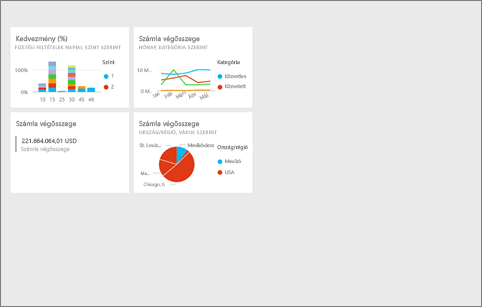
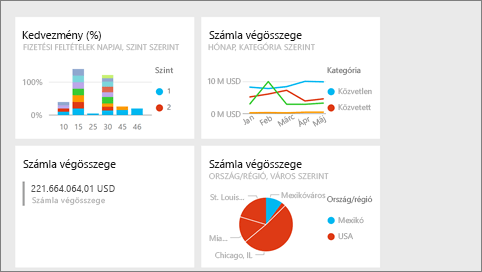
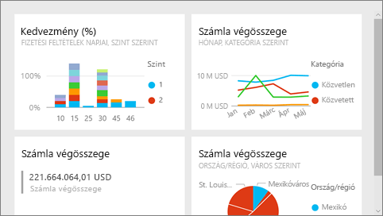

# Teljes képernyős mód a Power BI-ban
## Mi az a teljes képernyős mód?

Jelenítse meg menük és navigációs sávok nélkül a tartalmakat (irányítópultokat, jelentésoldalakat, csempéket és vizualizációkat), hogy semmi se terelje el róluk a figyelmet.  Így adatait bármikor megtekintheti egy letisztult, teljes képernyős nézetben, és ehhez elég csak odapillantania. Ezt a megjelenítési módot időnként TV módnak is nevezik. A teljes képernyős módban elérhető funkciók a megjelenített tartalomtól függenek.  

A teljes képernyős mód néhány felhasználása:

* irányítópult, csempe, vizualizáció vagy jelentés bemutatása egy megbeszélésen vagy konferencián
* irodai megjelenítés egy erre a célra kijelölt nagyméretű kijelzőn vagy projektoron
* megtekintés kis képernyőn
* véleményezés zárolt módban – anélkül érintheti meg a képernyőt, vagy viheti a csempék fölé az egérmutatót, hogy megnyitná az irányítópultot vagy az alapjául szolgáló jelentést

> **MEGJEGYZÉS**: A teljes képernyős mód nem egyezik meg a [Fókusz (kiugró) móddal](service-focus-mode.md).
> 
> 

Figyelje meg, hogyan nyitja meg Amanda az irányítópultját, és hogyan jeleníti meg teljes képernyős módban, majd hogy hogyan vezérli az alapértelmezett megjelenítést néhány URL-paraméter alkalmazásával. Ezután a videó alatt látható részletes utasításokat követve próbálkozzon meg a feladat elvégzésével.

<iframe width="560" height="315" src="https://www.youtube.com/embed/c31gZkyvC54" frameborder="0" allowfullscreen></iframe>

## Irányítópultok és jelentésoldalak teljes képernyős módban
1. A Power BI-ban az irányítópult vagy a jelentés felett található menüsávban válassza a **Teljes képernyő** ikont  . Az irányítópult vászna vagy a jelentésoldal ekkor kitölti az egész képernyőt. Az alábbi példában egy irányítópult szerepel.
   
      
2. A teljes képernyős mód menüjében több lehetősége is van.  A menü megjelenítéséhez mozgassa az egeret vagy a kurzort. 
   
     Irányítópult menüje    
         
   
     Jelentésoldalak menüje    
        
   
        
    A **Vissza** gombbal a böngészője előző oldalára léphet vissza. Ha az előző oldal is egy Power BI-oldal volt, akkor az is teljes képernyős módban fog megjelenni.  A teljes képernyős mód bekapcsolva marad, amíg ki nem lép belőle.
   
        
    Ezzel a gombban teljes képernyős módban nyomtatható ki egy irányítópult vagy egy jelentésoldal. 
   
        
    A **Képernyőhöz igazítás** gombra kattintva az irányítópultját a görgetősávok használata nélkül elérhető lehető legnagyobb méretben jeleníti meg.     
   
    
   
           
    Bizonyos esetekben nem okoz problémát a görgetősávok használata, és szeretné inkább kitölteni a rendelkezésre álló teljes szélességet. Ehhez válassza a **Szélességhez igazítás** gombot.    
   
    
   
           
    Teljes képernyős jelentéseknél ezeket a nyilakat használva válthat a jelentésoldalak között.    
3. A teljes képernyős módból való kilépéshez válassza a **Kilépés a teljes képernyős módból** ikont.
   
      

## Vizualizációk és irányítópult-csempék teljes képernyős módban
1. Irányítópult-csempék és jelentések vizualizációinak teljes képernyős módban való megjelenítéséhez a csempének vagy a vizualizációnak már [Fókusz módban](service-focus-mode.md) kell lennie. 
   
    
2. Válassza ekkor a Teljes képernyő ikont,   amely ekkor az adott csempére vagy vizualizációra vonatkozik. A csempe vagy a vizualizáció ekkor menük és navigációs sávok nélkül, teljes képernyőn jelenik meg.
   
    

## Következő lépések
[A Power BI-irányítópultok](service-dashboards.md)  
[Fókusz mód](service-focus-mode.md)    

További kérdései vannak? [Kérdezze meg a Power BI közösségét](http://community.powerbi.com/)

