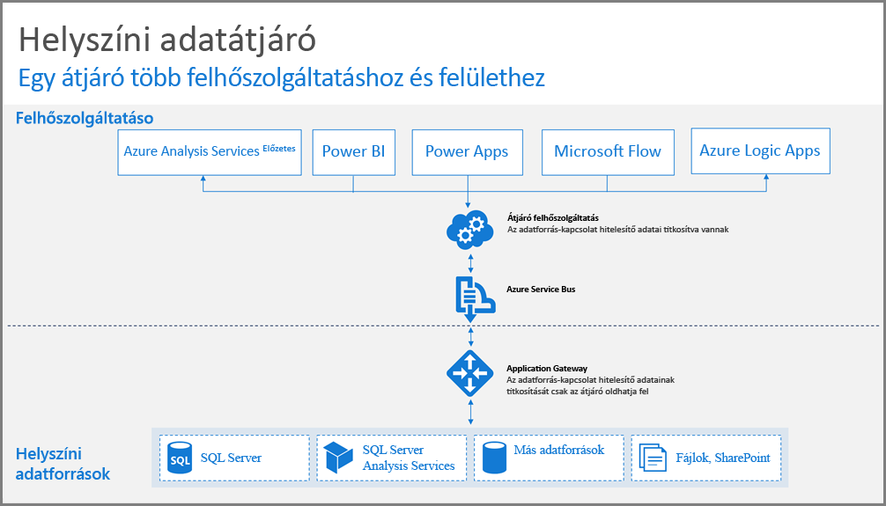
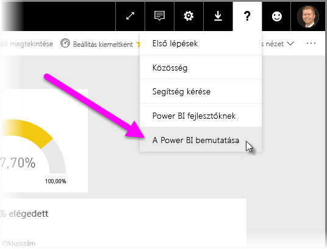
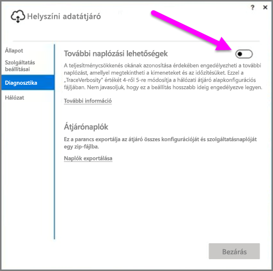
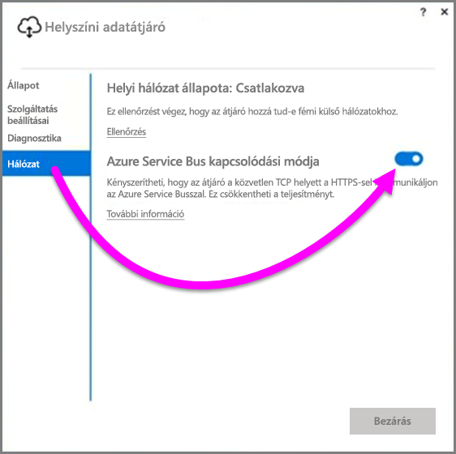
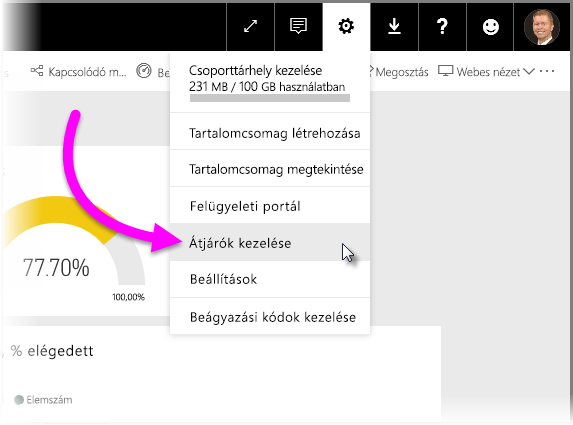

# Útmutató adatátjáró üzembe helyezéséhez a Power BI számára
A cikk útmutatást nyújt az adatátjáró hálózati környezetben történő telepítéséhez, és ismerteti a telepítés szempontjait. Az **átjáró** olyan szoftver, amely lehetővé teszi, hogy a helyszíni privát hálózaton lévő adatok elérhetőek legyenek az olyan felhőszolgáltatásokban, mint például a Power BI. A cikk végigvezeti a telepítés menetén, és útmutatást nyújt **helyszíni adatátjáró** telepítéséhez.

A **helyszíni adatátjáróval** kapcsolatos további információkért, és a telepítőre mutató hivatkozásért vessen egy pillantást erre a [blogbejegyzésre](https://powerbi.microsoft.com/blog/power-bi-gateways-march-update/).

## A helyszíni átjáró telepítésének szempontjai
Mielőtt túlságosan elmerülnénk a telepítés részleteiben, nem árt, ha ismertetünk pár szempontot, amelyeket érdemes szem előtt tartani. A következő szakaszokban bemutatott dolgokat fontos észben tartani a telepítés során.

### Felhasználók száma
A felhasználók száma, akik az átjáró használatával fognak a jelentésekkel dolgozni, fontos szempont annak eldöntésében, hogy hová telepítsük az átjárót. Néhány szempont, amelyet érdemes figyelembe venni:

* A felhasználók eltérő napszakokban használják ezeket a jelentéseket?
* Milyen típusú kapcsolatot használnak (DirectQueryt vagy importálást)?
* Minden felhasználó ugyanazt a jelentést használja?

Ha a felhasználók minden nap ugyanakkor kívánják elérni az adott jelentést, akkor gondoskodni kell róla, hogy az átjáró egy olyan számítógépen legyen telepítve, amely képes az összes kérelmet kezelni (segítségképpen a következő szakaszokból megismerheti a teljesítményszámlálókat és a minimális hardverkövetelményeket).

A **Power BI** szolgáltatásban van egy korlátozás, amely szerint *jelentésenként* csak *egy* átjáró használható, tehát hiába használ a jelentés több adatforrást, az összes adat ezen az egy átjárón fog áthaladni. Viszont, egy olyan irányítópultnál, amely *több* jelentésen alapul, mindegyik jelentéshez egy-egy dedikált átjárót használhat, így eloszthatja az átjárók terhelését az irányítópultot alkotó jelentések között.

### Kapcsolat típusa
A **Power BI-ban** kétféle kapcsolattípus áll rendelkezésre: a **DirectQuery** és az **Importálás**. Nem mindegyik adatforrás támogatja mindkét kapcsolattípust, és több szemponttól is függ, mikor melyiket érdemes használni, például a biztonsági követelményektől, a teljesítménytől, az adatkorláttól és az adatmodell méretétől. A kapcsolattípusokról és a támogatott adatforrásokról bővebben a *Helyszíni adatátjáró cikk* [Elérhető adatforrástípusok listája](service-gateway-onprem.md) című szakaszában olvashat.

A használt kapcsolat típusától függően az átjáróhasználat mértéke eltérő lehet. Például, amikor csak lehet, különítse el a **DirectQuery** típusú adatforrásokat az **Ütemezett frissítés** típusú adatforrásoktól (feltéve, hogy különböző jelentésekben vannak, és elkülöníthetőek). Ezzel megakadályozható, hogy DirectQuery-kérelmek ezreinek kelljen várni sorukra az átjárónál addig, amíg a cég fő irányítópultjához használt nagy méretű adatmodell reggeli ütemezett frissítése történik. Lássuk milyen szempontokat érdemes figyelembe venni a kapcsolattípusoknál:

* **Ütemezett frissítés**: A lekérdezések mérete és a napi frissítések száma alapján eldöntheti, hogy elég a javasolt minimális hardverkövetelményeknek megfelelő számítógépet használni, vagy nagyobb teljesítményű számítógépre lesz szüksége. Ha az adott lekérdezés nem kiszolgáló oldali transzformációkból áll, akkor a transzformációkat az átjáró fogja végezni, és ilyenkor hasznos lehet, ha a számítógépen, amelyen az átjáró telepítve van, több memória áll rendelkezésre.
* **DirectQuery**: A rendszer lekérdezést küld minden esetben, amikor egy felhasználó megnyitja a jelentést, vagy adatokat tekint meg. Ezért, ha várhatóan több mint 1000 felhasználó fog egyidejűleg hozzáférni az adatokhoz, érdemes gondoskodni arról, hogy a számítógép kellőképp robusztus és hatékony hardverrel rendelkezzen. **DirectQuery**-kapcsolat esetén több processzormag nagyobb teljesítményt eredményez.

A **helyszíni adatátjáró** telepítéséhez szükséges hardverkövetelmények a következők:

**Minimális:**

* A .NET-keretrendszer 4.5-ös verziója
* 64 bites Windows 7 vagy Windows Server 2008 R2 (vagy újabb)

**Ajánlott:**

* 8 magos CPU
* 8 GB memória
* 64 bites Windows 2012 R2 (vagy újabb)

### Hely
Az átjáró földrajzi helyzete jelentős hatással lehet a lekérdezési teljesítményre, ezért a hálózati késleltetés minimalizálása érdekében gondoskodjon róla, hogy az átjáró, az adatforrások és a Power BI-bérlő földrajzilag a lehető legközelebb helyezkedjenek el egymáshoz. A Power BI-bérlő földrajzi helyzetének meghatározásához a Power BI szolgáltatásban válassza a **?** ikont a jobb felső sarokban, majd válassza **A Power BI névjegye** lehetőséget.

### Az átjárók figyelése
A telepített átjárók használatának és teljesítményének figyeléséhez több eszköz is rendelkezésére áll.

#### Teljesítményszámlálók
Az átjáró aktivitásának kiértékeléséhez, és az aktivitásokhoz való hozzáféréshez számos teljesítményszámláló áll rendelkezésére. A számlálók segítségével felmérheti, hogy egy adott aktivitástípus nagyobb számban fordul-e elő, és hogy szükség van-e egy további új átjáró telepítésére.

> [!NOTE]
> Ezek a számlálók nem rögzítik az egyes feladatok időtartamát.
> 
> 

A számítógép számlálói mellett az *átjáró számlálója* is segíthet felmérni, hogy mekkora terhelésnek van kitéve a számítógép, és jelezheti, ha a terhelés szintje átlépte, vagy jelentősen meghaladja a kiszolgáló erőforrás-kapacitását.

Ezek a számlálók a **Windows teljesítményfigyelőből** érhetőek el, és adataikat bármely jelentéskészítő eszközzel felhasználhatja. A Power BI átjáróteljesítmény-figyelőjének részletes ismertetéséért tekintse meg a következő közösségi blogbejegyzést:

* [Helyszíni adatátjárók figyelése](https://insightsquest.com/2016/08/08/monitor-on-premises-data-gateways/)

#### Naplók
A konfigurációs- és szolgáltatási naplók egy további dimenziót nyújtanak az átjáróval kapcsolatos események felmérésében. Amikor a kapcsolat nem működik megfelelően, mindig érdemes ellenőrizni az átjáró naplóit, mert a Power BI szolgáltatás felületén nem mindegyik hibaüzenet jelenik meg.

Helyi gépen a naplók megtekintésének legegyszerűbb módja, ha az átjáró telepítését követően újra megnyitja az átjárót, és a **helyszíni adatátjáróban** a *Naplók exportálása* lehetőséget választja, ezután pedig kiválasztja a **Diagnosztika > Naplók exportálása** lehetőséget.

#### További naplózási lehetőségek
Az átjáró alapértelmezés szerint csak egyszerűsített naplózást végez. Ha az átjáróval kapcsolatos hibák vizsgálatához több részletre van szüksége a lekérdezéskapcsolatokról, akkor a *Részletes naplózás* ideiglenes engedélyezésével további információkat is gyűjthet. Ehhez a telepített átjáróban válassza a **Diagnosztika > További naplózás** lehetőséget.

A beállítás engedélyezése az átjáró használatától függően nagy mértékben megnövelheti a naplók méretét. Ezért javasoljuk, hogy ha végzett a naplók vizsgálatával, kapcsolja ki a **További naplózást**. A beállítást nem ajánlott bekapcsolva hagyni normál átjáróhasználat esetén.

#### Hálózati konfiguráció
Az átjáró egy kimenő kapcsolatot hoz létre az **Azure Service Bushoz**. Az átjáró a következő kimenő portokat használja a kommunikációhoz:

* TCP 443 (Alapértelmezett)
* 5671
* 5672
* 9350-től 9354-ig

Az átjáró használatához *nincs* szükség bejövő portokra. A fenti listában az átjáró használatához szükséges összes port fel van sorolva.

Javasoljuk, hogy engedélyezze a tűzfalán az adatterületéhez tartozó IP-címeket. Az IP-címek listáját innen érheti el és töltheti le: [A Microsoft Azure-adatközpontok IP-listája](https://www.microsoft.com/download/details.aspx?id=41653) A lista hetente frissül. Az átjáró a teljes tartománynév (FQDN) használata mellett a megadott IP-cím használatával fog kommunikálni az **Azure Service Busszal**. Ha az átjárót HTTPS-kommunikáció használatára kényszeríti, az átjáró kizárólag a teljes tartománynevet fogja használni, és egyáltalán nem fog IP-cím használatával kommunikálni.

#### HTTPS-kommunikáció kényszerítése az Azure Service Bus felé
Kényszerítheti az átjárót arra, hogy közvetlen TCP-kapcsolat helyett HTTPS használatával kommunikáljon az **Azure Service Busszal**. Ez kis mértékben csökkenteni fogja a teljesítményt. Már az átjáró felhasználói felületéről is beállíthatja, hogy az átjáró HTTPS használatával kommunikáljon az **Azure Service Busszal** (az átjáró 2017. márciusi kiadásától kezdődően).

Ehhez az átjáróban válassza a **Hálózat** lehetőséget, majd kapcsolja **Be** az **Azure Service Bus kapcsolódási módja** beállítást.

### További útmutatás
Ez a szakasz további útmutatást nyújt az átjárók telepítésével és kezelésével kapcsolatban.

* Érdemes elkerülni, hogy a hibaérzékeny pontok egyetlen helyre korlátozódjanak. Amennyiben lehetséges, próbálja meg helyszíni adatait több átjáró között elosztani, így, ha az egyik számítógép elérhetetlenné válik, továbbra is frissíteni tudja adatai egy részét, és nem veszíti el teljesen az adott funkcionalitást.
* Az átjáró nem telepíthető tartományvezérlőn, ezért nem is érdemes ezzel próbálkoznia.
* Az átjárót nem szabad olyan számítógépen telepíteni, amelyet kikapcsolhatnak, amely alvó állapotba kerülhet, vagy amely nem mindig csatlakozik az internethez (ilyen például egy laptop), mivel ezekben az esetekben az átjáró nem tud futni.
* Az átjárót nem érdemes vezeték nélküli hálózatra telepíteni, mert vezeték nélküli kapcsolat esetén csökkenhet a teljesítmény.

#### Átjáró helyreállítása
A **Helyreállítási kulcs** használatával helyreállíthatja, vagy másik gépre helyezheti át meglévő átjáróját. A helyreállítási kulcsot az átjáró telepítését végző felhasználó kapja, és később már *nem* lehet megváltoztatni. A helyreállítási kulcsot a rendszer az adattitkosításhoz és az átjáró helyreállításához egyaránt használja.

Az átjáró helyreállításakor győződjön meg arról, hogy rendszergazdai jogosultságokkal rendelkezik az átjáróban, arról, hogy tudja az átjáró nevét, és rendelkezik a megfelelő helyreállítási kulccsal, és gondoskodjon róla, hogy rendelkezésére álljon egy hasonló teljesítményű számítógép az átjáró számára.

Bejelentkezés után válassza ki a **Meglévő átjáró migrálása** lehetőséget. Ezután ki kell választani a helyreállítani vagy áthelyezni kívánt átjárót, majd meg kell adni a helyreállítási kulcsot és kiválasztani a konfigurálás lehetőséget. Ha elkészült ezzel a lépéssel a régi átjárót a rendszer egy újra cseréli, amely örökli a régi nevét és az ahhoz korábban beállított adatforrásokat. Mostantól minden adatforrás az új átjárón keresztül érhető el anélkül, hogy bármit újra közzé kéne tenni. Az automatikus feladatátvétel egyelőre nem támogatott, de csapatunk aktívan foglalkozik a támogatás lehetőségével.

#### Rendszergazdák
Az átjárók rendszergazdáinak listáját a **Power BI szolgáltatásban** tekintheti meg. Miután bejelentkezett a **Power BI** szolgáltatásba, válassza a **Beállítások** lehetőséget (a fogaskerék ikont), majd az **Átjárók kezelése > Átjáró felhasználói felület** lehetőséget.  

Innen az egyik átjáró kiválasztásával megtekintheti a rendszergazdák listáját. A listában szereplő rendszergazdák hozzáférhetnek az adott átjáróhoz, és azt helyre állíthatják, vagy törölhetik. Továbbá adatforrásokat is hozzáadhatnak az átjáróhoz, illetve törölhetnek onnan. Ahhoz, hogy az összes rendszergazda hozzáférhessen a cégen belül a csoportjaikhoz tartozó átjárókhoz, érdemes a következő lépést végrehajtani:

* Hozzon létre egy **AAD** biztonsági csoportot, adjon hozzá felhasználókat, majd a biztonsági csoportot adja hozzá az adott átjáró rendszergazdáihoz. Így gondoskodhat róla, hogy hiba, helyreállítás, vagy áthelyezés esetén ne csak egyetlen személy férhessen hozzá az átjáróhoz. Továbbá, ezáltal a rendszergazdák azt is láthatják, a csoportjuk melyik átjárót használja, és hogy milyen adatforrások vannak az egyes átjárókban.

## Következő lépések
[Proxybeállítások konfigurálása](service-gateway-proxy.md)  
[A helyszíni adatátjáró hibaelhárítása](service-gateway-onprem-tshoot.md)  
[Helyszíni adatátjáró – Gyakori kérdések](service-gateway-onprem-faq.md)  

További kérdései vannak? [Kérdezze meg a Power BI közösségét](http://community.powerbi.com/)

