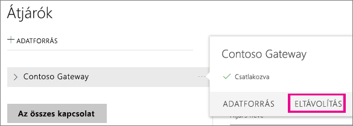
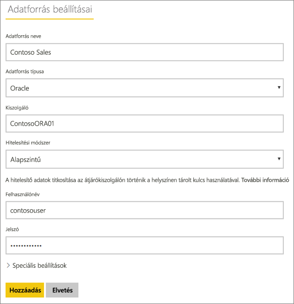
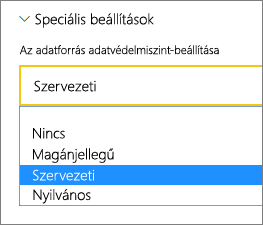
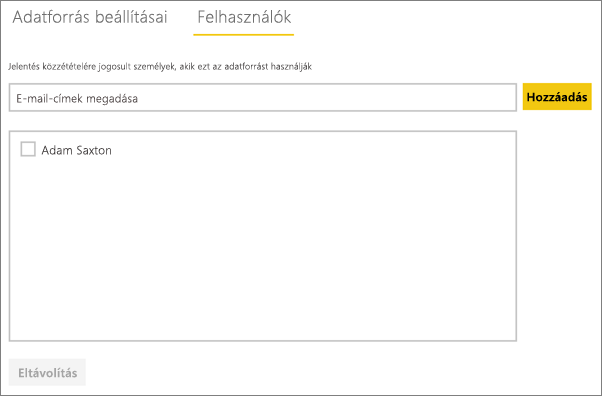
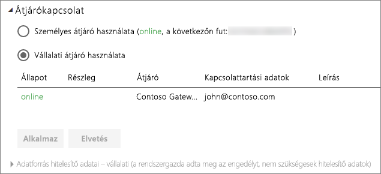

# Az adatforrás kezelése – Importálás/Ütemezett frissítés
Amint telepítette a helyszíni adatátjárót, fel kell vennie az átjáróval használható adatforrásokat. Ez a cikk bemutatja, hogyan lehet használni az ütemezett frissítéshez használt átjárókat és az adatforrásokat a DirectQuery vagy az élő kapcsolatok helyett.

## Az átjáró letöltése és telepítése
Az átjárót a Power BI szolgáltatásból töltheti le. Válassza a **Letöltések** > **Data Gateway** lehetőséget, vagy lépje az [átjáró letöltési oldalára](https://go.microsoft.com/fwlink/?LinkId=698861).

## Átjáró hozzáadása
Egy átjáró hozzáadásához egyszerűen [töltse le](https://go.microsoft.com/fwlink/?LinkId=698863) és telepítse a vállalati átjárót egy kiszolgálóra a környezetében. Miután telepítette az átjárót, megjelenik az átjárók listáiban az **Átjárók kezelése** területen.

> [!NOTE]
> Az **Átjárók kezelése** nem jelenik meg, amíg nem rendszergazdája legalább egy átjárónak. Ez elérhető úgy, ha hozzáadják rendszergazdaként, vagy ha saját maga telepít és konfigurál egy átjárót.
> 
> 

## Átjáró eltávolítása
Egy átjáró eltávolítása az átjáró alatti adatforrásokat is törli.  Az adott adatforrásokra támaszkodó irányítópultok és jelentések sem fognak működni.

1. Válassza ki a fogaskerék ikont  a jobb felső sarokban, majd az **Átjárók kezelése** lehetőséget.
2. Átjáró > **Eltávolítás**
   
   

## Adatforrások felvétele
Az adatforrások felvételének egyik módja az, ha kiválaszt egy átjárót, és az **Adatforrás hozzáadása** lehetőségre kattint, a másik pedig az, ha az Átjáró > **Adatforrás hozzáadása** elemhez lép.

Ekkor a listáról kiválaszthatja az **Adatforrás típusa** lehetőséget. Az összes felsorolt adatforrás használható ütemezett frissítéshez a vállalati átjáróval. Az Analysis Services, az SQL Server és az SAP HANA használható ütemezett frissítéshez vagy DirectQuery/élő kapcsolatokhoz is.

Ekkor kell megadni az információkat az adatforráshoz. Ebbe beletartoznak a forrásra vonatkozó információk és az adatforrás eléréséhez használt hitelesítő adatok.

> [!NOTE]
> Az adatforrás felé irányuló összes lekérdezés ezen hitelesítő adatok segítségével fut. További információkért tekintse meg a helyszíni adatátjárókat ismertető fő cikket, amelyből többet tudhat meg a [hitelesítő adatok](service-gateway-onprem.md#credentials) tárolásáról.
> 
> 

Miután minden információt megadott, kattintson a **Hozzáadás** lehetőségre.  Mostantól használhatja ezt az adatforrást ütemezett frissítéshez a helyszíni adataival. Ha sikerrel járt, megjelenik a *Sikeres csatlakozás* üzenet.

<!-- Shared Install steps Include -->
[!INCLUDE [gateway-onprem-datasources-include](./includes/gateway-onprem-datasources-include.md)]

### Speciális beállítások
Konfigurálhatja az adatforrás adatvédelmi szintjét. Ez vezérli, hogy hogyan fűzhetők össze adatok. Ez csak ütemezett frissítéshez használható. [További információ](https://support.office.com/article/Privacy-levels-Power-Query-CC3EDE4D-359E-4B28-BC72-9BEE7900B540)

## Adatforrás eltávolítása
Ha eltávolít egy adatforrást, akkor leáll minden olyan irányítópult vagy jelentés is, amely az adott adatforrásra támaszkodik.  

Egy adatforrás eltávolításához lépjen az Adatforrás > **Eltávolítás** elemhez.

## Rendszergazdák kezelése
Az átjárókhoz tartozó Rendszergazdák lapon felveheti és eltávolíthatja az átjáró kezelésére jogosult felhasználókat. Ekkor csak felvehet felhasználókat. Biztonsági csoportokat nem lehet hozzáadni.

## Felhasználók kezelése
Az adatforráshoz tartozó Felhasználók lapon felveheti és eltávolíthatja az adatforrás használatára jogosult felhasználókat vagy biztonsági csoportokat.

> [!NOTE]
> A felhasználók listája csak azt szabályozza, ki tehet közzé jelentéseket. A jelentéstulajdonosok létrehozhatnak irányítópultokat vagy tartalomcsomagokat, és megoszthatják azokat más felhasználókkal.
> 
> 

## Az adatforrás használata ütemezett frissítéshez
Miután létrehozta az adatforrást, használhatja DirectQuery-kapcsolatokkal vagy ütemezett frissítéssel is.

> [!NOTE]
> A kiszolgáló és az adatbázis nevének egyeznie kell a Power BI Desktopban és az adatforrásban a helyszíni adatátjárón belül.
> 
> 

Az adatkészlet és az adatforrás közötti kapcsolat az átjárón belül a kiszolgáló nevén és az adatbázis nevén alapul. Ezeknek egyezniük kell. Ha például egy IP-címet ad meg a kiszolgáló nevének, a Power BI Desktopban azt az IP-címet kell használnia az adatforráshoz az átjáró konfigurációján belül. Ha a *KISZOLGÁLÓ\PÉLDÁNY* nevet használja, a Power BI Desktopban ugyanezt kell használnia az átjáróhoz konfigurált adatforráson belül.

Ha szerepel az átjárón belül konfigurált adatforrás **Felhasználók** lapján, és a kiszolgáló és az adatbázis neve egyezik, az átjáró megjelenik lehetőségként az ütemezett frissítésnél.

> [!WARNING]
> Ha az adatkészlet több adatforrást tartalmaz, az egyes adatforrásokat hozzá kell adni az átjárón belül. Ha egy vagy több adatforrást nem ad hozzá az átjáróhoz, az átjáró nem lesz elérhető ütemezett frissítésre.
> 
> 

## Korlátozások
* Az OAuth nem támogatott hitelesítési séma a helyszíni adatátjáróval. Nem vehet fel olyan adatforrásokat, amelyekhez OAuth szükséges. Ha az adatkészlet egy adatforrásához OAuth szükséges, nem fogja tudni ütemezett frissítéshez használni az átjárót.

## Következő lépések
[Helyszíni adatátjáró](service-gateway-onprem.md)  
[Helyszíni adatátjáró – részletek](service-gateway-onprem-indepth.md)  
[A Helyszíni adatátjáróval kapcsolatos hibák elhárítása](service-gateway-onprem-tshoot.md)  
További kérdései vannak? [Kérdezze meg a Power BI közösségét](http://community.powerbi.com/)

