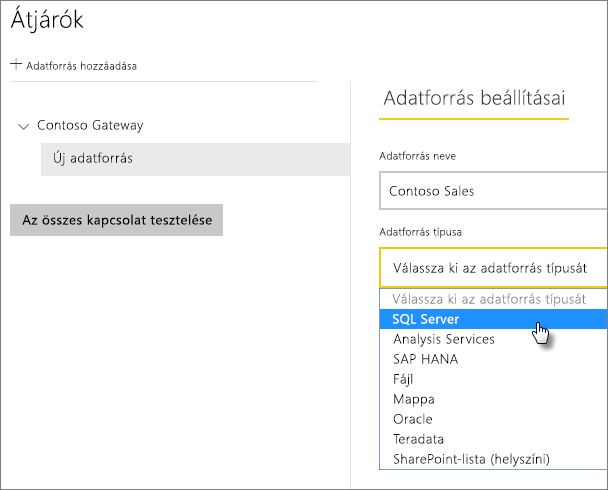
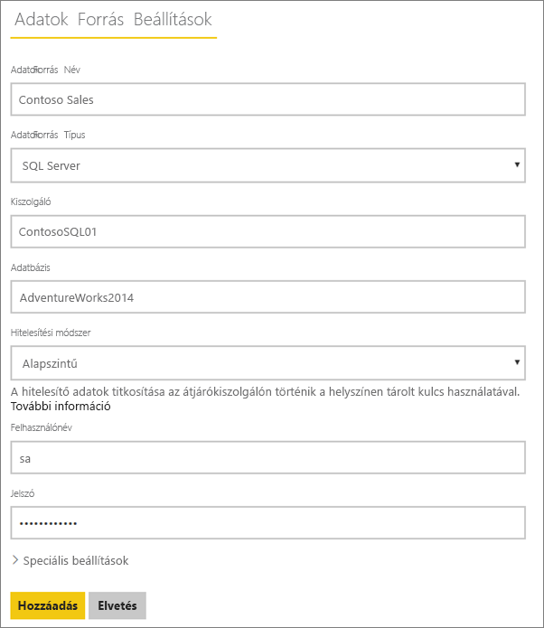
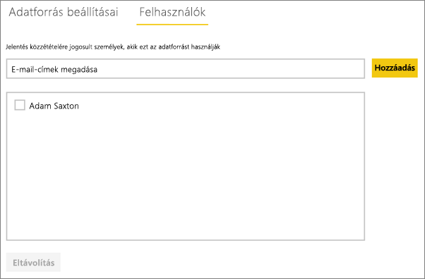

# Adatforrások kezelése – SQL Server
A helyszíni adatátjáró telepítése után az átjáróval használható adatforrásokat adhat hozzá. Ez a cikk bemutatja, hogyan lehet használni az átjárókat és az adatforrásokat. Az SQL Server-adatforrás ütemezett frissítéshez vagy DirectQueryhez is használható.

## Az átjáró letöltése és telepítése
Az átjárót a Power BI szolgáltatásból töltheti le. Válassza a **Letöltések** > **Data Gateway** lehetőséget, vagy lépje az [átjáró letöltési oldalára](https://go.microsoft.com/fwlink/?LinkId=698861).

## Átjáró hozzáadása
Egy átjáró hozzáadásához egyszerűen [töltse le](https://go.microsoft.com/fwlink/?LinkId=698861) és telepítse az átjárót egy kiszolgálóra a környezetében. Miután telepítette az átjárót, az megjelenik az átjárók listáiban az **Átjárók kezelése** területen.

> [!NOTE]
> Az **Átjárók kezelése** csak akkor jelenik meg, ha Ön legalább egy átjárónak rendszergazdája. Ez úgy lehetséges, hogy rendszergazdaként hozzáadják egy átjáróhoz, vagy saját maga telepít és konfigurál egy átjárót.
> 
> 

## Átjáró eltávolítása
Egy átjáró eltávolítása az átjáró alatti adatforrásokat is törli.  Az adott adatforrásokra támaszkodó irányítópultok és jelentések sem fognak működni.

1. Válassza ki a fogaskerék ikont  a jobb felső sarokban, majd az **Átjárók kezelése** lehetőséget.
2. Átjáró > **Eltávolítás**
   
   

## Adatforrások felvétele
Az adatforrások felvételének egyik módja az, ha kiválaszt egy átjárót, és az **Adatforrás hozzáadása** lehetőségre kattint, a másik pedig az, ha az Átjáró > **Adatforrás hozzáadása** elemhez lép.

Ez után kiválaszthatja az **Adatforrástípust** a listából.

> [!NOTE]
> DirectQuery használatakor az átjáró csak az **SQL Server 2012 SP1** és későbbi verzióit támogatja.
> 
> 

Ez után az adatforrás információit, köztük a **Kiszolgálót** és az **Adatbázist** is kell megadnia.  

**Hitelesítési módszert** is választania kell.  Ez lehet **Windows** vagy **Egyszerű**.  Az **Egyszerű** lehetőséget akkor kell választani, ha Windows-hitelesítés helyett SQL-hitelesítést fog használni. Végül adja meg az ehhez az adatforráshoz használandó hitelesítő adatokat.

> [!NOTE]
> Az adatforráson minden lekérdezés ezekkel a hitelesítő adatokkal fog futni, hacsak nincs hozzá konfigurálva és engedélyezve a Kerberos használata egyszeri bejelentkezéshez (SSO). Egyszeri bejelentkezés (SSO) használata esetén az importált adatkészletek a tárolt hitelesítő adatokat használják, a DirectQuery-adatkészletek viszont az aktuális Power BI-felhasználó nevében, SSO használatával futtatják a lekérdezéseket. A helyszíni adatátjáróról szóló fő cikkben bővebben tájékozódhat a [hitelesítő adatok](service-gateway-onprem.md#credentials) tárolásáról. További információ: [a Kerberos használata egyszeri bejelentkezéshez (SSO) a Power BI-ból helyszíni adatforrásokba](service-gateway-kerberos-for-sso-pbi-to-on-premises-data.md).
> 
> 

Miután minden információt megadott, kattintson a **Hozzáadás** lehetőségre.  Az adatforrás ettől kezdve használható ütemezett frissítéshez vagy DirectQuery-lekérdezéshez egy helyszíni SQL Server kiszolgálón. Siker esetén az *A kapcsolat sikeresen létrejött* üzenet jelenik meg.

### Speciális beállítások
Konfigurálhatja az adatforrás adatvédelmi szintjét. Ez vezérli, hogy hogyan fűzhetők össze adatok. Ez csak ütemezett frissítéshez használható. Mindez nem érvényes a DirectQueryre. [További információ](https://support.office.com/article/Privacy-levels-Power-Query-CC3EDE4D-359E-4B28-BC72-9BEE7900B540)

## Adatforrás eltávolítása
Ha eltávolít egy adatforrást, akkor leáll minden olyan irányítópult vagy jelentés is, amely az adott adatforrásra támaszkodik.  

Egy adatforrás eltávolításához lépjen az Adatforrás > **Eltávolítás** elemhez.

## Rendszergazdák kezelése
Az átjárókhoz tartozó Rendszergazdák lapon felvehet és eltávolíthat az átjáró kezelésére jogosult felhasználókat (vagy biztonsági csoportokat).

## Felhasználók kezelése
Az adatforráshoz tartozó Felhasználók lapon felveheti és eltávolíthatja az adatforrás használatára jogosult felhasználókat vagy biztonsági csoportokat.

> [!NOTE]
> A felhasználók listája csak azt szabályozza, ki tehet közzé jelentéseket. A jelentéstulajdonosok létrehozhatnak irányítópultokat vagy tartalomcsomagokat, és megoszthatják azokat más felhasználókkal.
> 
> 

## Az adatforrás használata
Miután létrehozta az adatforrást, használhatja DirectQuery-kapcsolatokkal vagy ütemezett frissítéssel is.

> [!NOTE]
> A kiszolgáló és az adatbázis nevének egyeznie kell a Power BI Desktopban és az adatforrásban a helyszíni adatátjárón belül.
> 
> 

Az adatkészlet és az adatforrás közötti kapcsolat az átjárón belül a kiszolgáló nevén és az adatbázis nevén alapul. Ezeknek egyezniük kell. Ha például IP-címet ad meg a kiszolgáló neveként a **Power BI Desktopban**, akkor az átjáró konfigurációjában is az IP-címet kell megadnia az adatforráshoz. Ha a Power BI Desktopban a *KISZOLGÁLÓ\PÉLDÁNY* formát használta, az átjáró konfigurációjában is ezt kell megadnia az adatforráshoz.

Ez a DirectQuery és az ütemezett frissítés esetén egyaránt érvényes.

### Az adatforrás használata DirectQuery-kapcsolatokkal
Gondoskodjon róla, hogy a kiszolgáló- és adatbázis-név megegyezzen a **Power BI Desktopban** és a helyszíni adatátjáróban konfigurált adatforrásban. DirectQuery-adatkészletek közzétételéhez arról is gondoskodnia kell, hogy a felhasználója szerepeljen az adatforrás **Felhasználók** lapján. A DirectQuery esetén a kiválasztásra az első adatimportáláskor kerül sor a Power BI Desktopon belül. [További információ](desktop-use-directquery.md)

Miután elvégezte a közzétételt a Power BI Desktopból vagy az **Adatok lekérése** területről, el kell kezdeni működniük a jelentéseknek. Az átjárón belüli adatforrás létrehozása után több percbe telhet, amíg a kapcsolat használhatóvá válik.

### Az adatforrás használata ütemezett frissítéssel
Ha szerepel az átjárón belül konfigurált adatforrás **Felhasználók** lapján, és a kiszolgáló és az adatbázis neve egyezik, az átjáró megjelenik lehetőségként az ütemezett frissítésnél.

## Következő lépések
* [Helyszíni adatátjáró](service-gateway-onprem.md)  
* [Helyszíni adatátjáró – részletek](service-gateway-onprem-indepth.md)  
* [A Helyszíni adatátjáróval kapcsolatos hibák elhárítása](service-gateway-onprem-tshoot.md)
* [Kerberos használata egyszeri bejelentkezéshez (SSO) a Power BI-ból a helyszíni adatforrásokhoz](service-gateway-kerberos-for-sso-pbi-to-on-premises-data.md). 
* További kérdései vannak? [Kérdezze meg a Power BI közösségét](http://community.powerbi.com/)

