# Az adatforrás kezelése – Analysis Services
Amint telepítette a helyszíni adatátjárót, fel kell vennie az átjáróval használható adatforrásokat. Ez a cikk bemutatja, hogyan lehet használni az átjárókat és az adatforrásokat. Az Analysis Services-adatforrást ütemezett frissítéshez vagy élő kapcsolatokhoz használhatja.

<iframe width="560" height="315" src="https://www.youtube.com/embed/ownIGbcRAAU" frameborder="0" allowfullscreen></iframe>

## Az átjáró letöltése és telepítése
Az átjárót a Power BI szolgáltatásból töltheti le. Válassza a **Letöltések** > **Adatátjáró** lehetőséget, vagy lépjen az [átjáró letöltési oldalára](https://go.microsoft.com/fwlink/?LinkId=698861).

## Az élő Analysis Services-kapcsolatokra vonatkozó korlátozások
Az élő kapcsolatokat táblázatos vagy többdimenziós példányokhoz használhatja.

| **Kiszolgáló verziója** | **Kötelező termékváltozat** |
| --- | --- |
| 2012 SP1 CU4 vagy újabb |Business Intelligence és Enterprise termékváltozat |
| 2014 |Business Intelligence és Enterprise termékváltozat |
| 2016 |Minimum Standard termékváltozat |

* A cellaszintű formázás és a fordítási funkciók nem támogatottak.
* A Műveletek és az Elnevezett készletek nem jelennek meg a Power BI-ban, azonban továbbra is lehetséges a Műveleteket vagy Elnevezett készleteket is tartalmazó többdimenziós kockákhoz kapcsolódni, és vizualizációkat és jelentéseket létrehozni.

## Átjáró hozzáadása
Egy átjáró hozzáadásához egyszerűen [töltse le](https://go.microsoft.com/fwlink/?LinkId=698861) és telepítse az átjárót egy kiszolgálóra a környezetében. Miután telepítette az átjárót, az megjelenik az átjárók listáiban az **Átjárók kezelése** területen.

> [!NOTE]
> Az **Átjárók kezelése** nem jelenik meg, amíg nem rendszergazdája legalább egy átjárónak. Ez elérhető úgy, ha hozzáadják rendszergazdaként, vagy ha saját maga telepít és konfigurál egy átjárót.
> 
> 

## Átjáró eltávolítása
Egy átjáró eltávolítása az átjáró alatti adatforrásokat is törli.  Az adott adatforrásokra támaszkodó irányítópultok és jelentések sem fognak működni.

1. Válassza ki a fogaskerék ikont  a jobb felső sarokban, majd az **Átjárók kezelése** lehetőséget.
2. Átjáró > **Eltávolítás**
   
   

## Adatforrások felvétele
Az adatforrások felvételének egyik módja az, ha kiválaszt egy átjárót, és az **Adatforrás hozzáadása** lehetőségre kattint, a másik pedig az, ha az Átjáró > **Adatforrás hozzáadása** elemhez lép.

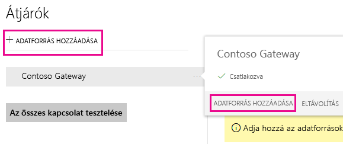

Ekkor a listáról kiválaszthatja az **Adatforrás típusa** lehetőséget. Válassza az Analysis Services lehetőséget, ha többdimenziós vagy táblázatos kiszolgálóhoz csatlakozik.

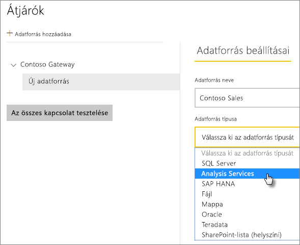

Ekkor meg kell adni az információkat az adatforráshoz, például a **Kiszolgálót** és az **Adatbázist**.  

Az átjáró a beírt **Felhasználónévvel** és **Jelszóval** csatlakozik az Analysis Services-példányhoz.

> [!NOTE]
> A megadott Windows-fióknak kiszolgálói rendszergazdai engedélyekkel kell rendelkeznie a példányhoz, amelyhez csatlakozik. Ha a fiók jelszava úgy van beállítva, hogy lejárjon, a felhasználók kapcsolódási kísérletei meghiúsulhatnak, ha nem az adatforrás jelszava nem frissül. További információkért tekintse meg a helyszíni adatátjárókat ismertető fő cikket, amelyből többet tudhat meg a [hitelesítő adatok](service-gateway-onprem.md#credentials) tárolásáról.
> 
> 

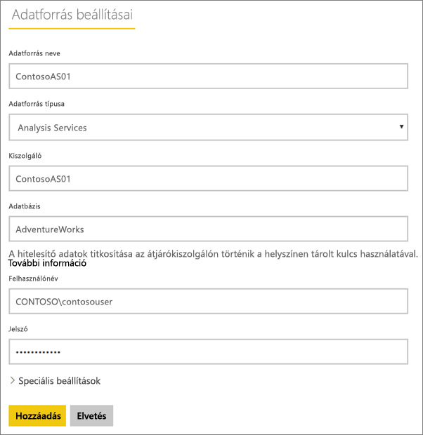

Miután minden információt megadott, kattintson a **Hozzáadás** lehetőségre.  Mostantól használhatja ezt az adatforrást ütemezett frissítésekhez, vagy egy helyszíni Analysis Services-példánnyal kialakított élő kapcsolatokhoz.  Ha sikerrel járt, megjelenik a *Sikeres csatlakozás* üzenet.

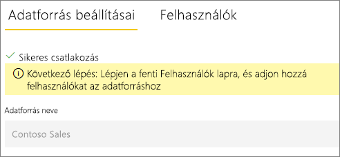

### Speciális beállítások
Konfigurálhatja az adatforrás adatvédelmi szintjét. Ez vezérli, hogy hogyan fűzhetők össze adatok. Ez csak ütemezett frissítéshez használható. az élő kapcsolatokra nem érvényes. [További információ](https://support.office.com/article/Privacy-levels-Power-Query-CC3EDE4D-359E-4B28-BC72-9BEE7900B540)

## Az Analysis Services és a felhasználónevek
Amikor egy felhasználó az Analysis Serviceshez csatlakoztatott jelentéssel dolgozik, a rendszer az érvényes felhasználónevet átadja az átjárónak, majd a helyszíni Analysis Services-kiszolgálónak. A Power BI-ba való bejelentkezéshez használt e-mail-címet adja át az Analysis Services-nek érvényes felhasználóként. Ezt a rendszer továbbadja az [EffectiveUserName](https://msdn.microsoft.com/library/dn140245.aspx#bkmk_auth) kapcsolati tulajdonságnak. Ennek az e-mail-címnek egyeznie kell a helyi Active Directory-tartományban meghatározott UPN-nel. Az UPN az Active Directory-fiókok egy tulajdonsága. A Windows-fióknak ekkor szerepelnie kell egy Analysis Services-szerepkörben. Ha nem található egyezés az Active Directoryban, sikertelen lesz a bejelentkezés. [További információ](https://msdn.microsoft.com/library/ms677605.aspx)

Le is képezheti a Power BI-ban használt bejelentkezési nevet egy helyi könyvtár UPN-jére. [További információ](service-gateway-enterprise-manage-ssas.md#map-user-names)

<iframe width="560" height="315" src="https://www.youtube.com/embed/Qb5EEjkHoLg" frameborder="0" allowfullscreen></iframe>

### Honnan tudhatom meg, mi az UPN-em?
Előfordulhat, hogy nem tudja az UPN-jét, és az is lehet, hogy Ön nem tartományi rendszergazda. A munkaállomáson a következő paranccsal tudhatja meg a fiókja UPN-jét.

    whoami /upn

Az eredmény egy e-mail-címhez hasonlóan fog kinézni, de ez a tartományi fiók UPN-je. Ha élő kapcsolatokhoz használ egy Analysis Services-adatforrást, és ez nem egyezik a Power BI-ba való bejelentkezéshez használt e-mail-címmel, érdemes áttekinteni, hogyan [képezhet le felhasználóneveket](#map-user-names).

## Felhasználónevek leképezése
<iframe width="560" height="315" src="https://www.youtube.com/embed/eATPS-c7YRU" frameborder="0" allowfullscreen></iframe>

Kétféleképpen képezhet le felhasználóneveket az Analysis Services számára:

1. Felhasználó manuális újbóli leképezése 
2. Helyszíni Active Directory-tulajdonságkeresés AAD UPN-ek Active Directory-felhasználókra való leképezéséhez (AD keresési leképezés)

Noha a második megközelítéssel is lehet manuális leképezést végezni, ez időigényes és nehezen fenntartható. Különösen akkor okoz nehézséget, amikor a minták egyeztetése nem elegendő, például ha az AAD és a helyszíni AD tartománynevei vagy a hozzájuk kapcsolódó felhasználói fiókok nevei különböznek. Ezért nem ajánljuk, hogy manuális leképezésénél a második megközelítéssel próbálkozzon.

Ezt a két megközelítést a következő két szakaszban ismertetjük részletesen.

### Felhasználónév manuális újbóli leképezése
Az Analysis Services-adatforrásokhoz konfigurálhat egyszerű felhasználónevekre (UPN) vonatkozó egyéni szabályokat. Ez segít, ha a Power BI szolgáltatás bejelentkezési nevei nem egyeznek a helyi könyvtár UPN-jével. Amikor például a john@contoso.com használatával jelentkezik be a Power BI-be, de a helyi könyvtár UPN-je john@contoso.local, konfigurálhat egy leképezési szabályt, hogy a rendszer a john@contoso.local értéket átadja az Analysis Servicesnek.

Az UPN leképezési képernyőjének megnyitásához tegye a következőket.

1. Kattintson a **fogaskerék ikonra**, és válassza az **Átjárók kezelése** lehetőséget.
2. Bontsa ki az Analysis Services-adatforrást tartalmazó átjárót. Ha eddig nem hozta létre az Analysis Services-adatforrást, most megteheti.
3. Válassza ki az adatforrást, majd válassza a **Felhasználók** fület.
4. Válassza a **Felhasználónevek leképezése** lehetőséget.
   
    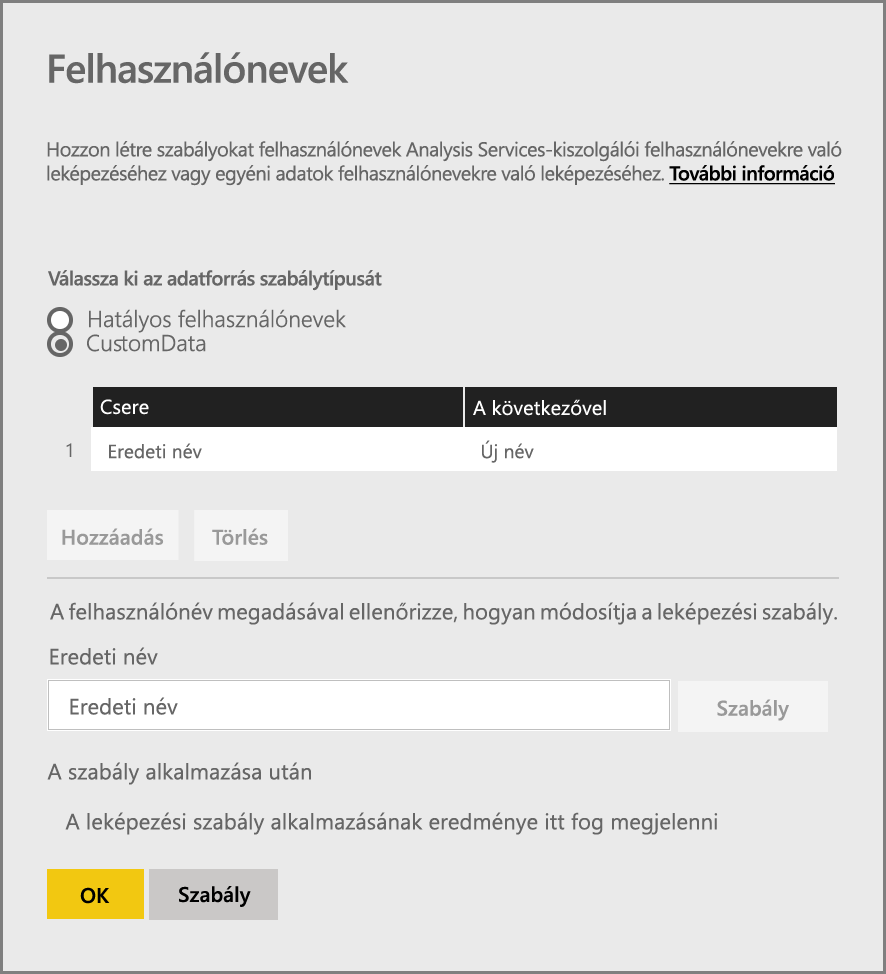

Ekkor megjelennek a szabályok hozzáadásának és adott felhasználó tesztelésének lehetőségei.

> [!NOTE]
> Előfordulhat, hogy véletlenül olyan felhasználót módosít, akit nem szeretett volna. Ha például a **Csere (eredeti érték)** *@contoso.com*, és **A következővel (új név)** *@contoso.local*, minden, a *@contoso.com* nevet tartalmazó bejelentkezési adatokkal rendelkező felhasználó *@contoso.local* névre módosul. Ezenkívül, ha a **Csere (eredeti név)** *dave@contoso.com*, és **A következővel (új név)** *dave@contoso.local*, a v-dave@contoso.com nevet tartalmazó bejelentkezési adatokkal rendelkező felhasználók v-dave*@contoso.local* névre módosulnak.
> 
> 

### AD keresési leképezés
Ha helyszíni AD-tulajdonságkeresést szeretne végezni az AAD UPN-ek Active Directory-felhasználókra való leképezéséhez, kövesse a jelen szakaszban ismertetett lépéseket. Először tekintsük át, hogyan működik ez a leképezés.

A **Power BI szolgáltatásban** a következő történik:

- A Power BI AAD-felhasználók által egy helyszíni SSAS-kiszolgálóra irányított összes lekérdezés esetén a rendszer egy UPN-karakterláncot továbbít, például a következőt:      firstName.lastName@contoso.com

> [!NOTE]
> A Power BI-adatforrás konfigurációjában meghatározott összes manuális felhasználói UPN-leképezés továbbra is érvényesül, *mielőtt* a rendszer a felhasználónév karakterláncát a helyszíni adatátjáróra küldené.
> 
> 

A konfigurálható egyéni felhasználóleképezéssel rendelkező helyszíni adatátjárón tegye a következőt:

1. Keresse meg azt az Active Directoryt, amelyben keresni szeretne (automatikus vagy konfigurálható).
2. Keresse meg az AD személy attribútumát (például *E-mail*) a **Power BI szolgáltatásból** bejövő UPN karakterlánc („firstName.lastName@contoso.com”) alapján.
3. Ha az AD-keresés meghiúsul, megkísérli a továbbított UPN-t használni az EffectiveUser értékeként az SSAS-hez.
4. Ha az AD-keresés sikeres, lekéri az AD személy *UserPrincipalName* nevét. 
5. A *UserPrincipalName* e-mail-címet *EffectiveUser* értékként adja át az SSAS-nek, például a következőképpen: *Alias@corp.on-prem.contoso*

Az átjáró konfigurálása az AD-kereséshez:

1. Töltse le és telepítse a legújabb átjárót.
2. Az átjáróban módosítania kell a **helyszíni adatátjárói szolgáltatást**, hogy tartományi fiókkal fusson (helyi szolgáltatásfiók helyett – különben az AD-keresés futásidőben nem fog megfelelően működni). A változtatás érvénybe léptetéséhez újra kell indítania az átjárószolgáltatást.  Nyissa meg a gépén az átjáróalkalmazást (keressen rá a „helyszíni adatátjáró” kifejezésre). Ehhez lépjen a **Szolgáltatásbeállítások > Szolgáltatásfiók módosítása** területre. Győződjön meg arról, hogy rendelkezik ezen átjáró helyreállítási kulcsával, mert vissza kell majd állítania ugyanezen a gépen, ha nem szeretne helyette létrehozni új átjárót. 
3. Lépjen rendszergazdaként az átjáró telepítési mappájához, a *C:\Program Files\Hegyszíni adatátjáró* mappához, hogy írási-olvasási engedélyei legyenek, és szerkessze a következő fájlt:
   
       Microsoft.PowerBI.DataMovement.Pipeline.GatewayCore.dll.config 
4. Szerkessze a következő két konfigurációértéket az alapján, hogy *Ön* milyen attribútumkonfigurációkat adott meg az Active Directory felhasználóihoz. Az alábbi konfigurációértékek csak példák – az Active Directory konfigurációja alapján kell őket meghatároznia. 
   
   
5. A konfiguráció módosításának érvénybe léptetéséhez indítsa újra a **helyszíni adatátjáró** szolgáltatást.

### Leképezési szabályok használata
Leképezési szabály létrehozásához írja be az **Eredeti név** és az **Új név** értékét, majd válassza a **Hozzáadás** lehetőséget.

| Mező | Leírás |
| --- | --- |
| Csere (eredeti név) |A Power BI-ba való bejelentkezéshez használt e-mail-cím. |
| A következővel (új név) |Az érték, amelyre lecseréli. A csere eredménye lesz az Analysis Services-kapcsolat *EffectiveUserName* tulajdonságának értéke. |

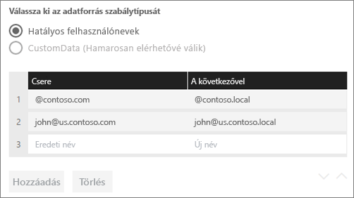

Amikor kiválaszt egy elemet a listából, választhat, hogy a **sávnyíl ikonjaival** újrarendezi, vagy **Törli** a bejegyzést.

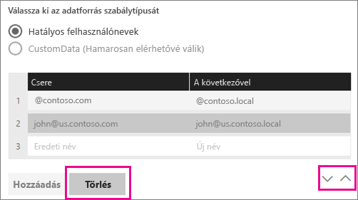

### Helyettesítő karakter (\*) használata
Helyettesítő karaktert is használhat a **Csere (eredeti név)** karakterlánchoz. Ez csak önállóan használható, más karakterláncrészlettel nem. Lehetővé teszi, hogy a művelet az összes felhasználóra vonatkozzon, és egyetlen értéket adjon tovább az adatforrásba. Ez akkor hasznos, ha azt szeretné, hogy a cégen vagy vállalaton belül mindenki ugyanazt a felhasználót használja a helyi környezetben.

### Leképezési szabály tesztelése
Érvényesítheti az eredeti nevet lecserélő nevet, ha beír egy értéket az **Eredeti név** mezőbe, és kiválasztja a **Szabály tesztelése** lehetőséget.

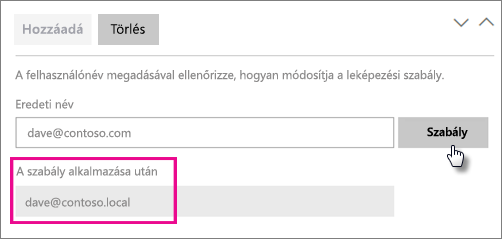

> [!NOTE]
> Eltarthat néhány percig, mire a szolgáltatás elkezdi a mentett szabályok használatát. A böngészőben a szabály azonnal működésbe lép.
> 
> 

### A leképezési szabályok korlátozásai
* A leképezés csak a konfigurálás alatt álló adott adatforrásra vonatkozik, és nem egy globális beállítás. Ha több Analysis Services-adatforrása van, mindegyik adatforráshoz le kell képeznie a felhasználókat.

## Adatforrás eltávolítása
Ha eltávolít egy adatforrást, akkor leáll minden olyan irányítópult vagy jelentés is, amely az adott adatforrásra támaszkodik.  

Adatforrás eltávolításához lépjen az Adatforrás > **Eltávolítás** elemhez.

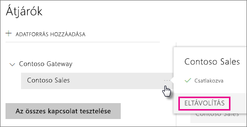

## Rendszergazdák kezelése
Az átjárókhoz tartozó Rendszergazdák lapon felvehet és eltávolíthat az átjáró kezelésére jogosult felhasználókat (vagy biztonsági csoportokat).

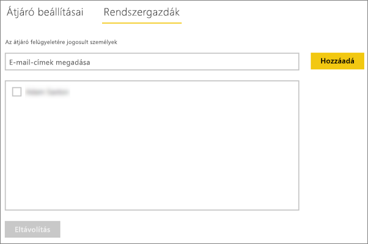

## Felhasználók kezelése
Az adatforráshoz tartozó Felhasználók lapon felvehet és eltávolíthat az adatforrás használatára jogosult felhasználókat vagy biztonsági csoportokat.

> [!NOTE]
> A felhasználók listája csak azt szabályozza, ki tehet közzé jelentéseket. A jelentéstulajdonosok létrehozhatnak irányítópultokat vagy tartalomcsomagokat, és megoszthatják azokat más felhasználókkal.
> 
> 

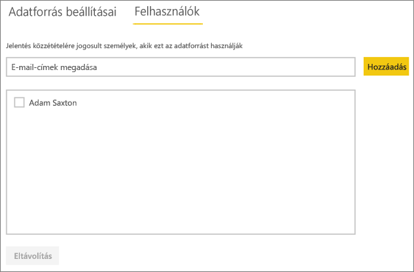

## Az adatforrás használata
Miután létrehozta az adatforrást, használhatja élő kapcsolatokkal vagy ütemezett frissítéssel is.

> [!NOTE]
> A kiszolgáló és az adatbázis nevének egyeznie kell a Power BI Desktopban és az adatforrásban a helyszíni adatátjárón belül.
> 
> 

Az adatkészlet és az adatforrás közötti kapcsolat az átjárón belül a kiszolgáló nevén és az adatbázis nevén alapul. Ezeknek egyezniük kell. Ha például egy IP-címet ad meg a kiszolgáló nevének, a Power BI Desktopban azt az IP-címet kell használnia az adatforráshoz az átjáró konfigurációján belül. Ha a *SERVER\INSTANCE* nevet használja, a Power BI Desktopban ugyanezt kell használnia az átjáróhoz konfigurált adatforráson belül.

Ez az élő kapcsolatok és az ütemezett frissítések esetén is igaz.

### Az adatforrás használata élő kapcsolatokkal
Meg kell győződnie arról, hogy a kiszolgáló és az adatbázis neve egyezik a Power BI Desktop és az átjáró számára konfigurált adatforrás között. Arról is meg kell győződnie, hogy a felhasználó szerepel az adatforrás **Felhasználók** lapján, ha élő kapcsolati adatkészleteket szeretne közzétenni. Az élő kapcsolatok esetén a kiválasztásra az első adatimportáláskor kerül sor a Power BI Desktopon belül.

Miután elvégezte a közzétételt a Power BI Desktopból vagy az **Adatok lekérése** területről, el kell kezdeni működniük a jelentéseknek. Az átjárón belüli adatforrás létrehozása után több percbe telhet, amíg a kapcsolat használhatóvá válik.

### Az adatforrás használata ütemezett frissítéssel
Ha szerepel az átjárón belül konfigurált adatforrás **Felhasználók** lapján, és a kiszolgáló és az adatbázis neve egyezik, az átjáró megjelenik lehetőségként az ütemezett frissítésnél.

## Következő lépések
[Helyszíni adatátjáró](service-gateway-onprem.md)  
[Helyszíni adatátjáró – részletek](service-gateway-onprem-indepth.md)  
[A Helyszíni adatátjáróval kapcsolatos hibák elhárítása](service-gateway-onprem-tshoot.md)  
További kérdései vannak? [Kérdezze meg a Power BI közösségét](http://community.powerbi.com/)

