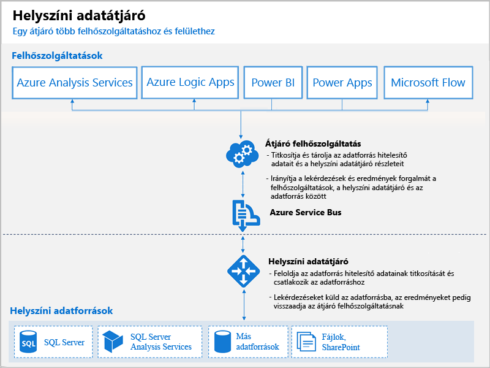

# Mik a Power BI-átjárók?

A Power BI-átjáró egy olyan szoftver, amelyet a helyszíni hálózaton belül telepíthet, és amely lehetővé teszi a hálózaton belüli adatok elérését. Kapuőrként figyeli a kapcsolódási kérelmeket, és csak akkor engedélyezi azokat, ha a felhasználói kérelem eleget tesz bizonyos feltételeknek. Ez lehetővé teszi, hogy a cégek az adatbázisaikat és más adatforrásaikat a helyszíni hálózaton belül tartsák, de ezzel együtt biztonságosan használhassák ezeket a helyszíni adatokat a Power BI-jelentésekhez és az irányítópultokhoz.

Egy átjáró használható egyetlen adatforráshoz vagy több adatforráshoz. Az alábbi ábrán egy áttekintő nézet látható, ahol az átjáró a felhőből három helyszíni számítógéphez érkező kérelmet kezel. A cikk későbbi részében erre még részletsebben is kitérünk majd.

## Átjárótípusok

A Power BI két átjárót biztosít, mindegyiket külön helyzethez:

* **Helyszíni adatátjáró (személyes mód)** – egyetlen felhasználónak teszi lehetővé, hogy kapcsolódjon a forrásokhoz, és nem osztható meg másokkal. Csak a Power BI-jal használható. Ez az átjáró kiválóan alkalmazható olyan helyzetekhez, ahol egyedül Ön készít jelentéseket, és nem szükséges megosztania az adatforrásokat másokkal.

* **Helyszíni adatátjáró** – Több felhasználó számára teszi lehetővé, hogy több helyszíni adatforráshoz csatlakozzanak. Használhatja a Power BI, a PowerApps, a Flow, az Azure Analysis Services és az Azure Logic Apps szolgáltatásokkal, és mindegyikhez csupán egyetlen átjárótelepítés szükséges. Ez az átjáró összetettebb helyzetekhez optimális, ahol többen is hozzá akarnak férni több adatforráshoz. 

## Átjáró használata

Átjáró használatához négy fő lépés szükséges:

1. **Az átjáró telepítése** egy helyi számítógépen a megfelelő mód használatával
2. **Felhasználók hozzáadása az átjáróhoz**, hogy hozzáférhessenek a helyszíni adatforrásokhoz
3. **Csatlakozás adatforrásokhoz**, hogy azok használhatóak legyenek jelentésekben és irányítópultokon
4. **A helyszíni adatok frissítése**, hogy a Power BI-jelentések mindig aktuálisak legyenek

Telepíthető önálló átjáró, vagy egy *fürthöz* is hozzáadható egy átjáró – ez utóbbi a javasolt eljárás a magas rendelkezésre állás érdekében.

## Az átjárók működése

A telepített átjáró **helyszíni adatátjáró** Windows-szolgáltatásként fut. Ez a helyi szolgáltatás az Azure Service Buson keresztül van regisztrálva a Gateway felhőszolgáltatásban. Az alábbi ábra a helyszíni adatok és az átjárót használó felhőszolgáltatások közötti folyamatot mutatja be.

Lekérdezések és adatfolyam:

1. A felhőszolgáltatás létrehoz egy lekérdezést a helyszíni adatforráshoz tartozó titkosított hitelesítő adatokkal. Ezt a rendszer elküldi az átjáró várólistájára feldolgozásra.
2. Az átjáró felhőszolgáltatása elemzi a lekérdezést, majd leküldi a kérelmet az Azure Service Busnak.
3. A helyszíni adatátjáró lekérdezi a függőben lévő kéréseket az Azure Service Busról.
4. Az átjáróhoz beérkezik a lekérdezés, az elvégzi a hitelesítő adatok visszafejtését, majd kapcsolódik az adatforrásokhoz ezekkel a hitelesítő adatokkal.
5. A futtatáshoz az átjáró a lekérdezést elküldi az adatforrásnak.
6. A futtatás eredményeit az adatforrás visszaküldi az átjárónak, majd a felhőszolgáltatásnak és az Ön kiszolgálójának.

## Következő lépések
[A helyszíni adatátjáró telepítése](service-gateway-install.md)

További kérdései vannak? [Kérdezze meg a Power BI közösségét](http://community.powerbi.com/)

