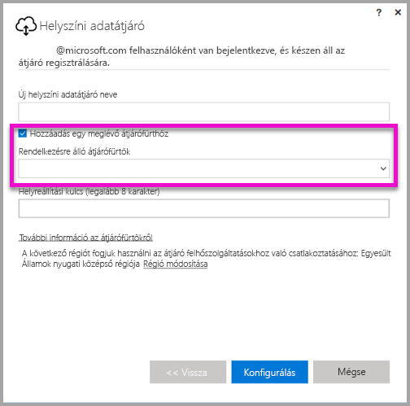

# <a name="high-availability-clusters-for-on-premises-data-gateway"></a>Magas rendelkezésre állású fürtök helyszíni adatátjáróhoz
A **helyszínen üzemelő adatátjárókból** **magas rendelkezésre állású fürtöket** hozhat lére, így biztosíthatja a szervezet hozzáférését a Power BI-jelentések és -irányítópultok által használt helyszíni adatforrásokhoz. Ezek a fürtök lehetővé teszik az átjárót felügyelő rendszergazdák számára az átjárók csoportosítását, és ezzel elkerülhetik, hogy egy adott pont meghibásodása megakadályozza a helyszíni adatforrásokhoz való hozzáférést. Ez a cikk azokat a lépéseket ismerteti, amelyekkel létrehozható a helyszíni adatátjárókból egy magas rendelkezésre állású fürt, és a beállításokhoz használható ajánlott eljárásokat is tartalmaz. A magas rendelkezésre állású átjárófürtökhöz a helyszíni adatátjáró 2017. novemberi vagy újabb frissítésére van szükség.


## <a name="setting-up-high-availability-clusters-of-gateways"></a>Magas rendelkezésre állású átjárófürtök kialakítása

A **helyszíni adatátjáró** telepítésénél azt is meghatározhatja, hogy az átjáró egy már meglévő átjárófürthöz legyen-e hozzáadva. 



Ha az átjárót meglévő fürthöz szeretné hozzáadni, meg kell adnia az elsődleges átjárópéldány *Helyreállítási kulcsát* ahhoz a fürthöz, amelyhez csatlakoztatni szeretné az átjárót. A fürt elsődleges átjárójának a 2017. novemberi vagy újabb frissítéssel kell rendelkeznie. 


## <a name="managing-a-gateway-cluster"></a>Az átjárófürt kezelése

Ha az átjárófürt már több átjárót tartalmaz, akkor minden átjáróra irányuló művelet (például adatforrás hozzáadása vagy felügyeleti engedélyek kiosztása egy átjárónak) a fürt összes átjárójára érvényes lesz. 

Ha a rendszergazda a **Power BI szolgáltatás** fogaskerék ikonja alatt található **Átjárók kezelése** menüpontot használja, megjelenik számára a regisztrált fürtök vagy különálló átjárók listája, de a fürthöz tartozó egyes átjárópéldányok nem lesznek láthatóak.

Minden új **Ütemezett frissítési** kérelem és DirectQuery-művelet automatikusan az adott átjárófürt elsődleges példányára irányul. Ha az elsődleges átjárópéldány nem érhető el, a kérelem a fürt egy másik példányához lesz átirányítva.

## <a name="powershell-support-for-gateway-clusters"></a>PowerShell-támogatás az átjárófürtökhöz

A PowerShell-parancsfájlok a helyszíni adatátjáró telepítési könyvtárában találhatók. Ez a könyvtár alapértelmezés szerint a *C:\Program Files\On-premises data gateway*. A parancsfájlok futtatásához a PowerShell 5-ös vagy újabb verziója szükséges. A PowerShell-parancsfájlokkal az alábbi műveletek végezhetők el:

-   Egy felhasználó számára elérhető átjárófürtök listájának beolvasása
-   Egy fürtben regisztrált átjárópéldányok listájának és a példányok online vagy offline állapotának lekérése
-   Egy fürtön belüli átjárópéldány engedélyezése/letiltása és más átjárótulajdonságok beállítása
-   Átjáró törlése

Ahhoz, hogy a táblázatban szereplő PowerShell-parancsokat futtatni tudja, először el kell végeznie az alábbi lépéseket:

1. Nyisson meg egy PowerShell-parancssori ablakot rendszergazdai jogosítványokkal
2. Futtassa az alábbi egyszeri PowerShell-parancsot (ez azt feltételezi, hogy ezen a gépen még soha nem futtatott PowerShell-parancsokat):

    ```
    Set-ExecutionPolicy -ExecutionPolicy Unrestricted -Force
    ```

3. A PowerShell-ablakban keresse meg a helyszíni adatátjáró telepítési mappáját, és az alábbi parancs használatával importálja a szükséges modult:

    ```
    Import-Module .\OnPremisesDataGatewayHAMgmt.psm1
    ```

Ha ezekkel végzett, az átjárófürtök kezeléséhez használhatja a táblázatban szereplő parancsokat

| **Parancs** | **Leírás** | **Paraméterek** |
| --- | --- | --- |
| *Login-OnPremisesDataGateway* |A parancs használatával bejelentkezhet a felhasználó, és kezelheti saját helyszíni adatátjáró-fürtjeit.  Ezt a parancsot még *azelőtt* kell futtatni, mielőtt a magas rendelkezésre állással kapcsolatos más parancsokat futtatna. Megjegyzés: a Login-parancs meghívásával beszerzett AAD-hitelesítési token egy órán át érvényes, utána pedig lejár. Új token beszerzéséhez újra kell futtatni a Login-parancsot.| AAD-hez tartozó felhasználónév és jelszó (a parancs végrehajtásának részeként, nem pedig a kezdő hívásnál megadva)|
| *Get-OnPremisesDataGatewayClusters* | Beolvassa a bejelentkezett felhasználóhoz tartozó átjárófürtök listáját. | A könnyebb olvashatóság érdekében lehetőség van formázási paramétereket is hozzáadni a parancshoz, például: *Format-Table -AutoSize -Wrap* (táblázat formázása, automatikus méretezés, sortörés) |
| *Get-OnPremisesDataClusterGateways* | Lekéri a megadott fürthöz tartozó átjárók listáját, és további információt is elérhetővé tesz az egyes átjárókról (pl. online/offline állapot, gép neve stb.) | *-ClusterObjectID xyz*  (ahol az *xyz*-t egy tényleges fürtobjektum azonosítójának értékével kell kicserélni, melyet a *Get-OnPremisesDataGatewayClusters* paranccsal lehet lekérni)|
| *Set-OnPremisesDataGateway* | Egy fürtön belüli átjáró tulajdonságait lehet beállítani vele, többek között engedélyezhető vagy letiltható egy adott átjárópéldány  | *-ClusterObjectID xyz* (*xyz*-t egy tényleges fürtobjektum azonosítójának értékével kell kicserélni, melyet a *Get-OnPremisesDataGatewayClusters* paranccsal lehet lekérni) *-GatewayObjectID abc* az (*abc*-t egy tényleges átjáróobjektum azonosítójának értékével kell kicserélni, melyet a *Get-OnPremisesDataClusterGateways* paranccsal lehet lekérni egy adott fürtobjektum azonosítójával) |
| *Get-OnPremisesDataGatewayStatus* | Egy fürtön belüli átjárópéldány állapotát lehet lekérni vele  | *-ClusterObjectID xyz* (*xyz*-t egy tényleges fürtobjektum azonosítójának értékével kell kicserélni, melyet a *Get-OnPremisesDataGatewayClusters* paranccsal lehet lekérni) *-GatewayObjectID abc* az (*abc*-t egy tényleges átjáróobjektum azonosítójának értékével kell kicserélni, melyet a *Get-OnPremisesDataClusterGateways* paranccsal lehet lekérni egy adott fürtobjektum azonosítójával) |
| *Remove-OnPremisesDataGateway*  | Egy átjárópéldányt lehet eltávolítani vele egy fürtből. Vegye figyelembe, hogy a fürt elsődleges átjárója csak azt követően távolítható el, hogy a fürt összes többi átjáróját is eltávolították a fürtből.| *-ClusterObjectID xyz* (*xyz*-t egy tényleges fürtobjektum azonosítójának értékével kell kicserélni, melyet a *Get-OnPremisesDataGatewayClusters* paranccsal lehet lekérni) *-GatewayObjectID abc* az (*abc*-t egy tényleges átjáróobjektum azonosítójának értékével kell kicserélni, melyet a *Get-OnPremisesDataClusterGateways* paranccsal lehet lekérni egy adott fürtobjektum azonosítójával) |


## <a name="next-steps"></a>Következő lépések

-   [Adatforrások kezelése – Analysis Services](service-gateway-enterprise-manage-ssas.md)  
-   [Az adatforrás kezelése – SAP HANA](service-gateway-enterprise-manage-sap.md)  
-   [Adatforrások kezelése – SQL Server](service-gateway-enterprise-manage-sql.md)  
-   [Adatforrások kezelése – Oracle](service-gateway-onprem-manage-oracle.md)  
-   [Adatforrások kezelése – Importálás és ütemezett frissítés](service-gateway-enterprise-manage-scheduled-refresh.md)  
-   [Helyszíni adatátjáró – részletes](service-gateway-onprem-indepth.md)  
-   [Helyszíni adatátjáró (személyes mód)](service-gateway-personal-mode.md)
-   [Helyszíni adatátjáró proxybeállításainak konfigurálása](service-gateway-proxy.md)  
-   [Kerberos használata egyszeri bejelentkezéshez (SSO) a Power BI-ból a helyszíni adatforrásokhoz](service-gateway-kerberos-for-sso-pbi-to-on-premises-data.md)  

További kérdései vannak? [Kérdezze meg a Power BI közösségét](http://community.powerbi.com/)
