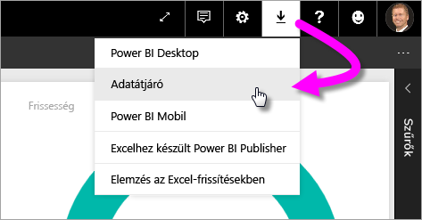
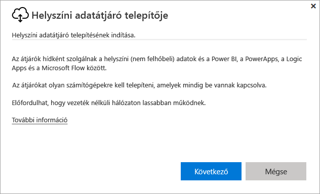
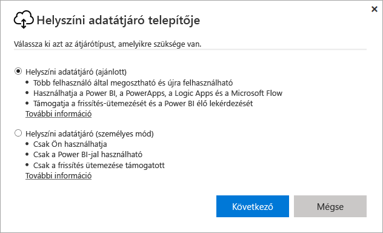
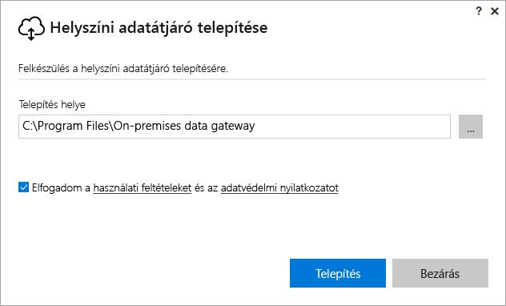
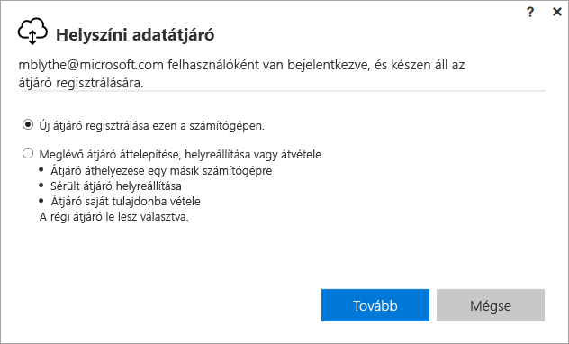
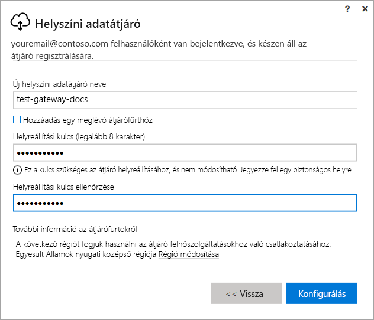
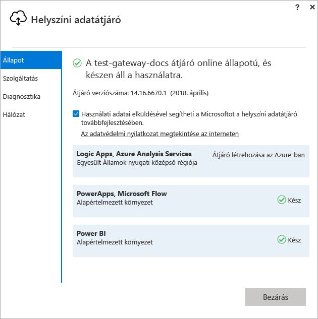
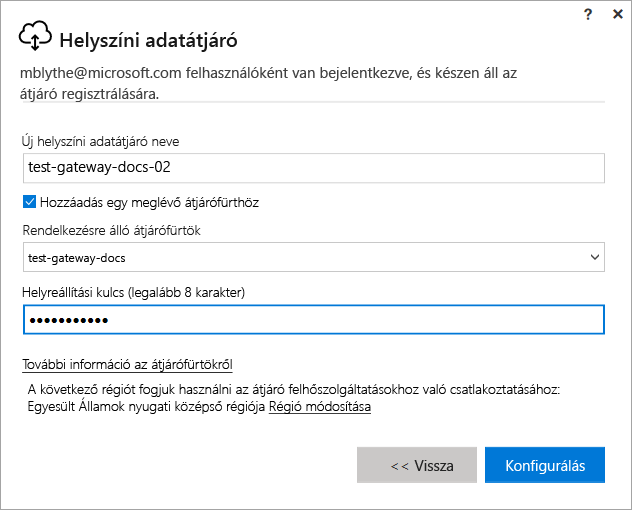

# Átjáró telepítése a Power BI-hoz

A Power BI-átjáró egy olyan szoftver, amelyet a helyszíni hálózaton belül telepíthet, és amely lehetővé teszi a hálózaton belüli adatok elérését. Az [áttekintésben](service-gateway-getting-started.md) leírtak szerint az átjárók személyes módban vagy standard módban (ez ajánlott) telepíthetők. Standard módban telepíthető önálló átjáró, vagy egy *fürthöz* is hozzáadható egy átjáró – ez utóbbi a javasolt eljárás a magas rendelkezésre állás érdekében. Ez a cikk bemutatja egy standard átjáró telepítését, majd egy fürt létrehozását egy másik átjáró hozzáadásával.

Ha még nem regisztrált a Power BI-ra, a kezdés előtt [hozzon létre egy ingyenes próbaverziós fiókot](https://app.powerbi.com/signupredirect?pbi_source=web).

## Az átjáró letöltése és telepítése

Az átjáró azon a számítógépen fut, amelyen telepítve van, ezért fontos olyan gépre telepíteni, amely mindig be van kapcsolva. A jobb teljesítmény és megbízhatóság érdekében javasolt, hogy a számítógép ne vezeték nélküli, hanem vezetékes hálózatra legyen csatlakoztatva.

1. A Power BI szolgáltatás jobb felső sarkában válassza a **letöltés ikon**  > **Adatátjáró** lehetőséget.

    

2. A letöltési oldalán válassza az **ÁTJÁRÓ LETÖLTÉSE** gombot.

3. Kattintson a **Tovább** gombra.     

    

4. Válassza a **Helyszíni adatátjáró (ajánlott)** > **Tovább** lehetőséget.

    

5. Tartsa meg az alapértelmezett telepítési útvonalat, és fogadja el a feltételeket > **Telepítés**.

    

6. Adja meg a fiókot, amellyel a Power BI-ba jelentkezik be > **Bejelentkezés**.

    

    Az átjáró a Power BI-fiókjához van társítva, az átjárókat pedig a Power BI szolgáltatáson belül tudja kezelni. Most már bejelentkezett a fiókjába.

7. Válassza az **Új átjáró regisztrálása ezen a számítógépen** > **Tovább** lehetőséget.

    

8. Adjon meg egy nevet az átjáróhoz (a bérlőn belül egyedinek kell lennie) és egy helyreállítási kulcsot. Erre a kulcsra szüksége lesz, ha helyre kell állítania vagy át kell helyeznie az átjárót. Válassza a **Konfigurálás** lehetőséget.

    

    Figyelje meg a **Hozzáadás egy meglévő átjárófürthöz** lehetőséget. Ezt a lehetőséget a cikk következő szakasza tárgyalja.

9. Tekintse át az információkat az utolsó ablakban. Figyelje meg, hogy az átjáró a Power BI-on kívül a PowerAppshez és a Flowhoz is elérhető, ugyanis mindhármat ugyanazzal a fiókkal használom. Kattintson a **Bezárás** gombra.

    

Az átjáró sikeres telepítése után hozzáadhat egy másik átjárót, ezzel létrehozva egy fürtöt.

## Fürt létrehozása másik átjáró hozzáadásával

A fürt által az átjáró rendszergazdái elkerülhetik, hogy hibaérzékeny pont legyen a helyszíni adatok elérésében. Ha az elsődleges átjáró nem elérhető, akkor az adatkérelmek a másodikként hozzáadott átjáróra lesznek irányítva, és így tovább. Egy számítógépre csak egy standard átjáró telepíthető, ezért a fürt második átjáróját egy másik számítógépre kell telepíteni. Ezt az is indokolja, hogy a fürtnek redundánsnak kell lennie.

A magas rendelkezésre állású átjárófürtökhöz a helyszíni adatátjáró 2017. novemberi vagy újabb frissítésére van szükség.

1. Töltse le az átjárót egy másik számítógépre, és telepítse.

2. Miután bejelentkezett Power BI-fiókjába, regisztrálja az átjárót. Válassza a **Hozzáadás egy meglévő átjárófürthöz** lehetőséget. A **Rendelkezésre álló átjárófürtök** alatt válassza ki az elsőként telepített átjárót (ez lesz az *elsődleges átjáró*), majd adja meg a hozzá tartozó helyreállítási kulcsot. Válassza a **Konfigurálás** lehetőséget.

    

## Következő lépések

[Power BI-átjáró kezelése](service-gateway-manage.md)

További kérdései vannak? [Kérdezze meg a Power BI közösségét](http://community.powerbi.com/)