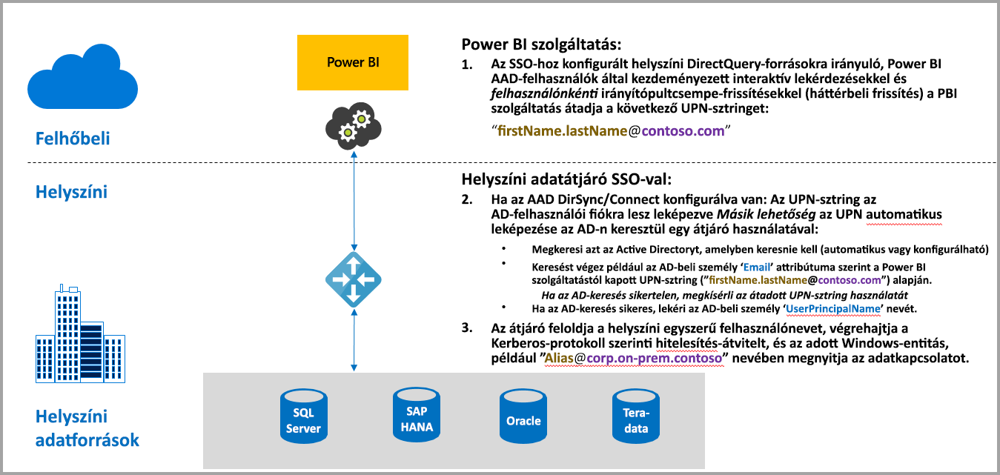
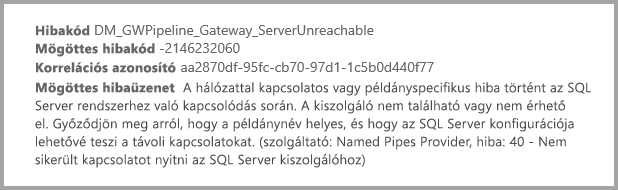
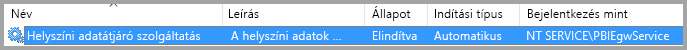
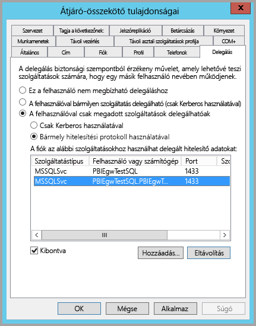
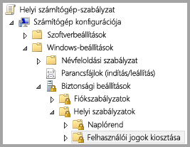
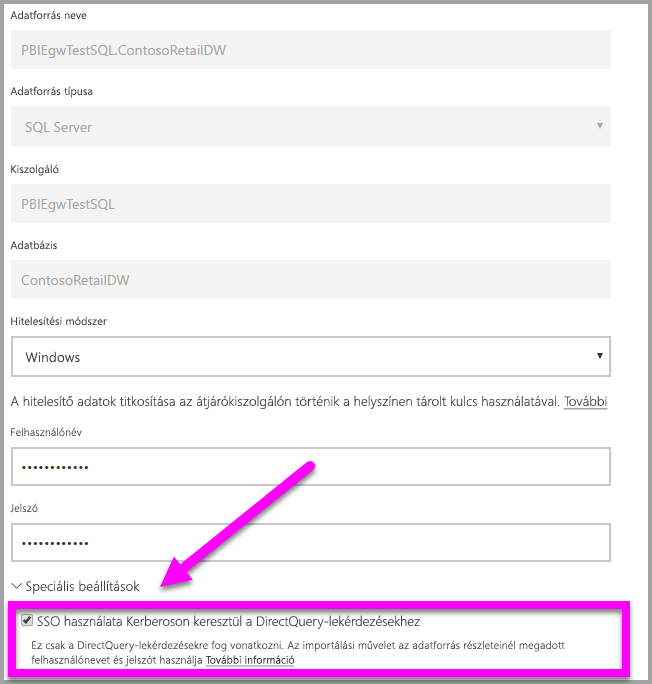
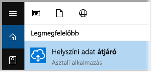
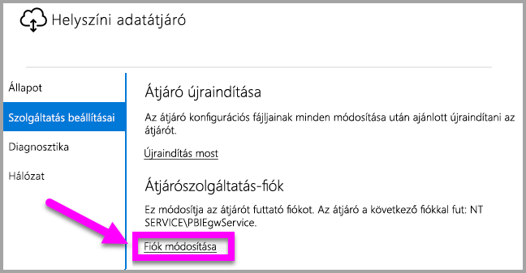

# Kerberos használata egyszeri bejelentkezésre (SSO) a Power BI-ból a helyszíni adatforrásokba
Ha a helyszíni adatátjárót konfigurálja a Kerberosszal, zökkenőmentes egyszeri bejelentkezési kapcsolatot érhet el, amely lehetővé teszi a Power BI-jelentések és -irányítópultok frissítését a helyszíni adatokból. A helyszíni adatátjáró segíti az egyszeri bejelentkezést (SSO) a DirectQuery használatakor, amellyel a helyszíni adatforrásokhoz kapcsolódik.

Jelenleg az SQL Server, az SAP HANA és a Teradata adatforrásokat támogatja a [Kerberos által korlátozott delegálás](https://technet.microsoft.com/library/jj553400.aspx) alapján.

* SQL Server
* SAP HANA
* Teradata

Ha egy felhasználó DirectQuery jelentést használ a Power BI szolgáltatásban, az összes keresztszűrő, szeletelő, rendezés és szerkesztési művelet olyan lekérdezéseket eredményezhet, amelyek az alapul szolgáló helyszíni adatforrásból dolgoznak.  Ha az egyszeri bejelentkezés konfigurálva van az adatforráshoz, akkor a Power BI-t használó felhasználó identitása alatt futnak a lekérdezések (vagyis a webtartalmakon vagy a Power BI mobilalkalmazásokon keresztül). Így minden felhasználó pontosan azokat az adatokat látja, amelyekhez engedélye van az alapul szolgáló adatforrásban. Ha az egyszeri bejelentkezés konfigurálva van, nincsenek különböző felhasználók között megosztott adatok a gyorsítótárazás során.

## Lekérdezés futtatása SSO-val – a végrehajtott lépések
Az SSO-val futó lekérdezés három lépésből áll, az alábbi ábrán látható módon.

> [!NOTE]
> Az egyszeri bejelentkezés az Oracle-ben még nem érhető el, de fejlesztés alatt áll és hamarosan elérhetővé válik.
> 
> 

További információk a lépésekről:

1. Az egyes lekérdezésekhez a **Power BI szolgáltatás** hozzárendeli az *egyszerű felhasználónevet* (UPN), amikor elküldi a lekérdezési kérést a konfigurált átjáróra.
2. Az átjárónak le kell képeznie az Azure Active Directory UPN-jét egy helyi Active Directory-identitásra.
   
   a.  Ha az AAD DirSync (más néven *AAD Connect*) konfigurálva van, akkor a leképezés automatikusan működik az átjáróban.
   
   b.  Ellenkező esetben az átjáró kikeresheti és leképezheti az Azure AD UPN-jét egy helyi felhasználóra a helyi Active Directory-tartományra irányuló keresés végrehajtásával.
3. Az átjárószolgáltatás folyamata megszemélyesíti a leképezett helyi felhasználót, megnyitja a kapcsolatot az alapul szolgáló adatbázishoz, és elküldi a lekérdezést. Az átjárót nem kell ugyanarra a gépre telepíteni, mint az adatforrást.
   
   - A felhasználó megszemélyesítése és az adatbázishoz való kapcsolódás csak akkor sikeres, ha az átjáró szolgáltatásfiókja tartományi fiók (vagy szolgáltatási SID), és ha a Kerberos által korlátozott delegálás konfigurálva volt az adatbázishoz, hogy elfogadja a Kerberos-jegyeket az átjáró szolgáltatási fióktól.  
   
   > [!NOTE]
   > A szolgáltatás biztonsági azonosítójával kapcsolatban, ha az AAD DirSync/Connect konfigurálva van és a felhasználói fiókok szinkronizálva vannak, az átjárószolgáltatásnak nem kell helyi AD-kereséseket végrehajtania futásidőben, és használhatja a helyi szolgáltatási SID-et (azaz nincs szükség tartományi fiókra) az átjáró szolgáltatáshoz.  A Kerberos által korlátozott delegálás cikkben ismertetett konfigurációs lépései ugyanezek (csak a tartományi fiók helyett a szolgáltatási SID alapján kell alkalmazni).
   > 
   > 

> [!NOTE]
> Ha engedélyezni szeretné az egyszeri bejelentkezést az SAP HANA szolgáltatáshoz, a következő SAP HANA-specifikus konfigurációkat kell alkalmaznia az SAP-n:
> 1. Ellenőrizze, hogy az SAP HANA-kiszolgáló a minimálisan megkövetelt verzióval fut-e, ami az SAP HANA-kiszolgáló platformjának szintéjtől függ:
> * [HANA 2 SPS 01 Rev 012.03](https://launchpad.support.sap.com/#/notes/2557386)
> * [HANA 2 SPS 02 Rev 22](https://launchpad.support.sap.com/#/notes/2547324)
> * [HANA 1 SP 12 Rev 122.13](https://launchpad.support.sap.com/#/notes/2528439)
>
> 2. Az átjárót tartalmazó számítógépen telepítse az SAP legfrissebb HANA ODBC-illesztőjét.  A minimális verzió a HANA ODBC 2017. augusztusi, 2.00.020.00-s verziója.
>
> Az alábbi SAP-javítások és -frissítések hivatkozásai hasznosak lehetnek. Vegye figyelembe, hogy az alábbi erőforrásokba az SAP-támogatási fiókjával kell bejelentkeznie, és hogy az SAP megváltoztathatja vagy frissítheti ezeket a hivatkozásokat.
> 
> * [HANA 2 SPS 01 Rev 012.03](https://launchpad.support.sap.com/#/notes/2557386) 
> * [HANA 2 SPS 02 Rev 22](https://launchpad.support.sap.com/#/notes/2547324) 
> * [HANA 1 SP 12 Rev 122.13](https://launchpad.support.sap.com/#/notes/2528439)

## A Kerberos elégtelen konfigurálásából származó hibák
Ha az alapul szolgáló adatbázis-kiszolgáló és átjáró nincsenek megfelelően konfigurálva a **Kerberos által korlátozott delegáláshoz**, a következő hibaüzenetet kaphatja:

A hibaüzenethez kapcsolódó technikai részletek pedig a következőképpen nézhetnek ki:

Az elégtelen Kerberos konfiguráció eredménye az, hogy az átjáró nem tudta megfelelően megszemélyesíteni az eredeti felhasználót, és nem sikerült a csatlakozási kísérlet az adatbázissal.

## A Kerberos által korlátozott delegálás előkészítése
Számos elemet kell konfigurálni ahhoz, hogy a Kerberos által korlátozott delegálás megfelelően működjön, beleértve a *szolgáltatás egyszerű szolgáltatásneveit* (SPN) és a delegálási beállításokat a szolgáltatásfiókokhoz.

### 1. előfeltétel: A helyszíni adatátjáró telepítése és konfigurálása
A helyszíni adatátjáró ezen kiadása támogatja a helyben történő frissítést, valamint a meglévő átjárók beállításainak átvételét.

### 2. előfeltétel: Az átjáró Windows-szolgáltatásának futtatása tartományi fiókként
A standard telepítés során az átjáró a gép helyi szolgáltatásfiókjával fut (ebben az esetben: *NT Service\PBIEgwService*), az alábbi képen látható módon:

A **Kerberos által korlátozott delegálás** engedélyezéséhez az átjárót tartományi fiókkal kell futtatni, ha az AAD még nincs szinkronizálva a helyi Active Directoryval (az AAD DirSync/Connect használatával). A fiókváltoztatás megfelelő működésének elérésére két lehetősége van:

* Ha a helyszíni adatátjáró előző verziójával kezdi, kövesse sorrendben az alábbi cikkben ismertetett öt lépés mindegyikét (beleértve az átjárókonfiguráló futtatását a 3. lépésben):
  
  * [Az átjárószolgáltatás fiókjának tartományi felhasználóra váltása](https://powerbi.microsoft.com/documentation/powerbi-gateway-proxy/#changing-the-gateway-service-account-to-a-domain-user)
  * Ha már telepítette a helyszíni adatátjáró előzetes verzióját, van egy új, a felhasználói felület által vezetett megközelítés, amellyel közvetlenül az átjárókonfigurálón belül lehet váltani szolgáltatásfiókot. Tekintse meg az **Átjáró tartományi fiókra váltása** részt a cikk végén.

> [!NOTE]
> Ha az AAD DirSync/Connect konfigurálva van és a felhasználói fiókok szinkronizálva vannak, az átjáró szolgáltatásnak nem kell helyi AD-kereséseket végrehajtania futásidőben, és használhatja a helyi szolgáltatási SID-et (azaz nincs szükség tartományi fiókra) az átjáró szolgáltatáshoz. A Kerberos által korlátozott delegálás cikkben ismertetett konfigurációs lépései ugyanezek, mint ez a konfiguráció (csak a tartományi fiók helyett a szolgáltatási SID alapján kell alkalmazni).
> 
> 

### 3. előfeltétel: Tartományi rendszergazdai jogosultsággal kell rendelkezni az SPN-ek (SetSPN) és a Kerberos által korlátozott delegálási beállítások konfigurálásához
Habár technikailag lehetséges az, hogy egy tartományi rendszergazda ideiglenesen vagy véglegesen jogosultságot adjon valaki másnak az SPN-ek és a Kerberos delegálás konfigurálására anélkül, hogy rendszergazdai jogosultságra lenne szükség, nem ez az ajánlott eljárás. A következő szakaszban részletezzük a **3. előfeltételhez** szükséges konfigurációs lépéseket.

## A Kerberos által korlátozott delegálás konfigurálása az átjáróhoz és az adatforráshoz
A rendszer megfelelő konfigurálásához a következő két elemet kell konfigurálni vagy érvényesíteni:

1. Szükség esetén konfiguráljon egy egyszerű szolgáltatásnevet az átjáró szolgáltatásfiókhoz (ha még nincs ilyen).
2. Delegálási beállítások konfigurálása az átjárószolgáltatás tartományfiókján.

Vegye figyelembe, hogy ezen két konfigurációs lépés végrehajtásához tartományi rendszergazdai jogosultságok szükségesek.

A következő szakaszok ezeket a lépéseket ismertetik.

### Az átjáró szolgáltatásfiókjához tartozó egyszerű szolgáltatásnév konfigurálása
Először az alábbi lépések végrehajtásával állapítsa meg, hogy létre lett-e már hozva egyszerű szolgáltatásnév az átjáró szolgáltatásfiókjaként használt tartományi fiókhoz:

1. Tartományi rendszergazdaként futtassa az **Active Directory – felhasználók és számítógépek** modult
2. Kattintson a jobb gombbal a tartományra, válassza a **Keresés** lehetőséget, és írja be az átjáró szolgáltatásfiókjának nevét
3. A keresési eredményekben kattintson a jobb gombbal az átjáró szolgáltatásfiókjára, majd válassza a **Tulajdonságok** lehetőséget.
   
   * Ha a **Delegálás** lap látható a **Tulajdonságok** párbeszédpanelen, akkor már létre lett hozva egy egyszerű szolgáltatásnév, ezért továbbléphet a delegálási beállítások konfigurálásáról szóló következő alszakaszra.

Ha nincs **Delegálás** lap a **Tulajdonságok** párbeszédpanelen, manuálisan létrehozhat egy egyszerű szolgáltatásnevet, így megjelenik a **Delegálás** lap (ez a delegálási beállítások konfigurálásának legegyszerűbb módja). Egyszerű szolgáltatásnevet létrehozhat a [setspn eszközzel](https://technet.microsoft.com/library/cc731241.aspx), amely a Windows rendszer része (tartományi rendszergazdai jogosultságokra van szükség az egyszerű szolgáltatásnév létrehozásához).

Például tegyük fel, hogy az átjáró szolgáltatásfiókja „PBIEgwTest\GatewaySvc”, és az átjáró szolgáltatást futtató számítógép neve **Machine1**. Ebben a példában az adott számítógépen az átjáró-szolgáltatásfiók egyszerű szolgáltatásnevének beállításához a következő parancsot futtatná:

Miután végzett ezzel a lépéssel, továbbléphet a delegálási beállítások konfigurálására.

### Delegálási beállítások konfigurálása az átjáró szolgáltatásfiókon
A második konfigurációs követelmény a delegálási beállítások konfigurálása az átjáró-szolgáltatásfiókon. Számos eszköz áll rendelkezésre a lépések végrehajtásához. Ebben a cikkben az **Active Directory – felhasználók és számítógépek** modult használjuk, a Microsoft Management Console (MMC) beépülő modulját, amellyel felügyelheti és közzéteheti az információkat a címtárban, és alapértelmezés szerint elérhető a tartományvezérlőkön. Más gépeken a **Windows-szolgáltatás** konfigurációján keresztül is engedélyezheti.

A **Kerberos által korlátozott delegálást** protokollváltással kell konfigurálni. Korlátozott delegálás esetén explicit módon kell meghatároznia, hogy melyik szolgáltatásokhoz szeretne delegálni, például csak az SQL Server vagy az SAP HANA-kiszolgáló fogad delegálási hívást az átjáró szolgáltatásfiókjától.

Ez a szakasz azt feltételezi, hogy már konfigurálta az egyszerű szolgáltatásneveket az alapul szolgáló adatforrásokhoz (például SQL Server, SAP HANA, Teradata stb.). Az adatforrás-kiszolgálók egyszerű szolgáltatásneveinek konfigurálásával az adott adatbázis-kiszolgáló műszaki dokumentációjában ismerkedhet meg. Emellett megtekintheti a blogbejegyzést, amely azt ismerteti, hogy [*milyen egyszerű szolgáltatásnévre van szükség az alkalmazásához.*](https://blogs.msdn.microsoft.com/psssql/2010/06/23/my-kerberos-checklist/)

A következő lépésekben egy helyszíni környezetet feltételezünk két géppel: egy átjárót tartalmazó számítógéppel és egy adatbázis-kiszolgálóval (SQL Server-adatbázis), és a példa kedvéért a következő beállításokat és neveket is feltételezzük:

* Átjáró-számítógép neve: **PBIEgwTestGW**
* Átjáró-szolgáltatásfiók: **PBIEgwTest\GatewaySvc** (fiók megjelenített neve: Gateway Connector)
* SQL Server adatforrás gépének neve: **PBIEgwTestSQL**
* SQL Server adatforrás szolgáltatásfiókja: **PBIEgwTest\SQLService**

A példaként megadott nevekkel és beállításokkal a konfigurációs lépések a következők:

1. Tartományi rendszergazdai jogosultsággal futtassa az **Active Directory – felhasználók és számítógépek** modult.
2. Kattintson a jobb gombbal az átjáró-szolgáltatásfiókra (**PBIEgwTest\GatewaySvc**), majd válassza a **Tulajdonságok** lehetőséget.
3. Válassza a **Delegálás** lapot.
4. Válassza **A számítógépen csak a megadott szolgáltatások delegálhatók** elemet.
5. Válassza a **Bármely hitelesítési protokoll használatával** elemet.
6. **A fiók az alábbi szolgáltatásokhoz használhat delegált hitelesítő adatokat:** szakaszban kattintson a **Hozzáadás** lehetőségre.
7. Az új párbeszédpanelben válassza a **Felhasználók vagy számítógépek** elemet.
8. Adja meg az SQL Server-adatbázisszolgáltatás szolgáltatásfiókját (**PBIEgwTest\SQLService**), és kattintson az **OK** gombra.
9. Válassza ki azt az egyszerű szolgáltatásnevet, amelyet létrehozott az adatbázis-kiszolgálóhoz. A példánkban az egyszerű szolgáltatásnév az **MSSQLSvc** kifejezéssel kezdődik. Ha megadta az adatbázis-szolgáltatás teljes tartománynevét és a NetBIOS egyszerű szolgáltatásnevét is, válassza ki mindkettőt. Lehet, hogy csak az egyiket látja.
10. Kattintson az **OK** gombra. Ekkor az SPN-nek meg kell jelennie a listában.
11. Ha szeretné, kiválaszthatja a **Kibontva** lehetőséget, hogy a teljes tartománynév és a NetBIOS egyszerű szolgáltatásnév is megjelenjen
12. A párbeszédpanel az alábbihoz fog hasonlítani, ha bejelölte a **Kibontva** lehetőséget.
    
    
13. Kattintson az **OK** gombra.
    
    Végül az átjáró-szolgáltatást futtató gépen (a példánkban **PBIEgwTestGW**) az átjáró-szolgáltatásfióknak meg kell adni az „Ügyfél megszemélyesítése hitelesítés után” helyi házirendet. Ezt a Helyi csoportházirend-szerkesztőben hajthatja végre/ellenőrizheti (**gpedit**).
14. Az átjárót tartalmazó számítógépen futtassa a következőt: *gpedit.msc*
15. Navigáljon a **Helyi számítógép-házirend > Számítógép konfigurációja > A Windows beállításai > Biztonsági beállítások > Helyi házirend > Felhasználói jogok kiosztása** elemhez az alábbi képen látható módon.
    
    
16. A **Felhasználói jogok kiosztása** lehetőségnél a házirendek listájából válassza ki az **Ügyfél megszemélyesítése hitelesítés után** elemet.
    
    
    
    Kattintson jobb gombbal, és nyissa meg az **Ügyfél megszemélyesítése hitelesítés után** elem **Tulajdonságait**, és ellenőrizze a fiókok listáját. A listának tartalmaznia kell az átjáró-szolgáltatásfiókot (**PBIEgwTest\GatewaySvc**).
17. A **Felhasználói jogok kiosztása** lehetőségnél a házirendek listájából válassza ki az **Az operációs rendszer részeként való működés (SeTcbPrivilege)** elemet. Győződjön meg róla, hogy az átjáró-szolgáltatásfiók a fiókok listájában is szerepel.
18. Indítsa újra a **helyszíni adatátjáró** szolgáltatás folyamatát.

## Power BI-jelentés futtatása
A cikkben szereplő korábbi konfigurációs lépések végrehajtása után a Power BI-ban az **Átjárók kezelése** lapon konfigurálja az adatforrást, majd az itt található **Speciális beállítások** területen engedélyezze az egyszeri bejelentkezést, ezután pedig tegye közzé az adatforráshoz kötött jelentéseket és adatkészleteket.

Ez a konfiguráció a legtöbb esetben működik. A Kerberos esetében azonban más konfigurációkra lehet szükség a környezettől függően. Ha a jelentés továbbra sem töltődik be, forduljon a tartományi rendszergazdájához a probléma részletesebb kivizsgálásához.

## Átjáró váltása tartományi fiókra
A cikk korábbi részeiben már volt szó az átjáró helyi szolgáltatásfiók helyett tartományi fiókként történő futtatására váltásáról a **helyszíni adatátjáró** felhasználói felületén. Ennek a lépései a következők:

1. Indítsa el a **helyszíni adatátjáró** konfigurációs eszközét.
   
   
2. A főoldalon kattintson a **Bejelentkezés** gombra, majd jelentkezzen be Power BI-fiókjával.
3. A sikeres bejelentkezés után válassza a **Szolgáltatásbeállítások** fület.
4. Kattintson a **Fiók módosítása** elemre a részletes útmutató elindításához, ahogyan az az ábrán látható.
   
   

## Következő lépések
A **helyszíni adatátjáróval** és a **DirectQueryvel** kapcsolatos további információkért lásd az alábbi forrásanyagokat:

* [Helyszíni adatátjáró](service-gateway-onprem.md)
* [A DirectQuery használata a Power BI-ban](desktop-directquery-about.md)
* [A DirectQuery által támogatott adatforrások](desktop-directquery-data-sources.md)
* [A DirectQuery és az SAP BW](desktop-directquery-sap-bw.md)
* [A DirectQuery és az SAP HANA](desktop-directquery-sap-hana.md)

