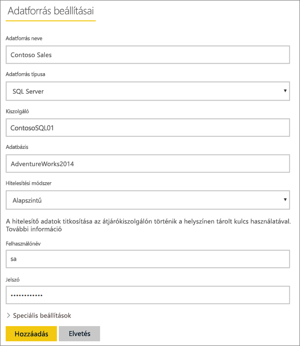
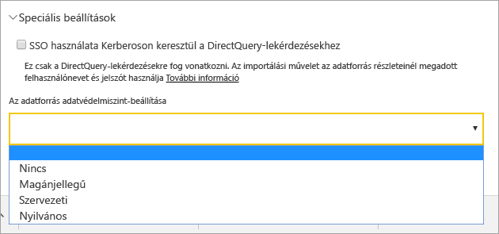
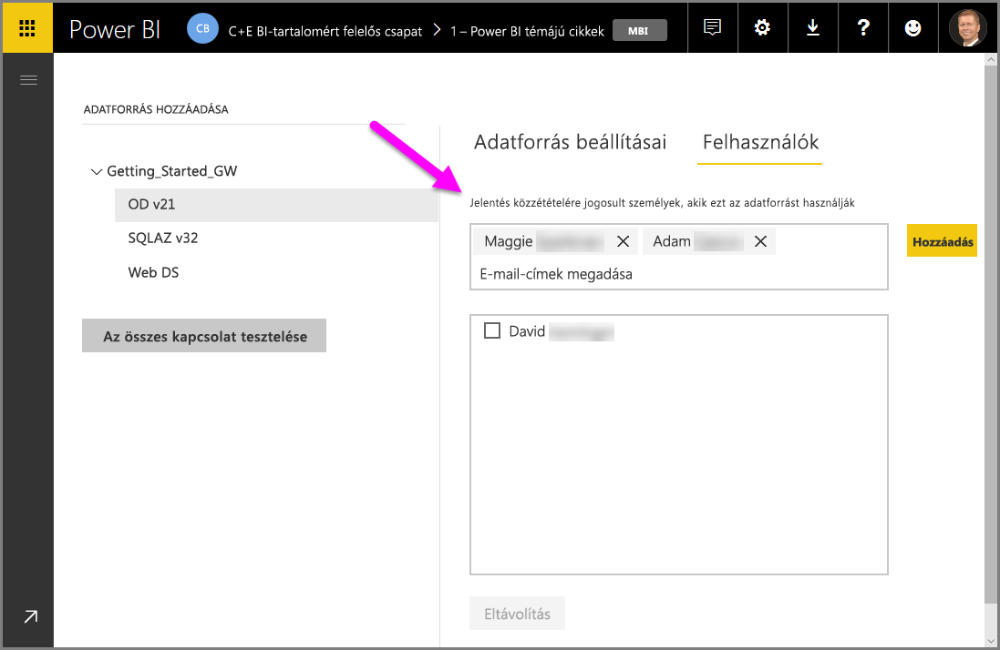
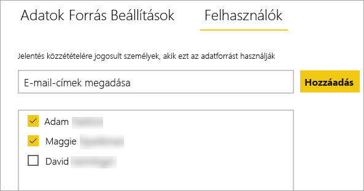
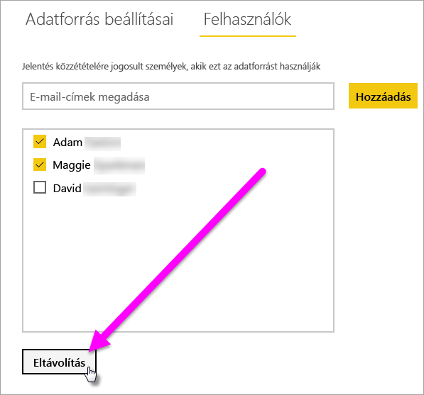
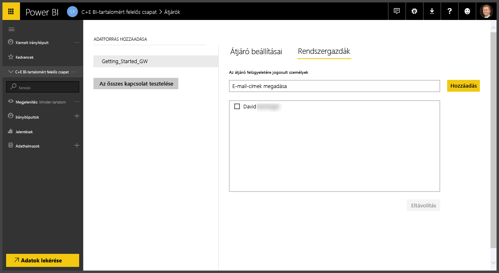
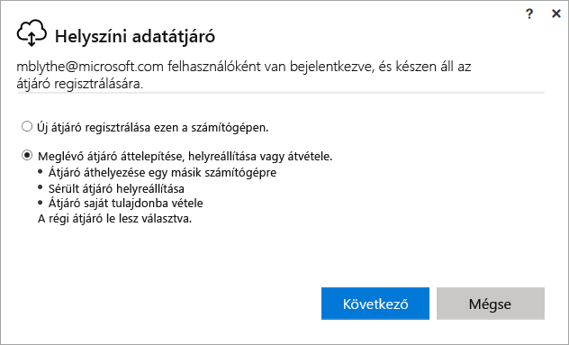
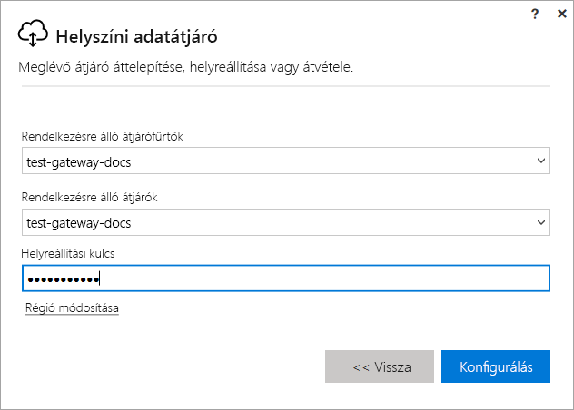

# Power BI-átjáró kezelése

Miután [telepítette a Power BI-adatátjárót](service-gateway-install.md), a követelményeknek megfelelően kezelheti azt. Ebben a témakörben elsajátíthatja, hogyan vehet fel és távolíthat el adatforrásokat és felhasználókat; indíthat újra átjárókat; és helyezhet át, állíthat vissza, vehet át és távolíthat el átjárókat. 

Az átjárókat a Power BI szolgáltatás **Átjárók kezelése** területén, a helyi számítógépen az átjáró-alkalmazással vagy Power Shell-szkriptekkel kezelheti. Ez a cikk a Power BI szolgáltatással foglalkozik. 

Ha éppen most telepített átjárót, akkor ajánlott a következő lépésben [adatforrást hozzáadni](#add-a-data-source), majd [hozzáadni a felhasználókat](#add-users-to-a-data-source), hogy elérhessék az adatforrást.

## Adatforrások kezelése

A Power BI sokféle helyszíni adatforrást támogat, és ezek mindegyikéhez saját követelmények tartoznak. Egy átjáró használható egyetlen adatforráshoz vagy több adatforráshoz. Az itt tárgyalt példában adatforrásként SQL Server hozzáadását mutatjuk be, de a lépések más adatforrások esetén is hasonlóak.

### Adatforrások felvétele

1. Válassza a Power BI szolgáltatás jobb felső sarkában lévő fogaskerék ikont  > **Átjárók kezelése**.

    

2. Választhat egy átjárót, majd az **Adatforrás hozzáadása** lehetőséget, vagy választhatja az Átjárók alatti **Adatforrás hozzáadása** lehetőséget.

    

3. Válassza ki az **Adatforrás típusát**.

    

4. Adja meg az adatforrás adatait. Itt adható meg például a **Kiszolgáló**, az **Adatbázis** és több más információ is.  

    

5. Az SQL Serverhez a **Windows** vagy az **Alapszintű** (SQL-hitelesítés) **Hitelesítési módszer** választható.  Ha az **Alapszintűt** választja, akkor meg kell adnia az adatforrás eléréséhez szükséges hitelesítő adatokat.

6. A **Speciális beállítások** alatt beállíthatja az adatforráshoz alkalmazandó [adatvédelmi szintet](https://support.office.com/article/Privacy-levels-Power-Query-CC3EDE4D-359E-4B28-BC72-9BEE7900B540)) (a [DirectQuery](desktop-directquery-about.md)-re nem érvényes).

    

7. Válassza a **Hozzáadás** elemet. Ha a folyamat sikerrel zárult, megjelenik a *Sikeres csatlakozás* üzenet.

    

Most már használhatja az adatforrást, hogy az SQL Server adatait felhasználja Power BI-irányítópultjain és -jelentéseiben.

### Adatforrás eltávolítása

A már nem használt adatforrást el is távolíthatja. Ügyeljen arra, hogy egy adatforrás eltávolítása után az arra épülő irányítópultok és jelentések nem működnek megfelelően.

Az eltávolításához lépjen az adatforráshoz, és válassza az **Eltávolítás** lehetőséget.

## Felhasználók és rendszergazdák kezelése

Miután hozzáadott egy adatforrást az átjáróhoz, felhasználóknak és biztonsági csoportoknak adhat hozzáférést az adott adatforráshoz (nem a teljes átjáróhoz). Az adatforrás felhasználóinak listája csak azt szabja meg, hogy ki tehet közzé az adatforrásból származó adatokat tartalmazó jelentést. A jelentéstulajdonosok létrehozhatnak irányítópultokat, tartalomcsomagokat és alkalmazásokat, és megoszthatják azokat más felhasználókkal.

Felhasználóknak és biztonsági csoportoknak rendszergazdai hozzáférést is adhat az átjáróhoz.

### Felhasználók hozzáadása adatforráshoz

1. Válassza a Power BI szolgáltatás jobb felső sarkában lévő fogaskerék ikont  > **Átjárók kezelése**.

2. Jelölje ki az adatforrást, amelyhez felhasználókat kíván adni.

3. Válassza a **Felhasználók** lehetőséget, majd adjon meg egy vállalati felhasználót, akinek hozzáférést kíván adni a kijelölt adatforráshoz. A következő ábrán Maggie és Adam van hozzáadva.

    

4. Válassza a **Hozzáadás** lehetőséget, és az új tag megjelenik az ablakban.

    

Ennyi az egész. Ne feledje, hogy a felhasználókat minden adatforráshoz hozzá kell adnia, amelyhez hozzáférést kíván adni nekik. Minden adatforrás külön felhasználólistával rendelkezik, és a felhasználókat minden adatforráshoz külön kell hozzáadni.

### Felhasználók eltávolítása egy adatforrásból

Az adatforráshoz tartozó **Felhasználók** lapon eltávolíthat az adatforrás használatára jogosult felhasználókat vagy biztonsági csoportokat.

### Rendszergazdák hozzáadása és eltávolítása

Az átjárókhoz tartozó **Rendszergazdák** lapon felvehet és eltávolíthat az átjáró kezelésére jogosult felhasználókat (vagy biztonsági csoportokat).

## Átjárófürt kezelése

Ha létrehoz egy több átjárót tartalmazó fürtöt, akkor minden átjáróra irányuló művelet (például adatforrás hozzáadása vagy felügyeleti engedélyek kiosztása egy átjárónak) a fürt összes átjárójára érvényes lesz. 

Ha a rendszergazda a **Power BI szolgáltatás** fogaskerék ikonja alatt található **Átjárók kezelése** menüpontot használja, megjelenik számára a regisztrált fürtök vagy különálló átjárók listája, de a fürthöz tartozó egyes átjárópéldányok nem lesznek láthatóak.

Minden új **Ütemezett frissítési** kérelem és DirectQuery-művelet automatikusan az adott átjárófürt elsődleges példányára irányul. Ha az elsődleges átjárópéldány nem érhető el, a kérelem a fürt egy másik példányához lesz átirányítva.

## Átjáró megosztása

Maga az átjáró nem *osztható meg*, de hozzáadhat rendszergazdákat az átjáróhoz, valamint hozzáadhat felhasználókat az átjáró adatforrásaihoz. 

Miután telepített egy átjárót, alapértelmezés szerint Ön lesz az átjáró rendszergazdája. Amint azt korábban bemutattuk, más személyeket is felvehet rendszergazdaként. Ezek a rendszergazdák felvehetnek adatforrásokat, valamint konfigurálhatják és eltávolíthatják az átjárót.

Az egyes átjárók alatt létrehozott adatforrásokhoz felhasználókat is hozzárendelhet. A felhasználók ez után ezekkel az adatforrásokkal frissíthetik a Power BI-jelentéseket. Nem tudják azonban megváltoztatni az adatforrásokat, sem az átjáróbeállításokat.

## Átjáró migrálása, visszaállítása vagy átvétele

Futtassa az átjáró telepítőjét azon a számítógépen, ahol migrálni, visszaállítani vagy átvenni kívánja az átjárót.

1. Töltse le és telepítse az átjárót.

2. Miután bejelentkezett Power BI-fiókjába, regisztrálja az átjárót. Válassza a **Meglévő átjáró migrálása, visszaállítása vagy átvétele** > **Következő** lehetőséget.

    

3. Válasszon az elérhető fürtök és átjárók közül, és adja meg a választott átjáró helyreállítási kulcsát. Válassza a **Konfigurálás** lehetőséget.

    

## Átjáró újraindítása

Az átjáró Windows-szolgáltatásként fut. Mint minden Windows-szolgáltatás, többféle módon leállítható és elindítható. A parancssorból az eljárás a következő:

1. Nyisson meg egy rendszergazdai jogú parancssort azon a gépen, amelyen az átjáró fut.

2. A szolgáltatás leállításához írja be a következőt: `net stop PBIEgwService`.

3. A szolgáltatás elindításához írja be a következőt: `net start PBIEgwService`.

## Átjáró eltávolítása

A már nem használt átjárót el is távolíthatja. Vegye figyelembe, hogy az átjáró eltávolításával az alá tartozó adatforrásokat is törli. Ezáltal az ezekre az adatforrásokra épülő irányítópultok és jelentések sem működnek megfelelően.

1. Válassza a Power BI szolgáltatás jobb felső sarkában lévő fogaskerék ikont  > **Átjárók kezelése**.

2. Jelölje ki az átjárót, és válassza az **Eltávolítás** lehetőséget.
   
   

## Következő lépések

[Útmutató adatátjáró üzembe helyezéséhez](service-gateway-deployment-guidance.md)

További kérdései vannak? [Kérdezze meg a Power BI közösségét](http://community.powerbi.com/)
