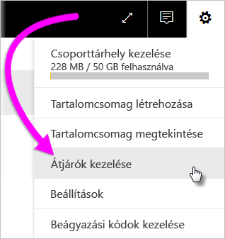
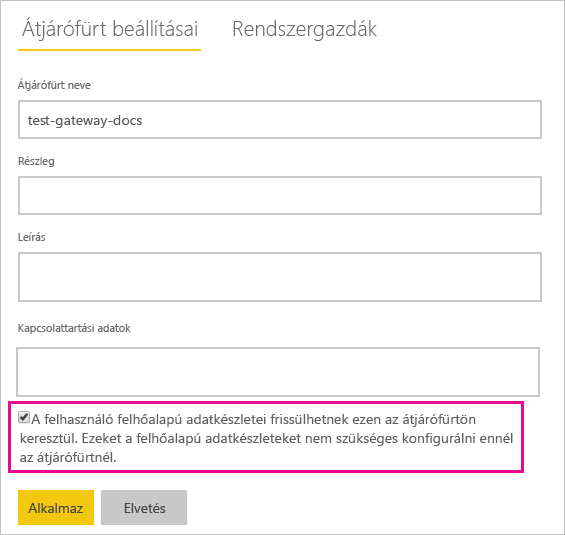
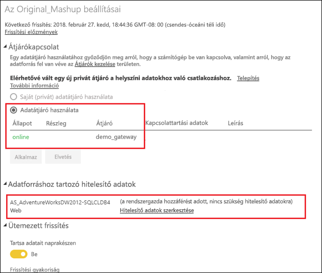

# Helyszíni és felhőbeli adatforrások egyesítése vagy összefűzése

A helyszíni adatátjáró lehetővé teszi, hogy a helyszíni és a felhőbeli adatforrásokat egyesítse vagy összefűzze ugyanazon a lekérdezésen belül. Ez a funkció olyankor hasznos, ha különböző adatforrásokból kíván adatokat lekérni, de nem szeretne több külön lekérdezést használni.

## Előfeltételek

- A helyi számítógépen [telepített átjáró](service-gateway-install.md).
- Egy Power BI Desktop-fájl, amely helyszíni és felhőbeli adatforrásokat kombináltan használó lekérdezéseket tartalmaz.

1. Válassza a Power BI szolgáltatás jobb felső sarkában lévő fogaskerék ikont  > **Átjárók kezelése**.

    

2. Válassza ki a konfigurálni kívánt átjárót.

3. Az **Átjárófürt beállításai** fülön válassza **Az ezen átjárófürtön keresztüli frissítés engedélyezése a felhasználó felhőalapú adatforrásai számára** > **Alkalmaz** lehetőséget.

    

4. Az átjárófürtnél vegye fel a lekérdezésekben használt [helyszíni adatforrásokat](service-gateway-enterprise-manage-scheduled-refresh.md#add-a-data-source). A felhőbeli adatforrásokat nem szükséges itt megadnia.

5. Töltse fel a helyszíni és felhőbeli adatforrásokat kombináltan használó lekérdezéseket tartalmazó Power BI Desktop-fájlt a Power BI szolgáltatásba.

6. Az új adathalmazhoz tartozó **Adathalmaz beállításai** lapon:

   - A helyszíni adatforrásnál válassza ki az adatforráshoz társított átjárót.

   - Az **Adatforrás azonosító adatai** szakasznál szükség szerint módosítsa az adatforrás azonosító adatait.

     

7. Most, hogy beállította a felhőbeli hitelesítéseket, a **Frissítés most** lehetőség választásával azonnal frissítheti az adathalmazt, de ütemezhet rendszeres frissítést is.

## Következő lépések

Az átjárók adatfrissítésével kapcsolatban további információt [Az adatforrás használata ütemezett frissítéshez](service-gateway-enterprise-manage-scheduled-refresh.md#using-the-data-source-for-scheduled-refresh) című cikkben talál.