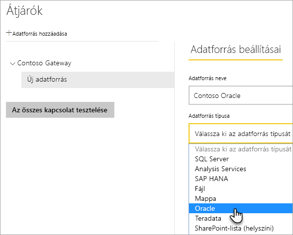
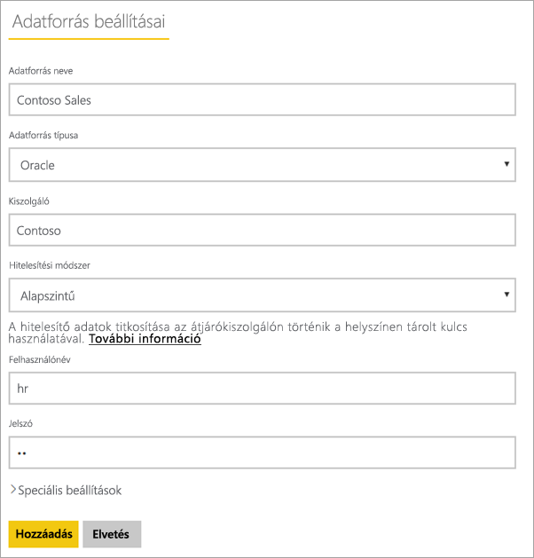
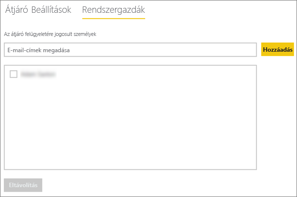
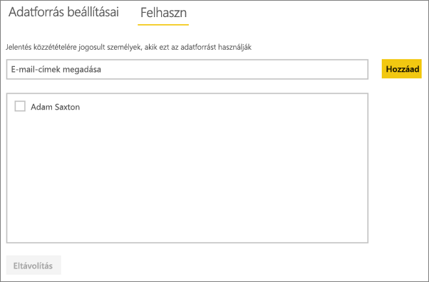

# <a name="manage-your-data-source---oracle"></a>Az adatforrás kezelése – Oracle
Amint telepítette a helyszíni adatátjárót, fel kell vennie az átjáróval használható adatforrásokat. Ez a cikk bemutatja, hogyan lehet használni az átjárókat és az adatforrásokat. Az Oracle adatforrást az ütemezett frissítéshez vagy a DirectQueryhez használhatja.

## <a name="download-and-install-the-gateway"></a>Az átjáró letöltése és telepítése
Az átjárót a Power BI szolgáltatásból töltheti le. Válassza a **Letöltések** > **Adatátjáró** lehetőséget, vagy lépjen az [átjáró letöltési oldalára](https://go.microsoft.com/fwlink/?LinkId=698861).


> [!WARNING]
> Ahhoz, hogy az átjáró csatlakozni tudjon az Oracle-kiszolgálóhoz, telepíteni és konfigurálni kell a .NET rendszer Oracle-adatszolgáltatóját (ODP.NET). Ez az Oracle Data Access Components (ODAC) része. Az Oracle szolgáltató letöltéséről további információt az alábbi [Az Oracle-ügyfél telepítése](#installing-the-oracle-client) című szakaszban talál.
> 
> 

## <a name="installing-the-oracle-client"></a>Az Oracle ügyfél telepítése
A Power BI Desktop **32 bites** verzióihoz a következő hivatkozással töltse le és telepítse a **32 bites** Oracle ügyfelet:

* [32 bites Oracle Data Access Components (ODAC) az Oracle Developer Tools for Visual Studio (12.1.0.2.4) verzióval](http://www.oracle.com/technetwork/topics/dotnet/utilsoft-086879.html)

A Power BI Desktop **64 bites** verzióihoz vagy a helyszíni adatátjáróhoz a következő hivatkozással töltse le és telepítse a **64 bites** Oracle ügyfelet:

* [64 bites ODAC 12.2c 1-es kiadás (12.2.0.1.0) Windows x64 rendszerhez](http://www.oracle.com/technetwork/database/windows/downloads/index-090165.html)

A telepítés után a megfelelő információkkal konfigurálnia kell a tnsnames.ora fájlt az adatbázishoz. A Power BI Desktop és az átjáró nem a tnsnames.ora fájlban meghatározott net_service_name névvel rendelkezik. Ha ez nincs konfigurálva, nem fog tudni csatlakozni. A tnsnames.ora fájl alapértelmezett elérési útja a következő: `[Oracle Home Directory]\Network\Admin\tnsnames.ora`. A tnsnames.ora fájlok konfigurálásáról további információ: [Oracle: Helyi elnevezési paraméterek (tnsnames.ora)](https://docs.oracle.com/cd/B28359_01/network.111/b28317/tnsnames.htm).

### <a name="example-tnsnamesora-file-entry"></a>Példa tnsnames.ora fájlbejegyzés
A tnsname.ora fájlban lévő bejegyzések alapvető formátuma a következő.

```
net_service_name=
 (DESCRIPTION=
   (ADDRESS=(protocol_address_information))
   (CONNECT_DATA=
     (SERVICE_NAME=service_name)))
```

Íme egy példa a kitöltött kiszolgáló- és portinformációkra.

```
CONTOSO =
  (DESCRIPTION =
    (ADDRESS = (PROTOCOL = TCP)(HOST = oracleserver.contoso.com)(PORT = 1521))
    (CONNECT_DATA =
      (SERVER = DEDICATED)
      (SERVICE_NAME = CONTOSO)
    )
  )
```

## <a name="add-a-gateway"></a>Átjáró hozzáadása
Egy átjáró hozzáadásához egyszerűen [töltse le](https://go.microsoft.com/fwlink/?LinkId=698861) és telepítse az átjárót egy kiszolgálóra a környezetében. Miután telepítette az átjárót, az megjelenik az átjárók listáiban az **Átjárók kezelése** területen.

> [!NOTE]
> Az **Átjárók kezelése** nem jelenik meg, amíg nem rendszergazdája legalább egy átjárónak. Ez elérhető úgy, ha hozzáadják rendszergazdaként, vagy ha saját maga telepít és konfigurál egy átjárót.
> 
> 

## <a name="remove-a-gateway"></a>Átjáró eltávolítása
Egy átjáró eltávolítása az átjáró alatti adatforrásokat is törli.  Az adott adatforrásokra támaszkodó irányítópultok és jelentések sem fognak működni.

1. Válassza ki a fogaskerék ikont  a jobb felső sarokban, majd az **Átjárók kezelése** lehetőséget.
2. Átjáró > **Eltávolítás**
   
   

## <a name="add-a-data-source"></a>Adatforrások felvétele
Az adatforrások felvételének egyik módja az, ha kiválaszt egy átjárót, és az **Adatforrás hozzáadása** lehetőségre kattint, a másik pedig az, ha az Átjáró > **Adatforrás hozzáadása** elemhez lép.


Ekkor a listáról kiválaszthatja az **Adatforrás típusa** lehetőséget.



Ekkor meg kell adni az információkat az adatforráshoz, például a **Kiszolgálót** és az **Adatbázist**.  

**Hitelesítési módszert** is választania kell.  Ez **Windows** vagy **Alapszintű** lehet.  Akkor érdemes az **Alapszintűt** választani, ha Windows-hitelesítés helyett egy, az Oracle-ben létrehozott fiókot fog használni. Ezután írja be az adatforráshoz használni kívánt hitelesítő adatokat.

> [!NOTE]
> Az adatforrás felé irányuló összes lekérdezés ezen hitelesítő adatok segítségével fut. További információkért tekintse meg a helyszíni adatátjárókat ismertető fő cikket, amelyből többet tudhat meg a [hitelesítő adatok](service-gateway-onprem.md#credentials) tárolásáról.
> 
> 



Miután minden információt megadott, kattintson a **Hozzáadás** lehetőségre.  Mostantól használhatja ezt az adatforrást az ütemezett frissítéshez vagy a DirectQueryhez egy helyszíni Oracle-kiszolgálóval. Ha sikerrel járt, megjelenik a *Sikeres csatlakozás* üzenet.


### <a name="advanced-settings"></a>Speciális beállítások
Konfigurálhatja az adatforrás adatvédelmi szintjét. Ez vezérli, hogy hogyan fűzhetők össze adatok. Ez csak ütemezett frissítéshez használható. Mindez nem érvényes a DirectQueryre. [További információ](https://support.office.com/article/Privacy-levels-Power-Query-CC3EDE4D-359E-4B28-BC72-9BEE7900B540)


## <a name="remove-a-data-source"></a>Adatforrás eltávolítása
Ha eltávolít egy adatforrást, akkor leáll minden olyan irányítópult vagy jelentés is, amely az adott adatforrásra támaszkodik.  

Egy adatforrás eltávolításához lépjen az Adatforrás > **Eltávolítás** elemhez.


## <a name="manage-administrators"></a>Rendszergazdák kezelése
Az átjárókhoz tartozó Rendszergazdák lapon felvehet és eltávolíthat az átjáró kezelésére jogosult felhasználókat (vagy biztonsági csoportokat).



## <a name="manage-users"></a>Felhasználók kezelése
Az adatforráshoz tartozó Felhasználók lapon felveheti és eltávolíthatja az adatforrás használatára jogosult felhasználókat vagy biztonsági csoportokat.

> [!NOTE]
> A felhasználók listája csak azt szabályozza, ki tehet közzé jelentéseket. A jelentéstulajdonosok létrehozhatnak irányítópultokat vagy tartalomcsomagokat, és megoszthatják azokat más felhasználókkal. A jelentést vagy irányítópultot használó felhasználóknak nem kell a felhasználók listájában lenniük.
> 
> 



## <a name="using-the-data-source"></a>Az adatforrás használata
Miután létrehozta az adatforrást, használhatja DirectQuery-kapcsolatokkal vagy ütemezett frissítéssel is.

> [!WARNING]
> A kiszolgáló és az adatbázis nevének egyeznie kell a Power BI Desktopban és az adatforrásban a helyszíni adatátjárón belül.
> 
> 

Az adatkészlet és az adatforrás közötti kapcsolat az átjárón belül a kiszolgáló nevén és az adatbázis nevén alapul. Ezeknek egyezniük kell! Ha például egy IP-címet ad meg a kiszolgáló nevének, a Power BI Desktopban azt az IP-címet kell használnia az adatforráshoz az átjáró konfigurációján belül. Ennek a névnek egyeznie kell a tnsnames.ora fájlban meghatározott aliassal is. A tnsnames.ora fájlról további információ: [Az Oracle-ügyfél telepítése](#installing-the-oracle-client).

Ez a DirectQuery és az ütemezett frissítések esetén is igaz.

### <a name="using-the-data-source-with-directquery-connections"></a>Az adatforrás használata DirectQuery-kapcsolatokkal
Meg kell győződnie arról, hogy a kiszolgáló és az adatbázis neve egyezik a Power BI Desktop és az átjáró számára konfigurált adatforrás között. Arról is meg kell győződnie, hogy a felhasználó szerepel az adatforrás **Felhasználók** lapján, ha DirectQuery-adatkészleteket szeretne közzétenni. A DirectQuery esetén a kiválasztásra az első adatimportáláskor kerül sor a Power BI Desktopon belül. [További információ](desktop-use-directquery.md)

Miután elvégezte a közzétételt a Power BI Desktopból vagy az **Adatok lekérése** területről, el kell kezdeni működniük a jelentéseknek. Az átjárón belüli adatforrás létrehozása után több percbe telhet, amíg a kapcsolat használhatóvá válik.

### <a name="using-the-data-source-with-scheduled-refresh"></a>Az adatforrás használata ütemezett frissítéssel
Ha szerepel az átjárón belül konfigurált adatforrás **Felhasználók** lapján, és a kiszolgáló és az adatbázis neve egyezik, az átjáró megjelenik lehetőségként az ütemezett frissítésnél.


## <a name="troubleshooting"></a>Hibaelhárítás
Több hibaüzenetet kaphat az Oracle-től, amikor az elnevezési szintaxis helytelen, vagy nincs megfelelően konfigurálva.

* ORA-12154: TNS: nem oldható fel a megadott csatlakozásazonosító  
* ORA-12514: A TNS figyelő jelenleg nem ismeri a csatlakozásleíróban kért szolgáltatást  
* ORA-12541: TNS: nincs figyelő  
* ORA-12170: TNS: kapcsolat-időtúllépés történt  
* ORA-12504: a TNS figyelő nem kapta meg a SERVICE_NAME nevet a CONNECT_DATA adatokban  

Ezek a hibák akkor fordulhatnak elő, ha az Oracle-ügyfél nincs telepítve, vagy ha nincs megfelelően konfigurálva. Ha telepítve van, meg kell győződnie arról, hogy a tnsnames.ora fájl helyesen van-e konfigurálva, és hogy a megfelelő net_service_name nevet használja-e. Arról is meg kell győződnie, hogy a net_service_name egyezzen a Power BI Desktopot használó gép és az átjárót futtató gép között. További információ: [Az Oracle-ügyfél telepítése](#installing-the-oracle-client).

> [!NOTE]
> Az Oracle-kiszolgáló verziója és az Oracle-ügyfél verziója közötti kompatibilitás miatt is kaphat hibaüzenetet. Ezeknek általában egyezniük kell.
> 
> 

Az átjáróval kapcsolatos további hibaelhárítási információkért lásd: [A helyszíni adatátjáró hibaelhárítása](service-gateway-onprem-tshoot.md).

## <a name="next-steps"></a>Következő lépések
[Helyszíni adatátjáró](service-gateway-onprem.md)  
[Helyszíni adatátjáró – részletek](service-gateway-onprem-indepth.md)  
[A helyszíni adatátjáró hibaelhárítása](service-gateway-onprem-tshoot.md)  
[Power BI Premium](service-premium.md)

További kérdései vannak? [Kérdezze meg a Power BI közösségét](http://community.powerbi.com/)

