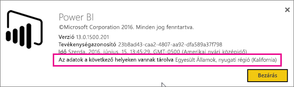
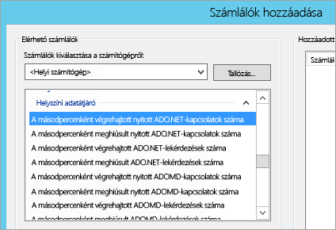
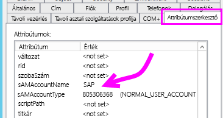
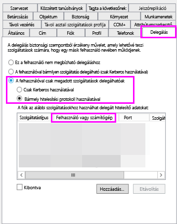
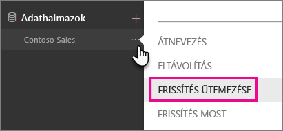
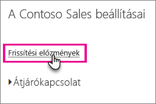
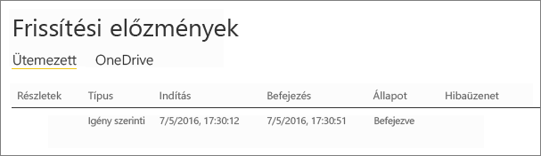

# <a name="troubleshooting-the-on-premises-data-gateway"></a>A helyszíni adatátjáró hibaelhárítása
Ez a cikk néhány olyan gyakori problémát ismertet, amelyek a **helyszíni adatátjáró** használatakor előfordulhatnak.

<!-- Shared Community & support links Include -->
[!INCLUDE [gateway-onprem-tshoot-support-links-include](./includes/gateway-onprem-tshoot-support-links-include.md)]

<!-- Shared Troubleshooting Install Include -->
[!INCLUDE [gateway-onprem-tshoot-install-include](./includes/gateway-onprem-tshoot-install-include.md)]

## <a name="configuration"></a>Konfiguráció
### <a name="how-to-restart-the-gateway"></a>Az átjáró újraindítása
Az átjáró Windows-szolgáltatásként fut, így többféle módon is elindítható és leállítható. Például megnyithat egy parancssort emelt szintű engedélyekkel a gépen, amelyen az átjáró fut, és aztán bármely parancsot futtathatja az alábbiak közül:

* A szolgáltatás leállításához futtassa az alábbi parancsot:
  
    „   net stop PBIEgwService   ”
* A szolgáltatás elindításához futtassa az alábbi parancsot:
  
    „   net start PBIEgwService   ”

### <a name="error-failed-to-create-gateway-please-try-again"></a>Hiba: Az átjáró létrehozása nem sikerült. Próbálkozzon újra.
Az összes részletes adat rendelkezésre áll, de a Power BI szolgáltatás meghívása hibát adott vissza. Ekkor megjelenik a hiba a tevékenységazonosítóval. Ez több különböző ok miatt történhet meg. A részletes adatok beszerzéséhez összegyűjtheti és áttekintheti az alábbiakban említett naplókat.

Ezt proxykonfigurációs problémák is okozhatják. A proxy konfigurálása a felhasználói felületen nem lehetséges. További információ a [proxykonfiguráció módosításáról](service-gateway-proxy.md)

### <a name="error-failed-to-update-gateway-details--please-try-again"></a>Hiba: Nem sikerült frissíteni az átjáró adatait.  Próbálkozzon újra.
A Power BI szolgáltatás adatokat küldött az átjárónak. A rendszer továbbította az adatokat a helyi Windows-szolgáltatásnak, de nem jöttek vissza. Vagy egy szimmetrikus kulcs létrehozása nem sikerült. A belső kivétel a **Részletek megjelenítése** területen látható. A részletes adatok beszerzéséhez összegyűjtheti és áttekintheti az alábbiakban említett naplókat.

### <a name="error-power-bi-service-reported-local-gateway-as-unreachable-please-restart-the-gateway-and-try-again"></a>Hiba: A Power BI szolgáltatás jelentése szerint a helyi átjáró nem érhető el. Indítsa újra az átjárót, majd próbálkozzon újra.
A konfigurálás végén a rendszer újra meghívja a Power BI szolgáltatást az átjáró érvényesítése érdekében. A Power BI szolgáltatás az átjárót nem *élőként* látja. Lehetséges, hogy a Windows-szolgáltatás újraindításával elhárítható a kommunikációs probléma. A részletes adatok beszerzéséhez összegyűjtheti és áttekintheti az alábbiakban említett naplókat.

### <a name="script-error-during-sign-into-power-bi"></a>Szkripthiba a Power BI-ba történő bejelentkezés során
A helyszíni adatátjáró konfigurálása során szkripthiba történhet a Power BI-ba történő bejelentkezéskor. A probléma elhárításához telepítse az alábbi biztonsági frissítést. A frissítés a Windows Update-en keresztül telepíthető.

[MS16-051: Biztonsági frissítés az Internet Explorerhez: 2016. május 10. (KB 3154070)](https://support.microsoft.com/kb/3154070)

### <a name="gateway-configuration-failed-with-a-null-reference-exception"></a>Az átjáró konfigurálása nem sikerült, null értékű hivatkozáskivétel történt
Az alábbihoz hasonló hibát tapasztalhat.

        Failed to update gateway details.  Please try again.
        Error updating gateway configuration.

A hiba magában foglal egy hívásláncot, amely az alábbiakat tartalmazza.

        Microsoft.PowerBI.DataMovement.Pipeline.Diagnostics.CouldNotUpdateGatewayConfigurationException: Error updating gateway configuration. ----> System.ArgumentNullException: Value cannot be null.
        Parameter name: serviceSection

Ha régebbi átjáróról végez frissítést, a rendszer megőrzi a konfigurációs fájlt. Lehet, hogy hiányzik egy szakasz. Amikor az átjáró megpróbálja olvasni, a fenti null értékű referencia kivételt adja vissza.

Ennek kijavításához tegye a következőket.

1. Távolítsa el az átjárót.
2. Törölje az alábbi mappát.
   
        c:\Program Files\On-premises data gateway
3. Telepítse újra az átjárót.
4. Opcionálisan alkalmazhatja a helyreállítási kulcsot egy meglévő átjáró visszaállításához.

### <a name="support-for-tls-1112"></a>A TLS 1.1/1.2 támogatása
A 2017. augusztusi frissítés után a helyszíni adatátjáró alapértelmezés szerint a Transport Layer Security (TLS) 1.1-es vagy 1.2-es verzióját használja a **Power BI szolgáltatással** való kommunikációra. A helyszíni adatátjáró korábbi verziói a TLS 1.0-t használják alapértelmezés szerint. 2017. november 1-jén a TLS 1.0 támogatása megszűnik. Frissítse helyszíni adatátjáróit a 2017. augusztusi vagy újabb kiadásra, hogy az átjárók ezután is megfelelően működjenek.

Fontos megjegyezni, hogy a november 1-je előtt a helyszíni adatátjáró továbbra is támogatja a TLS 1.0-t – az átjáró tartalékként használja. Ahhoz, hogy biztosítsa, hogy az átjárók teljes adatforgalma a TLS 1.1-es vagy 1.2-es verzióját használja (és hogy megakadályozza a TLS 1.0 használatát az átjárón), a következő beállításkulcsokat kell megadnia vagy módosítania az átjárószolgáltatáson futó gépen:

        [HKEY_LOCAL_MACHINE\SOFTWARE\Microsoft\.NETFramework\v4.0.30319]"SchUseStrongCrypto"=dword:00000001
        [HKEY_LOCAL_MACHINE\SOFTWARE\Wow6432Node\Microsoft\.NETFramework\v4.0.30319]"SchUseStrongCrypto"=dword:00000001

> [!NOTE]
> A beállításkulcsok hozzáadásával vagy módosításával a módosítások érvényesek lesznek az összes .NET-alkalmazásra. További információkat a TLS-t vagy az egyéb alkalmazásokat érintő beállításjegyzék-módosításokról [a Transport Layer Security (TLS) beállításjegyzék-módosításaival](https://docs.microsoft.com/windows-server/security/tls/tls-registry-settings) kapcsolatos cikkben olvashat.
> 
> 

## <a name="data-sources"></a>Adatforrások
### <a name="error-unable-to-connect-details-invalid-connection-credentials"></a>Hiba: Nem sikerült csatlakozni. Részletek: „Érvénytelen kapcsolathitelesítő adatok”
A **Részletek megjelenítése** terület megjeleníti az adatforrástól származó hibaüzenetet. Az SQL Server esetében ez az alábbihoz hasonló.

    Login failed for user 'username'.

Ellenőrizze, hogy a megfelelő felhasználónevet és jelszót adta-e meg. Ellenőrizze továbbá, hogy ezekkel a hitelesítő adatokkal sikeresen lehet-e kapcsolódni az adatforráshoz. Győződjön meg arról, hogy az éppen használt fiók megfelel a **hitelesítési módszernek**.

### <a name="error-unable-to-connect-details-cannot-connect-to-the-database"></a>Hiba: Nem sikerült csatlakozni. Részletek: „Nem lehet csatlakozni az adatbázishoz”
A kiszolgálóhoz sikerült kapcsolódni, a megadott adatbázishoz azonban nem. Ellenőrizze az adatbázis nevét, és hogy a felhasználói hitelesítő adatok megfelelő jogosultságot biztosítanak-e az adatbázis eléréséhez.

A **Részletek megjelenítése** terület megjeleníti az adatforrástól származó hibaüzenetet. Az SQL Server esetében ez az alábbihoz hasonló.

    Cannot open database "AdventureWorks" requested by the login. The login failed. Login failed for user 'username'.

### <a name="error-unable-to-connect-details-unknown-error-in-data-gateway"></a>Hiba: Nem sikerült csatlakozni. Részletek: „Ismeretlen hiba az adatátjáróban”
Ez a hiba különböző okok miatt fordulhat elő. Mindenképpen ellenőrizze, hogy létrehozható-e kapcsolat az adatforrás és az átjárót üzemeltető gép között. Ez annak a következménye lehet, hogy a kiszolgáló nem érhető el.

A **Részletek megjelenítése** területen ekkor megjelenik a **DM_GWPipeline_UnknownError** hibakód.

További részleteket az Eseménynaplók > **Alkalmazás- és szolgáltatásnaplók** > **Helyszíni adatátjáró szolgáltatás** részben talál.

### <a name="error-we-encountered-an-error-while-trying-to-connect-to-server-details-we-reached-the-data-gateway-but-the-gateway-cant-access-the-on-premises-data-source"></a>Hiba: Hiba történt a(z) <server> rendszerhez történő csatlakozás közben. Részletek: „Az adatátjáró elérése sikerült, de az átjáró nem tud hozzáférni a helyszíni adatforráshoz.”
Nem sikerült csatlakozni a megadott adatforráshoz. Ellenőrizze az adott adatforráshoz megadott információkat.

A **Részletek megjelenítése** területen ekkor megjelenik a **DM_GWPipeline_Gateway_DataSourceAccessError** hibakód.

Ha a mögöttes hibaüzenet az alábbihoz hasonló, az azt jelenti, hogy az adatforráshoz használt fiók nem a szóban forgó Analysis Services-példány kiszolgálói rendszergazdája. [További információ](https://docs.microsoft.com/sql/analysis-services/instances/grant-server-admin-rights-to-an-analysis-services-instance)

    The 'CONTOSO\account' value of the 'EffectiveUserName' XML for Analysis property is not valid.

Ha a mögöttes hibaüzenet az alábbihoz hasonló, az azt is jelentheti, hogy az Analysis Services-szolgáltatásfiókból hiányzik a [token-groups-global-and-universal](https://msdn.microsoft.com/library/windows/desktop/ms680300.aspx) (TGGAU) könyvtárattribútum.

    The user name or password is incorrect.

A Windows 2000 előtti rendszerekkel kompatibilis tartományok esetében a TGGAU attribútum engedélyezve van. A legtöbb újonnan létrehozott tartomány alapértelmezés szerint azonban nem engedélyezi ezt az attribútumot. További információkat [itt](https://support.microsoft.com/kb/331951) talál.

Ezt az alábbiak szerint ellenőrizheti.

1. Csatlakozzon az Analysis Services-géphez az SQL Server Management Studióban. A Speciális kapcsolati tulajdonságok részben adja meg a szóban forgó felhasználóhoz tartozó EffectiveUserName paramétert, és nézze meg, hogy a hiba továbbra is fennáll-e.
2. A dsacls Active Directory eszköz használatával ellenőrizheti, hogy az attribútum szerepel-e a listában. Ez az eszköz általában egy tartományvezérlőben található meg. Ismernie kell a fiók megkülönböztetett tartománynevét, és el kell küldenie az eszköznek.
   
        dsacls "CN=John Doe,CN=UserAccounts,DC=contoso,DC=com"
   
    Az eredményeknek az alábbiakhoz hasonlónak kell lenniük.
   
            Allow BUILTIN\Windows Authorization Access Group
                                          SPECIAL ACCESS for tokenGroupsGlobalAndUniversal
                                          READ PROPERTY

A probléma elhárításához engedélyeznie kell a TGGAU attribútumot az Analysis Services Windows-szolgáltatáshoz használt fiók számára.

**Másik lehetőség hibás felhasználónév vagy jelszó esetén**

Ennek a hibának az is lehet az oka, hogy az Analysis Services-kiszolgáló másik tartományban van, mint a felhasználók, és a tartományok között nincs kétirányú megbízhatósági kapcsolat.

A tartományok közötti megbízhatósági kapcsolatot a tartományi rendszergazdával együttműködésben kell ellenőriznie.

**Nem láthatók az adatátjáró adatforrásai az Analysis Services „Adatok lekérése” felületén a Power BI szolgáltatás használatakor**

Az átjáró konfigurálása során győződjön meg arról, hogy a fiókja szerepel az adatforrás **Felhasználók** lapján található listában. Ha nem rendelkezik hozzáféréssel az átjáróhoz, kérje meg az átjáró rendszergazdáját ennek ellenőrzésére. Az Analysis Services listájában szereplő adatforrás csak a **Felhasználók** listában szereplő fiókok számára látható.

## <a name="datasets"></a>Adathalmazok
### <a name="error-there-is-not-enough-space-for-this-row"></a>Hiba: Nincs elegendő szabad terület ehhez a sorhoz.
Ez a hiba akkor fordul elő, ha egyetlen sor mérete nagyobb 4 MB-nál. Meg kell határoznia, hogy az adatforrás melyik soráról van szó, és meg kell próbálnia kiszűrni a sort, vagy csökkenteni a méretét.

### <a name="error-the-server-name-provided-doesnt-match-the-server-name-on-the-sql-server-ssl-certificate"></a>Hiba: A megadott kiszolgálónév nem egyezik az SQL-kiszolgáló SSL-tanúsítványán szereplő kiszolgálónévvel.
Ez akkor fordulhat elő, ha tanúsítvány köznapi neve a kiszolgáló teljes tartománynevéhez (FQDN) tartozik, viszont csak a kiszolgáló Netbios-neve lett megadva. Ez eltérést fog okozni a tanúsítványban. A probléma megoldásához meg kell adnia a kiszolgálónevet az átjáró adatforrásán belül, valamint a PBIX-fájlt a kiszolgáló teljes tartománynevének használatához.

### <a name="i-dont-see-the-on-premises-data-gateway-persent-when-configuring-scheduled-refresh"></a>Az ütemezett frissítés konfigurálásakor nem látható a helyszíni adatátjáró.
Ennek különböző okai lehetnek a különböző forgatókönyvekben.

1. A Power BI Desktopban és az átjáróhoz konfigurált adatforrásban megadott kiszolgáló- és az adatbázisnév nem egyezik meg. Ezeknek az értékeknek meg kell egyezniük. A rendszer nem tesz különbséget a kis- és a nagybetűk között.
2. Az átjáró konfigurációjában a fiókja nem szerepel az adatforrás **Felhasználók** lapján. A listára az átjáró rendszergazdája veheti fel.
3. A Power BI Desktop-fájl több adatforrást tartalmaz, és ezek közül nem mindegyik van konfigurálva az átjáróhoz. Ahhoz, hogy az adott átjáró hogy megjelenjen az Ütemezett frissítésben, mindegyik adatforrást meg kell határoznia az átjáróhoz.

### <a name="error-the-received-uncompressed-data-on-the-gateway-client-has-exceeded-limit"></a>Hiba: Az átjáróügyfélen fogadott tömörítetlen adatok mérete nagyobb az engedélyezettnél.
A pontos határérték táblánként 10 GB tömörítetlen adat. Ha ezzel a problémával találkozik, jó lehetőségei vannak a hiba optimalizálására és elkerülésére. A probléma megoldását különösen a nagymértékben ismétlődő, hosszú karakterláncokból álló értékek használatának csökkentése, és ezek helyett normalizált kulcs használata vagy az oszlop eltávolítása (ha nincs használatban) segíti.

## <a name="reports"></a>Jelentések
### <a name="report-could-not-access-the-data-source-because-you-do-not-have-access-to-our-data-source-via-an-on-premises-data-gateway"></a>A jelentés nem tudott hozzáférni az adatforráshoz, mert nem rendelkezik hozzáféréssel az adatforráshoz egy helyszíni adatátjárón keresztül.
Ezt általában az alábbiak valamelyike okozza.

1. Az adatforrás adatai nem egyeznek meg az alapul szolgáló adatkészletben található adatokkal. A kiszolgáló és az adatbázis nevének meg kell egyeznie a helyszíni adatátjáró számára meghatározott adatforrásban és a Power BI Desktopban. Ha a Power BI Desktop esetében IP-címet használ, akkor a helyszíni adatátjáróhoz tartozó adatforrásnak is IP-címet kell használnia.
2. A cégen belül nem található elérhető adatforrással rendelkező átjáró. Az adatforrás konfigurálása egy új vagy egy meglévő helyszíni adatátjárón is elvégezhető.

### <a name="error-data-source-access-error-please-contact-the-gateway-administrator"></a>Hiba: Adatforrás-hozzáférési hiba. Forduljon az átjáró rendszergazdájához.
Ha ez a jelentés élő Analysis Services-kapcsolatot használ, azt a problémát tapasztalhatja, hogy az EffectiveUserName tulajdonságnak átadott érték nem érvényes, vagy nem rendelkezik engedélyekkel az Analysis Services-gépen. A hitelesítési probléma oka jellemzően az, hogy az EffectiveUserName tulajdonságnak átadott érték nem egyezik meg egyetlen helyileg érvényes egyszerű felhasználónévvel (UPN-nel) sem.

Ennek ellenőrzéséhez a következőt teheti.

1. Keresse meg az érvényes felhasználónevet az [átjáró naplóiban](#logs).
2. Ha megtalálta az átadott értéket, ellenőrizze a helyességét. Ha az Ön felhasználójáról van szó, futtathatja a következő parancsot egy parancssorból a megfelelően létrehozott UPN megtekintéséhez. Az UPN úgy fog kinézni, mint egy e-mail-cím.
   
        whoami /upn

Opcionálisan megtekintheti a Power BI által az Azure Active Directoryból beszerzett UPN-t is.

1. Lépjen a [https://graphexplorer.cloudapp.net](https://graphexplorer.cloudapp.net) lapra.
2. Válassza a **Bejelentkezés** lehetőséget a jobb felső sarokban.
3. Futtassa az alábbi lekérdezést. Egy eléggé nagy JSON-válasz jelenik meg.
   
        https://graph.windows.net/me?api-version=1.5
4. Keressen rá a következőre: **userPrincipalName**.

Ha az Azure Active Directory UPN-je nem egyezik meg a helyi Active Directory UPN-jével, a [Felhasználónevek leképezése](service-gateway-enterprise-manage-ssas.md#map-user-names) szolgáltatás segítségével lecserélheti egy érvényes értékre. Az UPN módosítását elvégeztetheti a bérlői rendszergazda vagy a helyi Active Directory-rendszergazda segítségével is.

<!-- Shared Troubleshooting Firewall/Proxy Include -->
[!INCLUDE [gateway-onprem-tshoot-firewall-include](./includes/gateway-onprem-tshoot-firewall-include.md)]

Az aktuális adatközponti régió kereséséhez tegye a következőket:

1. Válassza ki a **?** elemet. a Power BI szolgáltatás ablakának jobb felső sarkában.
2. Válassza **A Power BI bemutatása** lehetőséget.
3. Az adatrégió **Az adatok a következő helyeken vannak tárolva** listában szerepel.
   
    

Ha ez nem vezet eredményre, hálózati nyomkövetéssel is próbálkozhat például a [fiddler](#fiddler) vagy a netsh eszközzel, bár az ilyen speciális gyűjtési módszerek által összegyűjtött adatok elemzéséhez segítségre lehet szüksége. Segítségért forduljon a [támogatáshoz](https://support.microsoft.com).

## <a name="performance"></a>Teljesítmény
<iframe width="560" height="315" src="https://www.youtube.com/embed/IJ_DJ30VNk4?showinfo=0" frameborder="0" allowfullscreen></iframe>

### <a name="performance-counters"></a>Teljesítményszámlálók
Az átjáróhoz tartozó tevékenységek méréséhez számos teljesítményszámláló használható. Ez hasznos lehet annak az észleléséhez, ha a nagy mennyiségű tevékenység új átjáró létrehozását teszi szükségessé. Ezek a számlálók nem mérik a tevékenységek időtartamát.

A számlálók a Windows teljesítményfigyelő eszköz felületén érhetők el.



Az alábbiakban e számlálók általános csoportosítását mutatjuk be.

| Számláló típusa | Leírás |
| --- | --- |
| ADO.NET |Bármely DirectQuery-kapcsolattal használható. |
| ADOMD |Az Analysis Services 2014-es és korábbi verzióival használható. |
| OLEDB |Egyes adatforrások használják. Ezek közé tartozik az SAP HANA és az Analysis Services 2016 (vagy újabb). |
| Mashup |Tartalmazza az importált adatforrásokat is. Az ütemezett vagy igény szerinti frissítések az adategyesítési motoron keresztül történnek. |

Az alábbiakban a rendelkezésre álló teljesítményszámlálók láthatók.

| Számláló | Leírás |
| --- | --- |
| A másodpercenként végrehajtott nyitott ADO.NET-kapcsolatok száma |A másodpercenként végrehajtott nyitott ADO.NET kapcsolati műveletek száma (sikeres vagy sikertelen). |
| A másodpercenként meghiúsult nyitott ADO.NET-kapcsolatok száma |A másodpercenként meghiúsult nyitott ADO.NET kapcsolati műveletek száma. |
| A másodpercenként végrehajtott ADO.NET-lekérdezések száma |A másodpercenként végrehajtott ADO.NET-lekérdezések száma (sikeres vagy sikertelen). |
| A másodpercenként meghiúsult ADO.NET-lekérdezések száma |A másodpercenként végrehajtott sikertelen ADO.NET-lekérdezések száma. |
| A másodpercenként végrehajtott nyitott ADOMD-kapcsolatok száma |A másodpercenként végrehajtott nyitott ADOMD kapcsolati műveletek száma (sikeres vagy sikertelen). |
| A másodpercenként meghiúsult nyitott ADOMD-kapcsolatok száma |A másodpercenként meghiúsult nyitott ADOMD kapcsolati műveletek száma. |
| A másodpercenként végrehajtott ADOMD-lekérdezések száma |A másodpercenként végrehajtott ADOMD-lekérdezések száma (sikeres vagy sikertelen). |
| A másodpercenként meghiúsult ADOMD-lekérdezések száma |A másodpercenként végrehajtott sikertelen ADOMD-lekérdezések száma. |
| A másodpercenként végrehajtott összes nyitott kapcsolat száma |A másodpercenként végrehajtott nyitott kapcsolati műveletek száma (sikeres vagy sikertelen). |
| A másodpercenként meghiúsult összes nyitott kapcsolat száma |A másodpercenként végrehajtott sikertelen nyitott kapcsolati műveletek száma. |
| A másodpercenként végrehajtott összes lekérdezés száma |A másodpercenként végrehajtott lekérdezések száma (sikeres vagy sikertelen). |
| Az ADO.NET-kapcsolatkészletben található elemek száma |Az ADO.NET-kapcsolatkészletben megtalálható elemek száma. |
| Az OLEDB-kapcsolatkészletben található elemek száma |Az OLEDB-kapcsolatkészletben megtalálható elemek száma. |
| A Service Bus-készletben található elemek száma |A Service Bus-készletben megtalálható elemek száma. |
| A másodpercenként végrehajtott nyitott adategyesítési kapcsolatok száma |A másodpercenként végrehajtott nyitott adategyesítési kapcsolati műveletek száma (sikeres vagy sikertelen). |
| A másodpercenként meghiúsult nyitott adategyesítési kapcsolatok száma |A másodpercenként meghiúsult nyitott adategyesítési kapcsolati műveletek száma. |
| A másodpercenként végrehajtott adategyesítési lekérdezések száma |A másodpercenként végrehajtott adategyesítési lekérdezések száma (sikeres vagy sikertelen). |
| A másodpercenként meghiúsult adategyesítési lekérdezések száma |A másodpercenként végrehajtott sikertelen adategyesítési lekérdezések száma |
| A másodpercenként meghiúsult, több eredménykészlettel rendelkező OLEDB-lekérdezések száma |A másodpercenként végrehajtott sikertelen, több eredménykészlettel rendelkező OLEDB-lekérdezések száma. |
| A másodpercenként végrehajtott, több eredménykészlettel rendelkező OLEDB-lekérdezések száma |A másodpercenként végrehajtott, több eredménykészlettel rendelkező OLEDB-lekérdezések száma (sikeres vagy sikertelen). |
| A másodpercenként végrehajtott nyitott OLEDB-kapcsolatok száma |A másodpercenként végrehajtott nyitott OLEDB-kapcsolati műveletek száma (sikeres vagy sikertelen). |
| A másodpercenként meghiúsult nyitott OLEDB-kapcsolatok száma |A másodpercenként meghiúsult nyitott OLEDB-kapcsolati műveletek száma. |
| A másodpercenként végrehajtott OLEDB-lekérdezések száma |A másodpercenként végrehajtott, több eredménykészlettel rendelkező OLEDB-lekérdezések száma (sikeres vagy sikertelen). |
| A másodpercenként meghiúsult OLED-lekérdezések száma |A másodpercenként végrehajtott sikertelen, több eredménykészlettel rendelkező OLEDB-lekérdezések száma. |
| A másodpercenként végrehajtott, egy eredménykészlettel rendelkező OLEDB-lekérdezések száma |A másodpercenként végrehajtott, egy eredménykészlettel rendelkező OLEDB-lekérdezések száma (sikeres vagy sikertelen). |
| A másodpercenként meghiúsult lekérdezések száma |A másodpercenként végrehajtott sikertelen lekérdezések száma. |
| A másodpercenként meghiúsult, egy eredménykészlettel rendelkező OLEDB-lekérdezések száma |A másodpercenként végrehajtott sikertelen, egy eredménykészlettel rendelkező OLEDB-lekérdezések száma. |

## <a name="reviewing-slow-performing-queries"></a>Lassú lekérdezések áttekintése
Azt tapasztalhatja, hogy az átjáró lassan válaszol. Ez DirectQuery-lekérdezések esetében, illetve az importált adatkészlet frissítésekor fordulhat elő. A teljesítménycsökkenés okának azonosítása érdekében engedélyezheti a további naplózást, amellyel megtekintheti a kimeneteket és az időzítésüket. Ha hosszan futó lekérdezést észlel, lehetséges, hogy a lekérdezési teljesítmény hangolásához további módosításokat kell elvégeznie az adatforráson. Ilyen lehet például az SQL Server-lekérdezésekhez tartozó indexek beállítása.

A lekérdezés időtartamának meghatározásához két konfigurációs fájlt kell módosítania.

### <a name="microsoftpowerbidatamovementpipelinegatewaycoredllconfig"></a>Microsoft.PowerBI.DataMovement.Pipeline.GatewayCore.dll.config
A *Microsoft.PowerBI.DataMovement.Pipeline.GatewayCore.dll.config* fájlban módosítsa az `EmitQueryTraces` értékét `False` értékről `True` értékre. A fájl alapértelmezett helye: *C:\Program Files\On-premises data gateway*. Az `EmitQueryTraces` engedélyezésével bekapcsolja az átjáróról az adatforrásra küldött lekérdezések naplózását.

> [!IMPORTANT]
> Az átjáró használatának mértékétől függően az EmitQueryTraces engedélyezése jelentősen megnövelheti a napló méretét. A naplók áttekintése után az EmitQueryTraces értékét módosítsa False értékre. Nem javasoljuk, hogy ez a beállítás hosszabb ideig engedélyezve legyen.
> 
> 

```
<setting name="EmitQueryTraces" serializeAs="String">
    <value>True</value>
</setting>
```

**Példa lekérdezési bejegyzésre**

```
DM.EnterpriseGateway Information: 0 : 2016-09-15T16:09:27.2664967Z DM.EnterpriseGateway    4af2c279-1f91-4c33-ae5e-b3c863946c41    d1c77e9e-3858-4b21-3e62-1b6eaf28b176    MGEQ    c32f15e3-699c-4360-9e61-2cc03e8c8f4c    FF59BC20 [DM.GatewayCore] Executing query (timeout=224) "<pi>
SELECT
TOP (1000001) [t0].[ProductCategoryName],[t0].[FiscalYear],SUM([t0].[Amount])
 AS [a0]
FROM
(
(select [$Table].[ProductCategoryName] as [ProductCategoryName],
    [$Table].[ProductSubcategory] as [ProductSubcategory],
    [$Table].[Product] as [Product],
    [$Table].[CustomerKey] as [CustomerKey],
    [$Table].[Region] as [Region],
    [$Table].[Age] as [Age],
    [$Table].[IncomeGroup] as [IncomeGroup],
    [$Table].[CalendarYear] as [CalendarYear],
    [$Table].[FiscalYear] as [FiscalYear],
    [$Table].[Month] as [Month],
    [$Table].[OrderNumber] as [OrderNumber],
    [$Table].[LineNumber] as [LineNumber],
    [$Table].[Quantity] as [Quantity],
    [$Table].[Amount] as [Amount]
from [dbo].[V_CustomerOrders] as [$Table])
)
 AS [t0]
GROUP BY [t0].[ProductCategoryName],[t0].[FiscalYear] </pi>"
```

### <a name="microsoftpowerbidatamovementpipelinediagnosticsdllconfig"></a>Microsoft.PowerBI.DataMovement.Pipeline.Diagnostics.dll.config
A *Microsoft.PowerBI.DataMovement.Pipeline.Diagnostics.dll.config* fájlban módosítsa a `TracingVerbosity` értékét `4` értékről `5` értékre. A fájl alapértelmezett helye: *C:\Program Files\On-premises data gateway*. A beállítás módosításakor a rendszer részletes bejegyzéseket naplóz az átjáró naplójába. Ez magában foglalja az időtartamot megjelenítő bejegyzéseket is. A részletes bejegyzéseket is engedélyezheti a Helyszíni átjáró alkalmazás „További naplózás” gombjának engedélyezésével.

   

> [!IMPORTANT]
> Az átjáró használatának mértékétől függően a TracingVerbosity `5` értékre való állítása jelentősen megnövelheti a napló méretét. A naplók áttekintése után a TraceVerbosity értékét módosítsa `4` értékre. Nem javasoljuk, hogy ez a beállítás hosszabb ideig engedélyezve legyen.
> 
> 

```
<setting name="TracingVerbosity" serializeAs="String">
    <value>5</value>
</setting>
```

<a name="activities"></a>

### <a name="activity-types"></a>Tevékenységtípusok
| Tevékenységtípus | Leírás |
| --- | --- |
| MGEQ |ADO.NET-kapcsolaton végrehajtott lekérdezések. Magában foglalja a DirectQuery-adatforrásokat is. |
| MGEO |OLEDB-kapcsolaton végrehajtott lekérdezések. Ezek közé tartozik az SAP HANA és az Analysis Services 2016 (vagy újabb) is. |
| MGEM |A Mashup-motorról végrehajtott lekérdezések. Ez olyan importált adatkészletek esetében használható, amelyek ütemezett vagy igény szerinti frissítést használnak. |

### <a name="determine-the-duration-of-a-query"></a>Lekérdezés időtartamának meghatározása
Az adatforrás lekérdezési időtartamát az alábbiak szerint határozhatja meg.

1. Nyissa meg az átjáró naplóját.
2. A lekérdezés megkereséséhez keressen rá egy adott [Tevékenységtípusra](#activities). Ez lehet például az MGEQ.
3. Jegyezze fel a második GUID-ot, mivel ez a kérés azonosítója.
4. Folytassa az MGEQ keresését, amíg meg nem találja az időtartamot tartalmazó FireActivityCompletedSuccessfullyEvent bejegyzést. Ellenőrizheti, hogy a bejegyzés ugyanazzal a kérésazonosítóval rendelkezik-e. Az időtartam ezredmásodpercben van megadva.
   
        DM.EnterpriseGateway Verbose: 0 : 2016-09-26T23:08:56.7940067Z DM.EnterpriseGateway    baf40f21-2eb4-4af1-9c59-0950ef11ec4a    5f99f566-106d-c8ac-c864-c0808c41a606    MGEQ    21f96cc4-7496-bfdd-748c-b4915cb4b70c    B8DFCF12 [DM.Pipeline.Common.TracingTelemetryService] Event: FireActivityCompletedSuccessfullyEvent (duration=5004)
   
   > [!NOTE]
   > A FireActivityCompletedSuccessfullyEvent egy részletes bejegyzés. Ez a bejegyzés csak akkor lesz naplózva, ha a TraceVerbosity értéke legalább 5.
   > 
   > 

## <a name="kerberos"></a>Kerberos

Ha az alapul szolgáló adatbázis-kiszolgáló és a helyszíni adatátjáró nincs megfelelően konfigurálva a [Kerberos által korlátozott delegáláshoz](service-gateway-kerberos-for-sso-pbi-to-on-premises-data.md), engedélyezze a [részletes naplózást](#microsoftpowerbidatamovementpipelinediagnosticsdllconfig) az átjárón, és a hibaelhárítás kiindulási pontjaként vizsgálja meg az átjáró naplófájljaiban található hibákat/nyomkövetéseket.

### <a name="impersonationlevel"></a>ImpersonationLevel

A ImpersonationLevel az egyszerű szolgáltatásnév vagy a helyi szabályzat beállításához kapcsolódik.

```
[DataMovement.PipeLine.GatewayDataAccess] About to impersonate user DOMAIN\User (IsAuthenticated: True, ImpersonationLevel: Identification)
```

**Megoldás**

Kövesse az alábbi lépéseket a probléma megoldásához:
1. Egyszerű szolgáltatásnév beállítása a helyszíni átjáróhoz
2. Korlátozott delegálás beállítása az Active Directory (AD) szolgáltatásban

### <a name="failedtoimpersonateuserexception-failed-to-create-windows-identity-for-user-userid"></a>FailedToImpersonateUserException: Nem sikerült windowsos identitást létrehozni a felhasználói azonosítóhoz

A FailedToImpersonateUserException akkor történik, ha nem tud megszemélyesítést végezni más felhasználó nevében. Akkor is előfordulhat, ha a megszemélyesíteni kívánt fiók egy másik tartományból van, mint amelyikben az átjáró szolgáltatás tartománya található (ez egy korlátozás).

**Megoldás**
* Ellenőrizze a fenti ImpersonationLevel szakasz lépéseit követve, hogy megfelelő-e a konfiguráció
* Győződjön meg róla, hogy a megszemélyesíteni kívánt felhasználói azonosító egy érvényes AD-fiók

### <a name="general-error-1033-error-while-parsing-protocol"></a>Általános hiba; 1033 számú hiba történt a protokoll elemzése közben

Az 1033-as hibát kapja, amikor az SAP HANA-ban konfigurált külső azonosító nem egyezik a bejelentkezési adatokkal, ha a felhasználó megszemélyesítése egyszerű felhasználónévvel (alias@domain.com) történt. A naplókban az „Eredeti UPN (alias@domain.com) új UPN-nel lesz lecserélve (alias@domain.com) a hibanaplók elején, az alábbiak szerint”.

```
[DM.GatewayCore] SingleSignOn Required. Original UPN 'alias@domain.com' replaced with new UPN 'alias@domain.com'.
```

**Megoldás**
* Az SAP HANA megköveteli a megszemélyesített felhasználótól, hogy az sAMAccountName attribútumot használja az AD-ben (felhasználói alias). Ha ez nem helyes, az 1033 számú hiba jelenik meg.

    

* A naplókban az sAMAccountName (alias) fióknevet kell látnia, nem pedig az egyszerű felhasználónevet, amely az aliasból és az azt követő tartományból áll (alias@doimain.com)

    

```
      <setting name="ADUserNameReplacementProperty" serializeAs="String">
        <value>sAMAccount</value>
      </setting>
      <setting name="ADServerPath" serializeAs="String">
        <value />
      </setting>
      <setting name="CustomASDataSource" serializeAs="String">
        <value />
      </setting>
      <setting name="ADUserNameLookupProperty" serializeAs="String">
        <value>AADEmail</value>
```

### <a name="sap-aglibodbchdb-dllhdbodbc-communication-link-failure-10709-connection-failed-rte-1-kerberos-error-major-miscellaneous-failure-851968-minor-no-credentials-are-available-in-the-security-package"></a>[SAP AG][LIBODBCHDB DLL][HDBODBC] Kommunikációs kapcsolódási hiba;-10709 sikertelen kapcsolódás (RTE:[-1] Kerberos-hiba. Jelentős: „[851968] egyéb hiba”, kisebb: „Nincsenek hitelesítő adatok a biztonsági csomagban”

A -10709 sikertelen kapcsolat hibaüzenetet fogja kapni, ha a delegálás beállítása nem megfelelő az AD-ben.

**Megoldás**
* Ellenőrizze, hogy rendelkezik-e a SAP Hana-kiszolgálóval az AD delegálási lapján az átjárószolgáltatási fiókhoz

   

<!-- Shared Troubleshooting tools Include -->
[!INCLUDE [gateway-onprem-tshoot-tools-include](./includes/gateway-onprem-tshoot-tools-include.md)]

### <a name="refresh-history"></a>Frissítési előzmények
Ha az átjárót ütemezett frissítésre használja, a **Frissítési előzmények** oldalon láthatja a hibákat, valamint hasznos adatokat is talál egy esetleges támogatáskérés létrehozásához. Itt az ütemezett és az igény szerinti frissítéseket is láthatja. A **Frissítési előzmények** oldalra az alábbiak szerint juthat el.

1. A Power BI navigációs ablaktáblájának **Adatkészletek** területén jelöljön ki egy adatkészletet, majd válassza a &gt;Menü megnyitása&gt; **Frissítés ütemezése** lehetőséget.
   
    
2. A **Beállítások:** &gt; **Frissítés ütemezése** menüpontban válassza a **Frissítési előzmények** lehetőséget.
   
    
   
    

A frissítési forgatókönyvekkel kapcsolatos hibák elhárításáról a következő cikkben talál további információkat: [Frissítési forgatókönyvekkel kapcsolatos hibák elhárítása](refresh-troubleshooting-refresh-scenarios.md).

## <a name="next-steps"></a>Következő lépések
[Power BI-átjárók proxybeállításainak konfigurálása](service-gateway-proxy.md)  
[Helyszíni adatátjáró](service-gateway-onprem.md)  
[Helyszíni adatátjáró – részletek](service-gateway-onprem-indepth.md)  
[Az adatforrás kezelése – Analysis Services](service-gateway-enterprise-manage-ssas.md)  
[Az adatforrás kezelése – SAP HANA](service-gateway-enterprise-manage-sap.md)  
[Az adatforrás kezelése – SQL Server](service-gateway-enterprise-manage-sql.md)  
[Az adatforrás kezelés – Importálás/Ütemezett frissítés](service-gateway-enterprise-manage-scheduled-refresh.md)  
További kérdései vannak? [Kérdezze meg a Power BI közösségét](http://community.powerbi.com/)
