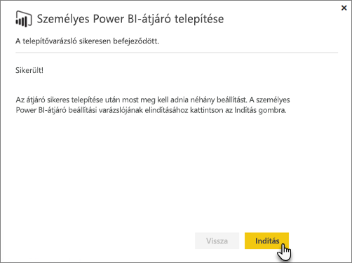
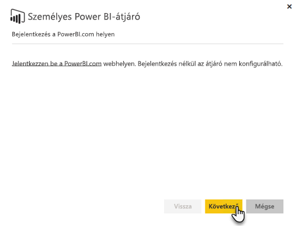
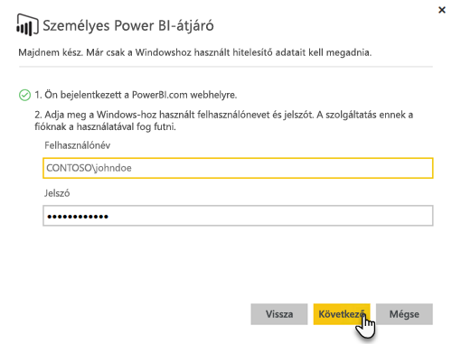

# Helyszíni adatátjáró

A helyszíni adatátjárók hídként működnek, és gyors és biztonságos adatátvitelt biztosítanak a helyszíni (nem a felhőben található) adatok és a Power BI, a Microsoft Flow, a Logic Apps és a PowerApps szolgáltatások között.

Egy átjárót egyszerre több szolgáltatással is használhat. Ha Power BI-t és PowerAppset is használ, használhatja mindkettőhöz ugyanazt az átjárót. Ez a bejelentkezéshez használt fióktól függ.

> [!NOTE]
> A helyszíni adatátjárók adattömörítést és átviteltitkosítást végeznek minden módban.

<!-- Shared Requirements Include -->
[!INCLUDE [gateway-onprem-requirements-include](./includes/gateway-onprem-requirements-include.md)]

### Az élő Analysis Services-kapcsolatokra vonatkozó korlátozások

Az élő kapcsolatokat táblázatos vagy többdimenziós példányokhoz használhatja.

| **Kiszolgáló verziója** | **Kötelező termékváltozat** |
| --- | --- |
| 2012 SP1 CU4 vagy újabb |Business Intelligence és Enterprise termékváltozat |
| 2014 |Business Intelligence és Enterprise termékváltozat |
| 2016 |Minimum Standard termékváltozat |

* A cellaszintű formázás és a fordítási funkciók nem támogatottak.
* A Műveletek és az Elnevezett készletek nem jelennek meg a Power BI-ban, azonban továbbra is lehetséges a Műveleteket vagy Elnevezett készleteket is tartalmazó többdimenziós kockákhoz kapcsolódni, és vizualizációkat és jelentéseket létrehozni.

<!-- Shared Install steps Include -->
[!INCLUDE [gateway-onprem-datasources-include](./includes/gateway-onprem-datasources-include.md)]

## Helyszíni adatátjáró letöltése és telepítése

Az átjáró letöltéséhez válassza a Letöltés menü alatt található **Data Gateway** (Adatátjáró) lehetőséget. Töltse le a [helyszíni adatátjárót](http://go.microsoft.com/fwlink/?LinkID=820925). 

Vegye figyelembe, hogy a helyszíni adatátjáró frissítéséhez az átjáró újratelepítése szükséges, az ebben a szakaszban leírtaknak megfelelően. Az átjáró (újratelepítéssel történő) frissítésekor az átjáró meglévő beállításai megmaradnak.

<!-- Shared Install steps Include -->
[!INCLUDE [gateway-onprem-install-include](./includes/gateway-onprem-install-include.md)]

## Átjáró telepítése személyes módban

> [!NOTE]
> Az átjáró személyes verziója csak a Power BI szolgáltatással működik.

A személyes átjáró telepítése után indítsa el a **Power BI Gateway – Personal beállítási varázslót**.

Ezután jelentkezzen be a Power BI-ba, hogy regisztrálja az átjárót a felhőszolgáltatáshoz.

A Windows-szolgáltatást futtató Windows-felhasználó felhasználónevét és jelszavát is adja meg. Nem kötelező a saját Windows-fiókját megadnia. Az átjáró szolgáltatást ez a felhasználói fiók fogja futtatni.

A telepítés befejezését követően, nyissa meg a Power BI-ban az adatkészletek részt, hogy meggyőződjön arról, hogy adott meg hitelesítési adatokat a helyszíni adatforrásaihoz.

## Titkosított hitelesítő adatok felhőbeli tárolása

Amikor hozzáad egy adatforrást az átjáróhoz, meg kell adnia az adatforrás hitelesítő adatait. Az adatforrás felé irányuló összes lekérdezés ezeket a hitelesítő adatokat fogja használni. A hitelesítő adatok titkosítása egy biztonságos aszimmetrikus titkosítással még a felhőbe kerülésük előtt megtörténik, így az adatokat a felhőben nem lehet visszafejteni. Amikor az adatforráshoz hozzáférnek, a hitelesítő adatok visszafejtését a helyszíni átjárót futtató számítógép végzi.

<!-- Account and Port information -->
[!INCLUDE [gateway-onprem-accounts-ports-more](./includes/gateway-onprem-accounts-ports-more.md)]

<!-- How the gateway works -->
[!INCLUDE [gateway-onprem-how-it-works-include](./includes/gateway-onprem-how-it-works-include.md)]

## Korlátozások és megfontolandó szempontok

* Az [Azure Information Protection](https://docs.microsoft.com/en-us/microsoft-365/enterprise/protect-files-with-aip
) jelenleg nem támogatott
* Az [Access Online](https://products.office.com/en-us/access) jelenleg nem támogatott

## Bérlőszintű felügyelet

Jelenleg nincs olyan felület, ahol a bérlő rendszergazdája együtt kezelhetné az összes olyan átjárót, amelyeket más felhasználók telepítettek és konfiguráltak.  Bérlőt felügyelő rendszergazdáknak azt javasoljuk, hogy kérjék meg a cégen belüli felhasználókat, hogy minden általuk telepített átjáróhoz adják hozzá őket rendszergazdaként. Ez lehetővé teszi, hogy a cég összes átjáróját kezelhesse az Átjáróbeállítások oldalon vagy pedig [PowerShell-parancsok](https://docs.microsoft.com/power-bi/service-gateway-high-availability-clusters#powershell-support-for-gateway-clusters) használatával. 

## Kimenő Azure-kapcsolatok engedélyezése

A helyszíni adatátjáró az Azure Service Bust használja a felhőbeli csatlakozásokhoz, és ennek megfelelően hoz létre kimenő kapcsolatokat a társított Azure-régiókhoz. Alapértelmezés szerint ez a Power BI-bérlő helye. Hol található a [Power BI-bérlőm?](https://powerbi.microsoft.com/en-us/documentation/powerbi-admin-where-is-my-tenant-located/)
Ha a kimenő kapcsolatokat tűzfal blokkolja, a tűzfalat úgy kell konfigurálnia, hogy az engedélyezze a kimenő kapcsolatokat a helyszíni adatátjárótól a hozzá kapcsolódó Azure-régióba. A [Microsoft Azure adatközpontjainak IP-címtartományai](https://www.microsoft.com/en-us/download/details.aspx?id=41653) című témakörben megtalálhatja minden egyes Azure-adatközpont IP-címtartományát.
> [!NOTE]
> Az IP-címtartományok idővel változhatnak, ezért fontos, hogy a legújabb információt rendszeresen letöltse. 

## Hibaelhárítás

Ha problémába ütközik az átjáró telepítése vagy konfigurálása során, tekintse meg a [Helyszíni adatátjárók hibaelhárítása](service-gateway-onprem-tshoot.md) című cikket. Ha úgy gondolja, hogy a probléma a tűzfalával kapcsolatos, tekintse meg a hibaelhárítási cikk [tűzfal vagy proxy](service-gateway-onprem-tshoot.md#firewall-or-proxy) szakaszát.

Ha úgy gondolja, hogy proxyval kapcsolatos problémákba ütközött, tekintse meg a [Proxybeállítások konfigurálása Power BI-átjárókhoz](service-gateway-proxy.md) című cikket.

## Következő lépések

[Adatforrások kezelése – Analysis Services](service-gateway-enterprise-manage-ssas.md)  
[Az adatforrás kezelése – SAP HANA](service-gateway-enterprise-manage-sap.md)  
[Adatforrások kezelése – SQL Server](service-gateway-enterprise-manage-sql.md)  
[Adatforrások kezelése – Oracle](service-gateway-onprem-manage-oracle.md)  
[Adatforrások kezelése – Importálás és ütemezett frissítés](service-gateway-enterprise-manage-scheduled-refresh.md)  
[Helyszíni adatátjáró – részletes](service-gateway-onprem-indepth.md)  
[Helyszíni adatátjáró (személyes mód) – a személyes átjáró új verziója](service-gateway-personal-mode.md)
[Helyszíni adatátjáró proxybeállításainak konfigurálása](service-gateway-proxy.md)  

További kérdései vannak? [Kérdezze meg a Power BI közösségét](http://community.powerbi.com/)