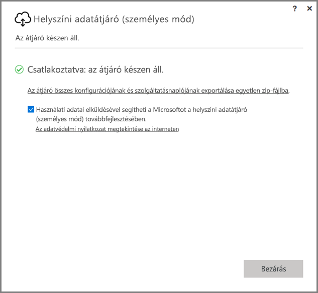
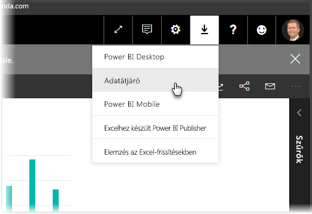
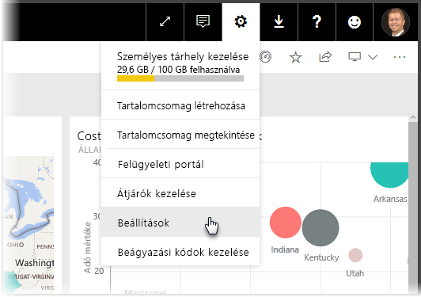
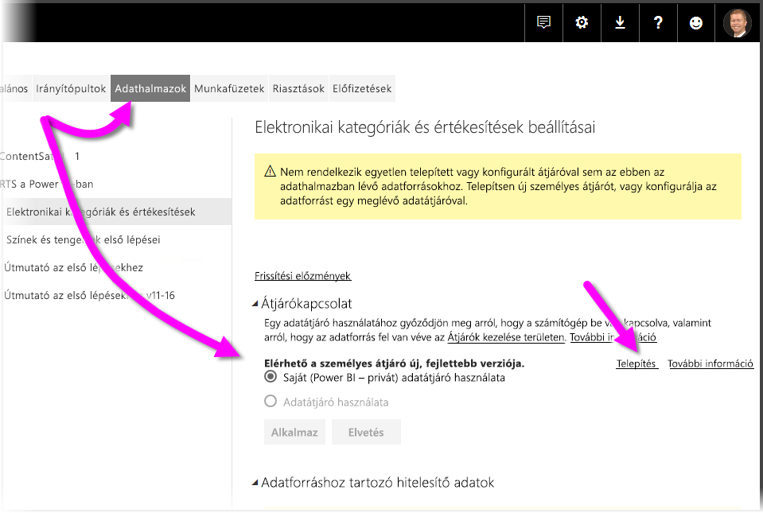
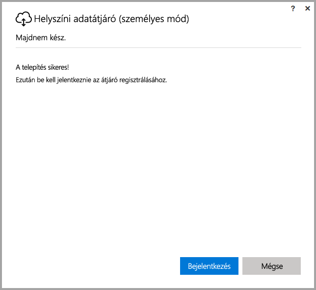
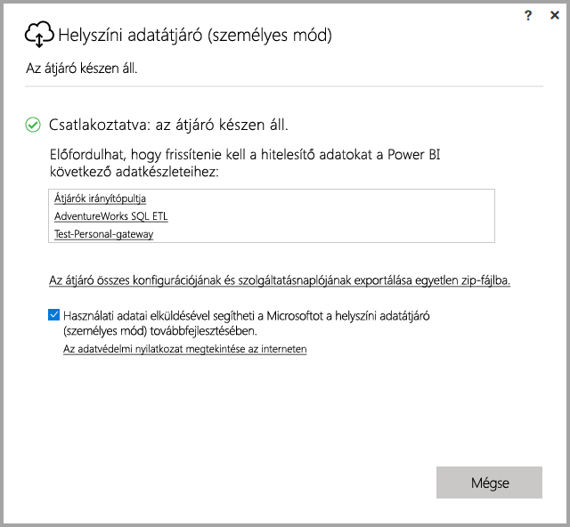

# <a name="on-premises-data-gateway-personal-mode"></a>Helyszíni adatátjáró (személyes mód)
Az átjáró használatával vehetők igénybe a helyszíni adatforrások, illetve létrehozhatók Power BI-jelentések és -irányítópultok. Az **átjárók** olyan szoftverek, amelyek hozzáférést biztosítanak egy helyszíni magánhálózaton tárolt adatokhoz, majd lehetővé teszik ezen adatok felhasználását olyan online szolgáltatásokban, mint a **Power BI szolgáltatás**. A **helyszíni adatátjáró (személyes mód)** a Power BI egy nemrég kiadott frissítése, amely lehetővé teszi személyek számára, hogy telepítsenek a számítógépükön egy átjárót, és hozzáférést szerezzenek helyszíni adatokhoz.



> [!NOTE]
> A **helyszíni adatátjáró (személyes mód)** veszi át a személyes átjáró korábban támogatott verziójának a helyét, amelyet **személyes Power BI Gatewaynek** neveztek. Az előző személyes átjáró csak 2017. július 31-ig használható. Az új verzióra való frissítés menetéről a következő szakaszokban talál információt.
> 
> 

## <a name="features-of-the-on-premises-data-gateway-personal-mode"></a>A helyszíni adatátjáró (személyes mód) funkciói
A **helyszíni adatátjáró (személyes mód)** kiadásával számos új fejlesztés és funkció válik elérhetővé. A személyes átjáró korábbi verziójában (amelyet **személyes Power BI Gatewaynek** neveztek) a megvalósítás különböző korlátozásokkal járt. Ahogy számos más Power BI-termék esetében, itt is odafigyeltünk az ügyfelek igényeire, valamint arra, hogy miként használják a terméket. Ennek eredményeképp a **helyszíni adatátjáró (személyes mód)** az alapoktól kezdve lett újratervezve, és a következő funkciókat és fejlesztéseket tartalmazza:

* **Továbbfejlesztett megbízhatóság** – a kódot és a szoftver szerkezetét érintő fejlesztéseknek köszönhetően a személyes átjáró új verziója megbízhatóbb lett az előző verziónál.
* **Továbbfejlesztett bővíthetőség** – a szoftver szerkezetét érintő fejlesztések részeként egyszerűen adhatók hozzá további funkciók a személyes átjáróhoz, amint elérhetővé válnak.
* **Személyes átjáró törlése a Power BI szolgáltatásból** – az új verziónál lehetőség van a személyes átjáró törlésére a **Power BI szolgáltatásból**.
* **Konfigurációs és szolgáltatási naplók** – az új verzióban könnyedén, egyetlen kattintással exportálhatók a konfigurációs és szolgáltatási naplók egy .zip-fájlba.

## <a name="installing-on-premises-data-gateway-personal-mode"></a>A helyszíni adatátjáró (személyes mód) telepítése
A **helyszíni adatátjáró (személyes mód)** telepítéséhez – ha az átjáró előző verziója nincs telepítve – kattintson a fogaskerék ikonra a **Power BI szolgáltatásban**, majd válassza az **Adatátjáró** lehetőséget.



Az átjárót [innen](https://go.microsoft.com/fwlink/?LinkId=820925&clcid=0x409) is letöltheti. Kövesse a telepítés lépéseit, és mivel a telepítő az átjáró mindkét verzióját (a másokkal megosztva használható standard átjárót és a személyes módot) képes telepíteni, így a telepíteni kívánt verzió kiválasztásánál mindenképp a **helyszíni adatátjáró (személyes mód)** lehetőséget válassza.

### <a name="updating-from-the-previous-personal-gateway"></a>Frissítés az előző személyes átjáróról
Ha már korábban telepítette a **személyes Power BI Gatewayt**, akkor a **Power BI szolgáltatás** **Beállításai** között, az **Adatkészletek** beállításainak megtekintésekor a szolgáltatás felkéri a személyes átjáró új, továbbfejlesztett verziójának telepítésére.



Ha kiválaszt egy adatkészletet, majd az **Átjárókapcsolat** lehetőséget, akkor a rendszer értesíti arról, hogy elérhető a személyes átjáró új, továbbfejlesztett verziója. Ekkor válassza a **Telepítés most** lehetőséget.



> [!NOTE]
> Ha a **személyes Power BI Gateway** előző verzióját emelt szintű folyamatként futtatja, akkor ügyeljen arra, hogy az új átjáró telepítésének folyamatát is emelt szinten indítsa el, hogy az adatkészletekhez tartozó hitelesítő adatok automatikusan frissíthetők legyenek. Ellenkező esetben az adatkészletek hitelesítő adatait manuálisan kell majd frissítenie.
> 
> 

Miután befejeződött a frissítési folyamat, megjelenik a telepítés sikeres befejezését jelző üzenet. Még ne zárjon be semmit, van egy utolsó lépés is.



Az utolsó lépés pedig a következő. Miután telepítette az új személyes átjárót (és a telepítés utolsó képernyője még látható), jelentkezzen be a **Power BI szolgáltatásba** és várjon, míg azt nem látja, hogy az átjáró online állapotban van, ahogy az a következő képen is látható.



Ha ugyanarra a gépre telepítette a személyes átjárót, amelyre az előzőt, akkor a rendszer automatikusan frissíti a hitelesítő adatokat, és minden frissítési tevékenység az új átjárón keresztül történik majd. Ha az előző átjárót egy másik gépre telepítette, akkor a rendszer bizonyos adatkészletek esetén fel fogja kérni a hitelesítő adatai frissítésére. Figyelje meg az előző képen az adatkészletek listáját az ablakban – ez a lista mutatja azokat az adatkészleteket, amelyeknél szükség lehet a hitelesítő adatok frissítésére. Mindegyik felsorolt adatkészlet egy közvetlen hivatkozás, amelyre rákattintva egyszerűen frissítheti a hitelesítő adatait.

Ennyi az egész – illetve csak majdnem. Az új átjáró telepítésével a régi átjáróra már nincs szükség a gépen, így azt érdemes eltávolítani. Ehhez keressen rá a gépen a **személyes Power BI Gatewayre**, és távolítsa el.

### <a name="determining-which-version-of-the-personal-gateway-you-have-installed"></a>A személyes átjáró telepített verziójának meghatározása
Ha szeretné meghatározni, hogy jelenleg a személyes átjáró mely verziója van telepítve a gépen, kövesse az alábbi eljárást:

* A személyes átjáró korábbi verzióját **személyes Power BI Gatewaynek** nevezték, és a Power BI ikonját használta a telepítő párbeszédablakában.
* A személyes átjáró új verziójának a neve **helyszíni adatátjáró (személyes mód)**, és az átjáró ikont használja (ez egy felhő, az alján egy fel-le mutató nyíllal).

A **Programok telepítése és törlése** listában megnézheti, hogy a **személyes Power BI Gateway** szerepel-e a listában. Ha igen, akkor a személyes átjáró korábbi verziója telepítve van.

## <a name="using-fast-combine-with-the-personal-gateway"></a>Gyors összevonás használata a személyes átjáróval
Ha az előző átjáróval használta a **Gyors összevonás** funkciót, akkor a következő lépésekkel újra engedélyeznie kell a **Gyors összevonást**, hogy az a **helyszíni adatátjáró (személyes mód)** használata esetén is működjön:

1. Tallózással nyissa meg a következő fájlt:
   
   ```
   %localappdata%\Microsoft\On-premises data gateway (personal mode)\Microsoft.PowerBI.DataMovement.Pipeline.GatewayCore.dll.config
   ```
2. A fájl végéhez adja hozzá a következő szöveget:
   
       ```
       <setting name="EnableFastCombine" serializeAs="String">```
       <value>true</value>
       </setting>
       ```
3. Ha elkészült, a beállítás körülbelül egy perc után lép életbe. A megfelelő működés ellenőrzéséhez próbáljon meg elvégezni a **Power BI szolgáltatásban** egy igény szerinti frissítést, amivel ellenőrizheti, hogy a **Gyors összevonás** működik-e.

## <a name="limitations-and-considerations"></a>Korlátozások és szempontok
A **helyszíni adatátjáró (személyes mód)** használatakor figyelembe kell venni néhány dolgot, amelyeket a következő lista ismertet.

* Ha a **Windows Hello** vagy egy PIN-kód használatával jelentkezik be a Windows rendszerbe, a következő hibaüzenet jelenhet meg: 
  * *A kiválasztott felhasználói fiók nem felel meg az alkalmazás feltételeinek. Használjon egy másik fiókot.*
  * E hiba kiküszöböléséhez válassza a *Másik fiók használata* lehetőséget, majd jelentkezzen be újra. 

A **helyszíni adatátjáró (személyes mód)** jelenleg nem támogatja a következő adatforrásokat:

* ADO.NET 
* CurrentWorkbook
* FTP
* HDFS
* SAP BusinessObjects         
* Spark

A Spark támogatása a tervek szerint a 2017-es naptári év második felében válik elérhetővé.

## <a name="frequently-asked-questions-faq"></a>Gyakori kérdések (GYIK)
* Futtathatom egyszerre a **helyszíni adatátjárót (személyes mód)** és a **helyszíni adatátjárót** (korábbi nevén az átjáró Vállalati verzióját)?
  
  * **Válasz:** Igen, az új verzió esetén mindkettő futtatható egyszerre.
* Futtathatom a **helyszíni adatátjárót (személyes mód)** szolgáltatásként?
  
  * **Válasz:** Nem. A **helyszíni adatátjáró (személyes mód)** csak alkalmazásként futtatható. Ha az átjárót szolgáltatásként vagy rendszergazda módban kell futtatnia, fontolja meg a [**helyszíni adatátjáró**](service-gateway-onprem.md) (korábbi nevén a Vállalati átjáró) használatát.
* Milyen gyakran frissül a **helyszíni adatátjáró (személyes mód)**?
  
  * **Válasz:** A személyes átjárót havonta tervezzük frissíteni.
* Miért kell frissítenem a hitelesítő adataim?
  
  * **Válasz:** Számos helyzet kiválthatja a hitelesítő adatok bekérését. A leggyakoribb eset az, ha a **helyszíni adatátjáró (személyes mód)** egy másik gépen lett újratelepítve, mint a **személyes Power BI-átjáró**. Az is lehet, hogy az adatforrásban áll fenn egy probléma, és a Power BI nem tudott tesztkapcsolatot létesíteni, illetve időtúllépés vagy rendszerhiba történt. A hitelesítő adatok frissítéséhez a **Power BI szolgáltatásban** kattintson a **fogaskerék ikonra**, válassza a **Beállítások**, majd az **Adatkészletek** elemet, keresse meg az adott adatkészletet, majd kattintson a *Hitelesítő adatok frissítése* elemre.
* Mennyi ideig lesz az előző személyes átjáróm offline állapotú a frissítés során?
  
  * **Válasz:** A személyes átjáró új verziójára való frissítési folyamat csak néhány percig tart. 
* Mi történik, ha nem migrálok az új személyes átjáróra 2017. július 31-ig?
  
  * **Válasz:** Ha a jelenlegi átjáróval frissíti a jelentéseit, a frissítések leállnak. Egy új frissítési ütemezés beállításának egyetlen módja az új átjáró telepítése és konfigurálása.
* R-szkripteket használok. Ez támogatott?
  
  * **Válasz:** A tervek szerint az R-szkriptek hamarosan támogatottak lesznek.
* Miért nem látom az átjáróm frissítésére felszólító üzenetet a **Power BI szolgáltatásban**?
  
  * **Válasz:** Valószínűleg azért, mert rendelkezik egy vagy több olyan adatkészlettel, amelyek olyan adatforrásokat tartalmaznak, amelyek jelenleg még nem támogatottak.

## <a name="next-steps"></a>Következő lépések
[Power BI-átjárók proxybeállításainak konfigurálása](service-gateway-proxy.md)  
További kérdései vannak? [Kérdezze meg a Power BI közösségét](http://community.powerbi.com/)

