# <a name="tutorial-connect-to-on-premises-data-in-sql-server"></a>Oktatóanyag: Csatlakozás helyszíni adatokhoz az SQL Serverrel

A helyszíni adatátjáró egy olyan szoftver, amelyet a helyszíni hálózaton belül telepíthet, és amely lehetővé teszi a hálózaton belüli adatok elérését. Ezzel az oktatóanyaggal olyan jelentést készíthet a Power BI Desktopban, amely SQL Serverről importált mintaadatokon alapul. Ezt a jelentést aztán közzéteheti a Power BI szolgáltatásban, és konfigurálhat egy átjárót, hogy a szolgáltatás hozzáférjen a helyszíni adatokhoz. Ezzel a hozzáféréssel a szolgáltatás frissíteni tudja az adatokat és naprakészen tarthatja a jelentést.

Az oktatóanyag a következőket ismerteti:
> [!div class="checklist"]
> * Jelentés készítése SQL Server-beli adatokból
> * Jelentés közzététele a Power BI szolgáltatásban
> * SQL Server hozzáadása átjáró adatforrásaként
> * Jelentésben szereplő adatok frissítése

Ha még nem regisztrált a Power BI-ra, a kezdés előtt [hozzon létre egy ingyenes próbaverziós fiókot](https://app.powerbi.com/signupredirect?pbi_source=web).


## <a name="prerequisites"></a>Előfeltételek

* [A Power BI Desktop telepítése](https://powerbi.microsoft.com/desktop/)
* Az [SQL Server telepítése](https://docs.microsoft.com/sql/database-engine/install-windows/install-sql-server) egy helyszíni számítógépen 
* [Helyszíni adatátjáró telepítése](service-gateway-install.md) ugyanezen a helyszíni számítógépen (éles üzemben ez általában egy másik számítógép)


## <a name="set-up-sample-data"></a>Mintaadatok előkészítése

Elsőként mintaadatokat kell hozzáadnia az SQL Serverhez, hogy az oktatóanyag további részében ezeket az adatokat használhassa.

1. Tesztadatbázis létrehozásához csatlakozzon saját SQL Server-példányához az SQL Server Management Studióban (SSMS).

    ```sql
    CREATE DATABASE TestGatewayDocs
    ```

2. A létrehozott adatbázisban hozzon létre egy táblát, és illesszen be adatokat.

    ```sql
    USE TestGatewayDocs

    CREATE TABLE Product (
        SalesDate DATE,
        Category  VARCHAR(100),
        Product VARCHAR(100),
        Sales MONEY,
        Quantity INT
    )

    INSERT INTO Product VALUES('2018-05-05','Accessories','Carrying Case',9924.60,68)
    INSERT INTO Product VALUES('2018-05-06','Accessories','Tripod',1350.00,18)
    INSERT INTO Product VALUES('2018-05-11','Accessories','Lens Adapter',1147.50,17)
    INSERT INTO Product VALUES('2018-05-05','Accessories','Mini Battery Charger',1056.00,44)
    INSERT INTO Product VALUES('2018-05-06','Accessories','Telephoto Conversion Lens',1380.00,18)
    INSERT INTO Product VALUES('2018-05-06','Accessories','USB Cable',780.00,26)
    INSERT INTO Product VALUES('2018-05-08','Accessories','Budget Movie-Maker',3798.00,9)
    INSERT INTO Product VALUES('2018-05-09','Digital video recorder','Business Videographer',10400.00,13)
    INSERT INTO Product VALUES('2018-05-10','Digital video recorder','Social Videographer',3000.00,60)
    INSERT INTO Product VALUES('2018-05-11','Digital','Advanced Digital',7234.50,39)
    INSERT INTO Product VALUES('2018-05-07','Digital','Compact Digital',10836.00,84)
    INSERT INTO Product VALUES('2018-05-08','Digital','Consumer Digital',2550.00,17)
    INSERT INTO Product VALUES('2018-05-05','Digital','Slim Digital',8357.80,44)
    INSERT INTO Product VALUES('2018-05-09','Digital SLR','SLR Camera 35mm',18530.00,34)
    INSERT INTO Product VALUES('2018-05-07','Digital SLR','SLR Camera',26576.00,88)
    ```

3. Ellenőrzésként kérdezze le az adatokat a táblából.

    ```sql
    SELECT * FROM Product
    ```

    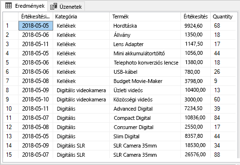


## <a name="build-and-publish-a-report"></a>Jelentés elkészítése és közzététele

Most, hogy már vannak mintaadatok, amelyekkel dolgozhat, csatlakozzon az SQL Serverhez a Power BI Desktopban, és készítsen egy jelentést az adatok alapján. Végül tegye közzé a jelentést a Power BI szolgáltatásban.

1. A Power BI Desktop **Kezdőlap** lapján válassza az **Adatok lekérése** > **SQL Server** lehetőséget.

2. A **Kiszolgáló** alatt adja meg a kiszolgáló nevét, az **Adatbázis** alatt pedig írja be a "TestGatewayDocs" nevet. Kattintson az **OK** gombra. 

    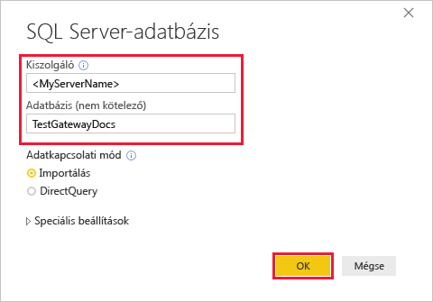

3. Ellenőrizze hitelesítő adatait, majd válassza a **Csatlakozás** lehetőséget.

4. A **Navigátor** alatt válassza a **Termék** táblát, majd a **Betöltés** lehetőséget.

    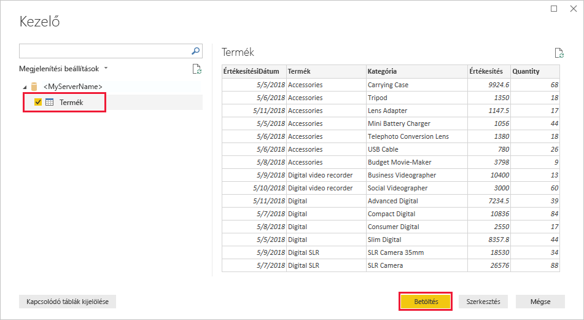

5. A Power BI Desktop **Jelentés** nézetében a **Vizualizációk** panelen válassza a **Halmozott oszlopdiagram** lehetőséget.

    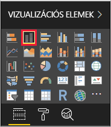    

6. Amikor az oszlopdiagram ki van jelölve a jelentésvásznon, a **Mezők** panelen jelölje ki a **Kategória** és az **Értékesítés** mezőket.  

    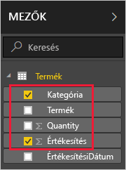

    A diagram most a következő képhez hasonlóan néz ki.

    

    Figyelje meg, hogy jelenleg az **SLR Camera** vezeti az értékesítési listát. Ez meg fog változni, amikor ennek az oktatóanyagnak egy későbbi részében módosítja az adatokat és frissíti a jelentést.

7. Mentse ki a jelentést "TestGatewayDocs.pbix" néven.

8. A **Kezdőlap** lapon válassza a **Közzététel** > **Saját munkaterület** > **Kiválasztás** lehetőséget. Ha a rendszer erre kéri, jelentkezzen be a Power BI szolgáltatásba. 

    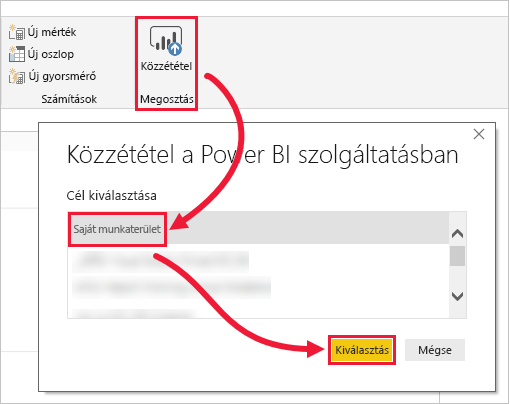

9. A **Siker** képernyőn válassza a **'TestGatewayDocs.pbix' megnyitása a Power BI-ban** lehetőséget.


## <a name="add-sql-server-as-a-gateway-data-source"></a>SQL Server hozzáadása átjáró adatforrásaként

A Power BI Desktopban közvetlenül kapcsolódhat az SQL Serverhez, a Power BI szolgáltatásban viszont átjáróra van szükség. Most hozzáadhatja SQL Server-példányát adatforrásként az átjáróhoz, amelyet egy korábbi cikk alapján hozott létre (szerepel az [Előfeltételek](#prereqisites) között). 

1. Válassza a Power BI szolgáltatás jobb felső sarkában lévő fogaskerék ikont  > **Átjárók kezelése**.

    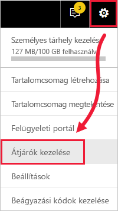

2. Válassza az **Adatforrás hozzáadása** lehetőséget, majd az **Adatforrás neve** mezőben adja meg a "test-sql-source" nevet.

    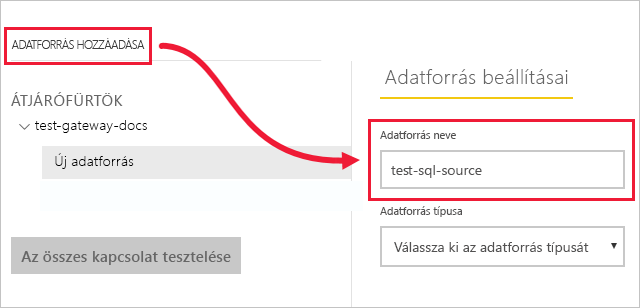

3. Az **Adatforrás típusa** alatt válassza ki az **SQL Server** típust, majd adja meg a többi értéket az ábra alapján.

    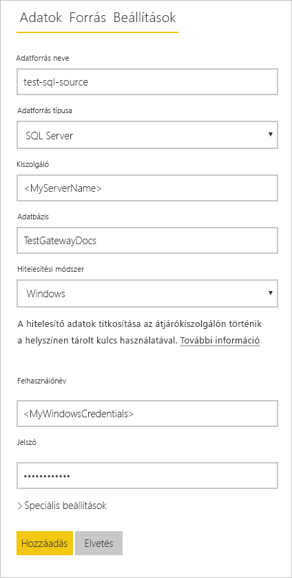

    | Beállítás | Érték |
    | ---    | ---   |
    | **Adatforrás neve**       | test-sql-source      |
    | **Adatforrás típusa**       | SQL Server      |
    | **Kiszolgáló**       |  Saját SQL Server-példányának neve (egyeznie kell a Power BI Desktopban megadott névvel)    |
    | **Adatbázis**       | TestGatewayDocs      |
    | **Hitelesítési módszer**       | Windows      |
    | **Felhasználónév**        |  A fiók, például michael@contoso.com, amellyel az SQL Serverhez csatlakozott     |
    | **Jelszó**       |  Az SQL Serverhez való csatlakozáshoz használt jelszó    |

4. Válassza a **Hozzáadás** elemet. A folyamat sikeres befejezésekor megjelenik a *Sikeres csatlakozás* üzenet.

    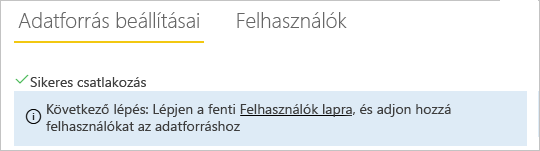

    Most már használhatja az adatforrást, hogy az SQL Server adatait felhasználja Power BI-irányítópultjain és -jelentéseiben.


## <a name="configure-and-use-data-refresh"></a>Adatfrissítés konfigurálása és használata

Már rendelkezik egy, a Power BI szolgáltatásban közzétett jelentéssel és egy konfigurált SQL Server-adatforrással. Ezek birtokában módosíthatja a Termék táblát, ez a módosítás pedig az átjárón keresztül kihat a közzétett jelentésre is. A későbbi módosítások kezelésére ütemezett frissítés is beállítható.

1. Módosítsa a Termék tábla adatait az SSMS-ben.

    ```sql
    UPDATE Product
    SET Sales = 32508, Quantity = 252
    WHERE Product='Compact Digital'     

    ```

2. A Power BI szolgáltatás bal oldali navigációs paneljén válassza a **Saját munkaterület** lehetőséget.

3. Az **Adatkészletek** alatt a **TestGatewayDocs** adatkészletnél válassza a **további lehetőségek** (**…**) > **Azonnali frissítés** lehetőséget.

    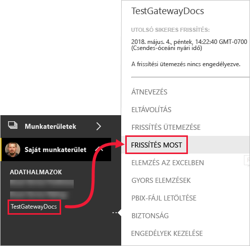

4. Válassza a **Saját munkaterület** > **Jelentések** > **TestGatewayDocs** lehetőséget. Figyelje meg, hogy a frissítés megtörtént és az értékesítési listát most a **Compact Digital** vezeti. 

    

5. Válassza a **Saját munkaterület** > **Jelentések** > **TestGatewayDocs** lehetőséget. Válassza a **további lehetőségek** (**…**) > **Frissítés ütemezése** lehetőséget.

6. A **Frissítés ütemezése** alatt kapcsolja **Be** a frissítést, majd válassza az **Alkalmaz** lehetőséget. Az adatkészlet alapértelmezés szerint naponta frissül.

    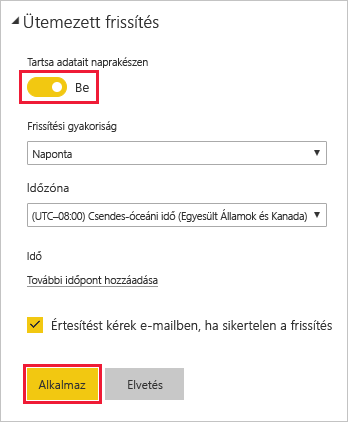

## <a name="clean-up-resources"></a>Erőforrások felszabadítása
Ha már nem kívánja használni a mintaadatokat, futtassa a `DROP DATABASE TestGatewayDocs` parancsot az SSMS-ben. Ha már nem kívánja használni az SQL Server-adatforrást, akkor válassza az [Adatforrás eltávolítása](service-gateway-manage.md#remove-a-data-source) lehetőséget. 


## <a name="next-steps"></a>Következő lépések
Az útmutatóból a következő ismereteket sajátíthatta el:
> [!div class="checklist"]
> * Jelentés készítése SQL Server-beli adatokból
> * Jelentés közzététele a Power BI szolgáltatásban
> * SQL Server hozzáadása átjáró adatforrásaként
> * Jelentésben szereplő adatok frissítése

További tudnivalókat a következő cikkben talál
> [!div class="nextstepaction"]
> [Power BI-átjáró kezelése](service-gateway-manage.md)

