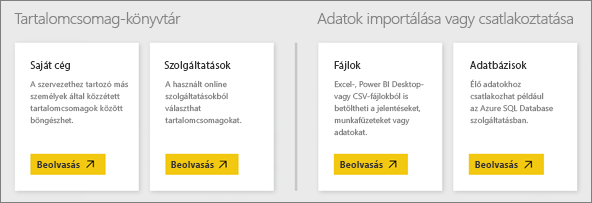

# Adatforrások a Power BI szolgáltatásban
A Power BI legfontosabb összetevői maguk az adatok. Amikor adatokat vizsgál, diagramokat és irányítópultokat hoz létre, és kérdéseket tesz fel a Q&A-jel, akkor a kapott vizualizációk és válaszok alapjául szolgáló adatok valójában egy adatkészletből származnak. De honnan származik ez az adatkészlet? Természetesen egy adatforrásból.

Ez a cikk sorra veszi a különböző típusú adatforrásokat, amelyekhez a Power BI szolgáltatásból kapcsolódhat. Ne feledje, hogy adatokhoz sok más típusú adatforrásból is hozzájuthat. Azok eléréséhez azonban először szükség lehet a Power BI Desktopnak vagy az Excel speciális lekérdezési és modellezési funkcióinak a használatára. Ezt később tárgyaljuk részletesebben. Egyelőre tekintsük át azokat a különféle adatforrástípusokat, amelyekhez közvetlenül a Power BI szolgáltatás webhelyéről kapcsolódhat.

Ezen adatforrások bármelyikéből úgy juthat adatokhoz a Power BI-ban, hogy a **Saját munkaterület** > **Adatok beolvasása** lehetőségre kattint.

## Fájlok

**Excel** (.xlsx, xlxm) – Az Excel egyedülálló abban a tekintetben, hogy egy munkafüzet saját kezűleg bevitt adatokat ugyanúgy tartalmazhat, mint külső adatforrásból a Power Query (az Excel 2016-ban Beolvasás és átalakítás) vagy a Power Pivot használatával lekérdezett és beolvasott adatokat. Importálhat adatokat munkafüzetben lévő táblázatokból (az adatoknak *kötelező* táblázatban lennie), vagy importálhat adatmodellbe beolvasott adatokat. További tudnivalókat az [Adatok beolvasása az Excelből](service-get-data-from-files.md) című cikkben talál.

**Power BI Desktop** (.pbix) – A Power BI Desktop használatával lekérdezhet és beolvashat külső adatforrásban lévő adatokat, kibővítheti az adatmodellt mértékekkel és kapcsolatokkal, és jelentéseket hozhat létre. A Power BI Desktop-fájlok importálható a Power BI-webhelyre. A Power BI Desktop gyakorlott felhasználók számára ideális, akik alaposan ismerik az adatforrásokat, az adatlekérdezéseket és az -átalakításokat, valamint az adatmodellezés fogalmait. További információt talál a [Kapcsolódás adatokhoz a Power BI Desktopban](desktop-connect-to-data.md) című cikkben.

**Vesszővel tagolt értékek** (.csv) – Ezek a fájlok adatsorokat tartalmazó, egyszerű szöveges fájlok. Minden sor egy vagy több értéket tartalmaz, vesszővel elválasztva. Egy neveket és címeket tartalmazó .csv-fájl például több sorból állhat, és minden sorban az utónév, vezetéknév, cím, város, állam stb. értékeket tartalmazhatja. .csv-fájlba nem importálhat adatokat, de sok alkalmazás, például az Excel képes egy különálló táblázat adatait .csv-fájlba menteni.

Más fájltípusok, például XML-táblázatok (.xml) vagy szöveges fájlok (.txt) esetében az adatok először a Beolvasás és átalakítás funkcióval kérdezhetők le, alakíthatók át és olvashatók be egy Excel- vagy egy Power BI Desktop-fájlba. Ezután importálhatja az Excel- vagy Power BI Desktop-fájlt a Power BI-ba.

Az is sokat számít, hogy hol tárolja a fájlokat. A OneDrive Vállalati verzió biztosítja a legnagyobb rugalmasságot és az integrációt a Power BI-jal. Az is megfelel, ha fájljait helyi meghajtón tárolja, de ilyenkor az adatok frissítése néhány további lépést is igényel. Erről a hivatkozott cikkek nyújtanak bővebb tájékoztatást.

## Tartalomcsomagok

Egy tartalomcsomag előkészítve tartalmaz minden szükséges adatot és jelentést. A Power BI-ban kétféle tartalomcsomag létezik. Az egyik olyan szolgáltatásokból származik, mint a Google Analytics, a Marketo, vagy a Salesforce, a másikat más felhasználók hozzák létre és osztják meg a cégen belül.

**Szolgáltatások** – Több tucat, Power BI-tartalomcsomagokat kínáló szolgáltatás létezik, és a kör folyamatosan bővül. A szolgáltatások többsége saját fiók használatát követeli meg. További tudnivalók: [Kapcsolódás szolgáltatásokhoz](service-connect-to-services.md).

**Szervezeti** – Ha Ön és a cég más felhasználói Power BI Pro-fiókkal rendelkeznek, akkor létrehozhatnak, megoszthatnak és használhatnak is tartalomcsomagokat. További információ: [Szervezeti tartalomcsomagok](service-organizational-content-pack-introduction.md).

## Adatbázisok

**Felhőbeli adatbázisok** – A Power BI szolgáltatásból a DirectQuery használatával élő kapcsolatot hozhat létre Azure SQL Database-, Azure SQL Data Warehouse-, Spark on Azure HD Insight-, és SQL Server Analysis Services-adatbázisokkal. A Power BI és az ilyen adatbázisok közötti kapcsolat élő, tehát ha például egy Azure SQL Database-adatbázishoz kapcsolódik, és megkezdi az adatok vizsgálatát a Power BI-ban létrehozott jelentésekkel, akkor az adatok bármilyen szűrésekor, vagy amikor új mezőt ad egy vizualizációhoz, létrejön egy lekérdezés magán az adatbázison. További információ: [Az Azure és a Power BI](service-azure-and-power-bi.md).

**Helyszíni adatbázisok** – A Power BI szolgáltatásból közvetlenül kapcsolódhat az SQL Server Analysis Services táblázatos modellű adatbázisaihoz. Power BI Enterprise Gateway szükséges. Ha nem tudja biztosan, hogyan kapcsolódhat a cége táblázatos modellű adatbázisához, akkor egyeztessen a rendszergazdával vagy az informatikai részleggel. További tájékoztatást a [Táblázatos SQL Server Analysis-adatok a Power BI-ban](sql-server-analysis-services-tabular-data.md) című cikkben talál.

A cége más típusú adatbázisaihoz először a Power BI Desktop vagy az Excel használatával kell kapcsolódnia, hogy lekérdezze és beolvassa az adatokat egy adatmodellbe. Ezután importálhatja a fájlt a Power BI-ba, ahol létrejön egy adatkészlet. Ha beállítja az ütemezett frissítést, akkor a Power BI a fájlban lévő kapcsolódási információ és a konfigurált frissítési beállítások alapján közvetlenül az adatforráshoz kapcsolódva kérdezi le a frissítéseket. Ezeket a frissítéseket aztán betölti a Power BI-ban lévő adatkészletbe. További információt a [Kapcsolódás adatokhoz a Power BI Desktopban](desktop-connect-to-data.md) című cikkben talál.

## Mi a helyzet, ha az adataim másféle forrásból származnak?
A Power BI-jal több százféle adatforrás használható. Az adatoknak azonban az eredetüktől függetlenül olyan formátumúnak kell lenniük, amelyből a Power BI szolgáltatás jelentéseket és irányítópultokat képes létrehozni Q&A-kérdések megválaszolásához és a többi feladat megoldásához.

Bizonyos adatforrásokban az adatok eleve a Power BI szolgáltatás által kezelhető formátumúak, ilyenek például a Google Analytics és a Twilio szolgáltató tartalomcsomagjai. Az SQL Server Analysis Services táblázatos modellű adatbázisai is felhasználásra készek. Az olyan felhőbeli adatbázisokkal, mint az Azure SQL Database és a Spark on HDInsight élő kapcsolat hozható létre.

Más esetekben szükséges lehet a kívánt adatokat egy fájlba lekérdezni és betölteni. Tegyük fel, hogy logisztikai adatai vannak egy adattárházbeli adatbázisban a cége egyik kiszolgálóján. Nem kapcsolódhat közvetlenül az adatbázishoz a Power BI szolgáltatásban, hogy megkezdje az adatok vizsgálatát (hacsak nem táblázatos modellű adatbázis). A Power BI Desktop vagy az Excel használatával viszont egy adatmodellbe kérdezheti le és olvashatja be, majd fájlként mentheti a logisztikai adatokat. Ezt a fájlt aztán importálhatja a Power BI-ba, ahol létrejön egy adatkészlet.

Nyilván arra gondol, hogy azok a logisztikai adatok naponta változnak az adatbázisban. Hogyan ellenőrizhetem, hogy az adatkészletem frissítve lesz a Power BI-ban? – A Power BI Desktop- vagy Excel-fájlból az adatokkal együtt kapcsolódási információk is importálódnak az adatkészletbe. Ha ütemezett frissítést állít be, vagy manuálisan frissíti az adatkészletet, akkor a Power BI az adatkészletben lévő kapcsolódási információ és néhány további beállítás alapján közvetlenül kapcsolódik az adatbázishoz, lekérdezi a frissítéseket, és beolvassa őket az adatkészletbe. A helyszíni kiszolgáló és a Power BI közötti biztonságos adatátvitelhez valószínűleg Power BI-átjáró szükséges. A jelentések és az irányítópultok vizualizációi automatikusan frissülnek.

Mint láthatja, önmagában az, hogy az adatforráshoz nem lehet közvetlenül a Power BI-ból kapcsolódni, még nem jelenti azt, hogy nem olvashatja be őket a Power BI-ba. Mindez csupán néhány további lépést és talán némi informatikai segítséget igényel. További információ: [Adatforrások a Power BI Desktopban](desktop-data-sources.md).

## További részletek
A Power BI használata során gyakran találkozik az „adatkészlet” és az „adatforrás” kifejezéssel. Ezeket gyakran azonos értelemben használják, pedig valójában két különböző, bár összefüggő dolgot jelentenek.

Amikor az Adatok beolvasása funkcióval egy tartalomcsomaghoz vagy fájlhoz kapcsolódik, és adatokat importál, vagy amikor egy élő adatforráshoz kapcsolódik, akkor a Power BI-ban automatikusan létrejön egy ***adatkészlet***. Az adatkészletek az adatforrást leíró információt, az adatforrásbeli hitelesítő adatokat, sok esetben pedig az adatoknak egy, az adatforrásból másolt részhalmazát is tartalmazzák. A jelentésekben és irányítópultokon létrehozott vizualizációk többségében az adatkészletben lévő adatok látszanak.

Egy ***adatforrás*** az adatkészletbeli adatok valódi származási helye. Ez lehet például online szolgáltatás, mint a Google Analytics vagy a QuickBooks, egy felhőbeli adatbázis, mint az Azure SQL Database, vagy a cége egy helyi számítógépén vagy kiszolgálóján tárolt adatbázis vagy fájl.

### Adatfrissítés
Ha helyi vagy cégén belüli meghajtóra menti a fájljait, akkor a Power BI-beli adatkészlet frissítéséhez Power BI-átjáróra lehet szükség. A számítógépnek, amelyen a fájlt tárolja, bekapcsolva kell lennie a frissítés idején. A fájlt újra is importálhatja, vagy használhatja az Excel vagy a Power BI Desktop Közzététel lehetőségét, de ezek nem automatizált folyamatok.

Ha a fájlokat a OneDrive Vállalati verziójára vagy a SharePoint-csapatwebhelyekre menti, majd ezekhez kapcsolódik, vagy importálja őket a Power BI-ban, akkor az adatkészlete, a jelentései és az indítópultjai is mindig naprakészek lesznek. Mivel a OneDrive és a Power BI is a felhőben van, a Power BI közvetlenül, körülbelül óránként egyszer tud a mentett fájlhoz kapcsolódni, és frissítéseket keresni. Találat esetén az adatkészlet és minden vizualizáció automatikusan frissül.

A szolgáltatásokból származó tartalomcsomagok automatikusan frissülnek. Ez többnyire naponta egyszer történik meg. Frissíthet manuálisan is, de hogy megjelennek-e a frissített adatok, az a szolgáltatótól függ. A cége más tagjaitól származó tartalomcsomagoknál számít a felhasznált adatforrás és az, hogy a tartalomcsomag létrehozója hogyan állította be a frissítést.

Az Azure SQL Database, az Azure SQL Data Warehouse, és a Spark on Azure HDInsight különlegessége az, hogy mind felhőbeli adatforrások. Mivel a Power BI szolgáltatás is a felhőben fut, a Power BI élőben kapcsolódhat hozzájuk a DirectQuery használatával. A Power BI-ban látható tartalom mindig szinkronizálva van, ezért nincs szükség beállított frissítésre.

Az SQL Server Analysis Services egyedülálló abban a tekintetben, hogy amikor a Power BI-ból kapcsolódik hozzá, akkor ugyanúgy élő kapcsolat jön létre, mint egy felhőbeli Azure-adatbázis esetében, pedig maga az adatbázis az Ön cégének egyik kiszolgálóján helyezkedik el. Az ilyen típusú kapcsolathoz Power BI-átjáró szükséges, amelyet általában az informatikai részleg konfigurál.

Az adatfrissítés kiemelten fontos a Power BI-ban, és túlságosan mély témakör ahhoz, hogy itt kifejtsük. Ha szeretné alaposan körüljárni, akkor olvassa el az [Adatfrissítés a Power BI-ban](refresh-data.md) című cikket.

## Szempontok és korlátozások
A Power BI szolgáltatásban használt összes adatforrásra érvényesek az alábbi szempontok és korlátozások. Léteznek más, egyes funkciókra vonatkozó korlátozások is, de a következő felsorolás a Power BI szolgáltatás egészére érvényes:

* **Adatkészletek méretkorlátja** – A Power BI szolgáltatásban az egyes adatkészletek méretének felső határa 1 GB.
* **Sorkorlát** – Az adatkészlet sorainak maximális száma (ha nem DirectQueryt használ) 2 milliárd, melyek közül három fenn van tartva (a sorok maximális száma így 1 999 999 997). A sorok maximális száma DirectQuery használatakor 1 millió.
* **Oszlopkorlát** – Az oszlopok legnagyobb megengedett száma egy adatkészletben, az adatkészlet összes táblájában összesen 16 000. Ez a Power BI szolgáltatásra és a Power BI Desktopban használt adatkészletekre is vonatkozik. A Power BI az adatkészlet minden táblájában tartalmaz egy beépített sorszámoszlopot is, tehát az oszlopok maximális száma 16 000 mínusz az adatkészletben használt táblák száma.

