# A Power BI szolgáltatás (az app.powerbi.com webhely) használatának első lépései
Ez az oktatóanyag segít az első lépések megtételében a ***Power BI szolgáltatásban***. Ha szeretné megérteni, hogyan illeszkedik a Power BI szolgáltatás a többi Power BI-ajánlathoz, javasoljuk, először olvassa el a [Mi az a Power BI](guided-learning/gettingstarted.yml?tutorial-step=1) című szakaszt.

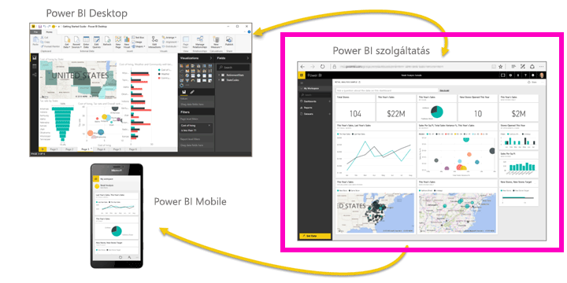

A Power BI szolgáltatásnak van ingyenes és Pro változata. Függetlenül attól, hogy melyik verziót használja, *ha már rendelkezik fiókkal*, nyissa meg a böngészőt, és írja be az app.powerbi.com címet a Power BI szolgáltatás megnyitásához. Ha Ön új felhasználó, ajánlott, hogy először a www.powerbi.com webhelyet nyissa meg. Itt további információt találhat a Power BI szolgáltatással kapcsolatban, mielőtt bejelentkezne abba.  Ha készen áll arra, hogy kipróbálja a szolgáltatást, válassza a jobb felső sarokban található **Ingyenes regisztráció** hivatkozást. Ha a rendszergazda már engedélyezte a Power BI használatát az Ön számára, ne nyomja meg az Ingyenes regisztráció gombot, hanem ehelyett nyissa meg közvetlenül az app.powerbi.com webhelyet. 

Ha a Power BI Desktoppal kapcsolatos segítséget keres, olvassa el az [Első lépések a Desktopban](desktop-getting-started.md) című szakaszt. Ha a Power BI Mobile-lal kapcsolatos segítségre van szükséges, lásd: [Power BI-alkalmazások mobileszközökre](mobile-apps-for-mobile-devices.md).

> [!TIP]
> Ehelyett egy ingyenes, saját tempóban elvégezhető tanfolyamot szeretne? [Regisztráljon Analyzing and Visualizing Data (Adatok elemzése és vizualizációja) tanfolyamunkra az Edx-en](http://aka.ms/edxpbi).

Nézze meg [lejátszási listánkat a YouTube-on](https://www.youtube.com/playlist?list=PL1N57mwBHtN0JFoKSR0n-tBkUJHeMP2cP). A kezdéshez egy remek videó az Introduction to Power BI service (A Power BI szolgáltatás bemutatása):
> 
> <iframe width="560" height="315" src="https://www.youtube.com/embed/B2vd4MQrz4M" frameborder="0" allowfullscreen></iframe>
> 
> 
> 

A Microsoft Power BI segítségével naprakész maradhat az Ön számára fontos információkkal.  A Power BI szolgáltatásban az ***irányítópultokkal*** ujjait a cége ütőerén tarthatja.  Az irányítópulton ***csempék*** találhatók, amelyekre kattintva ***jelentéseket*** nyithat meg a további vizsgálódásokhoz.  Több ***adatkészlethez*** is kapcsolódhat, hogy minden releváns adatát egy helyen tekinthesse meg. Segítségre van szüksége a Power BI építőköveinek megértéséhez?  Lásd: [Power BI – Alapfogalmak](service-basic-concepts.md).

Ha Excel- vagy CSV-fájlokba mentett fontos adatokkal rendelkezik, létrehozhat egy Power BI-irányítópultot, hogy tájékozott maradhasson, bárhol is van, és másokkal is megoszthassa az elemzéseket.  Előfizetett valamilyen SaaS-alkalmazásra, például a Salesforce-ra?  A gyors kezdéshez csatlakozzon a Salesforce-hoz, hogy automatikusan irányítópultot hozhasson létre az ott található adatokból, vagy [tekintse meg a többi SaaS-alkalmazást](service-get-data.md), amelyhez csatlakozhat. Ha egy cégnél dolgozik, nézze meg, hogy nem tettek-e közzé valamilyen [alkalmazást](service-create-distribute-apps.md) az Ön számára.

Olvassa el, milyen más módokon [kérhet még le adatokat a Power BI-ban](service-get-data.md).

## 1. lépés: Adatok lekérése
Íme egy példa adatok CSV-fájlból való lekérésére. Szeretné követni az oktatóanyagban leírtakat? [Töltse le ezt a CSV-mintafájlt](http://go.microsoft.com/fwlink/?LinkID=521962).

1. [Jelentkezzen be a Power BI-ba](http://www.powerbi.com/). Még nincs fiókja? Ne aggódjon, ingyenesen regisztrálhat.
2. A Power BI a böngészőjében nyílik meg. Válassza az **Adatok beolvasása** elemet a bal oldali navigációs sáv alján.
   
   
3. Válassza a **Fájlok** lehetőséget. 
   
   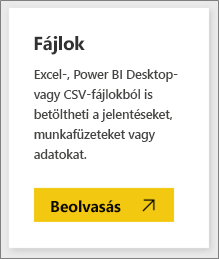
4. Tallózással keresse meg a fájlt a számítógépen, majd válassza a **Megnyitás** gombot. Ha a OneDrive Vállalati verzióban mentette azt, akkor válassza ezt a lehetőséget. Ha helyileg mentette, válassza a **Helyi fájl** lehetőséget. 
   
   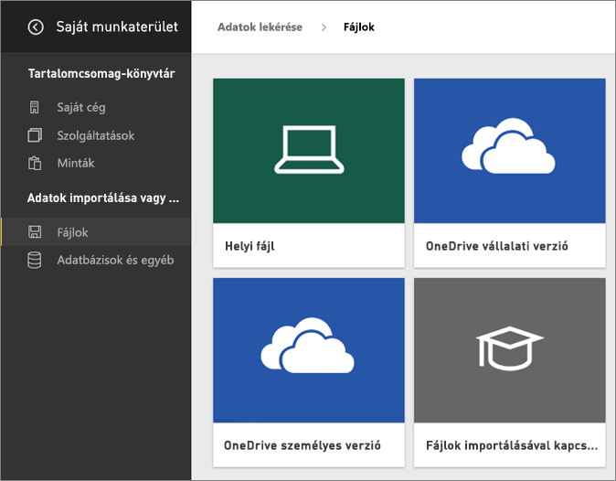
5. Ebben az oktatóanyagban az **Importálás** lehetőséget választva fogjuk az Excel-fájlt adatkészletként felvenni, amelyből aztán jelentéseket és irányítópultokat hozhatunk létre. Ha a **Feltöltés** lehetőséget választja, az egész Excel-munkafüzet fel lesz töltve a Power BI-ba, ahol megnyithatja és szerkesztheti az Excel Online-ban.
   
   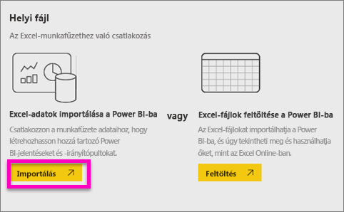
6. Amikor készen áll az adatkészlet, válassza az **Adatkészlet megtekintése** gombot a jelentésszerkesztőben való megnyitásához. 

    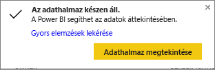

    Mivel még nem hoztunk létre vizualizációkat, a jelentésvászon üres lesz.

    

6. Vessen egy pillantást a felső menüsorra, és figyelje meg, hogy elérhető az **Olvasó nézet** lehetősége. Mivel elérhető az Olvasó nézet lehetősége, ez azt jelenti, hogy jelenleg **Szerkesztési nézetben** van. 

    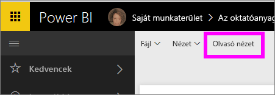

    Azért hozhat létre és módosíthat jelentéseket a Szerkesztési nézetében, mert Ön a jelentés *tulajdonosa*; egy *létrehozó*. Ha a jelentést megosztja a munkatársakkal, csak Olvasó nézetben fogják tudni használni azt; ők *felhasználók*. További információ az [Olvasó nézetről és a Szerkesztési nézetről](service-reading-view-and-editing-view.md).
    
    A jelentésszerkesztővel való ismerkedés nagyszerű módja egy [bemutató megtekintése](service-the-report-editor-take-a-tour.md)
   > 
 

## 2. lépés: Az adatkészlet feltárása
Most, hogy adatokhoz csatlakozott, megismerkedhet a felülettel.  Ha valami érdekeset talál, létrehozhat egy irányítópultot, hogy figyelje, és hogy ellenőrizze, hogyan változik az idő múlásával. Nézzük meg, hogyan is működik ez.
    
1. A jelentésszerkesztőben a lap jobb oldalán található **Mezők** ablaktábla használatával fogunk létrehozni egy vizualizációt.  Jelölje be a **Gross Sales** (Bruttó értékesítés) és a **Date** (Dátum) melletti jelölőnégyzetet.
   
   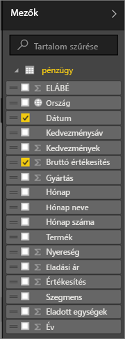

2. A Power BI elemzi az adatokat, és létrehoz egy vizualizációt.  Ha először a **Date** melletti négyzetet jelölte be, egy táblázat fog megjelenni.  Ha először a **Gross Sales** négyzetét jelölte be, egy diagram fog megjelenni. Váltson át egy másik adatmegjelenítési módra. Tekintsük meg ezeket az adatokat egy vonaldiagramon. Válassza a vonaldiagram ikonját (más néven sablonját) a **Megjelenítések ablaktáblán**.
   
   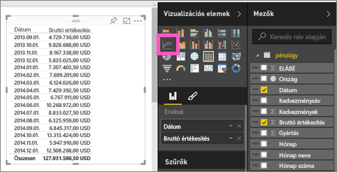

3. Ez érdekesnek tűnik, szóval *rögzítsük* egy irányítópulton. Vigye az egeret a vizualizáció fölé, és válassza a **Rögzítés** ikont.  Ha rögzíti a vizualizációt, a rendszer az irányítópulton tárolja és naprakészen tartja, hogy egyetlen pillantással nyomon tudja követheti a legújabb értékeket.
   
   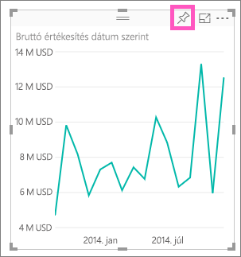

5. Mivel ez egy új jelentés, a rendszer először kéri, hogy mentse, mielőtt vizualizációkat rögzíthetne irányítópultokon. Adjon nevet a jelentésnek (példa: *Értékesítés az idő függvényében*), majd válassza a **Mentés és folytatás** lehetőséget. 
   
   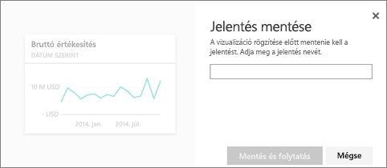
   
6. Rögzítse a vonaldiagramot az új irányítópulton, és adja neki a „Financial sample for tutorial” („Oktatóanyag pénzügyi mintája”) nevet. 
   
   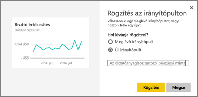
   
 1. Válassza a **Rögzítés** lehetőséget.
   
    A rendszer egy sikert jelző üzenettel (a jobb felső sarokban) tájékoztatja, hogy a vizualizáció csempeként hozzá lett adva az irányítópulthoz.
   
    

8. A csempeként a vadonatúj irányítópulthoz rögzített vonaldiagram megtekintéséhez válassza az **Ugrás az irányítópultra** lehetőséget. Az irányítópultot még jobbá teheti további vizualizációs csempék hozzáadásával, és a [csempék átnevezésével, átméretezésével, összekapcsolásával és áthelyezésével](service-dashboard-edit-tile.md).
   
   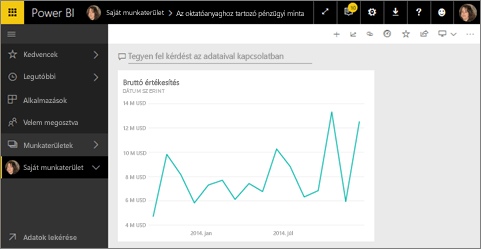
   
   A jelentéshez bármikor visszatérhet, ha az új csempét választja az irányítópulton. A Power BI a jelentéshez lépteti vissza Olvasó nézetben. A felső menüsorban a **Jelentés szerkesztése** lehetőséget választva váltson vissza a Szerkesztési nézetre. Miután a Szerkesztési nézetre váltott, folytassa a felülettel való ismerkedést és a csempék rögzítését. 

## 3. lépés: A felülettel való ismerkedés folytatása a Q&A-val (a természetes nyelvű lekérdezésekkel)
1. Az adatok gyors feltárásához próbáljon kérdést feltenni a Q&A mezőben. A Q&A-kérdésmező az irányítópult tetején (**Tegyen fel kérdést az adataival kapcsolatban**), illetve a jelentés felső menüsorában (**Kérdés feltevése**) található. Próbálja meg beírni például a „what segment had the most revenue” („melyik szegmensben volt a legnagyobb árbevétel”) kérdést.
   
   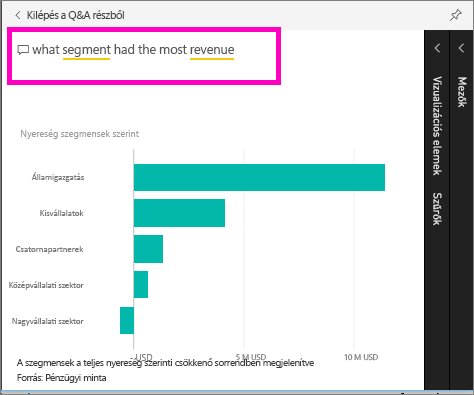

2. A Q&A megkeresi a választ, és egy vizualizáció formájában jeleníti azt meg. Válassza a gombostű ikont,  hogy ezt a vizualizációt is megjelenítse az irányítópulton.
3. Rögzítse a vizualizációt a „Financial sample for tutorial” („Oktatóanyag pénzügyi mintája”) irányítópulton.
   
    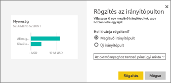

4. Térjen vissza az irányítópultra, melyen meg fog jelenni az új csempe.

   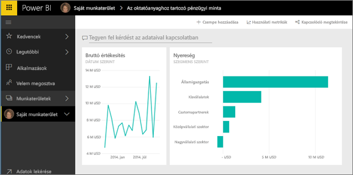

## Következő lépések
Készen áll, hogy több mindent kipróbáljon?  Íme néhány nagyszerű módszer a Power BI megismeréséhez.

* [Kapcsolódjon másik adatkészlethez](service-get-data.md).
* [Ossza meg az irányítópultot](service-share-dashboards.md) a munkatársakkal.
* Olvasson [tippeket irányítópultok tervezéséhez](service-dashboards-design-tips.md).
* Tekintse meg az irányítópultokat egy [Power BI alkalmazással a mobileszközén.](mobile-apps-for-mobile-devices.md)

Még nem áll teljesen készen? Kezdje ezekkel a témakörökkel, amelyeket a Power BI-vel való ismerkedésre terveztünk.

* [Ismerje meg, hogyan illeszkednek egymáshoz a jelentések, adatkészletek, irányítópultok és csempék.](service-basic-concepts.md)
* Látogasson el a [Power BI interaktív tanulási webhelyére](guided-learning/index.md), és vegyen részt néhány (nagyon rövid) tanfolyamon
* Tekintsen meg néhány [Power BI-videót](videos.md)
* [Tekintse meg, milyen példák állnak rendelkezésre a felhasználáshoz](sample-datasets.md).

### Maradjon kapcsolatban a Power BI-vel.
* Kövessen minket a [@MSPowerBITwitteren](https://twitter.com/mspowerbi).
* Iratkozzon fel [YouTube-videócsatornánkra](https://www.youtube.com/channel/UCy--PYvwBwAeuYaR8JLmrfg).
* Nézze meg igény szerint elérhető [Első lépések a Power BI-ban előadásainkat](webinars.md).
* Nem biztos benne, hol találhat segítséget? Tekintse meg [10 tanács segítségkéréshez](service-tips-for-finding-help.md) lapunkat.

További kérdései vannak? [Kérdezze meg a Power BI közösségét](http://community.powerbi.com/)

