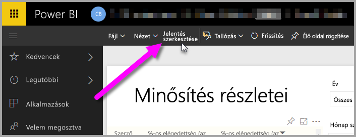
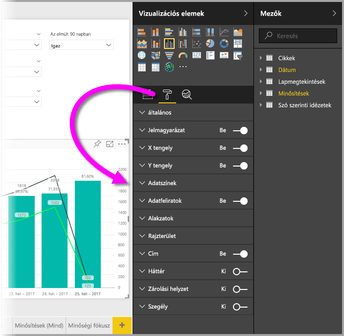
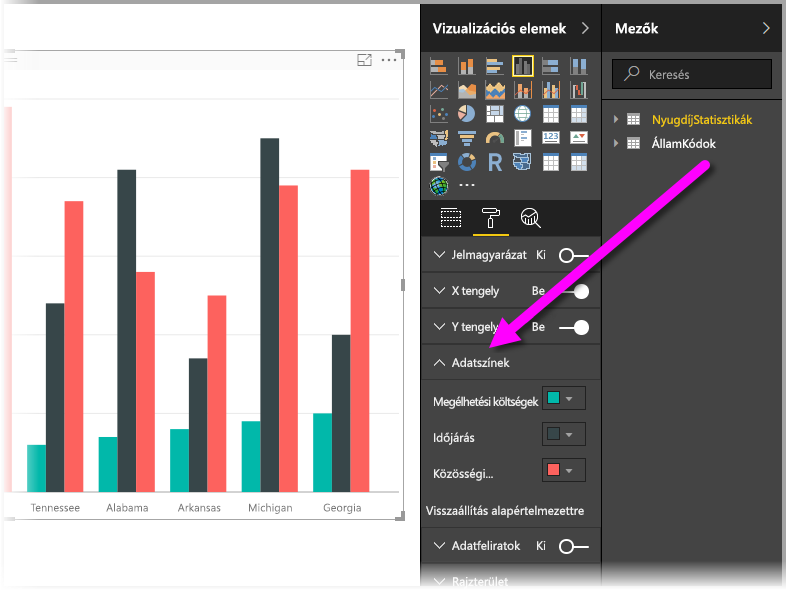
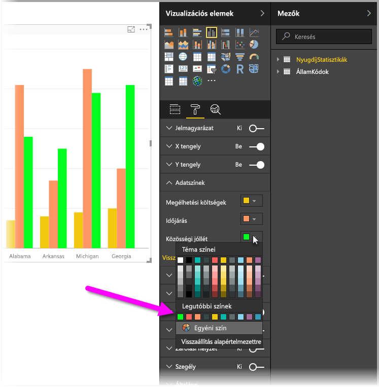
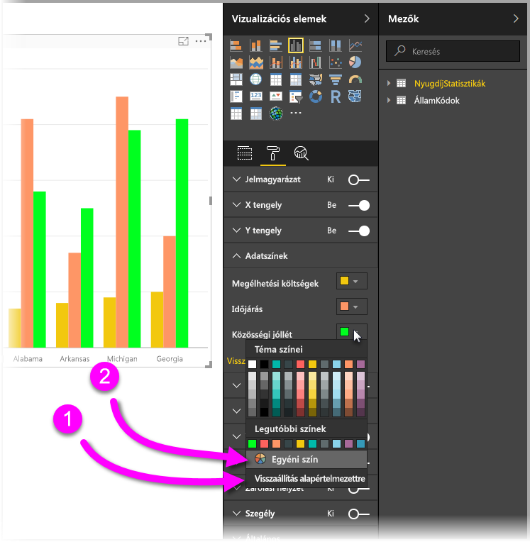
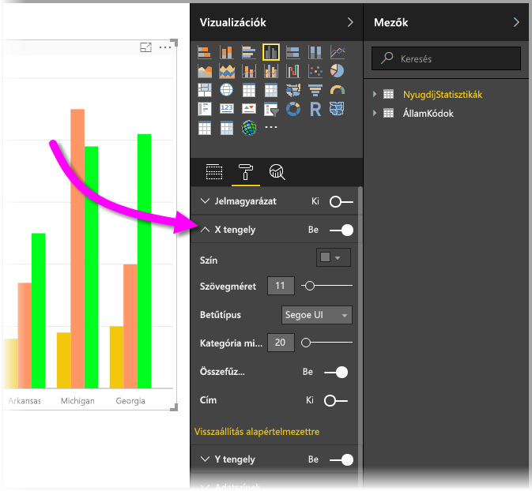

# Bevezetés a színformázás és tengelytulajdonságok használatába
A **Power BI** szolgáltatásban módosíthatja az adatsorozatok, adatpontok színét, sőt akár a vizualizációk hátteréét is. Módosíthatja az x és y tengely megjelenítésének módját is, így teljes körűen szabályozhatja az irányítópultok és jelentések megjelenését.

Első lépésként válassza a **Jelentés** elemet a **Saját munkaterület** ablaktáblán. Válassza a felső menüben található **Jelentés szerkesztése** elemet.  

Ha egy jelentést szerkeszt, és ki van jelölve egy vizualizáció, megjelenik a **Megjelenítések** ablaktábla, amely lehetővé teszi vizualizációk hozzáadását vagy módosítását. Közvetlenül a rendelkezésre álló vizualizációk alatt három ikon látható: a **Mezők** ikon (rudacskák), a **Formátum** ikon (gördülőkefe), és az **Analitika** (nagyító). Az alábbi ábrán a **Mezők** ikon van kijelölve, amit az ikon alatti sárga sáv jelez.

Ha a **Formátum** ikonra kattint, az alatta lévő terület a jelenleg kijelölt vizualizációhoz elérhető szín- és tengely-testreszabásokat jeleníti meg.  

Az egyes vizualizációk számos elemét testre szabhatja:

* Jelmagyarázat
* X tengely
* Y tengely
* Adatszínek
* Adatfeliratok
* Alakzatok
* Rajzterület
* Cím
* Háttér
* Zárolási helyzet
* Szegély

> [!NOTE]
>  
> Ezen elemek nem mindegyike látható az összes vizualizációs típus esetében. A választott vizualizáció hatással lesz az elérhető testreszabásokra; például tortadiagram kijelölése esetén nem látható X tengely, mivel a tortadiagramoknak nincs X tengelye.
> 
> 

Vegye figyelembe azt is, hogy ha még nincs vizualizáció kijelölve, akkor az ikonok helyett a **Szűrők** elem jelenik meg, amely lehetővé teszi szűrők alkalmazását az oldalon lévő összes vizualizációra.

Lássunk két példát: egyet a színek használatára, egyet pedig a tengely tulajdonságainak módosítására. Innentől készen kell állnia a színek, a tengelyek és a címkék testreszabására.

## Színek használata
Vegyük végig a diagram színeinek testreszabásához szükséges lépéseket.

1. Kijelölök egy **Csoportosított oszlopdiagramot** a jelentésvásznon.
2. Következő lépésként a **Formátum** ikonra kattintok a rendelkezésre álló testreszabások megjelenítéséhez.
3. Ezután az **Adatszínek** testreszabástól balra látható kis lefelé mutató nyílra kattintok. Ez azt mutatja majd, hogyan szabhatom testre az adatszíneket, a korábban kiválasztott vizualizációra vonatkozó beállításokkal.
4. Az **Adatszínek** elem lefelé kibomolva megjeleníti a rendelkezésre álló testreszabásokat.  
   

Végezzünk néhány módosítást. A szín melletti nyílra kattintva végezhetek módosításokat az egyes rendelkezésre álló adatsorozatokon. A **Cost of living** (Megélhetési költségek) színét sárgára, a **Weather** (Időjárás) színét narancssárgára, a **Community well-being** (Közösségi jólét) színét pedig zöldre fogom módosítani. A következő képernyőn az utolsó lépés látható, a **Cost of living** (Megélhetési költségek) módosítása.  

A módosítások az alábbi képen láthatók. Hűha, ez aztán egy világos diagram! Ne feledkezzen meg a következő hasznos elemekről a színek használatával kapcsolatosan. Az alábbi listán szereplő számok a következő képernyőn is megjelennek, jelezve, hol érheti el vagy módosíthatja ezeket a hasznos elemeket.

1. Nem megfelelők a színek? Semmi probléma, csak válassza a **Visszaállítás alapértelmezettre** lehetőséget, és a kijelölés visszaáll az alapértelmezett beállításokra. Ezt megteheti egy színre, vagy a teljes vizualizációra vonatkozóan.
2. Szeretne egy olyan színt használni, amely nem jelenik a palettán? Egyszerűen válassza az **Egyéni szín** elemet, és válasszon a színspektrumból.  
   

Nincs elragadtatva az előbb végzett módosítástól? A szokásos **CTRL + Z** billentyűkombinációval visszavonhatja.

## Tengely tulajdonságainak módosítása
Gyakran érdemes módosítani az X vagy az Y tengelyt. A színek használatához hasonlóan a módosítani kívánt tengely mellett balra látható lefelé mutató nyíl ikonra kattintva módosíthatja, a következő ábrán látható módon.  

Ha szeretné becsukni az **X tengely** beállításait, egyszerűen kattintson a felfelé mutató nyíl ikonra az **X tengely** mellett.

Eltávolíthatja az X tengely feliratait teljesen, ehhez kattintson az **X tengely** melletti választógombra. A tengelycímek be- és kikapcsolására is lehetősége van a **Cím** melletti választógomb bejelölésével.  

Mindenféle szín közül választhat, és számos további testreszabást is alkalmazhat a Power BI-jelentésekre és irányítópultokra.

> [!NOTE]
>  
> A **Formátum** ikon kijelölésével elérhető szín, tengely és kapcsolódó testreszabások a Power BI Desktopban is elérhetők.
> 
> 

## Következő lépés
További információkat a következő cikkekben talál:  

* [Tippek és trükkök a színformázáshoz a Power BI-ban](service-tips-and-tricks-for-color-formatting.md)  

