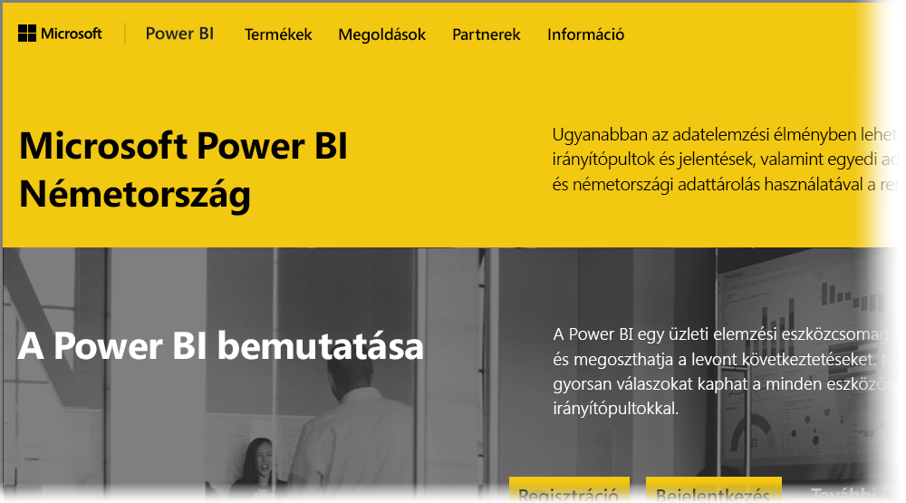

# A németországi felhőszolgáltatás (Germany Cloud) Power BI-felhasználói számára készült gyakori kérdések
A **Power BI szolgáltatás** egyik verziója kifejezetten az Európai Unió és az Európai Szabadkereskedelmi Társulás (EU és EFTA) országaiban lévő ügyfeleknek készült, és Microsoft Cloud Deutschland (MCD) néven hivatkozunk rá. A jelen cikkben a **Power BI szolgáltatás** EU- és EFTA-ügyfelek részére készült verzióját tárgyaljuk, amely elkülönül és különbözik a **Power BI szolgáltatás** kereskedelmi verziójától és a kormányzati ügyfelek részére biztosított Power BI-szolgáltatásoktól.

Az alábbi kérdések és válaszok fontos információkat nyújtanak a Microsoft Cloud Deutschland (MCD) adatközpontban használt Power BI Pro szolgáltatásról, amely a Power BI szolgáltatásfelhője kifejezetten EU- és EFTA-ügyfelek részére.

1. **Mi is a németországi felhőhöz készült Power BI szolgáltatás?**
   
   Az EU- és EFTA-ügyfelek részére készült Power BI szolgáltatás – más néven a Microsoft Cloud Deutschland (MCD) – az EU és az EFTA előírásainak megfelelő felhő, amely németországi adatközpontokból biztosítja a Power BI szolgáltatást. Az EU-/EFTA-felhőhöz készült Power BI szolgáltatáshoz kapcsolódó minden ügyféladatot Németországban tárolunk a független németországi adatkezelési megbízott, a T-Systems közreműködésével, az adatokhoz való fizikai és logikai hozzáférés pedig a németországi jogszabályokkal összhangban történik. Az EU/EFTA-felhőhöz készült Power BI szolgáltatáshoz a Power BI kereskedelmi verziójától különböző és különálló verziójú fiók szükséges. További információt a Microsoft Cloud Deutschland szolgáltatásról [itt](https://www.microsoft.com/trustcenter/cloudservices/nationalcloud) talál.
2. **Hol találom a Power BI Germany Cloud felhőre vonatkozó árakat és regisztrációs útmutatót?**
   
   A [Power BI Germany Cloud weboldalán](https://powerbi.microsoft.com/power-bi-germany/) rengeteg információ érhető el, köztük az árak is. Az oldalon egy hivatkozást is talál, amelyet követve regisztrálhat a **Power BI Pro szolgáltatás** 30 napos, 25 felhasználói licencet biztosító próbaverziójára. A próbaverzióra történő regisztráció után további előfizetéseket vásárolhat vagy vehet fel, ha szükséges. Nagyvállalati szerződéshez kötött, kormányzati és nonprofit díjszabást kínálunk. További információért forduljon a Microsoft ügyfélszolgálatához.
3. **A németországi felhőben rendelkezem bérlővel, amely az Azure Germany- és/vagy az Office 365 Germany-előfizetésem része. Használhatom a meglévő bérlőmet a Power BI Germany szolgáltatásba történő regisztrációhoz?**
   
   Igen. A regisztráció során lehetőség van arra, hogy meglévő Germany Cloud-bérlői rendszergazdai fiókkal jelentkezzen be, és a Power BI Pro szolgáltatásbeli licenceit meglévő, Germany Cloud-beli bérlőjében vegye fel. Vegye figyelembe, hogy a Germany Cloud-bérlők és -felhasználói fiókok különböznek a németországi felhőhöz készült Power BI szolgáltatásbeliektől.
4. **A németországi felhőhöz készült Power BI szolgáltatásnak létezik ingyenes verziója?**
   
   Nem. A németországi felhőhöz készült Power BI szolgáltatás nem érhető el ingyenes licencű verzióban. Helyette azt ajánljuk, hogy regisztráljon [az ingyenes Power BI szolgáltatásra a nyilvános felhőnkben](https://powerbi.microsoft.com/get-started/), ha az ingyenes Power BI funkcióinak köre megfelel cége igényeinek.
5. **Használható a Power BI Desktop, a Power BI Mobile, a helyszíni adatátjárók és az Excelhez készült Publisher a németországi felhőhöz készült Power BI szolgáltatással?**
   
   Igen. Frissítettük Power BI-ügyféltermékeinket, hogy zökkenőmentesen működjenek a németországi felhőhöz készült Power BI szolgáltatással. Jelentkezzen be a németországi felhőhöz készült Power BI-szolgáltatásbeli fiókjával, és máris használhatja ugyanazokat a Power BI-szolgáltatásokat. Az ügyféltermékek legújabb verzióját innen töltheti le:
   
   * [Power BI Desktop](https://powerbi.microsoft.com/desktop/)
   * [Power BI Mobile](https://powerbi.microsoft.com/mobile/)
   * [Helyszíni adatátjáró](https://powerbi.microsoft.com/gateway/)
   * [Az Excelhez készült Power BI Publisher](https://powerbi.microsoft.com/excel-dashboard-publisher/)
6. **Léteznek funkcióbeli korlátozások a németországi felhőhöz készült Power BI szolgáltatásban?**
   
   Az alábbi funkciók jelenleg nem érhetők el a németországi felhőhöz készült Power BI szolgáltatásban:
   
   * Webes közzététel
   * ArcGIS-térképek az Esritől
   * Power BI Embedded (különállóan mért független szoftverszállítói licencek; a jövőben a [Microsoft Azure Germany](https://azure.microsoft.com/overview/clouds/germany/) keretében lesz elérhető)
7. **Hol találom a németországi felhőhöz készült Power BI szolgáltatás konfigurációs segédletét az alkalmazásaimban való felhasználás és integráció céljából?**
   
   Frissítettük a [fejlesztői szolgáltatottszoftver-beágyazási mintákat](https://github.com/Microsoft/PowerBI-Developer-Samples), amelyek közt immár szerepelnek a németországi és más Power BI-felhők egyedi konfigurációs adatai. A **Cloud Configs** (Felhőkonfigurációk) nevű mappában a felhőspecifikus konfigurációs végpontok mintáit találja. Az alábbi táblázat a németországi felhőhöz készült Power BI szolgáltatás különböző végpontjait tartalmazza (a nyilvános felhőre mutató hivatkozásokat is közöljük, összevetési alapul).

| **Végpont neve és/vagy használat** | **A németországi felhőhöz készült Power BI szolgáltatás URL-címe** | **A neki megfelelő URL-cím a nyilvános felhőben (összevetési alapul)** |
| --- | --- | --- |
| Kezdőlap, regisztráció, bejelentkezés |[https://powerbi.microsoft.com/power-bi-germany/](https://powerbi.microsoft.com/power-bi-germany/) |[https://powerbi.microsoft.com/](https://powerbi.microsoft.com/) |
| Power BI szolgáltatás – közvetlen bejelentkezés |[https://app.powerbi.de/?noSignUpCheck=1](https://app.powerbi.de/?noSignUpCheck=1) |[https://app.powerbi.com/?noSignUpCheck=1](https://app.powerbi.com/?noSignUpCheck=1) |
| Szolgáltatási API |[https://api.powerbi.de/](https://api.powerbi.de/) |[https://api.powerbi.com/](https://api.powerbi.com/) |
| Office portál felhasználói licenckezeléshez, szolgáltatásállapot figyeléséhez és rendszergazdai támogatási kérelmekhez |[https://portal.office.de/](https://portal.office.de/) |[https://portal.office.com/](https://portal.office.com/) |
| AAD szolgáltatói URI |[https://login.microsoftonline.de/common/oauth2/authorize/](https://login.microsoftonline.de/common/oauth2/authorize/) |[https://login.microsoftonline.com/common/oauth2/authorize/](https://login.microsoftonline.com/common/oauth2/authorize/) |
| Power BI szolgáltatásbeli erőforrás-URI |[https://analysis.cloudapi.de/powerbi/api](https://analysis.cloudapi.de/powerbi/api) |[https://analysis.windows.net/powerbi/api](https://analysis.windows.net/powerbi/api) |
| Egyéni vizualizációtár |[https://app.powerbi.de/visuals/](https://app.powerbi.de/visuals/) |[https://app.powerbi.com/visuals/](https://app.powerbi.com/visuals/) |
| Alkalmazás regisztrációja a Power BI-ba (az Embedded szolgáltatáshoz) |[https://app.powerbi.de/apps](https://app.powerbi.de/apps) |[https://app.powerbi.com/apps](https://app.powerbi.com/apps) |
| Azure Portal (az Embedded szolgáltatáshoz) |[https://portal.microsoftazure.de/](https://portal.microsoftazure.de/) |[https://portal.azure.com/](https://portal.azure.com/) |
| Közösség |[https://community.powerbi.com/](https://community.powerbi.com/) |[https://community.powerbi.com/](https://community.powerbi.com/) |

### Következő lépések
A Power BI sokféle feladat elvégzésére alkalmas. További információt és tananyagokat – beleértve a szolgáltatásra való regisztrációt bemutató cikket – ezekben a forrásokban talál:

* [Power BI-oktatócsomag](guided-learning/gettingstarted.yml#step-1)
* [Első lépések a Power BI szolgáltatásban](service-get-started.md)
* [Első lépések a Power BI Desktop alkalmazással](desktop-getting-started.md)

