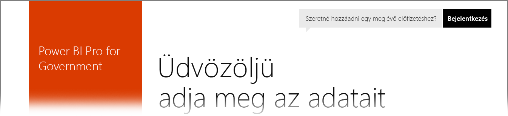

# Power BI az USA kormányzati ügyfelei számára
A **Power BI szolgáltatás** külön verziója érhető el az USA kormányzati ügyfeleinek az **egyesült államokbeli Office 365-közösségi** előfizetések részeként. A jelen cikkben a **Power BI szolgáltatás** kifejezetten az USA kormányzati ügyfeleinek készült verzióját tárgyaljuk, amely elkülönül és különbözik a **Power BI szolgáltatás** kereskedelmi verziójától.

A következő szakaszok a **Power BI szolgáltatás** US Government verziójában elérhető *funkciókat* ismerteti, tisztáz néhány *korlátozást*, gyakori kérdéseket (**GYIK**) és válaszokat sorol fel (beleértve a regisztráció leírását), és további információkra mutató hivatkozásokat tartalmaz.

## A Power BI US Government funkciói
Fontos megjegyezni, hogy a **Power BI US Government** csak **Pro licenccel** érhető el, ingyenes licenccel nem. A Power BI szolgáltatás bizonyos funkciói elérhetők a szolgáltatás **Power BI US Government** verziójában.

A **Power BI US Government**-ügyfelek a következő funkciókat érhetik el, mivel azok a **Pro** licenc funkcióihoz tartoznak:

* Irányítópultok és jelentések létrehozása és megtekintése
* [Adatkapacitás-korlátok](service-admin-manage-your-data-storage-in-power-bi.md)
* [Ütemezett adatfrissítés](refresh-data.md)
* Frissíthető csoportos irányítópultok
* Active Directory-csoportok hozzáférés-vezérlés megosztásához és kezeléséhez
* Jelentések és [adatok importálása](service-get-data.md) Excel-, CSV- és Power BI Desktop-fájlokból
* Adatkezelési átjáró
* Az Azure SQL és a Blob Storage használatával tárolt valamennyi Power BI-adat titkosítva van
* Kapcsolódás szolgáltatásokhoz [tartalomcsomagok](service-connect-to-services.md) használatával

## Kapcsolat a kormányzati és a nyilvános Azure-felhőszolgáltatások között 

Az Azure több felhő között elosztva működik. Alapértelmezés szerint a bérlő megnyithat tűzfalszabályokat egy felhőspecifikus példányhoz, a felhők közötti kapcsolódás azonban másféle jellegű, és meghatározott tűzfalszabályokat kell megnyitni ahhoz, hogy a szolgáltatások között sikeres kommunikáció történjen. Ha Ön Power BI-ügyfélként a nyilvános felhőben meglévő SQL-példányait szeretné elérni, akkor az SQL-ben meghatározott tűzfalszabályokat kell megnyitnia az Azure Government Cloud IP-tartományban az alábbi adatközpontokhoz:

* USGov Iowa
* USGov Virginia
* USGov Texas
* USGov Arizona

A nyilvános felhőben elérhetőek az IP-tartományok, a kormányzati felhő esetében azonban Azure-támogatási jegyet kell nyitnia, és kérelmeznie kell a fenti adatközpontokhoz tartozó IP-tartományokat. 

## A Power BI US Government korlátozásai
A **Power BI szolgáltatás** kereskedelmi verziójában elérhető egyes funkciók az USA kormányzati ügyfelek számára nyújtott **Power BI szolgáltatásban** *nem* elérhetők. A Power BI csapata folyamatosan dolgozik, hogy ezeket a funkciókat az USA kormányzati ügyfelek számára is elérhetővé tegye, és frissíteni fogja ezt a cikket, amikor a funkciók elérhetővé válnak.

* A **Power BI US Government** csak **Pro licenccel** érhető el. Felügyeleti portálon (vagy felhasználók által) Power BI (ingyenes) licencre tett bármilyen hivatkozás egy kereskedelmi Power BI szolgáltatásfelhőben fut.
* **Naplózás** – Nem érhető el a naplózás az Office 365 Biztonsági és Megfelelőségi portálján.
* **Power BI-tartalom Cortanával** – A Power BI-eredmények nem jelennek meg a Cortanával végzett olyan keresések eredményeiben, amelyek a Power BI-tartalmakra (irányítópultok, jelentések és alkalmazások) vonatkoznak, valamint olyan eredményekben, amelyek meghatározott kulcsszavakhoz tartozó, Cortanára optimalizált jelentésoldalakat tartalmaznak.

Ha fiókjához **Power BI** ingyenes licencek vannak társítva, akkor a fiók a **Power BI** szolgáltatás kereskedelmi verzióját futtatja, és nem tartozik a **Power BI US Government** ajánlat hatálya alá. Ilyen ingyenes fiók esetén a következő problémákba ütközhet:

* Az átjáró, a mobilalkalmazás és a Desktop nem képes a hitelesítésre
* Nem lehet hozzáférni az Azure kereskedelmi verziójú adatforrásaihoz
* A PBIX-fájlokat manuálisan kell feltölteni a kereskedelmi verzióból
* A Power BI mobilalkalmazásai nem érhetők el

A problémák megoldása érdekében forduljon a fiók kapcsolattartójához.

## Gyakori kérdések (GYIK) a Power BI szolgáltatás US Government verziójáról
A következő kérdéseket (és válaszokat) azért tesszük közzé, hogy gyorsan hozzájusson a szükséges információkhoz a szolgáltatással kapcsolatban.

**Kérdés:** Hogyan migrálhatom kereskedelmi **Power BI**-adataimat a **Power BI szolgáltatás** US Government verziójába?

**Válasz:** A rendszergazdának a **Power BI** egy új példányát kell létrehoznia egy különálló, a US Government verzióra érvényes előfizetés alatt. Ez után replikálhatja adatait a **Power BI szolgáltatás** US Government verziójában, törölheti kereskedelmi licencét, meglévő tartományát pedig az új, US Government verzióbeli szolgáltatáshoz társíthatja.

**Kérdés:** Miért nem tudok egy adott tartalomcsomaghoz kapcsolódni?

**Válasz:** Tartalomcsomaghoz csak engedélyezett előfizetéssel kapcsolódhat.

**Kérdés:** Érdekel a **Power BI** beszerzése egyesült államokbeli kormányzati cégem számára. Hogyan kezdjek hozzá?

**Válasz:** A regisztráció (vagy más néven *előkészítés*) menete a meglévő licenctől és előfizetéstől függően változhat. További információt a [Regisztráció a Power BI US Governmentre](service-govus-signup.md) című cikkben talál.

**Kérdés:** Eltér-e a **Power BI** US Government verziójához és a **Power BI** kereskedelmi verziójához való kapcsolódáshoz használt URL-cím?

**Válasz:** Igen, a két URL-cím eltér. A következő táblázatban az URL-címek láthatók:

| Kereskedelmi verzió URL-címe | US Government verzió URL-címe |
| --- | --- |
| https://app.powerbi.com/ |[https://app.powerbigov.us](https://app.powerbigov.us) |

## További lépések
A Power BI sokféle feladat elvégzésére alkalmas. További információt és tananyagokat – beleértve a szolgáltatásra való regisztrációt bemutató cikket – ezekben a forrásokban talál:

* [Regisztráció a Power BI US Governmentre](service-govus-signup.md)
* <a href="https://channel9.msdn.com/Blogs/Azure/Cognitive-Services-HDInsight-and-Power-BI-on-Azure-Government">Power BI US Government bemutató</a>
* [Power BI-oktatócsomag](guided-learning/gettingstarted.yml#step-1)
* [Első lépések a Power BI szolgáltatással](service-get-started.md)
* [Első lépések a Power BI Desktop alkalmazással](desktop-getting-started.md)

