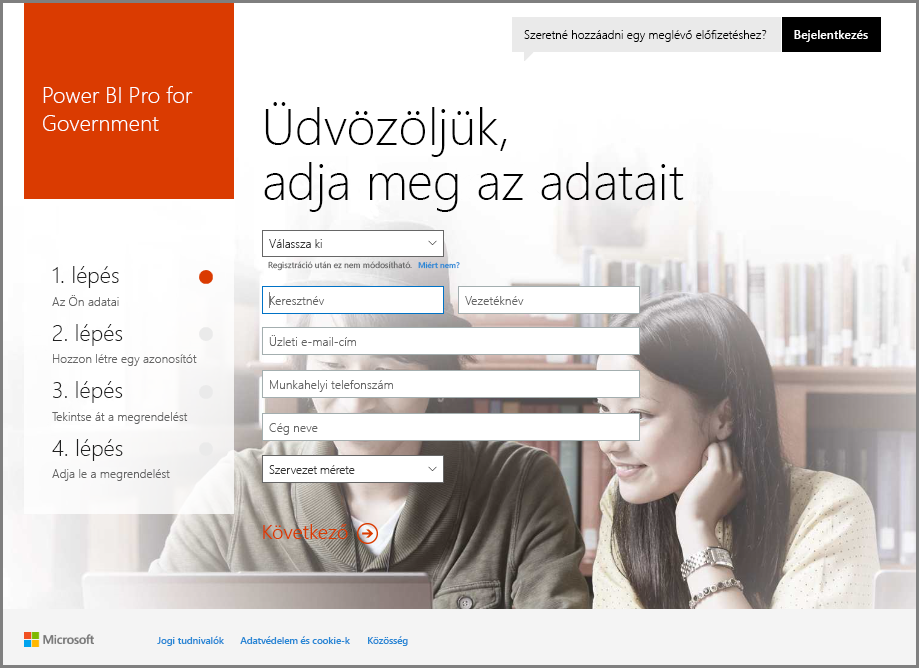
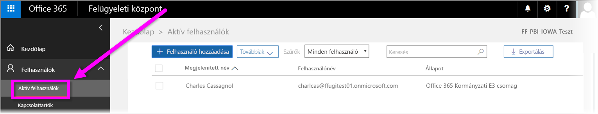

# USA-beli kormányzati szerv regisztrálása a Power BI szolgáltatásban
A **Power BI szolgáltatás** külön verziója érhető el az USA kormányzati ügyfeleinek az **egyesült államokbeli Office 365-közösségi** előfizetések részeként. A jelen cikkben a **Power BI szolgáltatás** kifejezetten az USA kormányzati ügyfeleinek készült verzióját tárgyaljuk, amely elkülönül és különbözik a **Power BI szolgáltatás** kereskedelmi verziójától.

Az Egyesült Államok kormányzati ügyfeleinek biztosított **Power BI szolgáltatásról**, illetve annak funkcióiról és korlátozásairól további információt [A Power BI az USA kormányzati ügyfelei számára – áttekintés](service-govus-overview.md) című témakörben kaphat.

> [!NOTE]
> Ez a cikk olyan rendszergazdáknak szól, akik jogosultak regisztrálni az USA valamely kormányzati szervét a Power BI szolgáltatásra. Ha Ön végfelhasználó, kérje meg rendszergazdáját, hogy szerezze be az USA kormányzati szerveinek biztosított Power BI szolgáltatás előfizetését.
> 
> 

## Válassza ki a az USA kormányzati szervének biztosított regisztrációs folyamatot
Elképzelhető, hogy az adott egyesült államokbeli kormányzati szerv még nem használja az **Office kormányzati felhőkörnyezetét**, de az is elképzelhető, hogy már rendelkezik előfizetéssel. Az alábbi szakaszok a regisztrációs lépéseket ismertetik attól függően, hogy Ön milyen előfizetéssel rendelkezik az Office kormányzati felhőkörnyezetéhez és a Power BI-hoz kapcsolódóan, és az egyes lépések a meglévő előfizetés alapján eltérnek.

Miután regisztrált az USA kormányzati szerveinek biztosított Power BI szolgáltatásra, elképzelhető, hogy egyes funkciók nem működnek, amíg az értékesítési vagy támogatási képviselő be nem fejezi az előkészítési folyamatot. A funkciókkal kapcsolatban lásd: [A Power BI az USA kormányzati ügyfelei számára – áttekintés](service-govus-overview.md). Az előkészítési folyamat befejezéséhez és a kapcsolódó funkciók engedélyezéséhez forduljon az értékesítési vagy támogatási képviselőhöz.

### Az USA kormányzati szervei, amelyek még nem használják az Office felhőkörnyezetét
Ha az Ön munkahelye még nem használja az **Office kormányzati felhőkörnyezetét**, kövesse az alábbi lépéseket:

> [!NOTE]
> Ezeket a lépéseket a portál rendszergazdájának kell elvégeznie.
>

1. Látogasson el a [https://products.office.com/en-us/government/office-365-web-services-for-government](https://products.office.com/en-us/government/office-365-web-services-for-government) címre.

>[!NOTE]
>Ha nem most kíván regisztrálni az Office kormányzati felhőszolgáltatására, lépjen kapcsolatba az értékesítési képviselővel.
>

2. Válassza az Office G3 lehetőséget, és töltse ki az Office próbaverziójához tartozó űrlapot
3. Amint az Office felhőszolgáltatásának ügyfelévé vált, folytassa a folyamatot „Az Office kormányzati felhőszolgáltatásának meglévő ügyfelei” című témakör alábbi lépéseivel

### Az Office kormányzati felhőszolgáltatásának meglévő ügyfelei
Ha a munkahelye az **Office kormányzati felhőszolgáltatásának** meglévő ügyfelei közé tartozik, de nem rendelkezik **Power BI**-előfizetéssel (ingyenes vagy egyéb), kövesse az alábbi lépéseket:

> [!NOTE]
> Ezeket a lépéseket a portál rendszergazdájának kell elvégeznie.
> 
> 

1. Jelentkezzen be a meglévő fiókjába az Office kormányzati felhőszolgáltatásában, és nyissa meg a felügyeleti portált
2. Válassza ki a **Számlázás** elemet.
3. Válassza ki a **Szolgáltatás vásárlása** elemet.
4. Válassza a kormányzati ügyfeleknek biztosított Power BI Pro lehetőséget, majd válasszon a **Kipróbálás** és a **Vásárlás most** lehetőségek közül
5. Fejezze be a megrendelést
6. Rendelje hozzá a felhasználókat a fiókhoz.
   
   
7. Jelentkezzen be az USA kormányzati ügyfeleinek szóló **Power BI szolgáltatásba** a [https://app.powerbigov.us](https://app.powerbigov.us) címen

## További regisztrációs információk
Az alábbiakban további információt találhat az **USA kormányzati ügyfeleinek szóló Power BI** szolgáltatás regisztrációjáról a különböző licencmigrálási esetekben.

### A Power BI próbaverziójáról Pro verzióra váltás – közvetlen előkészítés
* Kattintson és nyissa meg a Számlázás > Szolgáltatás vásárlása > Kormányzati Power BI Pro menüelemet, és válassza a Vásárlás lehetőséget a Kipróbálás helyett
* Töltse ki a szükséges adatokat, és szerezze be a licenceket
* Távolítsa el a Power BI Pro-próbaverziót, vagy távolítsa el a régi licenceket, és rendelje hozzá az újakat a felhasználókhoz
* Bejelentkezés: [https://app.powerbigov.us](https://app.powerbigov.us)

### A Power BI próbaverziójáról Pro verzióra váltás – viszonteladói előkészítés
Nyissa meg a **Számlázási > Előfizetések** menüelemet, majd válassza a **Kormányzati Power BI Pro** előfizetést. Itt az alábbiak láthatók:

* Elérhető
* Hozzárendelt
* Felhasználói hozzárendelési hivatkozások
* Ha továbbra is a próbaverzió van hozzárendelve:
  * Kattintson a **Hozzárendelt** elemre a Próbaverziós előfizetés szakaszban, majd távolítsa el a fizetős szolgáltatáshoz hozzáadandó felhasználókat
  * Nyissa meg a Fizetett előfizetést, és végezze el az ilyen felhasználók hozzárendelését

### Engedélyezési utasítások
Az *engedélyezés* olyan folyamat, amelyet a Power BI mérnöki csapata használ az ügyfelek kereskedelmi felhőkörnyezetből biztonságos kormányzati felhőkörnyezetbe való áthelyezéséhez. Ez biztosítja azt, hogy az Egyesült Államok kormányzati felhőkörnyezetében elérhető funkciók a várt módon működjenek. Az USA kormányzati szerveinek biztosított **Power BI** szolgáltatásokat első alkalommal megvásároló minden meglévő (vagy új) egyesült államokbeli kormányzati ügyfélnek kezdeményeznie *kell* az alábbi engedélyezési folyamatot. A folyamatot az USA kormányzati szerveinek biztosított **Power BI** szolgáltatások beállítása vagy migrálása előtt kell elvégezni. 

Ha azt szeretné, hogy a bérlője szerepeljen az USA kormányzati felhőjének *engedélyezési listáján*, forduljon a Microsoft-fiókok ügyfélszolgálatához. Vegye figyelembe, hogy csak rendszergazdák kezdeményezhetik ezt a kérelmet. Az *engedélyezés* folyamata körülbelül 3 hetet vesz igénybe, amelynek során a Power BI mérnöki csapata elvégzi a saját bérlő az USA kormányzati felhőkörnyezetében való megfelelő működéséhez szükséges módosításokat.

A Power BI **ingyenes** licencéről az **USA kormányzati szerveinek biztosított Power BI-licencre** (és definíció szerint a jelen cikk korábbi szakaszában ismertetett **Pro**-licenc kapcsolódó funkcióra) migráló ügyfelek a cikk alábbi szakaszában ismertetett problémákba ütköznek, amíg a Power BI mérnöki csapata el nem végzi a bérlő *engedélyezését*.

### Vegyes használatú ingyenes és Pro-licencek az USA kormányzati felhőkörnyezetében
Ha Ön az ingyenes és az USA kormányzati szerveinek biztosított Pro-licenccel egyaránt rendelkezik a saját bérlőn, akkor az ingyenes és (az USA kormányzati szerveinek biztosított) Pro-licenc továbbra is megmarad, de az egyik licenctípus nem fog megfelelően működni. Amikor a bérlő sikeresen végighalad az *engedélyezés* folyamatán, az alábbiak történnek:

* Az ingyenes licenc felhasználói többé nem tudnak bejelentkezni a Power BI szolgáltatásba a **Power BI Desktop** használatával, és az alábbi szakaszban ismertetetteknek megfelelően funkciókorlátozásokat fognak tapasztalni.
* Az USA kormányzati szerveinek biztosított Pro-licenchez hozzárendelt összes ügyfél a várt módon fog működni, beleértve az átjárók, a Power BI Desktop és a mobilalkalmazások használatát is.

Amikor az ingyenes és a Pro-licencet egyszerre használja az USA valamely kormányzati szervének bérlőjén, és végighalad az *engedélyezés* folyamatán, az alábbiak várhatók:

**Engedélyezés *előtt***:

* A kereskedelmi felhőkörnyezetet használó, ingyenes licenccel rendelkező felhasználók
* Az USA kormányzati szerveinek biztosított Pro-licencek láthatók a portálon, és a rendszergazda hozzárendelheti ezeket a licenceket a felhasználókhoz. Az USA kormányzati szerveinek biztosított Pro-licencek felhasználói nem veszítik el az ingyenes licencekhez tartozó adatokat, miután a rendszergazda a felhasználókhoz rendeli az USA kormányzati szerveinek biztosított Pro-licencet. A hozzárendelt felhasználók hozzáférnek az USA kormányzati ügyfeleinek biztosított Power BI Pro-funkciókhoz, de az alábbi listajeles listában ismertetett funkciókorlátozásokat fogják tapasztalni a bérlő sikeres *engedélyezéséig*:
  
  * Az átjáró, a mobilalkalmazás és a Power BI Desktop nem képes a hitelesítésre
  * Nem lehet hozzáférni az Azure kereskedelmi verziójú adatforrásaihoz
  * A PBIX-fájlokat manuálisan kell feltölteni a kereskedelmi verziójú Power BI szolgáltatásba
  * A Power BI mobilalkalmazásai nem érhetők el

**Engedélyezés *után***:

* A kereskedelmi verziójú Power BI szolgáltatást használó ingyenes felhasználók továbbra is használhatják a szolgáltatást, de a hitelesítésük a várt módon megszűnik.
* Az Egyesült Államok kormányzati felhőkörnyezetét használó Pro-felhasználók a várt módon használhatják az **USA kormányzati szerveinek biztosított Power BI** szolgáltatást.

Annak azonosításához, hogy a bérlőn a Power BI ingyenes licence fut-e, a rendszergazdák futtathatják a licencelési jelentést, amely után az ingyenes licencet használó felhasználók **Power BI Standard** jelöléssel jelennek meg.

## Következő lépések
A Power BI sokféle feladat elvégzésére alkalmas. További információt és tananyagokat – beleértve a szolgáltatásra való regisztrációt bemutató cikket – ezekben a forrásokban talál:

* [Power BI az USA kormányzati szervei számára – áttekintés](service-govus-overview.md)
* [Power BI-oktatócsomag](guided-learning/gettingstarted.yml#step-1)
* [Első lépések a Power BI szolgáltatással](service-get-started.md)
* [Első lépések a Power BI Desktop alkalmazással](desktop-getting-started.md)

