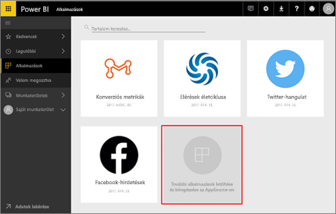
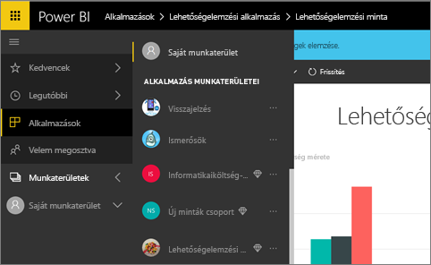
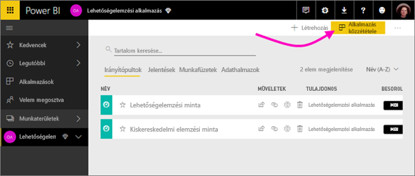
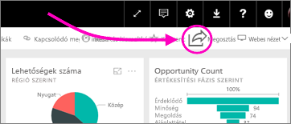
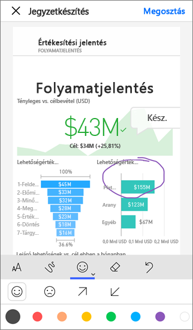

# Hogyan végezhetek közös munkát és hogyan oszthatok meg tartalmat a Power BI-ban?

Ön az irányítópultokat és jelentéseket létrehozó személy. Előfordulhat, hogy a munkatársaival együtt dolgozik rajtuk. Ezután szeretné, hogy mások is elérhessék, amit létrehozott. Mi a terjesztésük legjobb módja?

Ebben a témakörben összehasonlítjuk a Power BI-ban való közös munka és megosztás alábbi lehetőségeit: 

* Jelentések és irányítópultok létrehozása munkatársakkal együtt egy *alkalmazás-munkaterületen*.
* A létrehozott irányítópultok és jelentések egyesítése *alkalmazásként*, és ezek közzététele egy nagyobb csoport vagy a teljes cég számára.
* Az irányítópultok és jelentések megosztása csak néhány személlyel, a szolgáltatásból vagy a Power BI-mobilalkalmazásokból.
* Közzététel az interneten, ahol bárki megtekintheti és használhatja a tartalmat.
* Nyomtatás. 

Bármelyik lehetőséget is válassza, az irányítópultok megosztásához [Power BI Pro licenccel](service-free-vs-pro.md) kell rendelkeznie, vagy a tartalmat [prémium szintű kapacitásban](service-premium.md) kell elhelyeznie. Az irányítópultokat megtekintő munkatársakra vonatkozó licenckövetelményeket a választott lehetőség határozza meg. Az alábbi szakaszokban megtalálhatja a részleteket. 

*Alkalmazások a Power BI szolgáltatásban*

## Alkalmazás létrehozása munkatársakkal együtt
Tegyük fel, hogy Ön és a csapattársai szeretnék közzétenni a Power BI-elemzéseiket a cégüknél. Ennek a legjobb módja az, ha létrehoz egy *alkalmazást*. Az alkalmazás az irányítópultok és jelentések egy olyan gyűjteménye, amely arra szolgál, hogy fő mérőszámokat közvetítsen a cégének. 

Alkalmazás létrehozásához szüksége lesz egy *alkalmazás-munkaterületre*, melyen fel kell vennie tagként a csapattársait. Az alkalmazás-munkaterületre gondolhat amolyan átmeneti területként, amelyen Ön és a munkatársai közösen dolgozhatnak a Power BI-irányítópultokon és -jelentéseken. Ön és bárki más is hozhat létre jelentéseket, és közzéteheti őket az alkalmazás-munkaterületen a Power BI Desktop alkalmazásból. Ehhez azonban mindannyiuknak Power BI Pro licenccel kell rendelkeznie.

**Ha egy kész irányítópultot szeretne megosztani a munkatársaival, nem kell hozzáadnia őket az alkalmazás-munkaterülethez.** Ehelyett [hozza létre az irányítópultot egy alkalmazás-munkaterületen](service-create-distribute-apps.md), és ossza meg velük az alkalmazást. 

## Az alkalmazás megosztása széles közönséggel
Tegyük fel, hogy szeretné széles közönséggel megosztani az irányítópultját. Ön és a munkatársai létrehoztak egy *alkalmazás-munkaterületet*, majd az alkalmazás-munkaterületen létrehozták és kidolgozták az irányítópultokat, jelentéseket és adatkészleteket. Következő lépésként ki kell jelölnie a kívánt irányítópultokat és jelentéseket, és közzé kell tennie őket alkalmazásként – vagy csak egy biztonsági csoport vagy terjesztési lista tagjainak, vagy a teljes cégének. 

Az alkalmazások a Power BI szolgáltatásban ([https://powerbi.com](https://powerbi.com)) könnyen megtalálhatók és telepíthetők. Elküldheti az üzleti felhasználóknak az alkalmazására mutató közvetlen hivatkozást, vagy rákereshetnek az alkalmazására az AppSource-ban. Ha a Power BI-rendszergazdája engedélyezi ezt Önnek, akkor az alkalmazást akár közvetlenül is telepítheti a munkatársai Power BI-fiókjába. Többet is megtudhat [az alkalmazások közzétételéről](service-create-distribute-apps.md#publish-your-app). 

Miután a munkatársai telepítik az alkalmazást, megtekinthetik azt a böngészőjükben vagy egy mobileszközön.

Ahhoz, hogy a felhasználók megtekinthessék az alkalmazást, vagy Power BI Pro licenccel kell rendelkezniük nekik is, vagy pedig Power BI Premium-kapacitásban kell elhelyeznie az alkalmazást. További részletekért olvassa el [A Power BI Premium bemutatása](service-premium.md) cikket.

## Irányítópultok és jelentések megosztása
Tegyük fel, hogy véglegesített egy irányítópultot és egy jelentést a Saját munkaterületen vagy az alkalmazás munkaterületén, és szeretne hozzáférést adni néhány másik személynek is. Ennek egyik módja az, ha *megosztja* őket. 

A tartalmak megosztásához Power BI Pro licenccel kell rendelkeznie mind Önnek, mind pedig azoknak, akikkel megosztja a tartalmat, kivéve ha a megosztott tartalmak [prémium szintű kapacitásban](service-premium.md) találhatók. A megosztott irányítópultokat és jelentéseket a címzettek megtekinthetik és használhatják, de nem szerkeszthetik. Az irányítópultok és a jelentések adatait ugyanúgy látják, ahogyan Ön is, hacsak nem alkalmaz sorszintű biztonságot (RLS-t) a mögöttes adatkészletre. A munkatársai, akikkel megosztotta a tartalmat, továbboszthatják azt másokkal, ha engedélyezi. 

Akár cégen kívüli személyek is lehetnek a megosztás címzettjei. Az ilyen személyek megtekinthetik az irányítópultot, műveleteket végezhetnek vele, de megosztani nem tudják. 

Többet is megtudhat az [irányítópultok és jelentések Power BI szolgáltatásban való megosztásáról](service-share-dashboards.md). Szűrőt is hozzáadhat egy hivatkozáshoz, és így [a jelentés szűrt nézetét is megoszthatja](service-share-reports.md).

## Jegyzetkészítés és megosztás a Power BI-mobilalkalmazásokból
Az iOS- és Android-készülékekhez készült Power BI mobilalkalmazásban jegyzeteket adhat hozzá a csempékhez, jelentésekhez és vizualizációkhoz, majd megoszthatja azokat bárkivel e-mailben. 

Csempe, jelentés vagy vizualizáció megosztásakor az adott elem egy pillanatképét osztja meg, így a címzettek az e-mail elküldésekor érvényes pillanatnyi állapotot fogják látni. Az e-mail emellett tartalmaz egy hivatkozást is, mely az irányítópultra vagy a jelentésre mutat. Ha a címzettek rendelkeznek Power BI Pro licenccel, vagy ha a tartalom [prémium szintű kapacitásban](service-premium.md) található, és már megosztotta az objektumot velük, akkor megnyithatják azt. A csempékről készült pillanatképeket bárkinek elküldheti, nemcsak az azonos e-mail-tartományhoz tartozó munkatársainak.

Többet is megtudhat arról, hogy hogyan [láthat el jegyzetekkel és oszthat meg csempéket, jelentéseket és vizualizációkat](mobile-annotate-and-share-a-tile-from-the-mobile-apps.md) az iOS- és az Android-mobilalkalmazásokból.

A Windows 10-eszközökön futó Power BI alkalmazásból is [megoszthatja a csempék pillanatképét](mobile-share-tile-windows-10-phone-app.md).

## Webes közzététel
Megoszthatja a Power BI-jelentéseit a teljes internettel úgy, hogy interaktív vizualizációkat ágyaz be blogbejegyzésekbe, weblapokra, közösségi webhelyekre és más online kommunikációs tartalmakba. Ezt bármilyen eszközről megteheti. Ha így tesz, bárki megtekintheti a jelentéseit az interneten, és nem felügyelheti, hogy ki láthatja a közzétett tartalmait. A felhasználóknak nem kell Power BI-licenccel rendelkezniük. A webes közzététel csak azokhoz a jelentésekhez érhető el, amelyeknek jogosult a szerkesztésére. Nem tehet közzé jelentéseket az interneten, ha azokat csak megosztották Önnel, vagy ha azok egy alkalmazásban vannak. Többet is megtudhat a [webes közzétételről](service-publish-to-web.md).

## Nyomtatás vagy mentés PDF-ként vagy más statikus fájlként
A Power BI szolgáltatásban nyomtathat vagy menthet PDF-fájlként (illetve más formátumú statikus fájlként) egy teljes irányítópultot, egy irányítópult-csempét, egy jelentéslapot vagy egy vizualizációt. A jelentéseket csak laponként tudja nyomtatni – nem nyomtathatja a teljes jelentést egyszerre. Többet is megtudhat a [nyomtatásról és a statikus fájlba mentésről](service-print.md).

## Következő lépések
* Visszajelzés küldene? Mondja el javaslatait a [Power BI-közösség webhelyén](https://community.powerbi.com/).
* [Irányítópultok megosztása munkatársakkal és másokkal](service-share-dashboards.md)
* [Alkalmazás létrehozása és közzététele a Power BI-ban](service-create-distribute-apps.md)
* További kérdései vannak? [Kérdezze meg a Power BI közösségét](http://community.powerbi.com/).

