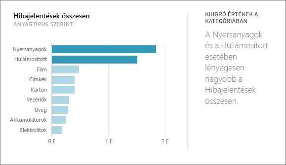
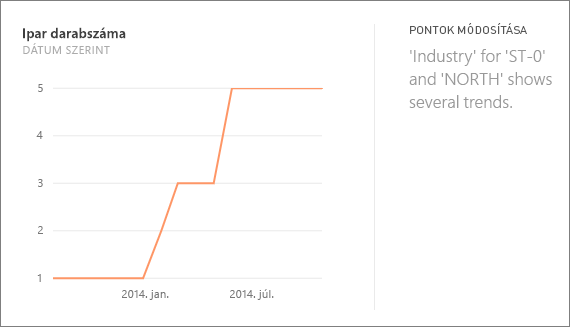
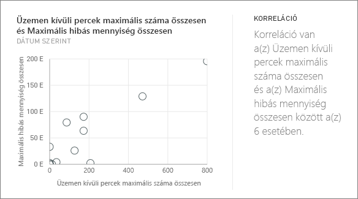
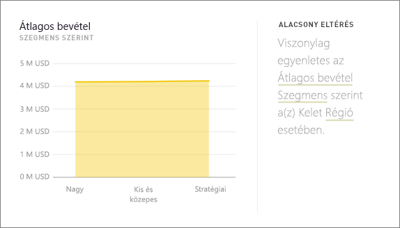
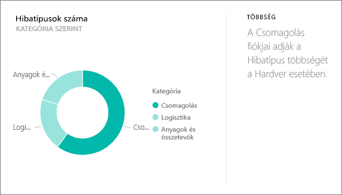
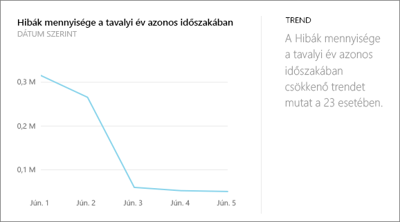
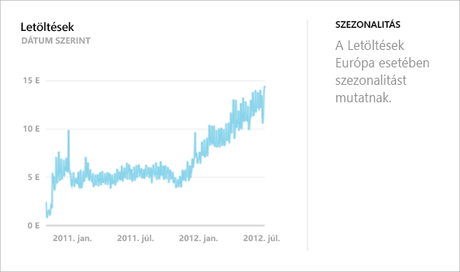
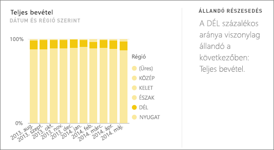
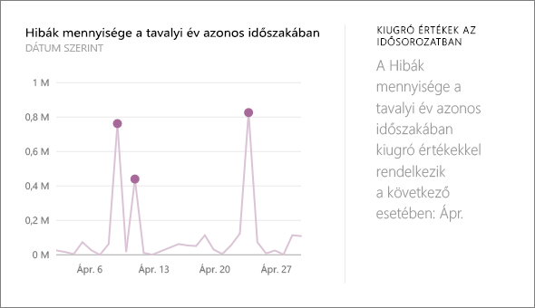

# A Power BI által támogatott elemzések típusai
## Az elemzések működése
A Power BI kifinomult algoritmusok alkalmazásával részhalmazokat keres az adatkészletben potenciálisan érdekes összefüggések feltárásához. A Power BI adott idő alatt annyi adatot vizsgál meg az adatkészletből, amennyit csak tud.

Az elemzések egy adathalmazon vagy egy irányítópult-csempén futtathatók.   

## Milyen összefüggések tárhatók fel az elemzésekkel?
A rendszer többek között az alábbi algoritmusokat használja:

## Kiugró (alsó vagy felső) értékek a kategóriában
Az adatmodell valamely kategóriája vonatkozásában kiemeli azokat az eseteket, amelyeknél adott dimenzióban az egyik vagy másik elem értéke sokkal nagyobb vagy alacsonyabb, mint a többié.  

## Időbeli adatsorok változási pontjai
Időbeli adatsoroknál kiemeli, hogy mikor következett be szignifikáns változás a trendekben.

## Korreláció
Észleli, hogy az adatkészletet egy adott dimenzió mentén ábrázolva milyen eseteken korrelálnak egymással a különböző kategóriák értékei.

## Alacsony variancia
Észleli azokat az eseteket, melyeknél az adatpontok közel vannak az átlaghoz.

## Többség (fő tényezők)
Megkeresi azokat az eseteket, amelyekben az összérték többségi aránya egy másik dimenzió mentén vizsgálva egyetlen tényezőnek tudható be.  

## Időbeli adatsorok általános trendjei
Észleli az időrendben elérhető adatok növekvő és csökkenő trendjeit.

## Időbeli adatsorok szezonális változásai
Azt vizsgálja, hogy felfedezhetőek-e heti, havi vagy éves gyakorisággal ismétlődő minták az időbeli adatsorokban.

## Állandó részesedés
Kiemeli azokat az eseteket, amelyekben szülő-gyermek típusú korreláció fedezhető fel egy gyermek érték részesedése és egy folyamatos változó mentén vizsgált teljes szülő érték között.

## Kiugró értékek egy időbeli adatsorban
Időrendben elérhető adatok esetén észleli, hogy vannak-e olyan dátumok vagy időpontok, melyeknél az érték szignifikánsan eltér a többi dátumhoz/időponthoz tartozó értéktől.

## Következő lépések
[Power BI-elemzések](service-insights.md)

Ha Ön az adathalmaz tulajdonosa, [optimalizálhatja azt elemzések elvégzéséhez](service-insights-optimize.md)

További kérdései vannak? [Kérdezze meg a Power BI közösségét](http://community.powerbi.com/)

