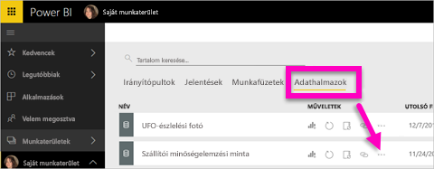
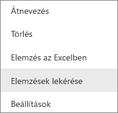
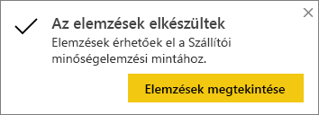
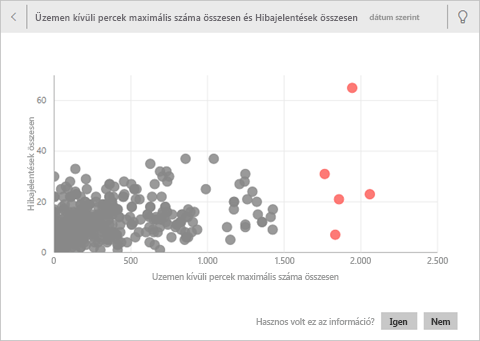
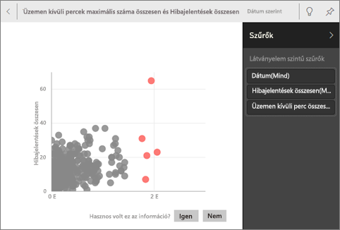
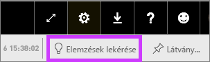
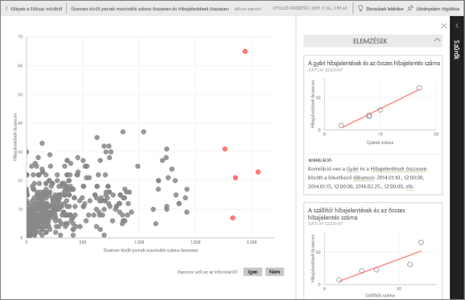
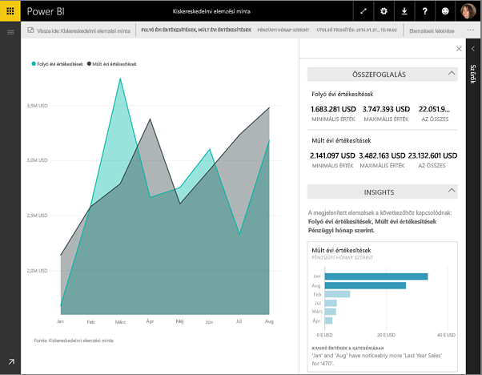

# Adatelemzések automatikus generálása a Power BI-jal
Van egy új adatkészlete, de nem tudja, hogy kezdje el feldolgozni?  Gyorsan létre kell hoznia egy irányítópultot?  Szeretne felfedezni eddig hiányzó összefüggéseket?

A Gyors elemzéseket futtatva érdekes interaktív vizualizációkat hozhat létre adataiból. Gyors elemzések egy teljes adatkészleten (gyors elemzések), illetve egy adott irányítópult-csempén is futtathatók (hatókörön belüli elemzés). Elemzésen is futtatható elemzés.

> **MEGJEGYZÉS:**: Az elemzés szolgáltatás csak a Power BI-ba feltöltött adatokhoz használható, DirectQueryvel előállított adatokhoz nem.
> 

Az elemzés szolgáltatás a Microsoft Research-csel együttműködésben fejlesztett, egyre növekvő számú [haladó szintű elemzési algoritmusra épül](service-insight-types.md). A Microsoft Research egyre több ember számára teszi lehetővé adatai újszerű és intuitív módszerekkel történő elemzését.

## Gyors elemzések futtatása adatkészleteken
Tekintse meg, hogyan futtat Amanda gyors elemzést egy adatkészleten, hogyan nyit meg egy elemzést Fókusz módban, hogyan tűzi ki egy ilyen elemzést irányítópultjára csempeként, és hogyan kér gyors elemzést egy irányítópult-csempéhez kapcsolódóan.

<iframe width="560" height="315" src="https://www.youtube.com/embed/et_MLSL2sA8" frameborder="0" allowfullscreen></iframe>

Most Ön következik. Fedezze fel az elemzések szolgáltatást a [Supplier Quality Analysis mintát](sample-supplier-quality.md) (Szállítói minőségelemzési mintát) használva.

1. Az **Adatkészletek** lapon kattintson a három pontra (...), majd válassza az **Elemzések lekérése** lehetőséget.
   
    
   
    
2. A Power BI [különböző algoritmusokat](service-insight-types.md) használ az adatkészlet trendjeinek kimutatásához.
   
    
3. Az elemzés másodpercek alatt elkészül.  A vizualizációk megjelenítéséhez kattintson az **Elemzések megtekintése** lehetőségre.
   
    
   
   > **MEGJEGYZÉS:**: Bizonyos adatkészletek esetén nem hozható létre elemzés, mert az adatok statisztikailag nem szignifikánsak.  Ha ezzel kapcsolatban további információra van szüksége, tekintse át az [Adatok elemzésekhez történő optimalizálását](service-insights-optimize.md) bemutató cikket.
   > 
   > 
1. A vizualizációk a **Gyors elemzések** speciális vásznán jelennek meg, akár 32 különálló elemzéskártyán. Minden kártyán egy-egy diagram vagy ábra és egy rövid leírás látható.
   
    

## Az elemzéseket megjelenítő kártyák interaktív használata
  

1. A vizualizáció irányítópultra történő felvételéhez vigye a kurzort az egyik kártya fölé, és válassza a kitűzés ikont.
2. Mutasson egy kártyára, válassza a három pontot (...), majd az **Elemzések megtekintése** elemet. Ekkor az elemzés megnyílik teljes képernyős módban.
   
    
3. Fókusz módban a következő műveleteket végrehajtására van lehetőség:
   
   * Vizualizációk szűrése.  A szűrők megjelenítéshez a jobb felső sarokban látható nyilat választva tudja kinyitni a Szűrők ablaktábláját.
        
   * Az elemzéskártyát a gombostű   ikont vagy a **Vizualizáció rögzítése** lehetőséget választva tűzheti ki egy irányítópultra.
   * Elemzést magára a kártyára vonatkozóan is futtathat. Ezt gyakran **hatókörön belüli elemzésnek** is nevezik. Válassza a jobb felső sarokban látható villanykörte ikont   vagy az **Elemzések lekérése** lehetőséget.
     
       
     
     A bal oldalon megjelennek az elemzések, a jobb oldalon pedig új kártyák láthatók, melyeket kizárólag az adott elemzésben szereplő adatok alapján készített a rendszer.
     
       
4. Az eredeti elemzéseket tartalmazó vászonra a bal felső sarokban látható **Kilépés a fókusz módból** lehetőséget választva léphet vissza.

## Irányítópult csempére vonatkozó elemzések futtatása
Teljes adatkészletek összefüggéseinek feltárása helyett egyetlen irányítópult-csempe létrehozásához használt adatokra is szűkíthető az elemzés. Ezt is gyakran **hatókörön belüli elemzésnek** is nevezik.

1. Nyisson meg egy irányítópultot.
2. Vigye az egérmutatót egy csempe fölé. válassza a három pontot (...), majd az **Elemzések megtekintése** lehetőséget. A csempe [Fókusz módban](service-focus-mode.md) nyílik meg, és a jobb oldalán jelennek meg az elemzéskártyák.    
   
        
4. Felkeltette valamelyik elemzés az érdeklődését? Az adott elemzéskártyát kiválasztva az adatok mélyebb szintjére is leáshat. A kiválasztott elemzés a bal oldalon fog megjelenni, az új, kizárólag az adott elemzés adatain alapuló új elemzéskártyák pedig a jobb oldalon.    
6. Az adatok mélyebb szintjeinek feltárását tovább folytatva az érdekes elemzéseket a jobb felső sarokban látható **Vizualizáció rögzítése** lehetőséget választva tűzheti ki az irányítópultra.

## Következő lépések
Ha Ön az adatkészlet tulajdonosa, akkor [optimalizálhatja azt gyors elemzések készítéséhez](service-insights-optimize.md)

További tudnivalók a [Gyors elemzések típusaival kapcsolatban](service-insight-types.md)

További kérdései vannak? [Kérdezze meg a Power BI közösségét](http://community.powerbi.com/)

