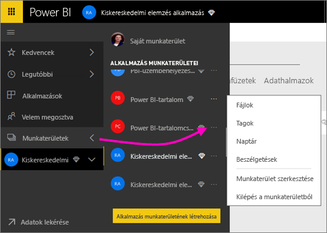
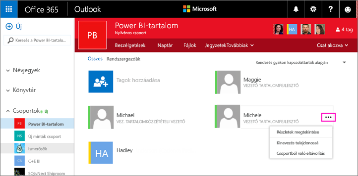
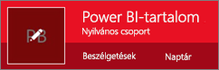
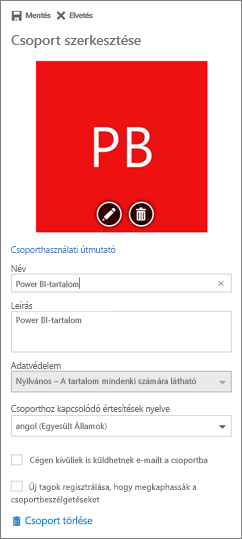

# Az alkalmazás-munkaterület kezelése a Power BI-ban és az Office 365-ben
Az Office 365-ben vagy a [Power BI-ban az alkalmazás-munkaterület](consumer/end-user-apps.md) létrehozójaként vagy rendszergazdájaként Ön kezeli a Power BI munkaterületének egyes funkcióit. Más funkciókat az Office 365-ben kezelhet. 

> [!NOTE]
> Az új munkaterületi felhasználói felület előzetes verziójában megváltozik a Power BI-munkaterületek és az Office 365-csoportok közötti kapcsolat. A rendszer nem fog automatikusan létrehozni Office 365-csoportokat minden alkalommal, amikor egy új munkaterület jön létre. További információ az [új munkaterületek létrehozásáról (előzetes verzió)](service-create-the-new-workspaces.md)

**A Power BI-ban** a következőket teheti:

* Alkalmazás-munkaterület tagjainak felvétele és eltávolítása, valamint a munkaterület egy tagjának rendszergazdává alakítását.
* Az alkalmazás-munkaterület nevének szerkesztése.
* Az alkalmazás-munkaterület törlése.

**Az Office 365-ben** a következőket teheti:

* Az alkalmazás-munkaterület csoporttagjainak felvétele és eltávolítása, valamint egy tag rendszergazdává alakítása.
* A csoport nevének, képének, leírásának és más beállításoknak a szerkesztése.
* A csoport e-mail-címének megtekintése.
* A csoport törlése.

Ahhoz, hogy alkalmazás-munkaterület rendszergazdája vagy tagja lehessen [Power BI Pro](service-free-vs-pro.md)-licencre van szüksége. Az alkalmazás felhasználóinak szintén Power BI Pro-licenccel kell rendelkezniük, kivéve, ha az alkalmazás-munkaterület Power BI Premium-kapacitásban található. Részletek: [Mi a Power BI Premium?](service-premium.md).

## Az alkalmazás-munkaterület szerkesztése a Power BI-ban
1. A Power BI szolgáltatásban válassza a **Munkaterületek** elem melletti nyilat, majd a munkaterület neve melletti három pontot (**...**), aztán a **Munkaterület szerkesztése** menüpontot. 
   
   
   
   > [!NOTE]
   > A **Munkaterület szerkesztése** csak akkor látható, ha Ön az alkalmazás-munkaterület rendszergazdája.
   > 
   > 
2. Itt átnevezhet, hozzáadhat és eltávolíthat tagokat, vagy törölheti az alkalmazás-munkaterületet. 
   
   
3. Kattintson a **Mentés** vagy a **Mégse** gombra.

## A Power BI-beli alkalmazás-munkaterület tulajdonságainak szerkesztése az Office 365-ben
1. A Power BI szolgáltatásban válassza a **Munkaterületek** elem melletti nyilat, majd a munkaterület neve melletti három pontot (**...**), aztán a **Tagok** menüpontot. 
   
   
   
   Ezzel megnyílik az alkalmazás-munkaterület Office 365 Outlook csoportnézete.
   
   Lehet, hogy be kell jelentkeznie a vállalati fiókjába.
2. Koppintson a tag neve melletti három pontra (**...**) a rendszergazdává alakításához, vagy törölje a tagot az alkalmazás-munkaterületről. 
   
   

## Kép felvétele és más munkaterület-tulajdonságok beállítása az Office 365-csoportban
Amikor az alkalmazást az alkalmazás-munkaterületről terjeszti, az itt hozzáadott kép lesz az alkalmazás képe. Olvassa el az [Új munkaterületek létrehozása](service-create-workspaces.md) című cikk [Kép hozzáadása az alkalmazáshoz](service-create-workspaces.md#add-an-image-to-your-office-365-app-workspace-optional) szakaszát.

1. Az alkalmazás-munkaterület Office 365 Outlook nézetében jelölje ki a csoport képét a csoport munkaterület-tulajdonságainak szerkesztéséhez.
   
   
2. Itt szerkesztheti a nevet, a leírást és a nyelvet, képet vehet fel, és más tulajdonságokat is beállíthat.
   
   
3. Kattintson a **Mentés** vagy az **Elvetés** gombra.

## Következő lépések
* [Mik a Power BI szolgáltatáson belüli alkalmazások?](consumer/end-user-apps.md)
* [Irányítópultokból és jelentésekből álló alkalmazások közzététele a Power BI-ban](consumer/end-user-create-apps.md)
* További kérdései vannak? [Kérdezze meg a Power BI közösségét](http://community.powerbi.com/)

