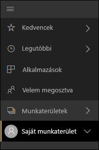
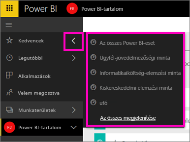
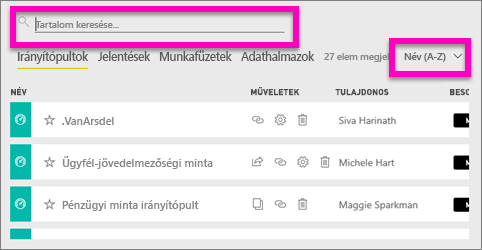
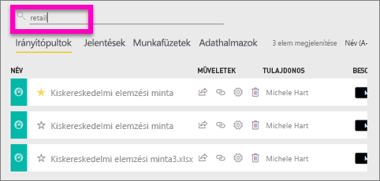
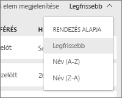

# Tartalom keresése és rendezése a Power BI szolgáltatásban
A Power BI szolgáltatásban bármit gyorsan megtalálhat a Power BI automatizált rendszerezése, a felhasználói címkézés, a keresés, és a válogatás kombinációja révén.

## Hogyan segíti a Power BI a tartalmon belüli navigációt
A Power BI szolgáltatás többféleképpen rendezi a tartalmat.  Először is irányítópultokba, jelentésekbe, munkafüzetekbe és adatkészletekbe csoportosítja. Ezzel az elrendezéssel számos Power BI-képernyőn találkozhat. A Power BI szolgáltatás ezen kívül a tartalom osztályozásával is segíti a keresett elemek gyors megtalálását. Vessen egy pillantást a bal oldali navigációs ablaktáblára.

A saját használatra létrehozott tartalom a **Saját munkaterületen** érhető el, a csoporttal létrehozott és megosztott tartalom az **alkalmazás-munkaterületen**, a gyorsan elérni kívánt tartalom a **Kedvencek** alatt, az Önnel megosztott tartalom a **Velem megosztott** részben, az utoljára megtekintett tartalmakat pedig a **Legutóbbiak** részből is megnyithatja.

További információkért lásd: [Tartalom rendszerezése a Power BI szolgáltatásban](service-basic-concepts.md)

> **FIGYELEM**: A rendszerezésben az is segít, ha a leggyakrabban megtekinteni kívánt irányítópultot *kiemelt* irányítópultként állítja be. A Power BI szolgáltatás megnyitásakor mindig ez az irányítópult jelenik meg először. További információkért lásd: [Kiemelt irányítópult](service-dashboard-featured.md).
> 
> 

## Kedvenc irányítópultok és alkalmazások
Vannak gyakran használt irányítópultjai és alkalmazásai? Ha [úgy állítja be őket, mint *kedvenceket*](service-dashboard-favorite.md), mindig elérhetőek lesznek a bal oldali navigációs ablaktáblán.

.

A kedvencek használatának részletes leírását lásd a [Kedvencek a Power BI szolgáltatásban](service-dashboard-favorite.md) című cikkben.

## Keresés és rendezés a munkaterületeken
A munkaterületeken négyféle tartalomlap található: Irányítópultok, Jelentések, Munkafüzetek, Adatkészletek.  Minden laphoz tartozik egy keresőmező és egy rendezési gomb.  A Power BI szolgáltatás használatának kezdetén talán nem találja szükségesnek őket, hiszen akkor még csak egy-két elem lesz egy lapon.  De idővel hosszú tartalomlisták is kialakulhatnak.  A keresés és a rendezés használatával könnyedén megtalálhatja, amit keres.

* Adjon meg egy keresőkifejezést az aktuális képernyőn való kereséshez
  
   
* A rendezés gombra kattintva megtekintheti az aktuális lap tartalmát. Az elemek név vagy tulajdonos szerint rendezhetők sorba.
  
   

## Megfontolások és hibaelhárítás
* Az adatkészletek esetében a tulajdonos szerinti **Rendezés** nem érhető el.

## Következő lépések
[Power BI – Alapfogalmak](service-basic-concepts.md)

Több kérdése van? [Kérdezze a Power BI-közösséget](http://community.powerbi.com/)

