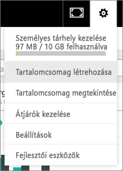
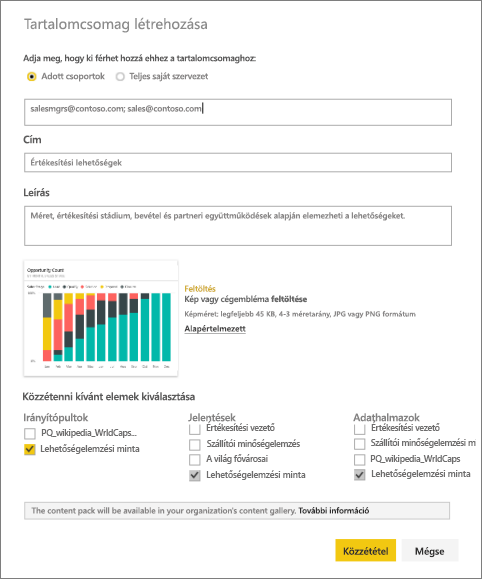
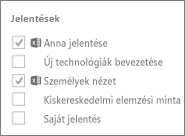
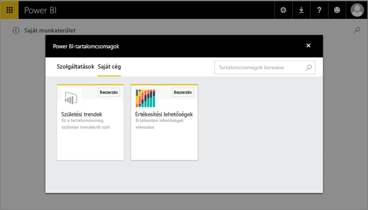

# Power BI szervezeti tartalomcsomag létrehozása és közzététele (oktatóanyag)
> [!NOTE]
> Hallott már az új *alkalmazásokról*? Az alkalmazásokkal új módon oszthatja meg a nagyközönséggel a tartalmakat a Power BI-ban. Javasoljuk az alkalmazások használatát a vállalati tartalomcsomagok vagy csak olvasható munkaterületek helyett. [További információk az alkalmazásokról](service-install-use-apps.md).
> 
> 

Ebben az oktatóanyagban egy szervezeti tartalomcsomagot hoz létre, hozzáférést ad hozzá egy adott csoport számára, és közzéteszi a cég tartalomcsomagtárában a Power BI-ban.

A tartalomcsomagok létrehozása nem azonos az irányítópultok megosztásával vagy az azokon való közös munkával. Olvassa el [Az irányítópultokon és jelentéseken végzett közös munka, illetve azok megosztása](service-how-to-collaborate-distribute-dashboards-reports.md) szakaszt, hogy eldönthesse, melyik lehetőség felel meg legjobban a helyzetének.

> [!NOTE]
> A szervezeti tartalomcsomagok létrehozásához Önnek és kollégáinak [Power BI Pro-fiókkal](https://powerbi.microsoft.com/pricing) kell rendelkezniük.
> 
> 

Képzelje el, hogy Ön a Contoso kiadáskezelője, és épp egy új termék kiadásának előkészületeit végzi.  Létrehozott egy irányítópultot, amelyet meg szeretne osztani a kiadást kezelő munkatársaival. Szeretné összecsomagolni az irányítópultot és a jelentéseket egyetlen megoldásba, amelyet aztán a munkatársai használhatnak. 

Ha érdekli a megoldás, tartson velünk. A [Power BI szolgáltatásban](https://powerbi.com) az **Adatok lekérése > Minták > Lehetőségelemzési minta** > **Kapcsolódás** pontban töltheti le a saját példányát. 

1. A bal oldali navigációs ablaktáblán válassza a **Lehetőségelemzési minta** irányítópultot.
2. A felső navigációs sávon kattintson a fogaskerék ikon  > **Tartalomcsomag létrehozása** elemére.    
   
3. A **Tartalomcsomag létrehozása** ablakban adja meg az alábbi adatokat.  
   
   Vegye figyelembe, hogy a cég tartalomcsomagtára idővel a cég vagy a különböző csoportok számára létrehozott tartalomcsomagok százait fogja tartalmazni. Ezért szánjon időt arra, hogy egy értelmes nevet és jól átlátható leírást adjon a tartalomcsomagnak, illetve kiválassza a megfelelő közönséget.  Használjon olyan szavakat, amelyek alapján a tartalomcsomag könnyen megtalálható.
   
   1.  Válassza az **Adott csoportok** lehetőséget, és adja meg adott személyek, [Office 365-csoportok](https://support.office.com/article/Create-a-group-in-Office-365-7124dc4c-1de9-40d4-b096-e8add19209e9), terjesztési vagy biztonsági csoportok teljes e-mail-címét. Például:
      
         salesmgrs@contoso.com; sales@contoso.com
      
      Ebben az oktatóanyagban használja a saját vagy a csoportja e-mail-címét.
   
   2.  Adja az **Értékesítési lehetőségek** nevet a csoportnak.
   
      > [!TIP]
      > Érdemes lehet az irányítópult nevét is belevenni a tartalomcsomag nevébe. Így munkatársai könnyebben megtalálják az irányítópultot a tartalomcsomag csatlakoztatását követően.
      > 
      > 
   
   3.  Ajánlott: Adjon meg egy **leírást**. Így a munkatársai könnyebben találják meg a számukra szükséges tartalomcsomagokat. A leírás mellett kulcsszavakat is hozzáadhat, amelyekkel a munkatársai könnyebben találhatják meg a tartalomcsomagot. Adja meg a kapcsolattartási adatait is arra az esetre, ha a munkatársainak kérdése merülne fel vagy segítségre volna szüksége.
   
   4.  **Töltsön fel egy képet vagy emblémát is**, hogy a csoport tagjai könnyebben találják meg a tartalomcsomagot – a képeket könnyebb gyorsan kiszúrni, mint a leírásokat. Az alábbi képernyőképen a Opportunity Count 100% (Lehetőségek száma 100%) oszlopdiagram csempéjének képét használjuk.
   
   5.  Válassza ki a **Lehetőségelemzési minta** irányítópultot, és adja a tartalomcsomaghoz.  A Power BI automatikusan hozzáadja a kapcsolódó jelentést és adatkészletet. Igény szerint továbbiakat is hozzáadhat.
   
      > [!NOTE]
      >  Csak azok az irányítópultok, jelentések, adatkészletek és munkafüzetek vannak felsorolva, amelyeket szerkeszthet. Így az Önnel megosztott elemek nem szerepelnek a listában.
      > 
      > 
   
       
   
   6. Az Excel-munkafüzetek a Jelentések között vannak felsorolva, és egy Excel ikon jelöli őket. Ezeket is hozzáadhatja a tartalomcsomaghoz.
   
     
   
      > [!NOTE]
      > Ha a csoport tagjai nem látják az Excel-munkafüzetet, esetleg [meg kell osztania azt velük a OneDrive Vállalati verziójában](https://support.office.com/en-us/article/Share-documents-or-folders-in-Office-365-1fe37332-0f9a-4719-970e-d2578da4941c).
      > 
      > 
4. A tartalomcsomagot a **Közzététel** gombra kattintva adhatja hozzá a csoport céges tartalomcsomagtárához.  
   
   A sikeres közzétételt egy üzenet nyugtázza. 
5. A csoport tagjai az **Adatok lekérése > Saját szervezet** felületen, a keresőmezőben megadhatják az „Értékesítési lehetőségek” keresőkifejezést.
   
    
6. Megjelenik a tartalomcsomag.  
    
   
   > [!TIP]
   > A böngészőben megjelenő URL-cím a tartalomcsomag egyedi címe.  Szeretné értesíteni a munkatársait az új tartalomcsomagról?  Illessze be az URL-címet egy e-mailbe.
   > 
   > 
7. Ezután kattintson a **Kapcsolódás** gombra, és így a munkatársai már [megtekinthetik és használhatják a tartalomcsomagot](service-organizational-content-pack-copy-refresh-access.md). 

### Következő lépések
* [A szervezeti tartalomcsomagok bemutatása](service-organizational-content-pack-introduction.md)  
* [Szervezeti tartalomcsomagok kezelése, frissítése és törlése](service-organizational-content-pack-manage-update-delete.md)  
* [Csoportok létrehozása a Power BI-ban](service-create-distribute-apps.md)  
* [Mi a OneDrive Vállalati verziója?](https://support.office.com/en-us/article/What-is-OneDrive-for-Business-187f90af-056f-47c0-9656-cc0ddca7fdc2)
* További kérdései vannak? [Kérdezze meg a Power BI közösségét](http://community.powerbi.com/)

