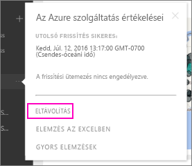

# Power BI szervezeti tartalomcsomaggal létesített kapcsolat eltávolítása

> [!NOTE]
> Nem lehet létrehozni vagy telepíteni céges tartalomcsomagokat az új munkaterületi felhasználói felület előzetes verziójában. Ha még nem kezdte el, ideje frissítenie az alkalmazásokhoz tartozó tartalomcsomagokat. További információ az [új munkaterületi felhasználói felületről](service-create-the-new-workspaces.md).
> 

Egy munkatársa létrehozott egy tartalomcsomagot. Ön megnyitotta az AppSource-ban, és hozzáadta a Power BI-munkaterületéhez. Mostanra pedig már nincs rá szüksége.  Hogyan tudja eltávolítani?

A tartalomcsomagok eltávolításához el kell távolítania azok adatkészletét.  

* A bal oldali navigációs ablaktáblában kattintson az adatkészlet jobb oldalán található három pontra, majd válasza az **eltávolítás \> Igen** lehetőséget.  
  
  

Az adatkészlet eltávolítása minden hozzárendelt jelentést és irányítópultot is eltávolít. A tartalomcsomaggal létesített kapcsolat eltávolítása azonban nem törli a tartalomcsomagot a szervezeti AppSource-ból.  Az AppSource-ból később újra hozzáadhatja a tartalomcsomagot a munkaterülethez. Csak akkor [törölhet az AppSource-ból tartalomcsomagokat](service-organizational-content-pack-manage-update-delete.md), ha azokat Ön hozta létre.

## Következő lépések
* [Szervezeti tartalomcsomagok: bevezetés](service-organizational-content-pack-introduction.md) 
* [Alkalmazások létrehozása és terjesztése a Power BI-ban](service-create-distribute-apps.md) 
* [A Power BI alapvető fogalmai](consumer/end-user-basic-concepts.md)  
* További kérdései vannak? [Kérdezze meg a Power BI közösségét](http://community.powerbi.com/)

