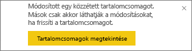
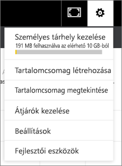

# Céges tartalomcsomagok kezelése, frissítése és törlése
> [!NOTE]
> Nem lehet létrehozni vagy telepíteni céges tartalomcsomagokat az új munkaterületi felhasználói felület előzetes verziójában. Ha még nem kezdte el, ideje frissítenie az alkalmazásokhoz tartozó tartalomcsomagokat. További információ az [új munkaterületi felhasználói felületről](service-create-the-new-workspaces.md).
> 

Irányítópultjait, jelentéseit, Excel-munkafüzeteit és adatkészleteit [céges tartalomcsomagokba](service-organizational-content-pack-introduction.md) rendezheti és megoszthatja munkatársaival. Munkatársai használhatják ezeket a megosztott formában, vagy létrehozhatják belőlük saját példányukat.

A tartalomcsomagok létrehozása más, mint az irányítópultok megosztása vagy csoportos együttműködéssel történő használata. Az [Irányítópultok és jelentések közös használata és megosztása](service-how-to-collaborate-distribute-dashboards-reports.md) című cikkben leírtak segítenek kiválasztani az Ön számára optimális megoldást.

A céges tartalomcsomagokkal kapcsolatban bizonyos feladatokat csak a tartalomcsomag létrehozója végezhet el:

* Újbóli közzététel.
* Tartalomcsomaghoz történő hozzáférés korlátozása vagy kiterjesztése.
* Ütemezett frissítés beállítása és módosítása.
* Tartalomcsomag törlése.

## Céges tartalomcsomag módosítása és újbóli közzététele
Ha módosítja a tartalomcsomagban eredetileg közzétett irányítópultot, jelentést vagy Excel-munkafüzetet, a Power BI kérni fogja, hogy tegye közzé újra. A tartalomcsomag létrehozójaként ezenkívül bármelyik beállítást módosíthatja, amelyet a tartalomcsomag létrehozásakor a Tartalomcsomag létrehozása ablakban megadott. 

## Újbóli közzététel az új tartalommal
Amikor módosít és ment egy tartalomcsomagba foglalt irányítópultot, a Power BI emlékezteti, hogy frissítse a tartalomcsomagot annak érdekében, hogy a változásokat mások is láthassák. Például ha kitűz egy új csempét, vagy egyszerűen csak megváltoztatja az irányítópult nevét.

1. Kattintson a **Tartalomcsomag megtekintése** lehetőségre az üzenetben.
   
   
2. Vagy kattintson a jobb felső sarokban látható  fogaskerék ikonra, és válassza a **Tartalomcsomag megtekintése** lehetőséget.
   
   
   
   Megjelenik a  Figyelmeztetés ikon.  Ez azt jelzi, hogy valamilyen formában módosította a tartalomcsomagot, és már nem egyezik meg a közzétett tartalommal.
3. Kattintson a **Szerkesztés** lehetőségre.  
4. Hajtsa végre a szükséges módosításokat a **Tartalomcsomag frissítése** ablakban, majd válassza a **Frissítés** lehetőséget. Megjelenik a **Sikeres** változtatást jelző üzenet.
   
   * A rendszer automatikusan érvényesíti a frissítést azoknál a csoporttagoknál, akik nem szabták testre a tartalomcsomagot.
   * Azokat a csoporttagokat, akik testreszabták a tartalomcsomagot, értesíti, hogy létezik egy új verzió.  Ha megnyitják az AppSource-ot, akkor letölthetik a frissített tartalomcsomagot, de a saját verziójuk is megmarad.  Így már két verziójuk lesz: a személyre szabott és a frissített tartalomcsomag.  A személyre szabott verzióból el fognak tűnni az eredeti tartalomcsomag csempéi.  Láthatóak lesznek ugyanakkor a más jelentésekből kitűzött csempék. Ha azonban a tartalomcsomag tulajdonosa törli a csomag alapjául szolgáló adatkészletet, akkor a teljes jelentés elvész.  

## A közönség frissítése: a hozzáférés kiterjesztése vagy korlátozása
Egy másik módosítási lehetőség a tartalomcsomag létrehozói számára a hozzáférés kiterjesztése, illetve korlátozása.  Előfordulhat, hogy egy szűkebb csoportra szeretné korlátozni egy széles közönség számára közzétett tartalomcsomag elérhetőségét.  

1. Kattintson a  fogaskerék ikonra, majd kattintson a **Tartalomcsomag megjelenítése** lehetőségre.
2. Kattintson a **Szerkesztés** lehetőségre. 
3. Hajtsa végre a szükséges módosításokat a **Tartalomcsomag frissítése** ablakban, majd válassza a **Frissítés** lehetőséget. Törölje például az eredeti terjesztési csoportot az **Adott csoportok** mezőből, és adjon meg helyette egy másik (kevesebb taggal rendelkező) terjesztési csoportot.
   
   Megjelenik a Sikeres változtatást jelző üzenet.
   
   Azon munkatársak közül, akik nem tartoznak az új aliashoz:
   
   * Azok a csoporttagok, akik nem szabták testre a tartalomcsomagot, nem fognak hozzáférni a tartalomcsomaghoz tartozó irányítópultokhoz és jelentésekhez, és nem fogják látni a tartalomcsomagot a Navigációs panelen.
   * Azok a csoporttagok, akik testreszabták a tartalomcsomagot, a testreszabott irányítópult legközelebbi megnyitásakor az eredeti tartalomcsomag egyik csempéjét sem fogják látni.  Láthatóak lesznek ugyanakkor a más jelentésekből kitűzött csempék. Az eredeti tartalomcsomag jelentései és adatkészletei nem lesznek többé elérhetőek, és a tartalomcsomag nem jelenik meg a Navigációs panelen.   

## Céges tartalomcsomag frissítése
A tartalomcsomag létrehozójaként [ütemezheti az adatkészletek frissítését](refresh-data.md).  Amikor létrehoz és feltölt egy tartalomcsomagot, az adatkészletekkel együtt a frissítési ütemezést is feltölti a rendszer. Ha megváltoztatja a frissítési ütemezést, újra közzé kell tennie a tartalomcsomagot (a fentebb leírtak szerint).

## Céges tartalomcsomag törlése az AppSource-ból
Csak azokat a tartalomcsomagokat törölheti az AppSource-ból, amelyeket Ön hozott létre. Ha létrehozott egy vállalati tartalomcsomagot egy alkalmazás-munkaterületen, és úgy dönt, hogy törli ezt a munkaterületet, akkor először a tartalomcsomagot kell törölnie. Ha a tartalomcsomag előzetes törlése nélkül törli a munkaterületet, akkor elveszti az ilyen tartalomcsomagokhoz való hozzáférését, és a Microsoft ügyfélszolgálatához kell fordulnia segítségért. 

> [!TIP]
> [Törölheti ugyanakkor az olyan tartalomcsomagokra mutató kapcsolatokat](service-organizational-content-pack-disconnect.md), melyeket nem Ön hozott létre. Ilyen esetben az AppSource-ból nem törli a tartalomcsomagot a rendszer.
> 
> 

1. A tartalomcsomagok AppSource-ból való törléséhez lépjen arra az alkalmazás-munkaterületre, ahol létrehozta a tartalomcsomagot, kattintson a  fogaskerék ikonra, majd válassza a **Tartalomcsomag megtekintése** lehetőséget.
2. Válassza a **Törlés \> Törlés** lehetőséget. 
   
   * Azon csoporttagok elől, akik nem szabták testre a tartalomcsomagot, a rendszer automatikusan eltávolítja a tartalomcsomaghoz tartozó irányítópultokat és jelentéseket. Számukra nem lesznek elérhetők, és nem fogják látni a Navigációs panelen sem a tartalomcsomagot.
   * Azok a csoporttagok, akik testreszabták a tartalomcsomagot, a testreszabott irányítópult legközelebbi megnyitásakor az eredeti tartalomcsomag egyik csempéjét sem fogják látni.  Láthatóak lesznek ugyanakkor a más jelentésekből kitűzött csempék. Az eredeti tartalomcsomag jelentései és adatkészletei nem lesznek többé elérhetőek, és a tartalomcsomag nem jelenik meg a Navigációs panelen.   

## További lépések
* [Szervezeti tartalomcsomagok: bevezetés](service-organizational-content-pack-introduction.md)
* [Alkalmazások létrehozása és terjesztése a Power BI-ban](consumer/end-user-create-apps.md) 
* További kérdései vannak? [Kérdezze meg a Power BI közösségét](http://community.powerbi.com/)

