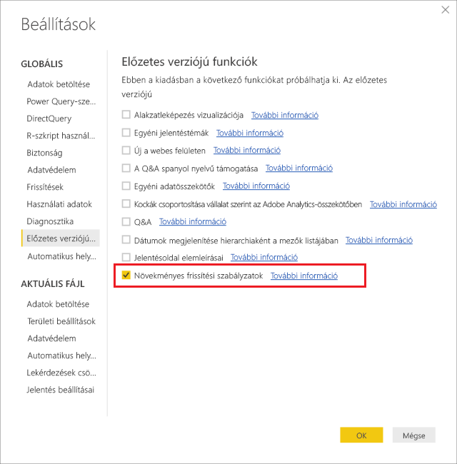
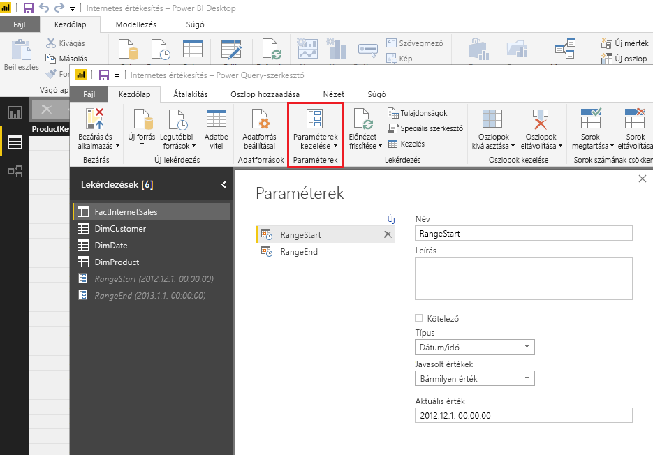
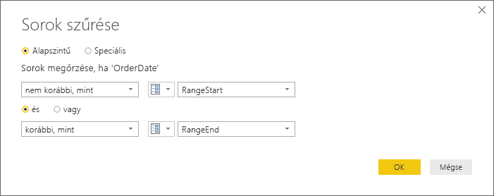
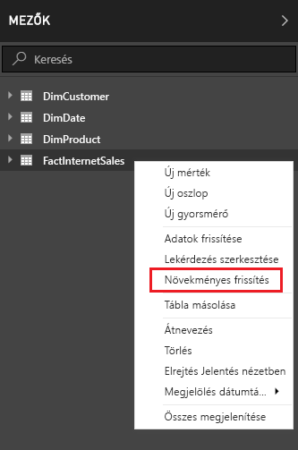
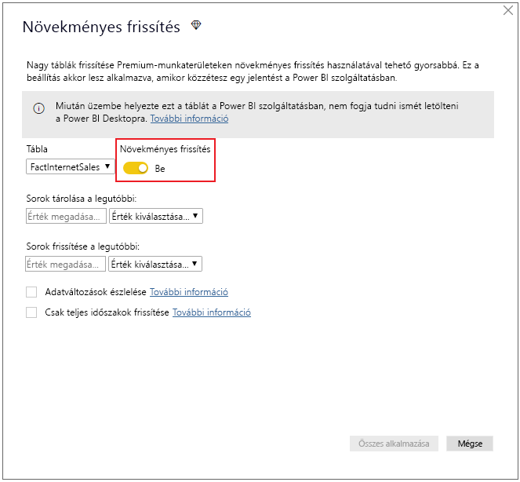
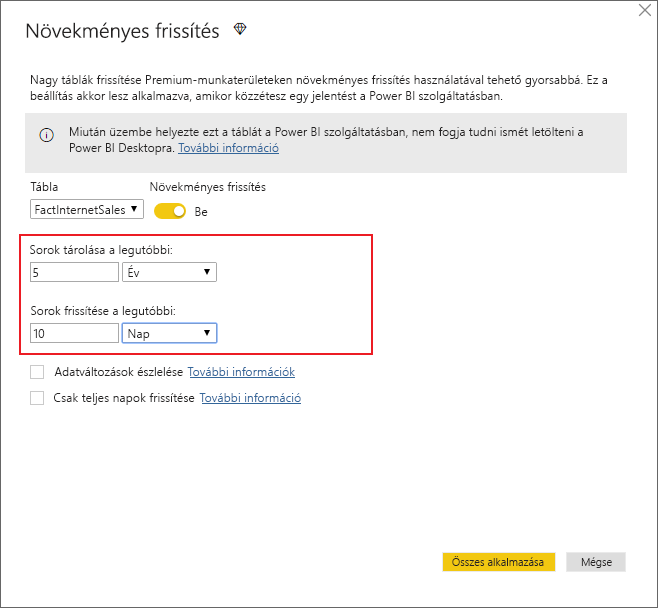
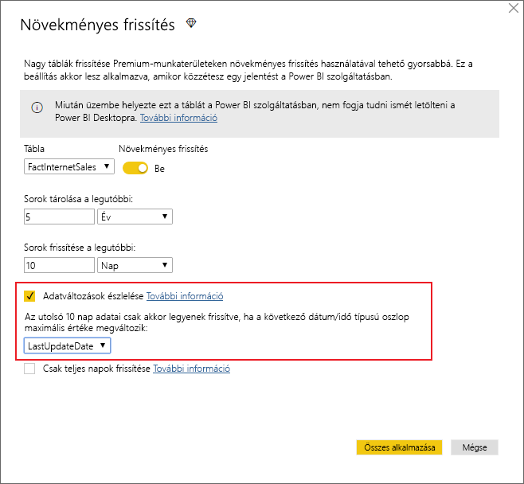
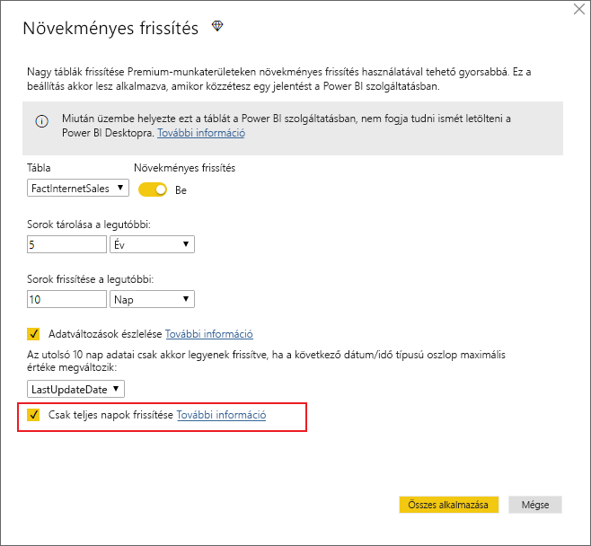
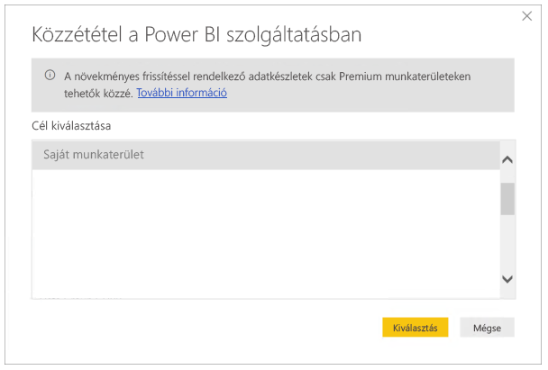

# <a name="incremental-refresh-in-power-bi-premium"></a>Növekményes frissítés a Power BI Premium szolgáltatásban

A növekményes frissítés lehetővé teszi a rendkívül nagyméretű adatkészletek használatát a Power BI Premium szolgáltatásban az alábbi előnyökkel:

- **A frissítés gyorsabb lesz.** Csak a módosult adatokat szükséges frissíteni. Frissítheti például egy 10 éves adatkészletnek csak az utolsó 5 napját.

- **A frissítések megbízhatóbbak.** Nem szükséges például hosszú futású kapcsolatokat fenntartani alacsony megbízhatóságú forrásrendszerekkel.

- **Alacsonyabb erőforrásigény.** A kevesebb frissítendő adat csökkenti a frissítési művelet által igényelt memóriamennyiséget és más erőforrásokat.

## <a name="how-to-use-incremental-refresh"></a>A növekményes frissítés használata

Definiálnia kell egy növekményes frissítési szabályzatot a Power BI Desktopban, majd az alkalmazásához közzé kell azt tennie a Power BI szolgáltatásban.

Első lépésként engedélyezze a növekményes frissítést az előzetes verziójú funkciók között.



### <a name="filter-large-datasets-in-power-bi-desktop"></a>Nagyméretű adatkészletek szűrése a Power BI Desktopban

A potenciálisan több milliárd sort tartalmazó nagyméretű adatkészletek nem biztos, hogy betölthetők a Power BI Desktop alkalmazásba, mivel ez az alkalmazás a felhasználó asztali számítógépének erőforrásai által korlátozott. Ezeket az adatkészleteket ezért gyakran szűrjük importáláskor, hogy elférjenek a Power BI Desktopban. Ez a gyakorlat független attól, hogy növekményes frissítést használ-e vagy sem.

#### <a name="rangestart-and-rangeend-parameters"></a>RangeStart és RangeEnd paraméter

A növekményes frissítés Power BI szolgáltatásban való használatához szűrnie kell az adatokat dátum/idő típusú Power Query-paraméterekkel, melyeknek a **RangeStart** és a **RangeEnd** fenntartott nevet kell adnia, a kis- és nagybetűk különbségére is ügyelve.

A Power Query-szerkesztőben válassza a **Paraméterek kezelése** lehetőséget a paraméterek alapértelmezett értékkel való definiálásához.



A paraméterek definiálása után alkalmazhatja a szűrőt úgy, hogy az **Egyéni szűrő** menüpontot választja a kívánt oszlopnál.


A sorokat úgy kell szűrnie, hogy az oszlopérték *nem korábbi, mint* szűrőjéhez a **RangeStart** paramétert választja, a *korábban, mint* szűrőjéhez pedig a **RangeEnd** paramétert.



> [!TIP]
> A paraméterek adattípusának dátum/időnek kell lennie, de átkonvertálhatja őket, hogy megfeleljenek az adatforrás követelményeinek. Az alábbi Power Query-függvény például átkonvertálja a dátum/idő értéket oly módon, hogy az egész szám típusú helyettes kulcsot alkosson *ééééhhnn* formátumban, melynek használata elterjedt gyakorlat az adatraktárakban. A függvényt a szűrési lépéssel hívhatja meg.
>
> `(x as datetime) => Date.Year(x)*10000 + Date.Month(x)*100 + Date.Day(x)`

Válassza a **Bezárás és alkalmazás** lehetőséget a Power Query-szerkesztőben. Ezután az adatkészlet egy alkészletével dolgozhat a Power BI Desktopban.

> [!NOTE]
> A közzététel után a paraméterek értékét automatikusan felülbírálja a Power BI szolgáltatás. Nem szükséges az adatkészlet beállításainál módosítania őket.

### <a name="define-the-refresh-policy"></a>Frissítési szabályzat definiálása

A növekményes frissítést a táblák helyi menüjében érheti el, kivéve az élő kapcsolatú modellek esetében.



#### <a name="incremental-refresh-dialog"></a>Növekményes frissítés párbeszédpanel

Ekkor megjelenik a Növekményes frissítés párbeszédpanel. A párbeszédpanelt az alábbi váltógombbal engedélyezheti.



> [!NOTE]
> Ha a tábla Power Query-kifejezése nem hivatkozik a fenntartott nevű paraméterekre, a váltógomb letiltva jelenik meg.

A fejlécszöveg rövid magyarázatot nyújt az alábbiakról:

-   A növekményes frissítést csak a prémium szintű kapacitáson tárolt munkaterületek támogatják. A frissítési szabályzatokat a Power BI Desktopban definiálhatja, és a frissítési művelet alkalmazza őket a szolgáltatásban.

-   Ha sikerül is letöltenie a növekményes frissítési szabályzatot tartalmazó PBIX-fájlt a Power BI szolgáltatásból, nem fog megnyílni a Power BI Desktopban. Hamarosan már a letöltés sem fog működni. A jövőben elképzelhető, hogy a rendszer támogatni fogja ezt a használati módot, de tartsa szem előtt, hogy ezek az adatkészletek akkorára nőhetnek, hogy problémákba ütközhet, ha átlagos asztali számítógépen próbálja letölteni és megnyitni őket.

#### <a name="refresh-ranges"></a>Tartományok frissítése

Az alábbi példa definiál egy frissítési szabályzatot 5 évnyi adat tárolásához, illetve 10 napnyi adat növekményes frissítéséhez. Az adatkészlet napi frissítése esetén az alábbi műveletek zajlanak le minden egyes frissítési művelet során.

-   Új napnyi adatok hozzáadása.

-   Az adatok frissítése az aktuális dátumtól számított 10 napra visszamenőleg.

-   Az aktuális dátumtól számított 5 évnél régebbi naptári évek eltávolítása. Ha például az aktuális dátum 2019. január 1., a 2013-as évet eltávolítja a rendszer.

A Power BI szolgáltatás által végzett első frissítés tovább tarthat, mert itt a teljes 5 éves időtartamot importálni kell. A későbbi frissítések végrehajtása már sokkal rövidebb időt fog igénybe venni.



**Előfordulhat, hogy ezeknek a tartományoknak a definiálásán kívül semmilyen más teendője nincs. Ez esetben közvetlenül a lentebb lévő közzétételi lépésekhez ugorhat. A többi legördülő lista speciális funkciók használatához készült.**

#### <a name="detect-data-changes"></a>Adatváltozások észlelése

10 napnyi adat növekményes frissítése természetesen sokkal hatékonyabb, mint 5 évnyi adat teljes frissítése. De lehet, hogy ennél többet is tudunk tenni. Az **Adatváltozások észlelése** jelölőnégyzet bejelölésével megadhat egy dátum/idő oszlopot, amely alapján a rendszer azonosítani tudja, hogy mely napokon történt adatváltozás, és csak ezeket a napokat frissíti. Ez azt feltételezi, hogy található ilyen oszlop a forrásrendszerben (mely jellemzően megtalálható, naplózási célokból). Ennek az oszlopnak a maximális értékét a rendszer kiértékeli a növekményes tartományban lévő minden egyes időszak esetében. Ha nem változott az utolsó frissítés óta, akkor nem szükséges frissíteni az időszakot. A jelen példában ez tovább csökkentheti a növekményesen frissített napok számát 10-ről akár 2-re.



> [!TIP]
> A jelenlegi architektúra megköveteli az adatváltozás-észlelési oszlop megőrzését és memóriában való gyorsítótárazását. A számosság és a memóriahasználat csökkentéséhez tanácsos lehet megfontolnia az alábbi technikák egyikének használatát.
>
> Csak az oszlop maximális értékét őrizze meg frissítéskor, például egy Power Query-függvénnyel.
>
> Csökkentse a pontosságot egy olyan szintre, amely a frissítési gyakorisággal kapcsolatos követelmények vonatkozásában még elfogadható.
>
> Tervezzük az adatváltozás-észleléshez használható egyéni lekérdezések definiálásának támogatását. Ez segítene abban, hogy ne kelljen megőrizni az oszlopértéket.

#### <a name="only-refresh-complete-periods"></a>Csak teljes időszakok frissítése

Tegyük fel, hogy a frissítés mindennap hajnali 4 órára van ütemezve. Ha a forrásrendszerbe e 4 óra során adat kerül be, akkor elképzelhető, hogy azt nem szeretné figyelembe venni. Egyes üzleti mérőszámok – például a hordók száma naponta az olaj- és gáziparban – nem értelmezhetők részleges naponként.

További példaként tegyük fel, hogy az adatokat egy pénzügyi rendszerből frissítjük, ahol az elmúlt hónapra vonatkozó adatok a hónap 12. napján vannak jóváhagyva. Ilyen esetben beállíthatja a növekményes tartományt 1 hónapra, és a frissítést ütemezheti úgy, hogy a hónap 12. napján fusson le. Ennek a jelölőnégyzetnek a bejelölése esetén például a januári adatokat a rendszer csak február 12-én frissíti.



> [!NOTE]
> A szolgáltatás az UTC időzóna szerint hajtja végre a frissítési műveleteket. Ez befolyásolhatja az aktuális dátumot és a teljes időszakokat. Tervezzük egy olyan funkció hozzáadását, amellyel felülbírálható az aktuális dátum a frissítési műveletekben.

## <a name="publish-to-the-service"></a>Közzététel a szolgáltatásban

Mivel a növekményes frissítés egy prémium szintű szolgáltatás, a közzétételi párbeszédpanel csak prémium szintű kapacitásban tárolt munkaterület kiválasztását támogatja.



Ezután készen áll a modell frissítésére. Az első frissítés tovább tarthat az előzményadatok importálása miatt. A későbbi frissítések azonban sokkal gyorsabban lesznek a növekményes frissítésnek köszönhetően.

## <a name="query-timeouts"></a>Lekérdezési időtúllépések

A [frissítéssel kapcsolatos hibák elhárítását tárgyaló cikkünk](https://docs.microsoft.com/power-bi/refresh-troubleshooting-refresh-scenarios) kitér rá, hogy a Power BI időtúllépés miatt leállíthatja a frissítési műveleteket. A lekérdezéseket emellett az adatforrás alapértelmezett időtúllépési beállítása is korlátozhatja. A legtöbb relációs forrás támogatja az időtúllépési érték M kifejezésben való felülbírálását. Az alábbi kifejezés például az [SQL Server data-access függvényével](https://msdn.microsoft.com/query-bi/m/sql-database) 2 órára állítja az időtúllépést. A szabályzatban megadott tartomány minden egyes időszaka elküld egy lekérdezést, mely tartalmazza ezt az időtúllépési beállítást.

```
let
    Source = Sql.Database("myserver.database.windows.net", "AdventureWorks", [CommandTimeout=#duration(0, 2, 0, 0)]),
    dbo_Fact = Source{[Schema="dbo",Item="FactInternetSales"]}[Data],
    #"Filtered Rows" = Table.SelectRows(dbo_Fact, each [OrderDate] >= RangeStart and [OrderDate] < RangeEnd)
in
    #"Filtered Rows"
```
