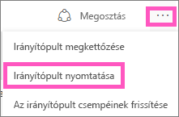
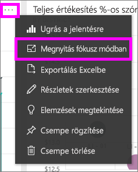
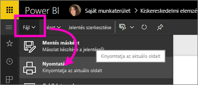

# Nyomtatás a Power BI-ból
Útmutató teljes irányítópultok, irányítópult-csempék, jelentésoldalak, jelentés-vizualizációk Power BI-ból történő nyomtatásához. A jelentésekből alkalmanként csak egy oldal nyomatható ki, a teljes jelentést nem lehet egyszerre kinyomtatni.

> [!NOTE]
> A nyomtatás csak a Power BI szolgáltatásból érhető el, a Power BI Desktopból nem.
> 
> 

Tekintse meg, hogyan nyomtat Amanda irányítópultjáról, illetve jelentéséből. Ezután a videó alatti részletes útmutatást követve próbálja ki a látottakat Ön is.

<iframe width="560" height="315" src="https://www.youtube.com/embed/jtlLGRKBvXY" frameborder="0" allowfullscreen></iframe>

## Irányítópult nyomtatása
1. Nyissa meg azt az irányítópultot, amelyet ki szeretne nyomtatni.
2. A jobb felső sarokban kattintson a három pontra (...), és válassza az **Irányítópult nyomtatása** lehetőséget.
   
    
3. Ekkor megjelenik a böngésző Nyomtatás ablaka. Adja meg a beállításokat és a nyomtatási célt, majd válassza a **Nyomtatás** elemet.
   
   > [!NOTE]
   > Az, hogy milyen nyomtatási párbeszédablak jelenik meg attól függ, hogy milyen böngészőt használ.
   > 
   
    

## Irányítópult-csempe nyomtatása
1. A három pontra, majd a Fókusz ikonra  kattintva [nyissa meg a csempét fókusz módban](service-focus-mode.md).
   
    
2. A felső navigációs sáv teljes képernyő ikonjára  kattintva nyissa meg a csempét [teljes képernyős módban](service-fullscreen-mode.md).
3. A kurzort a csempe fölé húzva jelenítheti meg a válaszható lehetőségek menüjét.
   
    
4. Kattintson a Nyomtatás ikonra   .     
   
   > [!NOTE]
   > Az, hogy milyen nyomtatási párbeszédablak jelenik meg attól függ, hogy milyen böngészőt használ.
   > 
   > 

## Jelentésoldal nyomtatása
A jelentésekből egyszerre egy oldal nyomtatható ki.

1. Nyissa meg a jelentést Olvasás nézetben vagy Szerkesztés nézetben.
2. Az aktuális jelentésoldal nyomtatásához kattintson a **Fájl** > **Nyomtatás** lehetőségre.
   
    
3. Ekkor megjelenik a böngésző Nyomtatás ablaka.
   
   > [!NOTE]
   > Az, hogy milyen nyomtatási párbeszédablak jelenik meg attól függ, hogy milyen böngészőt használ.
   > 
   > 

## Jelentés-vizualizáció nyomtatása
1. A kurzort a csempe fölé húzva, majd jobb felső sarokban látható Fókusz ikonra  kattintva [nyissa meg a vizualizációt fókusz módban](service-focus-mode.md).
2. Hajtsa végre a *Jelentésoldal nyomtatása* részben fentebb leírt 2. és 3. lépést.

## Megfontolandó szempontok és hibaelhárítás
* Kérdés: Nem található a **Nyomtatás** gomb.    
* Válasz: Ha a Power BI Desktopot használja, a nyomtatás nem támogatott.  A nyomtatás csak a Power BI szolgáltatásban érhető el.
* Kérdés: Nem nyomtatható ki a jelentés minden lapja egyszerre.    
* Válasz: Ez nem hiba. A jelentésekből egyszerre csak egy oldal nyomtatható ki.
* Kérdés: Nem lehet PDF-fájlba nyomtatni.    
* Válasz: Ez a lehetőség csak akkor jelenik meg, ha böngészőjéhez már beállított egy PDF-illesztőprogramot.    
* Kérdés: A **Nyomtatásra** kattintás után nem az itt bemutatott képernyő jelenik meg.    
* Válasz: A Nyomtatási képernyők böngészőnként és szoftververziónként változnak.
* Kérdés: A nyomtatásra kerülő anyag nincs megfelelően méretezve.  Az irányítópult nem fér el az oldalon. Méretezéssel és tájolással kapcsolatos egyéb problémák.    
* Válasz: Nem tudjuk garantálni, hogy a nyomtatott példány pontosan meg fog egyezni azzal, ami a Power BI szolgáltatásban látható. A kicsinyítést és nagyítást, a margókat, a megjelenítési részleteket, a tájolást és a méretet nem a Power BI szolgáltatás vezérli. Az ilyen kérdésekkel kapcsolatban a böngésző súgójában találhat információt.      

## További lépések
[Irányítópultok és jelentések megosztása munkatársakkal és más személyekkel](service-share-dashboards.md)

További kérdései vannak? [Kérdezze meg a Power BI közösségét](http://community.powerbi.com/)

