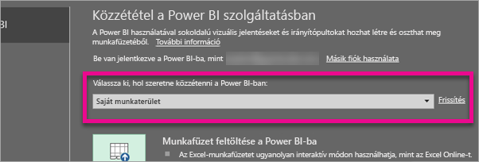
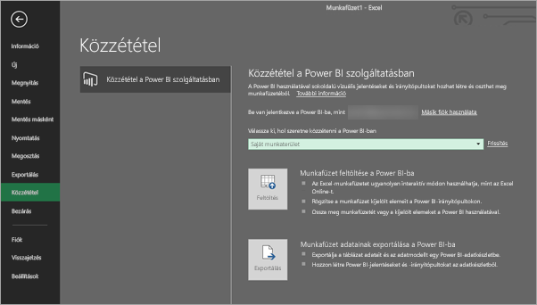
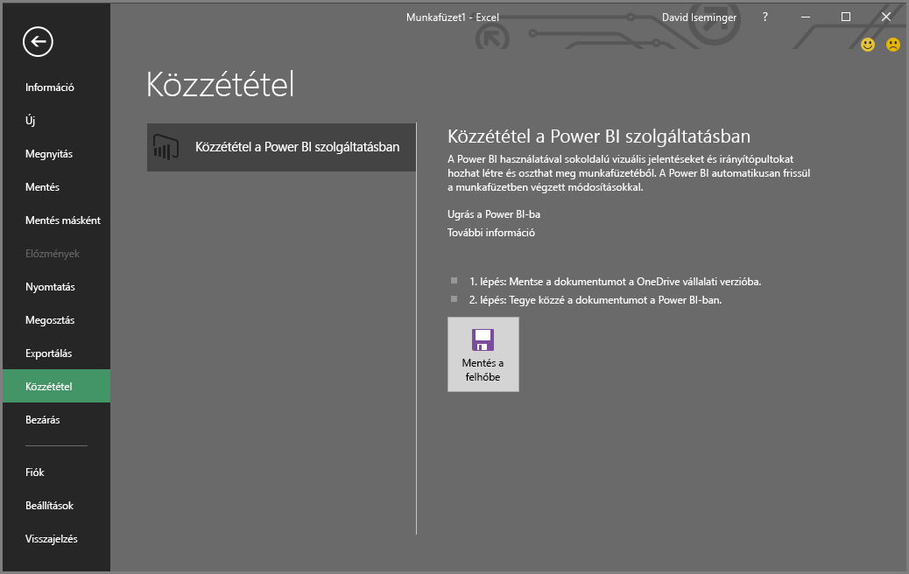
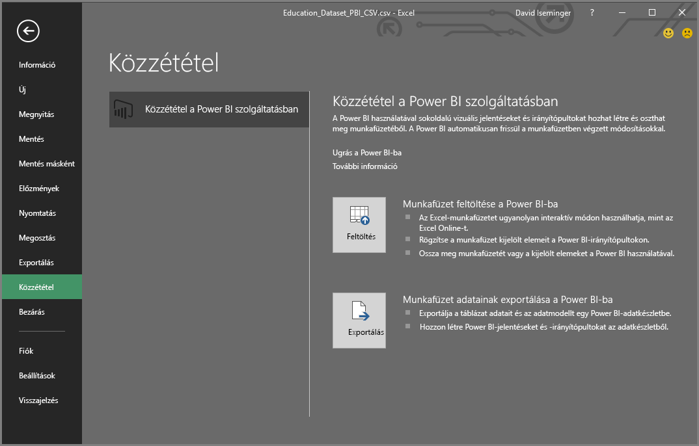

# Közzététel Excel 2016-ból a Power BI-ba
Az Excel 2016-tal közvetlenül [Power BI](https://powerbi.microsoft.com)-oldalára teheti közzé Excel-munkafüzeteit, ahol könnyen használható jelentéseket és irányítópultokat készíthet a munkafüzet adatai alapján. Az elemzés eredményeit aztán megoszthatja másokkal is a cégén belül.

Néhány dolog, amivel tisztában kell lennie, mielőtt továbbhalad:

* A Power BI-ba történő közzététel előtt mentenie kell a munkafüzetet a OneDrive Vállalati verziójára.
* Az Office-ba, a OneDrive Vállalati verziójába és a Power BI-ba ugyanazzal a fiókkal kell bejelentkeznie.
* Nem tehet közzé üres munkafüzetet vagy olyat, amelyben nincs a Power BI által támogatott tartalom.
* Nem tehet közzé titkosított vagy jelszóval védett, vagy az Information Protection felügyelete alatt álló munkafüzeteket.
* A Power BI-ba való közzététel feltétele a modern hitelesítés engedélyezése (alapértelmezés). Ha le van tiltva, akkor a Közzététel lehetőség nem érhető el a Fájl menüben.

## Excel-munkafüzet közzététele
Az Excelben válassza a **Fájl** > **Közzététel** lehetőséget.

### Helyi fájl közzététele
A 2017. februári frissítéstől kezdve az Excel 2016 támogatja a helyi Excel-fájlok közzétételét. Nem kell feltétlenül a OneDrive Vállalati verziójára vagy a SharePoint Online-ba menteni őket.

> [!IMPORTANT]
> A helyi fájlok közzétételének lehetősége csak az Excel 2016-ban és Office 365-előfizetéssel elérhető. Az önálló telepítésű Excel 2016-ban továbbra is csak a hagyományos "Közzététel" működik, amelyhez a fájlokat a OneDrive Vállalati verziójára vagy a SharePoint Online-ba kell menteni.
> 
> 

A **Közzététel** lehetőség használatakor megadhatja a közzététel céljául kiválasztott munkaterületet. Ez lehet személyes vagy csoport-munkaterület is, amelyhez hozzáférése van.

A munkafüzet tartalmát kétféle módon juttathatja el a Power BI-ba.

A közzététel után másolatként, az eredeti fájltól elkülönülve lesz tárolva a Power BI-ban. Ha frissíteni kívánja a Power BI-ban lévő fájlt, akkor újra közzé kell tennie az újabb verziót. Frissítheti az adatokat, és ütemezett frissítést állíthat be a Power BI-beli munkafüzethez vagy az adatkészlethez.

### Közzététel önálló telepítésű Excelből
Ha a munkafüzete még nincs kimentve a OneDrive-ra, akkor először mentenie kell. Válassza a Mentés a felhőbe lehetőséget, és jelöljön ki egy helyet a OneDrive Vállalati verzióján.

Miután kimentette a munkafüzetet a OneDrive-ra, a **Közzététel** lehetőség használatakor választhat a munkafüzetnek Power BI-ba való feltöltésének két módja közül.

#### Munkafüzet feltöltése a Power BI-ba
Ezt a lehetőséget választva a munkafüzet ugyanúgy jelenik meg a Power BI felületén, ahogyan az Excel Online-ban jelenne meg. Az Excel Online-tól eltérően azonban itt nagyszerű funkciók segítenek a munkalap elemeinek az irányítópultokon való rögzítésében.

A Power BI-ban megnyitott munkafüzet nem szerkeszthető. Ha módosítania kell, akkor válassza a **Szerkesztés** lehetőséget, majd szerkessze a munkafüzetet az Excel Online-ban, vagy nyissa meg a számtógépén az Excelben. A módosításai a OneDrive-on található munkafüzetbe lesznek mentve.

Feltöltéskor a Power BI-ban nem jön létre adatkészlet. A munkafüzet a Jelentések között jelenik meg a munkaterület navigációs paneljén. A Power BI-ba feltöltött munkafüzetekhez különleges Excel-ikon tartozik, amelyről felismerhető, hogy feltöltött Excel-munkafüzetek.

Akkor válassza ezt a lehetőséget, ha az adatai csak munkalapokon helyezkednek el, vagy kimutatásai és diagramjai vannak, amelyeket látni szeretne a Power BI-ban.
Az Excelből Power BI-ba való közzététel Feltöltés változatának használata szinte mindenben megegyezik a böngészőben használt Power BI Adatok beolvasása > Fájl > OneDrive Vállalati verzió > Excel-adatok elérése, kezelése és megtekintése a Power BI-ban lehetőségével.

#### Munkafüzet adatainak exportálása a Power BI-ba
Ezt a lehetőséget választva a táblázatokban és/vagy adatmodellekben lévő valamennyi támogatott adat új Power BI-adatkészletbe lesz exportálva. A Power View nézetet tartalmazó munkalapok újra létrejönnek a Power BI-ban, mint jelentések.

A munkafüzetet továbbra is szerkesztheti. Amikor menti a változtatásokat, azok általában egy órán belül szinkronizálódnak a Power BI-beli adatkészlettel. Ha gyorsabban érvényesíteni szeretné a változtatásait, akkor használhatja újra a Közzététel lehetőséget, és azonnal exportálhatja a változásokat. A jelentésekben és irányítópultokon lévő vizualizációk is frissülnek.

Akkor válassza ezt a lehetőséget, ha a Beolvasás és átalakítás lehetőséggel vagy a Power Pivot bővítménnyel töltött be adatokat egy adatmodellbe, vagy ha a munkafüzete Power View nézetet tartalmazó munkalapjain a Power BI-ben megjeleníteni kívánt vizualizációk vannak.

Az Excelből Power BI-ba való közzététel Exportálás változatának használata szinte mindenben megegyezik a böngészőben használt Power BI Adatok beolvasása > Fájl > OneDrive Vállalati verzió > Excel-adatok exportálása a Power BI-ba lehetőségével.

## Közzététel
Bármelyik utat is választja, az Excel bejelentkezik a Power BI-ba az Ön aktuális fiókjával, majd közzéteszi a munkafüzetét a Power BI-oldalán. Tartsa szemmel az Excel állapotsávját. Ott nyomon követhető a folyamat előrehaladása.

Amikor elkészült, az Excelből közvetlenül átléphet a Power BI-ba.

## További lépések
[Excel-adatok a Power BI-ban](service-excel-workbook-files.md)  
További kérdései vannak? [Kérdezze meg a Power BI közösségét](http://community.powerbi.com/)

