# Webes közzététel a Power BI-ból
A Power BI **Webes közzététel** lehetőségével egyszerűen ágyazhat be interaktív Power BI-vizualizációkat online, például blogbejegyzésekbe, weboldalakba, e-mailen vagy közösségi médián keresztül, bármilyen eszközön.

A közzétett vizualizációkat egyszerűen szerkesztheti vagy frissítheti, vagy akár vissza is vonhatja a megosztást.

> [!WARNING]
> A **Webes közzététel** használatával közzétett jelentést vagy vizualizációt bárki megtekintheti az Interneten. A jelentések megtekintésekor nincs hitelesítés. A Webes közzétételt csak olyan jelentések és adatok esetén használja, amelyeket az Interneten bárki számára (hitelesítés nélkül) láthatóvá kíván tenni. Ez a részletes adatokra is vonatkozik, amelyeket a jelentéseiben összegez. A jelentés közzététele előtt ellenőrizze, hogy jogában áll-e nyilvánosan megosztani az adatokat és vizualizációkat. Bizalmas vagy szellemi tulajdont képező információt ne tegyen közzé. Ha bizonytalan, akkor a közzététel előtt ellenőrizze a cég szabályzatait.
> 
> [!IMPORTANT]
> A Power BI-rendszergazdák a Felügyeleti portálon letilthatják a Webes közzététel lehetőségét a felhasználók számára. A **Bérlői beállítások**on belül állítsa a **Webes közzététel** kapcsolót **Ki** helyzetbe. Ez a beállítás a teljes bérlőre vonatkozik. További információ: [Power BI felügyeleti portál](service-admin-portal.md).
> 
> 

## A Webes közzététel használata
A **Webes közzétételt** a személyes vagy csoport-munkaterületein lévő, Ön által szerkeszthető jelentésekhez érheti el.  Nem használhatja a Webes közzétételt az Önnel megosztott, vagy az adatbiztonságot sorszintű védelemmel biztosító jelentéseknél. A lenti **Korlátozások** szakasz tartalmazza azoknak az eseteknek a teljes listáját, amelyeknél a Webes hozzátétel nem támogatott. A Webes közzététel használata előtt olvassa el figyelmesen a **Figyelmeztetést** a cikk elején.

A funkció működését megtekintheti a következő *rövid videóban*. A következő lépéseket követve Ön is kipróbálhatja.

<iframe width="560" height="315" src="https://www.youtube.com/embed/UF9QtqE7s4Y" frameborder="0" allowfullscreen></iframe>

A következő útmutató a **Webes közzététel** használatát ismerteti.

1. Egy a munkaterületén lévő, Ön által szerkeszthető jelentésen válassza a **Fájl > Webes közzététel** lehetőséget.
   
   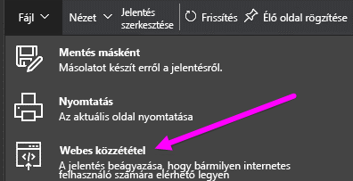
2. Olvassa el a párbeszédpanel szövegét, majd válassza a **Beágyazási kód létrehozása** lehetőséget, ahogyan az alábbi ábra mutatja.
   
   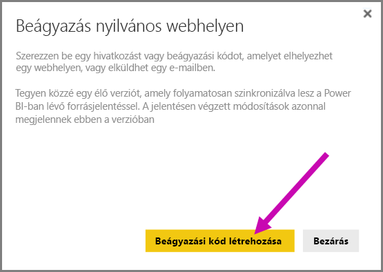
3. Olvassa el a következő párbeszédpanelen álló figyelmeztetést, és ellenőrizze, hogy az adatok szabadon beágyazhatók-e egy nyilvános weboldalba. Ha így van, akkor válassza a **Közzététel** lehetőséget.
   
   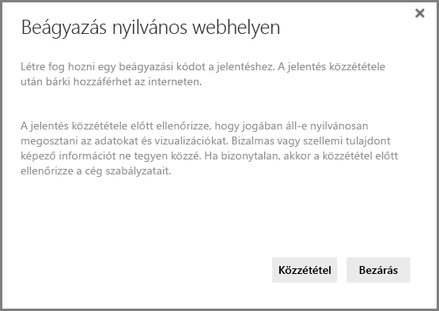
4. Újabb párbeszédpanel jelenik meg, amely megad egy e-mailben továbbítható vagy kódba (például iFrame) beépíthető hivatkozást, és egy másikat, amelyet közvetlenül beilleszthet a weboldalra vagy a blogba.
   
   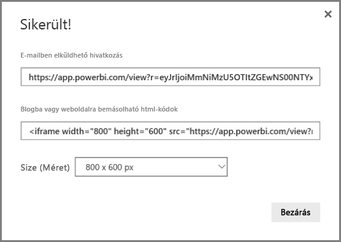
5. Ha már korábban létrehozta a jelentés beágyazási kódját, akkor a kód gyorsan megjelenik. Jelentésenként csak egy beágyazási kód hozható létre.
   
   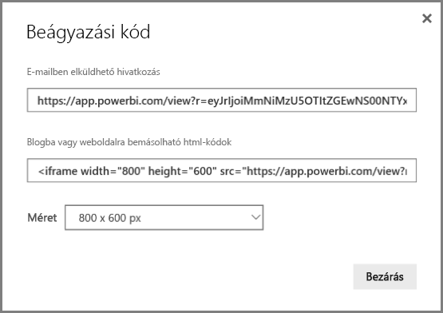

## Tippek és trükkök különböző Megtekintési módokhoz
Amikor egy blogbejegyzésbe ágyaz be tartalmat, akkor annak általában egy adott méretű képernyőn kell elférnie.  Az iFrame-címkében a magasságot és a szélességet is igény szerint beállíthatja, de arról is gondoskodnia kell, hogy a jelentés elférjen az iFrame-keret egy adott részén, ezért a jelentés szerkesztésekor be kell állítania a megfelelő Megtekintési módot.

A következő táblázat a Megtekintési módokat és azok beágyazott megjelenését ismerteti.

| Megtekintési mód | Beágyazott megjelenés |
| --- | --- |
|  |Az **oldalhoz igazítás** a jelentés magasságát és szélességét veszi figyelembe. Ha az oldalt 'Dinamikus', például 16:9 vagy 4:3 képarányúra állította be, akkor a tartalom úgy méreteződik át, hogy illeszkedjen a megadott iFrame-keretbe. iFrame-keretbe ágyazva az **oldalhoz igazítás** eredményeként **üres sávok**, szürke hátterű területek jelenhetnek meg a tartalom mellett, miután az átméreteződik, hogy illeszkedjen a keretbe. Az üres sávok eltüntetéséhez állítsa át az iFrame-keret magasságát/szélességét a megfelelő értékre. |
| 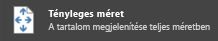 |A **tényleges méret** módban a jelentés megtartja a jelentésoldalon megadott méretét. Emiatt az iFrame-keretben görgetősávok jelenhetnek meg. A görgetősávok megjelenése az iFrame-keret magasságának és szélességének beállításával előzhető meg. |
|  |A **szélességhez igazítás** beállítás biztosítja, hogy a tartalom vízszintesen kitöltse az iFrame-keretet. A szegély látható marad, de a tartalom úgy méreteződik át, hogy vízszintesen kitöltse a rendelkezésre álló területet. |

## Tippek és trükkök az iFrame magasság- és szélesség-beállításaihoz
A Webes közzététel után kapott beágyazási kód a következőhöz lesz hasonló:

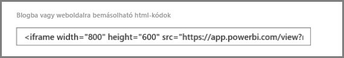

A szélességét és magasságát manuálisan is módosíthatja, hogy pontosan a kívánt módon illeszkedjen az oldalba, amelybe beágyazza.

A legjobb illeszkedés érdekében megpróbálhat 56 képpontot hozzáadni az iFrame-keret magasságához. Ezen éppen elfér a jelenlegi méretű alsó sáv. Ha a jelentésoldala dinamikus méretezést használ, akkor az alábbi táblázatban talál néhány üres sávok nélküli illeszkedést biztosító méretet.

| Képarány | Nagyság | Méret (szélesség × magasság) |
| --- | --- | --- |
| 16:9 |Kicsi |640 × 416 képpont |
| 16:9 |Közepes |800 × 506 képpont |
| 16:9 |Nagy |960 × 596 képpont |
| 4:3 |Kicsi |640 × 536 képpont |
| 4:3 |Közepes |800 × 656 képpont |
| 4:3 |Nagy |960 × 776 képpont |

## Beágyazott kódok kezelése
Miután létrehozott egy **Webes közzétételi** beágyazási kódot, a kódokat a Power BI szolgáltatás **Beállítások** menüjében tudja kezelni. A beágyazási kódok kezeléséhez tartozik a kód által hivatkozott vizualizáció vagy jelentés eltávolítása (ez használhatatlanná teszi a beágyazási kódot), vagy a beágyazási kód ismételt lekérése.

1. A **Webes közzétételi** beágyazási kódok kezeléséhez nyissa meg a **Beállítások** fogaskerék-ikont, és válassza a **Beágyazási kódok kezelése** lehetőséget.
   
   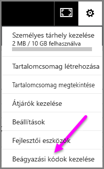
2. Megjelenik a létrehozott beágyazási kódok listája, ahogyan a következő ábra mutatja.
   
   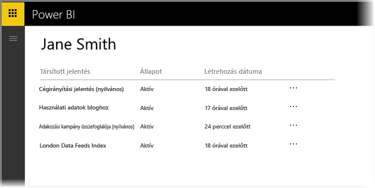
3. A listában szereplő **Webes közzétételi** beágyazási kódok mindegyikéhez újra lekérheti a beágyazási kódot vagy törölheti azt. Az utóbbi esetben az érintett jelentésre vagy vizualizációra mutató hivatkozások többé nem működnek.
   
   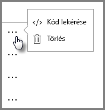
4. Ha a **Törlés** lehetőséget választja, akkor a rendszer rákérdez, hogy valóban törölni szeretné-e a beágyazott kódot.
   
   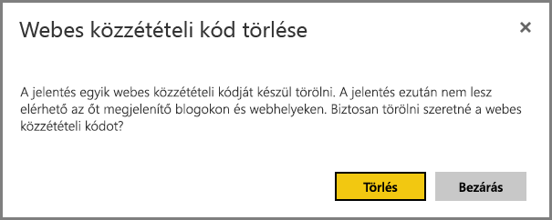

## Jelentések és adatok frissítése
A **Webes közzétételi** beágyazási kód létrehozása és megosztása után a jelentésben minden Ön által végzett változtatás frissülni fog. Fontos azonban tudni, hogy eltarthat egy ideig, mire a frissítés a felhasználóknál is megjelenik. Egy jelentés vagy vizualizáció módosításai körülbelül egy óra elteltével jelennek meg a Webes közzétételi beágyazási kódokban.

Amikor először használja a **Webes közzététel** lehetőséget beágyazási kód létrehozásához, a hivatkozás azonnal aktív lesz, és megtekinthető bárki számára, aki megnyitja.  A Webes közzétételi beágyazási kódok által hivatkozott jelentések vagy vizualizációk első webes közzététel utáni módosításai körülbelül egy óra elteltével lesznek láthatók a felhasználók számára.

További tudnivalókat ennek a cikknek a **Hogyan működik?** című szakaszában talál. Ha a frissítéseknek azonnal elérhetőknek kell lenniük, akkor törölheti a beágyazási kódot, és létrehozhat egy újat.

## Adatfrissítés
Az adatfrissítések automatikusan megjelennek a beágyazott jelentésben vagy vizualizációban. A frissített adatok körülbelül egy óra elteltével lesznek láthatók a beágyazási kódokon keresztül. Az automatikus frissítést le is tilthatja, ha a **ne frissüljön** lehetőséget választja a jelentés által használt adatkészlet ütemezésénél.  

## Egyéni vizualizációk
A **Webes közzététel** az egyéni vizualizációkat is támogatja. A Webes közzététel használatakor azoknak a felhasználóknak, akik megosztják az Ön által közzétett vizualizációt, nem kell engedélyezniük az egyéni vizualizációkat a jelentés megtekintéséhez.

## Korlátozások
A Power BI szolgáltatás adatforrásainak és jelentéseinek túlnyomó többsége esetén támogatott a **Webes közzététel**, a következők azonban nem támogatottak és nem elérhetők Webes közzététellel:

1. Sorszintű biztonságot használó jelentések.
2. Helyszínen üzemeltetett, Analysis Services táblázatos modellt használó jelentések.
3. Közvetlenül Önnel vagy céges tartalomcsomagon keresztül megosztott jelentések.
4. Olyan csoporthoz tartozó jelentések, amelynek ön nem szerkesztési joggal bíró tagja.
5. Az "R" vizualizációk Webes közzétételű jelentésekben jelenleg nem támogatottak.

## A beágyazási kód állapota oszlop ismertetése
A **Webes közzétételi** beágyazási kódokat tartalmazó **Beágyazási kódok kezelése** oldalon egy állapot oszlop is szerepel. A beágyazási kódok alapértelmezés szerint aktívak, de az alábbi állapotok bármelyike előfordulhat.  

| Állapot | Leírás |
| --- | --- |
| **Aktív** |A jelentés elérhető, megtekinthető és használható a felhasználók számára az Interneten. |
| **Blokkolva** |A jelentés tartalma sérti a [Power BI szolgáltatási feltételeit](https://powerbi.microsoft.com/terms-of-service). A Microsoft blokkolta. Ha úgy véli, hogy a tartalom blokkolása indokolatlan, akkor lépjen kapcsolatba a támogatási szolgálattal. |
| **Nem támogatott** |A jelentés adatkészlete sorszintű biztonságot vagy más nem támogatott konfigurációt használ. A teljes listát a **Korlátozások** című szakaszban találja. |

## Webes közzététel tartalmával kapcsolatos észrevétel jelentése
Egy **Webes közzététel** útján egy weboldalba vagy blogba beágyazott tartalommal kapcsolatos észrevételét úgy jelentheti be, hogy az alsó sávnak az ábrán jelölt **zászló** ikonjára kattint. A rendszer felkéri, hogy küldjön az észrevételt leíró e-mailt a Microsoftnak. A Microsoft a Power BI szolgáltatási feltételei alapján értékeli a tartalmat, és megteszi a megfelelő lépéseket.

Észrevétel bejelentéséhez használja a megtekintett webes közzétételű jelentés alsó sávján lévő **zászló** ikont.

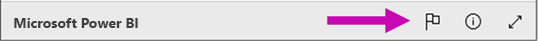

## Licencelés és Díjszabás
A **Webes közzétételt** csak Microsoft Power BI-felhasználók használhatják. A jelentés felhasználóinak (olvasók, nézők) nem kell Power BI-felhasználóknak lenniük.

## Hogyan működik? (technikai részletek)
Amikor a **Webes közzététel** használatával beágyazott kódot állít elő, akkor a jelentés láthatóvá válik a felhasználók számára az Interneten. Nyilvánosan elérhető, tehát számítani lehet rá, hogy a megtekintői egyszerűen meg tudják majd osztani a jelentést a közösségi médiában. Amikor a felhasználók a közvetlen nyilvános URL-cím megnyitásával vagy egy weboldalba vagy blogba beágyazottan megtekintik a jelentést, akkor a Power BI gyorsítótárazza a jelentés definícióját és a jelentés megtekintéséhez szükséges lekérdezések eredményeit. Ezen a módon a jelentést egyidejűleg több ezer felhasználó is megtekintheti a teljesítmény romlása nélkül.  

A gyorsítótár hosszú ideig megőrzi a tartalmát, ezért ha Ön módosítja a jelentés definícióját (ha például megváltoztatja a megtekintési módját), akkor a módosítások körülbelül egy óra elteltével lesznek láthatók a jelentésnek a felhasználók által megtekintett verziójában. Éppen ezért ajánlott előre elkészíteni a munkáját, és a **Webes közzétételi** beágyazási kódot csak akkor létrehozni, amikor már elégedett a beállításokkal.

További kérdései vannak? [Felteheti őket a Power BI-közösségnek](http://community.powerbi.com/)

