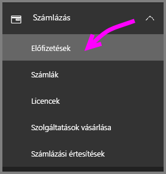
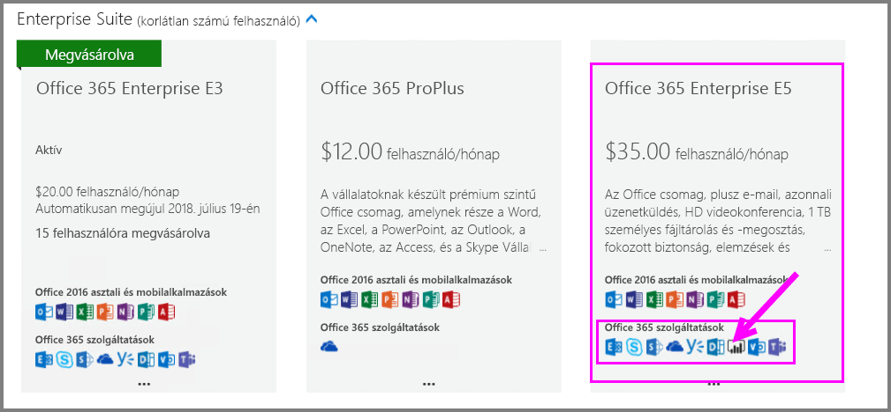
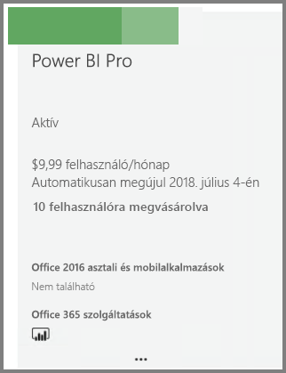
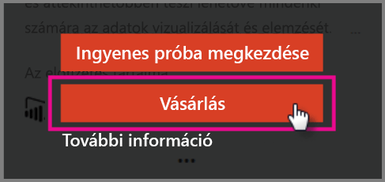
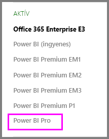

# A Power BI Pro megvásárlása

A Power BI Pro szolgáltatással tehet közzé jelentéseket, oszthat meg irányítópultokat, együttműködhet a munkatársaival a munkaterületeken, és más hasonló tevékenységeket is végezhet. Ha szeretne többet megtudni arról, hogy a Power BI Pro miként segíti szervezete munkáját, olvassa el [A Power BI Pro használata a szervezetben](service-power-bi-pro-in-your-organization.md) című témakört.

## A Power BI Pro megvásárlása az Office 365 Felügyeleti központból

Az Office-rendszergazdák megvásárolhatják a Power BI Pro szolgáltatást az Office 365 Nagyvállalati E5 csomagra szóló előfizetés részeként, illetve különálló Power BI Pro-előfizetésként is. A vásárlás után hozzárendelheti a Power BI Pro-licenceket a kívánt felhasználókhoz. További információ a licenc-hozzárendelésről: [Licencek hozzárendelése a felhasználókhoz az Office 365 szolgáltatásban](https://support.office.com/en-us/article/assign-licenses-to-users-in-office-365-for-business-997596b5-4173-4627-b915-36abac6786dc?ui=en-US&rs=en-US&ad=US).

Ha Ön Office-rendszergazda, kövesse az alábbi lépéseket a Power BI Pro megvásárlásához:

1. Keresse fel az [Office 365 Felügyeleti központot](https://portal.office.com/adminportal/home#/homepage).
2. A bal oldali navigációs panelen válassza a Számlázás, majd az Előfizetések lehetőséget.

    

3. Kattintson az „Előfizetések felvétele” gombra az Előfizetések lap jobb felső sarkában.

    

4. Keresse meg a kívánt előfizetési ajánlatot:

    Válassza a „Nagyvállalati csomag” csoportban az „Office 365 Nagyvállalati E5 csomag” lehetőséget.

    

    Válassza az „Egyéb csomagok” csoportban a „Power BI Pro” lehetőséget.

    

5. Mutasson a kívánt előfizetéshez tartozó három pontra (…), és válassza a Vásárlás lehetőséget.

    

6. Válassza a „Fizetés havonta” vagy a „Fizetés egy teljes évre” lehetőséget a számlázási igényeinek megfelelően.
7. A „Hány felhasználóra van szüksége?” területen adja meg a licencek kívánt számát, válassza a „Fizetés most” vagy a „Kosárba” lehetőséget, majd fejezze be a tranzakciót.
8. Ellenőrizze, hogy a beszerzett előfizetés megjelenik-e az Előfizetések lap listájában.

   

> [!NOTE]
> Az első vásárlás után tud további licenceket is hozzáadni. Válassza a Power BI Pro előfizetést az Előfizetések lapon, majd kattintson a „Licencek hozzáadása/eltávolítása” hivatkozásra.
>

## Díjszabás

A díjszabással kapcsolatos legújabb információkért tekintse át a [Power BI díjszabásának lapját](https://powerbi.microsoft.com/en-us/pricing/).

## Következő lépések
[Önkiszolgáló regisztráció a Power BI-ra](service-admin-signing-up-for-power-bi-with-a-new-office-365-trial.md)
 
[A Power BI (ingyenes) a vállalatában](service-admin-service-free-in-your-organization.md)
 
[A Power BI Pro használata a szervezetben](service-power-bi-pro-in-your-organization.md)
 
[A Pro meghosszabbított próbaverziójának aktiválása](service-extended-pro-trial.md)
 
[Power BI Pro-licencek felhasználókhoz rendelése](service-assigning-power-bi-pro-licenses.md)
 
[Power BI Premium – pontosan mi is ez?](service-admin-premium-manage.md)
 
[A Power BI Premium megvásárlása](service-admin-premium-purchase.md)
 
[Power BI Premium-tanulmány](https://aka.ms/pbipremiumwhitepaper)

További kérdései vannak? [Kérdezze meg a Power BI közösségét](https://community.powerbi.com/)