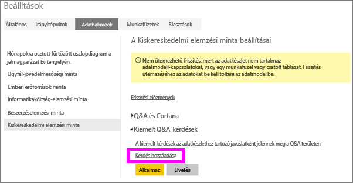
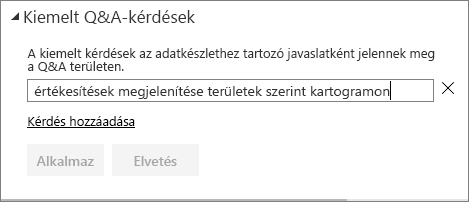
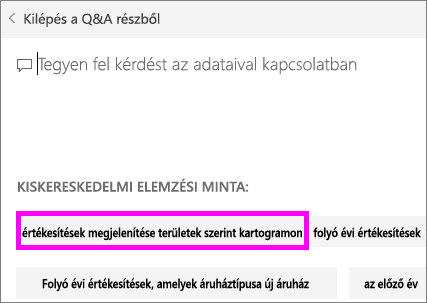
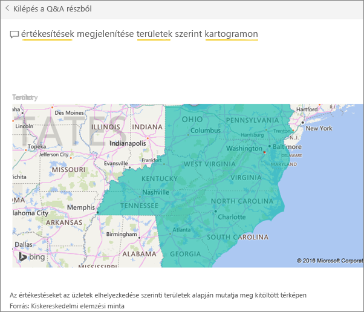

# Kiemelt kérdések létrehozása a Power BI Q&A-hez
Ha rendelkezik saját adatkészlettel, ehhez az adatkészlethez hozzáadhatja a kiemelt kérdéseit.  A Power BI Q&A pedig megjeleníti ezeket a kérdéseket az adatkészletet használó (más néven *fogyasztó*) munkatársaknak.  A kiemelt kérdések ötleteket adnak a munkatársaknak, hogy milyen típusú kérdéseket lehet feltenni az adatkészletről. Ön dönti el, milyen kérdéseket vesz fel. Vegyen fel népszerű kérdéseket, érdekes eredményeket megjelenítő kérdéseket vagy esetleg nehezen megfogalmazható kérdéseket.

Nézze meg, hogyan ad hozzá Will kiemelt kérdéseket a Power BI Q&A-hez, majd hogyan használja ezeket az adatkészlet feltárására. Ezután a videó alatt látható részletes utasításokat követve próbálkozzon meg a feladat elvégzésével.

<iframe width="560" height="315" src="https://www.youtube.com/embed/E1mIAyEXuF4" frameborder="0" allowfullscreen></iframe>

> [!NOTE]
> A Q&A kiemelt kérdések funkciója az [iOS-hez készült Microsoft Power BI-alkalmazásban iPadeken, iPhone-okon, és iPod Touch eszközökön](consumer/mobile/mobile-apps-ios-qna.md), illetve a Q&A a Power BI Desktophoz készült előzetes verziójában is elérhető. A kérdések létrehozása viszont kizárólag a Power BI szolgáltatásban (az app.powerbi.com webhelyen) érhető el.
> 

Ebben a cikkben a [Kiskereskedelmi értékesítési elemzési mintát](sample-datasets.md) használjuk.

1. Az irányítópulton válassza a Q&A kérdésmezőjét.   Figyelje meg, hogy a Q&A már most is segítséget nyújt az adatkészletben előforduló kifejezések listájának megjelenítésével.
2. A lista bővítéséhez kattintson a fogaskerék ikonra a Power BI jobb felső sarkában.  
   
3. Válassza a **Beállítások** &gt; **Adatkészletek** &gt; **Kiskereskedelmi elemzési minta** &gt; **Kiemelt Q&A-kérdések lehetőséget**.  
4. Kattintson a **Kérdés hozzáadása** hivatkozásra.
   
   
5. Írja be a kérdést a szövegmezőbe, és kattintson az **Alkalmaz** gombra.   Másik kérdést is hozzáadhat, ha a **Kérdés hozzáadása** lehetőséget választja.  
   
6. Térjen vissza a Kiskereskedelmi elemzési minta Power BI-irányítópultjára, és vigye a kurzort a Q&A kérdésmezőbe.   
   
7. A listában az első az új kiemelt kérdés, **Sales by territory as a map** (Értékesítések területenként, térképen). Jelölje ki.  
8. A válasz kitöltött térkép-vizualizációként jelenik meg.  
   

### Következő lépések
[Q&A a Power BI-ban](power-bi-q-and-a.md)  
[Oktatóanyag: Bevezetés a Power BI Q&A használatába](power-bi-visualization-introduction-to-q-and-a.md)  
[Power BI – Alapfogalmak](service-basic-concepts.md)  
További kérdései vannak? [Kérdezze meg a Power BI közösségét](http://community.powerbi.com/)

