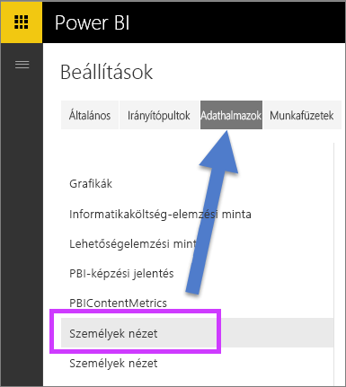
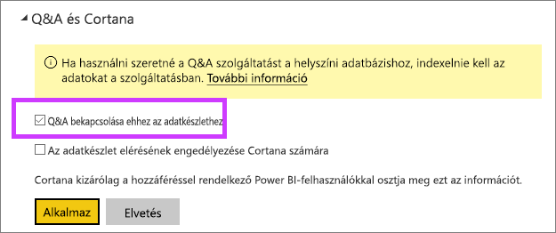

# Q&A engedélyezése élő kapcsolatokhoz
## Mi az a helyszíni adatátjáró?  Mi az az élő kapcsolat?
A Power BI-ban az adatkészletek importálhatók, vagy létrehozhat hozzájuk élő kapcsolatot. Az élő kapcsolattal rendelkező adatkészletekre gyakran „helyszíni”-ként utalnak. Az élő kapcsolatok kezelése [átjáró](service-gateway-onprem.md) használatával történik, az adatok és kérdések oda vissza küldése pedig élő lekérdezésekkel.

## Q&A helyszíni adatátjáró-adatkészletekhez
Ha olyan adatkészleteken szeretné használni a Q&A-t, amelyeket átjárón keresztül ér el, akkor azokat először engedélyeznie kell.

Engedélyezés után a Power BI indexet hoz létre az adatforrásról, és feltölti ezeknek az adatoknak egy részét a Power BI-ba a kérdésfeltevés engedélyezéséhez. Az elsődleges index létrehozása eltarthat néhány percig, aztán a Power BI automatikusan karbantartja és frissíti az indexet az adatok változásának megfelelően. A Q&A ezeken az adatkészleteken használva ugyanúgy viselkedik, mint a Power BI-ban közzétett adatokkal. Mindkét esetben támogatott a Q&A-ben rendelkezésre álló összes funkció, többek között az adatforrás Cortanával való használata is.

Miközben kérdéseket tesz fel a Power BI-ban, a Q&A az adatkészlet indexe alapján meghatározza, milyen vizualizáció létrehozása vagy jelentéslap használata lesz a legjobb a kérdés megválaszolására. A lehetséges legjobb válasz meghatározása után a Q&A a DirectQueryt használja az adatforrás élő adatainak az átjárón keresztül történő lekérésére a diagramok és grafikonok kitöltéséhez. Ez biztosítja, hogy a Q&A-eredményekben mindig a legújabb adatok szerepeljenek, közvetlenül az alapul szolgáló adatforrásból.

Mivel a Power BI Q&A az adatforrásból származó szöveg- és sémaértékeket használja az alapul szolgáló modell lekérdezésére, a meghatározott új vagy törölt szöveges értékek keresése (például egy újonnan hozzáadott szöveges bejegyzéshez kapcsolódó ügyfélnév lekérdezése) attól függ, hogy az index naprakész-e a legújabb értékekkel. A Power BI automatikusan naprakészen tartja a szöveg- és sémaindexet a változásokat 60 percen belül követve.

További információ:

* Mi az a [helyszíni adatátjáró](service-gateway-onprem.md)?
* [Bevezetés a Power BI Q&A használatába](power-bi-q-and-a.md)

## A Q&A engedélyezése
Miután beállította az adatátjárót, kapcsolódjon az adatokhoz a Power BI-ból.  Hozzon létre egy irányítópultot a helyszíni adatokkal, vagy töltsön fel egy .pbix-fájlt, amely helyszíni adatokat használ.  Rendelkezhet már helyszíni adatokkal olyan irányítópultokban, jelentésekben és adatkészletekben is, amelyeket megosztottak Önnel.

1. Kattintson a fogaskerék ikonra  a Power BI jobb felső sarkában, majd a **Beállítások** gombra.
   
   
2. Válassza az **adatkészletek** lapfület, majd válassza ki azokat az adatkészleteket, amelyeket engedélyezni szeretne a Q&A-hez.
   
   
3. Bontsa ki a **Q&A és Cortana** területet, és jelölje be a **Q&A bekapcsolása ehhez az adatkészlethez** négyzetet, majd kattintson az **Alkalmaz** gombra.
   
    

## Milyen adatok gyorsítótárazása történik, és hogyan valósul meg az adatvédelem?
Amikor engedélyezi a Q&A-t a helyszíni adataihoz, az adatok egy részét a szolgáltatás gyorsítótárazza. Ezt azért teszi, hogy a Q&A elfogadható teljesítményt nyújtson. A 24 karakternél hosszabb értékeket a Power BI kizárja a gyorsítótárazásból. Az adatkészlet néhány órán belül törlődik, miután letiltotta a Q&A-t a **Q&A bekapcsolása ehhez az adatkészlethez** jelölőnégyzet törésével, vagy miután törli az adatkészletet.

## Megfontolandó szempontok és hibaelhárítás
A funkció előzetes kiadási fázisában van néhány korlátozás:

* Eredetileg a funkció csak az SQL Server 2016 Analysis Services táblázatos adatforrásaihoz áll rendelkezésre. A funkció táblázatos adatokkal való munkavégzésre van optimalizálva. Néhány funkció rendelkezésre áll több dimenziós adatforrásokhoz, de a teljes Q&A-élmény több dimenziós adatok esetén még nem támogatott. A helyszíni adatátjáró által támogatott további adatforrások bevezetése a későbbiekben fog történni.
* Az SQL Server Analysis Servicesben meghatározott sorszintű biztonság teljes támogatása kezdetben a nyilvános előzetes verzióban nem áll rendelkezésre. Miközben kérdéseket tesz fel a Q&A-ben, a kérdések beírása közben megjelenő automatikus kitöltési javaslatok között lehetnek olyan sztringértékek, amelyekhez a felhasználó nem rendelkezik hozzáféréssel. A modellben meghatározott RLS-t azonban tiszteletben tartja a rendszer a jelentés- és a diagramvizualizációknál, ezért nem fed fel alapul szolgáló számadatokat. Az ezt a viselkedést vezérlő beállítások az elkövetkező frissítésekben fognak szerepelni.
* Az élő kapcsolatok csak a helyszíni adatátjárónál támogatottak. Ezért személyes adatátjáróval nem használhatók.

## Következő lépések
[Helyszíni adatátjáró](service-gateway-onprem.md)  
[Az adatforrás kezelése – Analysis Services](service-gateway-enterprise-manage-ssas.md)  
[Power BI – Alapfogalmak](service-basic-concepts.md)  
[A Power BI Q&A áttekintése](power-bi-q-and-a.md)  

További kérdései vannak? [Kérdezze meg a Power BI közösségét](http://community.powerbi.com/)

