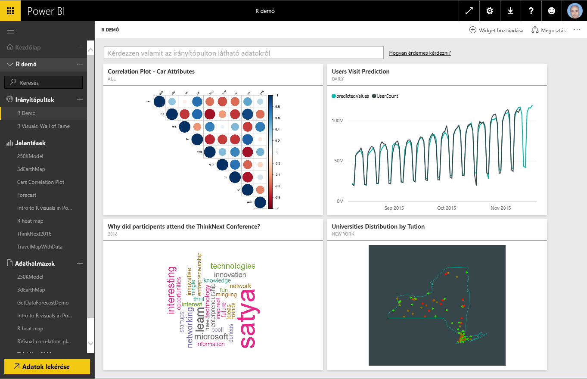
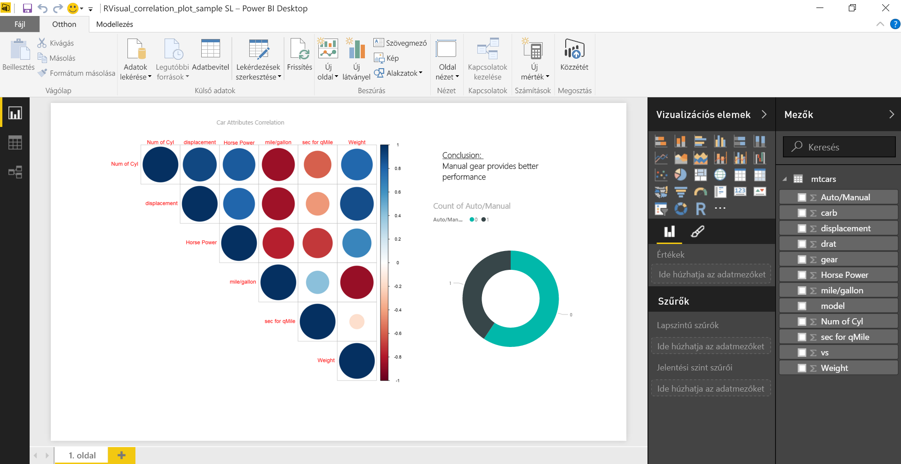
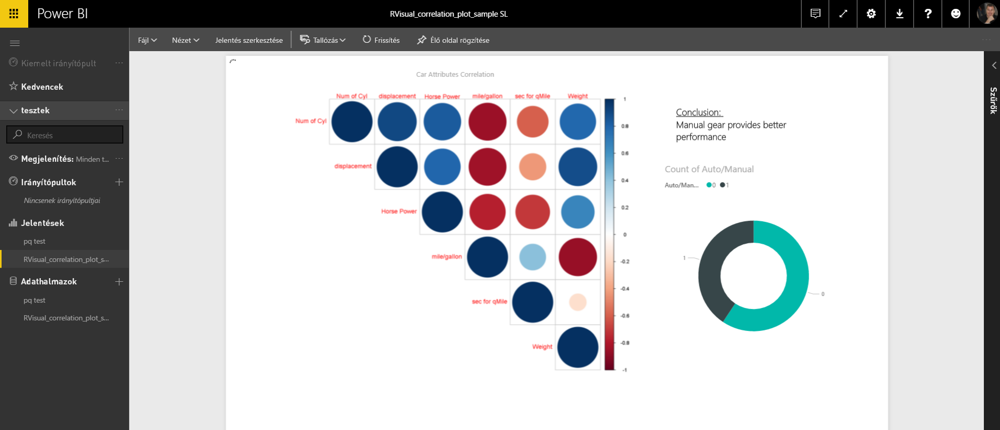
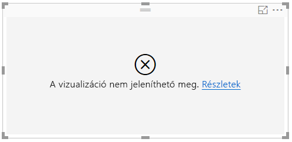
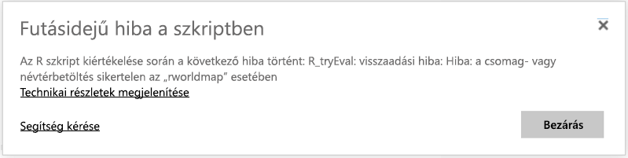
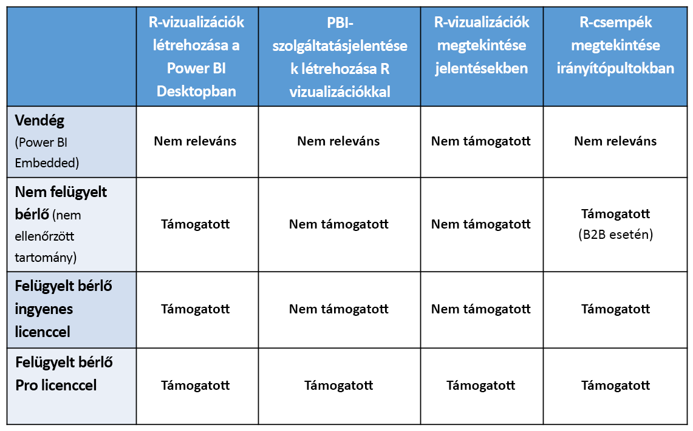

# R-vizualizációk létrehozása a Power BI szolgáltatásban
A Power BI szolgáltatás támogatja az R-parancsfájlokkal létrehozott vizualizációk megtekintését és használatát. Az R-parancsfájlokkal létrehozott, gyakran *R-vizualizációknak* nevezett vizualizációk fejlett adatformázást és elemzéseket, például előrejelzéseket kínálnak az R gazdag elemzési és megjelenítési lehetőségeinek kihasználásával.

> [!NOTE]
> Az [R programozási nyelv](https://www.r-project.org/) a statisztikusok, adatelemzők és üzleti elemzők körében legelterjedtebb programozási nyelvek egyike. Az R nyelv nyílt forráskódját gondozó közösség a széles körben használt [R User Groups](http://msdsug.microsoft.com/) mellett több mint 7000 bővítménycsomagot kínál. Az R-nek a Power BI szolgáltatással telepített verziója a következő: *Revolution R Open 3.2.2.*
> 
> 

Az alábbi ábrán egy Power BI-irányítópult látható fejlett elemzésekhez használt R-vizualizációkkal.

R-vizualizációk olyan [Power BI Desktop-jelentésekben](desktop-get-the-desktop.md) hozhatók létre, amilyen a következő képen látható.

A jelentésnek a **Power BI Desktopban** történő létrehozása után az egy vagy több R-vizualizációt tartalmazó jelentést közzéteheti a Power BI szolgáltatásban. R-vizualizációk jelenleg csak a **Power BI Desktopban** hozhatók létre és tehetők közzé a Power BI szolgáltatásban. R-vizualizációk létrehozásáról a [Power BI-vizualizációk létrehozása az R használatával (Power BI Desktop)](desktop-r-visuals.md) című cikk nyújt további információt.

Vegye figyelembe, hogy a szolgáltatás nem minden R-csomagot támogat. Ennek a cikknek a végén a támogatott csomagokról szóló bekezdésben találja meg a Power BI szolgáltatás által jelenleg támogatott csomagok listáját.

Letöltheti ezt a néhány R-vizualizációt tartalmazó [Power BI Desktop mintafájlt](http://download.microsoft.com/download/D/9/A/D9A65269-D1FC-49F8-8EC3-1217E3A4390F/RVisual_correlation_plot_sample SL.pbix) (.pbix-fájl), hogy kipróbálja a működését.

A **Power BI Desktopban** létrehozott, majd a Power BI szolgáltatásban közzétett R-vizualizációk szinte mindenben a Power BI szolgáltatásbeli más vizualizációkkal azonos módon viselkednek. Használhatók, szűrhetők, szűkíthetők, irányítópultra rögzíthetők vagy megoszthatók másokkal. Irányítópultok és vizualizációk megosztásáról az [Irányítópult megosztása munkatársakkal és másokkal](service-share-dashboards.md) című cikkben talál további információt. A más vizualizációktól való egyik eltérés az, hogy az R-vizualizációk nem jeleníthetnek meg elemleírásokat és nem használhatók más vizualizációk szűrésére.

Amint a következő képen látható, az R-vizualizációk a Power BI szolgáltatásban az irányítópultokon vagy jelentésekben szinte ugyanúgy jelennek meg és viselkednek, mint bármely más vizualizáció, és a felhasználóknak nem is kell tudniuk a vizualizációt létrehozó mögöttes R-parancsfájlról.

## R-parancsfájlok biztonsága
Az R-vizualizációk R-parancsfájlokból jönnek létre, amelyek biztonsági és adatvédelmi kockázatot jelentő kódot is tartalmazhatnak.

Ez a kockázat elsősorban a szerzői szakaszban jelentkezik, amikor a parancsfájlt a szerzője futtatja a saját számítógépén.

A Power BI szolgáltatás egy *tesztkörnyezet*-technológiával védi a felhasználókat és a szolgáltatást a biztonsági kockázatoktól.

A *tesztkörnyezet* alkalmazása megkötéseket kényszerít a Power BI szolgáltatásban futó R-parancsfájlokra, például az Internet vagy az R-vizualizációk létrehozásához nem szükséges más források elérésre vonatkozóan.

## R-parancsfájlok hibakezelése
Amikor egy R-parancsfájl futása során hiba jelentkezik, az R-vizualizáció nem rajzolódik ki, és hibaüzenet jelenik meg. A hiba részleteit az alábbi képen a vásznon látható **Részletek** hivatkozáson keresztül tekintheti meg.

Újabb példaként az alábbi képen bemutatott hibaüzenet akkor jelenik meg, amikor egy R-parancsfájl helyes futása egy Azure-beli R-csomag hiánya miatt hiúsul meg.

## Licencelés
Az R-vizualizációknak [Power BI Pro](service-self-service-signup-for-power-bi.md)-licencre van szükségük a jelentésekben való megjelenéshez, frissüléshez, szűréshez és keresztszűréshez. A Power BI Pro-licencekről és az ingyenes licencektől való eltéréseikről a [Power BI Pro-tartalom – mi is ez?](service-premium.md) című cikk nyújt további információt.

A Power BI ingyenes felhasználói csak a velük megosztott csempéket használhatják. További információ: [A Power BI Pro megvásárlása](service-admin-purchasing-power-bi-pro.md).

Az alábbi táblázat az R-vizualizációk használhatóságát részletezi licencelés alapján.

## Ismert korlátozások
A Power BI-beli R-vizualizációkra vonatkozik néhány korlátozás:

* Az R-vizualizációk támogatása a következő oldalon megadott csomagokra korlátozódik: <make this a link to the supported packages page per my excel>. Egyéni csomagok jelenleg nem támogatottak.
* Adatméret-korlátok – Az R-vizualizációk által a megjelenítéshez felhasznált adatok mennyisége legfeljebb 150000 sor lehet. 150000-nél több sor kijelölése esetén csak a felső 150000 sor lesz felhasználva, és erről üzenet jelenik meg a képen.
* Számítási idő korlátozása – Ha egy R-vizualizáció kiszámítása tovább tart 60 másodpercnél, akkor a parancsfájl futása időtúllépés miatt megszakad, és hiba keletkezik.
* Az R-vizualizációk az adatfrissítések, szűrések és kiemelések alkalmával frissülnek. Maga a kép viszont nem interaktív, és nem mutat elemleírásokat.
* Az R-vizualizációk reagálnak más vizualizációk kijelöléseire, de az R-vizualizáció elemeire nem lehet rákattintani más elemekkel való keresztszűréshez.
* Az R-vizualizációk *Time* (Idő) típusú adatokhoz jelenleg nem támogatottak. Használja helyette a Date/Time típust.
* Az R-vizualizációk nem jelennek meg a **Webes közzététel** használatakor.
* Az R-vizualizációk jelenleg nem nyomtatódnak ki az irányítópultok és jelentések nyomtatásakor
* Az R-vizualizációk jelenleg nem támogatottak az Analysis Services DirectQuery módjában
* A kínai, japán és koreai betűkészletek megfelelő működéséhez a következő lépések mindegyikét végre kell hajtani:
  
  * Először telepítse a *showtext* R-csomagot és annak minden függőségét. Ezt a következő parancsfájl futtatásával teheti meg:
    
        *install.packages("showtext")*
  * Ez után szúrja be a következő sort az R-parancsfájl elejére:
    
        powerbi_rEnableShowTextForCJKLanguages =  1

## Az R-csomagok áttekintése
Az R-csomagok R-függvények, adatok és lefordított kód jól definiált formátumú gyűjteményei. Az R egy szabványos csomagkészlettel együtt telepítődik, és további letölthető és telepíthető csomagok állnak rendelkezésre hozzá. Telepítés után a használni kívánt R-csomagokat be kell tölteni a munkamenetbe. Az ingyenes R-csomagok elsődleges forrása a CRAN, a [Comprehensive R Archive Network](https://cran.r-project.org/web/packages/available_packages_by_name.html).

A **Power BI Desktop** bármilyen R-csomagot használni tud, korlátozás nélkül. A **Power BI Desktopban** használni kívánt R-csomagokat saját maga is telepítheti (például az [RStudio IDE](https://www.rstudio.com/) használatával).

A **Power BI szolgáltatásban** az R-vizualizációk támogatása [ennek a cikknek](service-r-packages-support.md) a **támogatott csomagokról szóló** bekezdésében megtalálható csomagokon múlik. Ha nem találja meg az Önt érdeklő csomagot a támogatott csomagok listájában, akkor kérheti a csomag támogatását. A támogatás kérésének menetéről az [R-csomagok a Power BI szolgáltatásban](service-r-packages-support.md) című cikk nyújt tájékoztatást.

### R-csomagokra vonatkozó követelmények és korlátozások
Az R-csomagokra néhány követelmény és korlátozás is vonatkozik:

* A Power BI szolgáltatás többnyire támogatja az olyan ingyenes és nyílt forráskódú szoftverlicencekkel rendelkező R-csomagokat, mint a GPL-2, GPL-3, MIT+, és sok más.
* A Power BI szolgáltatás támogatja a CRAN-en közzétett csomagokat. A szolgáltatás nem támogatja a privát vagy egyéni R-csomagokat. A felhasználóknak ajánlott a CRAN-en elérhetővé tenni privát csomagjaikat, mielőtt kérelmezik a csomag elérhetővé tételét a Power BI szolgáltatásban.
* A **Power BI Desktophoz** az R-csomagoknak két változata létezik:
  
  * R-vizualizációkhoz bármilyen csomag, akár egyéni R-csomag is telepíthető
  * Egyéni R-vizualizációkhoz csak nyilvános CRAN-csomagok esetén támogatott a csomagok automatikus telepítése
* Biztonsági és adatvédelmi okokból a szolgáltatásban jelenleg nem támogatott az olyan R-csomagok használata, amelyek webszolgáltatásokon keresztül bonyolítják az ügyfél-kiszolgáló lekérdezéseket (mint az RgoogleMaps). Ilyen kísérletekkel szemben a hálózati elérés blokkolva van. A támogatott és nem támogatott R-csomagok listáját az [R-csomagok a Power BI szolgáltatásban](service-r-packages-support.md) című cikkben találja meg.
* Új R-csomag felvételének jóváhagyási folyamata egy függőségi fán múlik. A szolgáltatásban telepítendő függőségek közül nem mindegyik támogatható.

### Támogatott csomagok:
A támogatott R-csomagok hosszú (és a nem támogatott csomagok rövid) listáját a következő cikkben találja meg:

* [R-csomagok a Power BI szolgáltatásban](service-r-packages-support.md)

