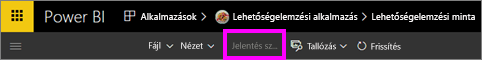
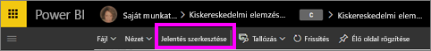
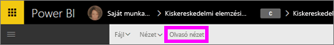

# A Power BI szolgáltatás jelentéseinek Olvasó és Szerkesztési nézete
A Power BI szolgáltatásban a jelentések két módban tekinthetők meg és kezelhetők: az Olvasó és a Szerkesztési nézetben (a Power BI Desktopban nem). Az Olvasó nézet minden felhasználó számára elérhető, és speciálisan az adatok *felhasználói* számára lett kialakítva, míg a Szerkesztő nézet csak a jelentések *létrehozói* és tulajdonosai számára érhető el. 

## Jelentés Olvasó nézete

 Az Olvasó nézetben nyugodtan kísérletezhet az adataival, és egy biztonságos környezetben tárhatja fel és ismerheti meg őket. Az Olvasó nézet a jelentések *felhasználói* számára van kialakítva, vagyis azok számára, akik az alkalmazásokban nyitnak meg jelentéseket, vagy akikkel jelentések vannak [megosztva](service-share-dashboards.md). Az Olvasó nézet biztosítja, hogy az adott jelentés minden egyes felhasználója számára ugyanaz a jelentés és ugyanazok a vizualizációk jelenjenek meg, azonos alkalmazott szűrőkkel.  A felhasználók kezelhetik a jelentéseket, azonban nem tudják menteni a módosításokat.

>**MEGJEGYZÉS**: Bizonyos esetekben előfordulhat, hogy a jelentés felhasználói számára a sorszintű biztonság és az adatokra vonatkozó engedélyek miatt eltérő adatok jelennek meg. 

## Jelentés Szerkesztési nézete

A Szerkesztési nézet csak a jelentés létrehozói számára, vagy azok számára érhető el, akik egy [alkalmazás-munkaterület tagjaként vagy rendszergazdájaként a jelentés társtulajdonosai](service-create-distribute-apps.md).

A Szerkesztési nézetet a jelentés *létrehozói* számára van kialakítva. A létrehozók itt importálhatják az adathalmazokat és itt kapcsolódhatnak hozzájuk, itt vizsgálhatják meg az adatokat, hozhatnak létre jelentéseket és irányítópultokat. A Szerkesztési nézetében a *létrehozó* mélyebbre áshat az adatok közt mezők felvételével és eltávolításával, a vizualizáció típusának a módosításával, új vizualizációk létrehozásával, valamint vizualizációk jelentésbe történő felvételével és törlésével. A létrehozott jelentéseket meg is oszthatják a munkatársakkal.

## Az Olvasó nézet és a Szerkesztés nézet összehasonlítása
A táblázat nem tartalmazza a Power BI szolgáltatás minden jelentéssel kapcsolatos lehetőségét. Csupán azokat a jelentésekkel összefüggő feladatokat listázza, amelyek nem érhetőek el **mind** az Olvasó, mind a Szerkesztési nézetben. 

|Feladat  | Olvasó nézet  | Szerkesztési nézet |
|-------------------------|-------|-------|
|**Jelentések teljes egészében**  |
||||
| [Jelentés létrehozása és szerkesztése](service-report-create-new.md) | Nem  | Igen |
| [Jelentés megosztása](service-share-reports.md)| Igen | Igen, és ezen kívül engedélyeket is tud kezelni, többek között mások számára *tulajdonosi* engedélyek adhatók. |
| [Állandó vizualizáció-szintű, lehatolási, oldalszintű és jelentésszintű szűrők létrehozása a Szűrők panelről](power-bi-report-add-filter.md) | Nem  | Igen |
| [A jelentés Szűrők paneljének használata](power-bi-how-to-report-filter.md) | Igen, a meglévő szűrők használhatók, de a változtatások nem menthetők a jelentésben. | Igen |
| [A jelentés Elemzés paneljének használata](service-analytics-pane.md) | Nem | Igen |
| [A jelentés **Nézet** beállításai](power-bi-report-display-settings.md) | Igen, meghatározott kivételekkel. | Igen, mindegyik, többek között a rácsvonalak, a rácshoz illesztés és a zárolás is. |
| [Frissítési ütemezés létrehozása](refresh-data.md) | Nem  | Igen |
| [Feliratkozás jelentésre](service-report-subscribe.md) | Igen | Nem |
| [Q&A – kérdések feltevése jelentésekben](power-bi-q-and-a.md) | Nem  | Igen |
| [Használati metrikák megtekintése](service-usage-metrics.md) | Igen, a jelentésvásznon. | Igen, a jelentéslistában (tartalom nézet) |
| [Kapcsolódó megtekintése](service-related-content.md) | Igen, a jelentésvásznon. | Igen, a jelentéslistában (tartalom nézet) |
| [Jelentés mentése](service-report-save.md) | Igen, de csak a **Mentés másként** használatával. | Igen |
| [Jelentés törlése](service-delete.md) | Nem  | Igen |
|**Jelentés oldala** |
||||
| [Jelentésoldal hozzáadása vagy átnevezése](power-bi-report-add-page.md)  | Nem  | Igen  |
| [Jelentésoldal megkettőzése](power-bi-report-copy-paste-page.md) | Nem  | Igen |
| [Jelentésoldal törlése](service-delete.md) | nem | igen |
|**Munka a jelentés vizualizációival**|
||||
| [Vizualizációk hozzáadása a jelentéshez](power-bi-report-add-visualizations-i.md) | Nem  | Igen |
| [Szövegmezők és alakzatok hozzáadása egy jelentéshez](power-bi-reports-add-text-and-shapes.md) | Nem  | Igen |
| [A jelentés formázási oldalának használata](service-the-report-editor-take-a-tour.md) | Nem | Igen |
| [Vizualizáció-interakciók beállítása](service-reports-visual-interactions.md) | Nem  | Igen |
| [A vizualizáció létrehozásához használt adatok megjelenítése](service-reports-show-data.md) | Nem  | Igen |
| [Részletezés konfigurálása](power-bi-visualization-drill-down.md) | Nem  | Igen |
| [A használt vizualizáció módosítása](power-bi-report-change-visualization-type.md) | Nem | Igen|
| [Vizualizáció, szövegmező vagy alakzat törlése](service-delete.md)| Nem | Igen |

## A Szerkesztési és az Olvasó nézet közötti váltás
Ne feledje, hogy a jelentéseket csak azok létrehozói és tulajdonosai tudják majd Szerkesztési nézetben megnyitni.

1. A jelentések alapértelmezés szerint általában Olvasó nézetben nyílnak meg. Az mutatja, hogy Olvasó nézetben van, hogy megjelenik a **Jelentés szerkesztése** lehetőség. Ha a **Jelentés szerkesztése** lehetőség szürke színnel jelenik meg, nem rendelkezik a jelentés Szerkesztési nézetében való megnyitásához szükséges engedélyekkel.

   

2. Ha a **Jelentés szerkesztése** lehetőség nem szürke színnel jelenik meg, ezt választva nyithatja meg a jelentést Szerkesztési nézetben. 
   
   
   
   A jelentés most már Szerkesztési nézetben látható, ugyanazokkal a [megjelenítési beállításokkal](power-bi-report-display-settings.md), melyeket legutóbb használt az Olvasó nézetben.

2. Az Olvasó nézetbe való visszalépéshez válassza az **Olvasó nézet** lehetőséget a felső menüsávban.
   
    

### Következő lépések
Számtalan különböző módon kezelheti a jelentéseket az Olvasó nézetben, tovább szeletelve és darabolva az adatokat összefüggések feltárásához és kérdések megválaszolásához.  Ezek közül néhányat a [Jelentések kezelése az Olvasó nézetben](service-interact-with-a-report-in-editing-view.md) című következő téma ismerteti részletesebben.    
Vissza a [Power BI-jelentésekhez](service-reports.md)    
További kérdései vannak? [Kérdezze meg a Power BI közösségét](http://community.powerbi.com/) 

