# Valós idejű streamelés a Power BI-ban
A Power BI valós idejű streamelésével valós időben streamelhet adatokat és frissítheti az irányítópultokat. A Power BI-ban elkészíthető vizualizációk vagy irányítópultok úgy is létrehozhatók, hogy valós idejű adatokat és a vizualizációkat jelenítsenek meg és frissítsenek. A streamelési adatok forrásai és eszközei lehetnek ipari érzékelők, közösségimédia-források, szolgáltatáshasználati metrika vagy bármi más, amiből időfüggő adatok gyűjthetők és továbbíthatók.

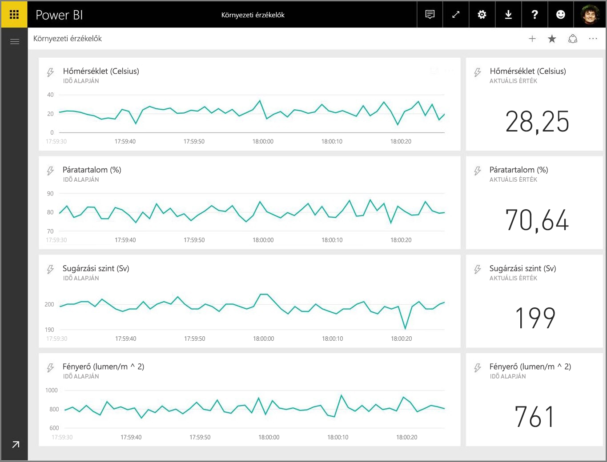

Ebben a cikkben bemutatjuk, hogyan lehet beállítani egy valós idejű streamelési adatkészletet a Power BI-ban. Mielőtt erre rátérnénk, fontos előbb megismerni a csempéken (és irányítópultokon) megjeleníthető valós idejű adatkészletek típusait, valamint a típusok közti különbségeket.

## A valós idejű adatkészletek típusai
A valós idejű irányítópultokon megjeleníthető valós idejű adatkészleteknek három típusuk van:

* Leküldéses adatkészlet
* Streamelési adatkészlet
* PubNub-alapú streamelési adatkészlet

Első lépésként (ebben a részben) ismertetjük, hogy miben különböznek egymástól, majd bemutatjuk, hogyan lehet adatokat leküldeni a különféle adatkészletekbe.

### Leküldéses adatkészlet
**Leküldéses adatkészlet** esetén az adatok leküldéssel kerülnek a Power BI szolgáltatásba. Amikor létrejön az adatkészlet, a Power BI automatikusan létrehoz a szolgáltatásban egy új adatbázist az adatok tárolására. A háttérben működik egy adatbázis, amely folyamatosan tárolja a bejövő adatokat, ezért az adatokból jelentések készíthetők. Ezek a jelentések és a vizualizációik éppen olyanok, mint bármilyen más jelentés vizualizációja, így a vizualizációk létrehozásához a Power BI összes jelentéskészítő funkciója használható, egyebek közt az egyéni vizualizációk, az adatértesítések és az irányítópultra rögzített csempék.

Ha létrejött egy leküldéses adatkészletet használó jelentés, akkor annak a vizualizációi rögzíthetők az irányítópultokon. Ha frissülnek az adatok, az irányítópulton látható vizualizációk is valós időben frissülnek. Minden alkalommal, amikor új adatok érkeznek, az irányítópult kezdeményezi a szolgáltatásban a csempék frissítését.

Két szempontot érdemes figyelembe venni a leküldéses adatkészletek rögzített csempéivel kapcsolatban:

* Ha az *élő oldal rögzítése* lehetőséggel rögzít egy teljes jelentést, attól még az adatok **nem** fognak automatikusan frissülni.
* Ha rögzített egy vizualizációt az irányítópulton, akkor a **Q&A** segítségével természetes nyelvezetet használva tehet fel kérdéseket a leküldéses adatkészlettel kapcsolatban. Ha feltett egy kérdést a **Q&A** területen, akkor rögzítheti az eredménye vizualizációját az irányítópulton, és ez az irányítópult *szintén* valós időben fog frissülni.

### Streamelési adatkészlet
A **streamelési adatkészletek** adatai szintén leküldéssel kerülnek az Power BI szolgáltatásba, van azonban egy fontos különbség: a Power BI csak egy átmeneti gyorsítótárban tárolja az adatokat, és az gyorsan kiürül. Az átmeneti gyorsítótár csak olyan vizualizációkhoz használható, amelyek rövid időre visszamenőleg jelenítik meg az előzményeket, mint amilyen például egy egyórás időtartományú vonaldiagram.

A  **adatkészlet** esetében *nincs* a háttérben működő adatbázis, így *nem* készíthetők vizualizációk a jelentésekhez a streamből beérkező adatokból. Tehát nem lesznek használhatók egyebek között olyan jelentési funkciók sem, mint a szűrés vagy az egyéni vizualizációk.

Streamelési adatkészletet kizárólag úgy jeleníthet meg, ha felvesz egy csempét, és a streamelési adatkészletet **egyedi streamelési adatok** típusú adatforrásként használja. A **streamelési adatkészleten** alapuló egyedi streamelési csempék valós idejű adatok gyors megjelenítésére vannak optimalizálva. Nagyon kicsi a késés aközött, hogy az adat leküldéssel a Power BI szolgáltatásba kerül, és aközött, hogy frissül a vizualizáció, ugyanis nincs szükség arra, hogy az adatok bekerüljenek egy adatbázisba, és onnan beolvassák őket.

A gyakorlatban a streamelésiadatkészletek és a hozzájuk kapcsolódó streamelési vizualizációk olyan helyzetekben használhatók a legjobban, amikor alapvető fontosságú az adatok beérkezése és megjelenítése között késés minimalizálása. Emellett tanácsos olyan formátumban leküldetni az adatokat, hogy ebben az állapotukban, mindenféle további összesítés nélkül lehessen megjeleníteni őket. Ilyen kész adat például a hőmérséklet vagy az előre kiszámolt átlag.

### PubNub-alapú streamelési adatkészlet
**PubNub**-alapú streamelési adatkészlet esetén a Power BI webügyfél a PubNub SDK-val beolvas egy meglévő PubNub-streamet, de a Power BI szolgáltatás nem tárol semmilyen adatot.

Ahogyan a  **adatkészlet** esetében, úgy a **PubNub-alapú streamelési adatkészlet** esetében sem működik a háttérben adatbázis, így nem készíthetők a folyamatosan beérkező adatokon alapuló jelentésekhez vizualizációk, és nem használhatók ki egyebek között az olyan jelentési funkciók előnyei sem, mint például a szűrés vagy az egyéni vizualizációk. Így a **PubNub-alapú streamelési adatkészlet** kizárólag úgy jeleníthető meg, ha felvesz egy csempét az irányítópulton, és a PubNub-alapú streamelési adatkészletet konfigurálja a forrásaként.

A **PubNub-alapú streamelési adatkészleten** alapuló csempék valós idejű adatok gyors megjelenítésére vannak optimalizálva. Mivel a Power BI közvetlenül kapcsolódik a PubNub-streamhez, nagyon kicsi a késés aközött, hogy az adat leküldéssel a Power BI szolgáltatásba kerül, és aközött, hogy frissül a vizualizáció.

### Streamelési adatkészlet mátrixa
A következő táblázat (vagy ha úgy tetszik, mátrix) ismerteti a valós idejű streamelés három típusát, illetve képességeiket és korlátozásaikat.

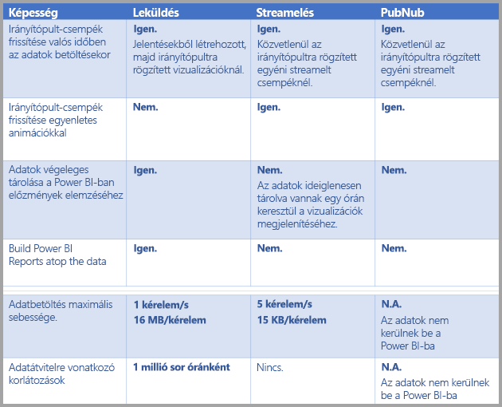

> [!NOTE]
> A **Leküldés** adatmennyiségének korlátozásaival kapcsolatban tekintse meg [ezt az MSDN-cikket](https://msdn.microsoft.com/library/dn950053.aspx).
> 
> 

## Adatok leküldése adatkészletekbe
Az előző szakasz ismertette a három valós idejű adatkészlettípust, amellyel valós idejű streamelés lehetséges, valamint a köztük megmutatkozó eltéréseket. Ez a szakasz azt ismerteti, hogy hogyan hozhat létre ilyen adatkészleteket, illetve hogyan küldhet le adatokat ezekbe az adatkészletekbe.

Három alapvető módszerrel küldhet le adatokat egy adatkészletbe:

* A Power BI REST API-k használatával
* A streamelési adatkészlet felhasználói felületén
* Az Azure Stream Analytics használatával

Vegyük sorra ezeket a módszereket.

### Adatok leküldése a Power BI REST API-k használatával
A **Power BI REST API-k** legjobban **leküldéses** és **streamelési** adatkészletek létrehozására, illetve az ezekbe történő adatküldésre használhatók. Ha a Power BI REST API-kal hoz létre egy adatkészletet, akkor a *defaultMode* jelző határozza meg, hogy az adatkészlet leküldéses vagy streamelési adatkészlet lesz. Ha nincs beállítva a *defaultMode* jelző, akkor az adatkészlet alapértelmezés szerint **leküldéses** adatkészlet lesz.

Ha a *defaultMode* *pushStreaming* értékre van állítva, akkor az adatkészlet egyszerre lesz **leküldéses** *és* **streamelési** adatkészlet, ami mindkét típus előnyeit nyújtja. A REST API [ dokumentációjának az **Adatkészlet létrehozásáról**](https://msdn.microsoft.com/library/mt203562.aspx) szóló cikke ismerteti a streamelési adatkészlet létrehozását, és működése közben mutatja meg a *defaultMode* jelzőt.

> [!NOTE]
> Ha egy olyan adatkészletet használ, amelynek a *defaultMode* jelzője *pushStreaming* értékre van állítva, és egy kérés mérete meghaladja a **streamelési** adatkészletekre vonatkozó 15 Kb-es méretkorlátot, de nem haladja meg a **leküldéses** adatkészletekre vonatkozó 16 MB-os méretkorlátot, akkor a kérés sikeres lesz, és az adat frissülni fog a leküldéses adatkészletben. Ugyanakkor a streamelési csempék átmenetileg nem fognak működni.
> 
> 

Ha létrejött az adatkészlet, használja a REST API-kat, hogy adatokat küldjön le a [**Sorok hozzáadása** API](https://msdn.microsoft.com/library/mt203561.aspx)-val, ahogyan [azt ez a cikk ismerteti](https://msdn.microsoft.com/library/mt203561.aspx).

A REST API-knak küldött kéréseket az **Azure AD OAuth** védi.

### Adatok leküldése a streamelési adatkészlet felhasználói felületén
A Power BI szolgáltatásban létrehozhat adatkészleteket az **API** módszer kiválasztásával, ahogyan az a következő képen látható.

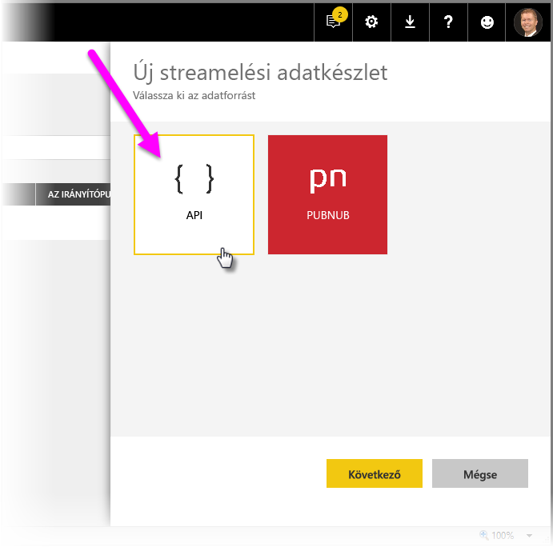

Új streamelési adatkészlet létrehozásakor az alább látható módon engedélyezheti az **Előzményadatok elemzése** beállítást, amely jelentős hatást fejt ki.

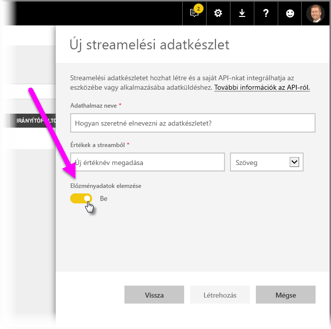

Ha az **Előzményadatok elemzése** le van tiltva (alapértelmezés szerint le van tiltva), akkor **streamelési adatkészlet** jön létre, ahogyan azt már korábban ismertettük ebben a cikkben. Ha *engedélyezve* van az **Előzményadatok elemzése**, akkor a létrehozott adatkészlet egyszerre lesz **streamelési** adatkészlet és **leküldéses** adatkészlet. Ez megegyezik azzal az esettel, amikor a Power BI REST API-k használatával hoz létre egy adatkészletet úgy, hogy a *defaultMode* jelző *pushStreaming* értékre van állítva, ahogyan azt már korábban ismertettük ebben a cikkben.

> [!NOTE]
> A Power BI szolgáltatás felhasználói felületén létrehozott streamelési adatkészletek esetében, ahogyan korábban is jeleztük, nincs szükség Azure AD-hitelesítésre. Az ilyen adatkészletekben az adatkészlet tulajdonosa kap egy URL-t, amely tartalmazza a sorkulcsot, amely Azure AD OAuth tulajdonosi jogkivonat nélkül hitelesíti az adatkészletbe történő adatleküldés kérelmezőjét. Ugyanakkor az Azure AD-n (AAD-n) alapuló módszer továbbra is működik az adatoknak az adatkészletbe történő leküldésekor.
> 
> 

### Adatok leküldése az Azure Stream Analytics használatával
Az **Azure Stream Analyticsben** (ASA-ban) a Power BI megadható kimenetként, majd a Power BI szolgáltatásban ezek a streamek valós időben megjeleníthetők. Ez a szakasz ennek a folyamatnak a technikai részleteit ismerteti.

Az Azure Stream Analytics létrehozza a Power BI felé irányuló kimeneti streamet a Power BI REST API-kkal, és a *defaultMode* jelzőt *pushStreaming* értékre állítja (a *defaultMode* jelzővel kapcsolatos tudnivalók a cikk korábbi szakaszaiban olvashatók). Ennek köszönhetően az adatkészlet mind a **leküldéses**, mind pedig a **streamelési** adatkészletek előnyeivel rendelkezni fog. Az adatkészlet létrehozása során az Azure Stream Analytics beállítja a **retentionPolicy* jelzőt is, *basicFIFO* értékre. Ezzel a beállítással a leküldéses adatkészletet támogató adatbázis 200 000 sor tárolására lesz képes, ennek elérése után FIFO módszerrel elkezdi eldobni a sorokat, vagyis mindig a legrégebbiek eldobásával kezdi.

> [!CAUTION]
> Ha az Azure Stream Analytics-lekérdezés nagyon gyakori kimenetet eredményez a Power BI felé (például másodpercenként egyet vagy kettőt), akkor az Azure Stream Analytics elkezdi ezeket a kimeneteket egyetlen kéréssé kötegelni. A kérés mérete emiatt meghaladhatja a streamelési csempe méretkorlátozását. Ez esetben a streamelési csempék megjelenítése nem fog működni, ahogyan azt már a korábbi szakaszokban is említettük. Ilyenkor az ajánlott eljárás a Power BI felé irányuló adatkimenet sebességének csökkentése, például a másodpercenkénti maximális érték helyett a 10 másodpercenkénti maximális érték beállításával.
> 
> 

## Valós idejű streamelési adatkészlet beállítása a Power BI-ban
Már érintettük a valós idejű streamelési adatkészletek három típusát, valamint a három alapvető módszert, amellyel adatokat lehet leküldeni ezekbe az adatkészletekbe. Így elérkezett az ideje, hogy beállítsunk egy működő, valós idejű streamelési adatkészletet a Power BI-ban.

A valós idejű streamelés első lépéseként ki kell választani két lehetőség közül, hogy hogyan történjen a Power BI-ban a streamelési adatok felhasználása:

* **csempék** – ezek vizualizációkat jelenítenek meg a streamelési adatokból
* **adatkészletek** – ezek a streamelési adatokból jönnek létre, és megőrzi őket a Power BI

Bármelyik lehetőséget választja is, be kell állítania a **streamelési adatokat** a Power BI-ban. Ehhez válassza az irányítópulton (egy meglévőn vagy egy újon) a **Csempe hozzáadása**, majd az **Egyedi streamelési adatok** lehetőséget.

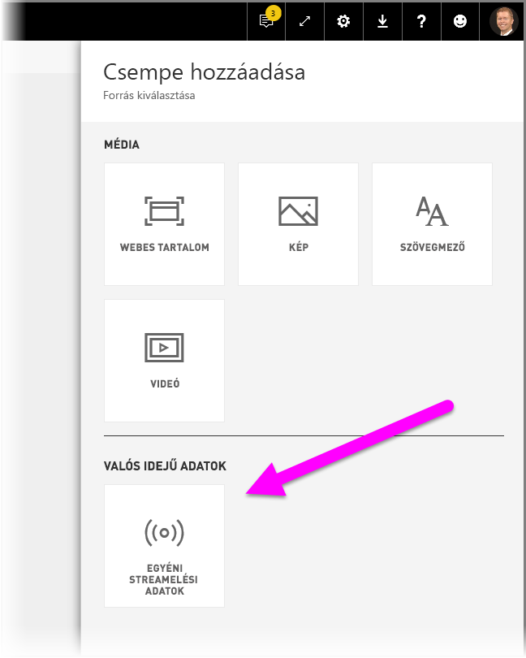

Ha még nincsenek beállítva streamelési adatai, akkor sem kell aggódnia: első lépésként válassza az **Adatkészletek kezelése** lehetőséget.

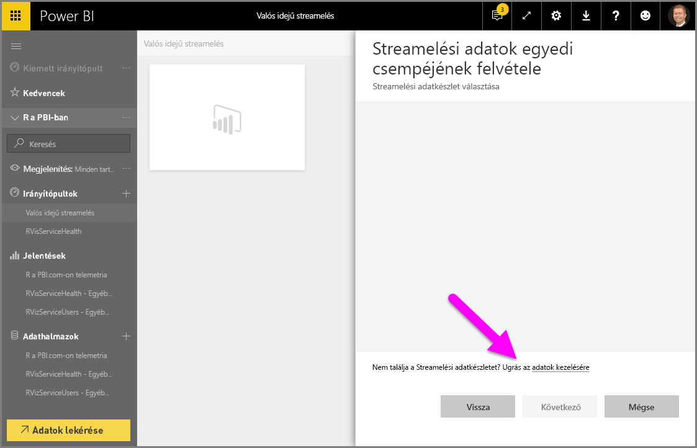

Ezen az oldalon (a szövegmezőben) megadhatja a streamelési adatkészlet végpontját, ha már hozott létre ilyet. Ha még nincs streamelési adatkészlete, válassza a jobb felső sarokban található plusz ikont ( **+** ), hogy megjelenjenek a streamelési adatkészletek létrehozásának lehetőségei.

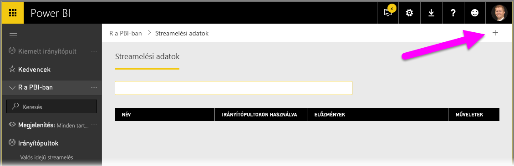

Amikor rákattint a **+** ikonra, két lehetőség jelenik meg:

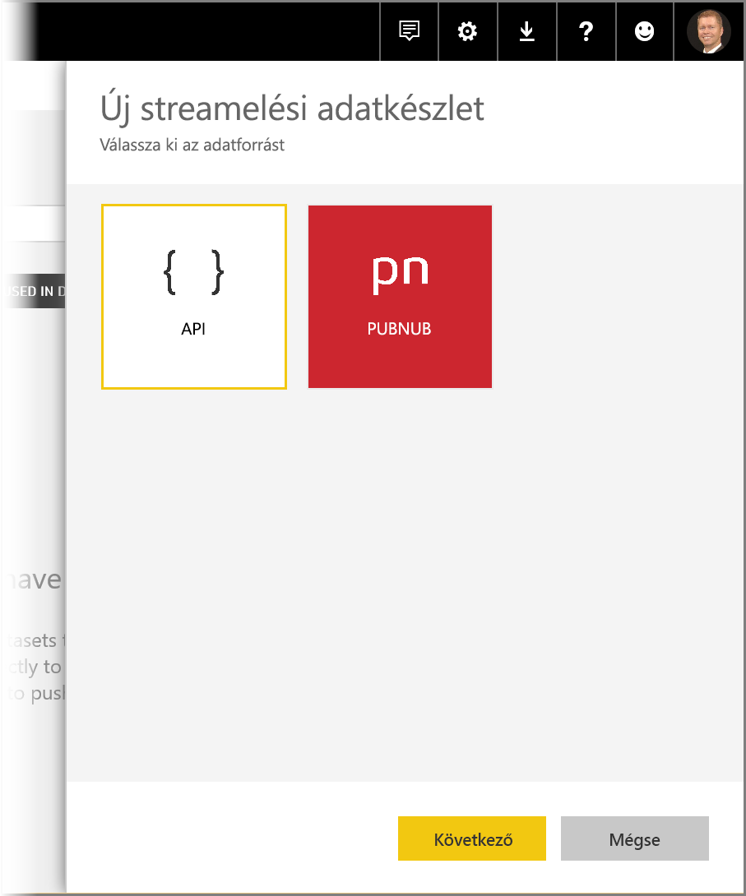

A következő szakasz ezeket a lehetőségeket ismerteti, és részletesen bemutatja, hogyan lehet egy streamelési adatforrásból streamelési **csempét** vagy **adatkészletet** létrehozni, és ezeket utána jelentések készítésére használni.

## Streamelési adatkészlet létrehozása az Önnek jobban tetsző lehetőséggel
Kétféleképpen hozhat létre a Power BI által felhasználható és megjeleníthető valós idejű streamelési adatcsatornákat:

* **Power BI REST API**, amely egy valós idejű streamelési végpontot használ
* **PubNub**

A következő szakasz ezeket veszi sorra.

### A POWER BI REST API használata
**Power BI REST API** – A Power BI REST API legfrissebb fejlesztései azt a célt szolgálják, hogy megkönnyítsék a fejlesztők számára a valós idejű streamelést. Amikor az **Új streamelési adatkészlet** ablakban kiválasztja az **API** lehetőséget, akkor olyan bejegyzések jelennek meg, amelyek lehetővé teszik, hogy a Power BI csatlakozzon a végponthoz, és használja azt:

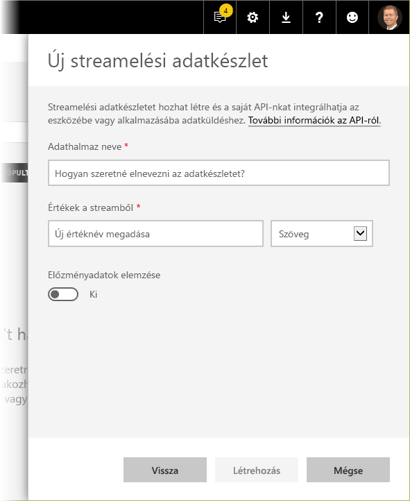

Ha azt szeretné, hogy a Power BI tárolja is az streamben elküldött adatokat, engedélyezze az *Előzményadatok elemzése* lehetőséget, hogy felhasználhassa az összegyűjtött streamet jelentések vagy elemzések készítésére. [További információkat is megtudhat az API-ról](https://msdn.microsoft.com/library/dn877544.aspx).

Amint sikeresen létrehozta a streamjét, megkapja a REST API URL-végpontot. Ezt az alkalmazás a *POST* kéréssel tudja meghívni, hogy adatokat küldjön le az imént létrehozott Power BI **streamelési adatokból** álló adatkészletbe.

A *POST* kérések küldésekor érdemes ellenőrizni, hogy a kérés törzse megfelel-e a Power BI felhasználói felületén megadott JSON-mintának. Például a JSON-objektumokat be kell burkolni egy tömbbe.

### A PubNub használata
A Power BI-ban a **PubNub**-streamelés integrációja lehetővé teszi meglévő kis késésű **PubNub**-streamjeinek használatát (vagy újak létrehozását). Válassza a **PubNub**, majd a **Tovább** lehetőséget. Ekkor az alábbi ablak jelenik meg:

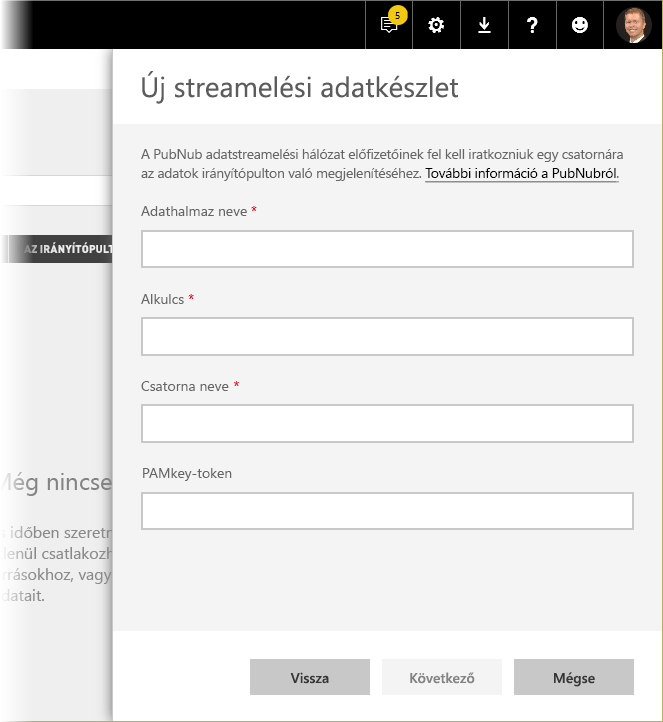

> [!WARNING]
> A PubNub-csatornákat egy PubNub Access Manager-alapú hitelesítési kulcs (PAM-kulcs) védi. Ez a kulcsot az összes olyan felhasználó megkapja, aki hozzáfér az irányítópulthoz. [További tudnivalók a PubNub hozzáférés-vezérlésről](https://www.pubnub.com/docs/web-javascript/pam-security).
> 
> 

A **PubNub**-streamek gyakran nagy mennyiségű adattal szolgálnak, és az eredeti formájukban nem alkalmasak a tárolásra és az előzményadataik elemzésére. Ahhoz, hogy a Power BI elemezni tudja az előzményadatokat PubNub-adatok esetében, összesíteni kell a nyers PubNub-streamet, majd el kell küldeni a Power BI-ba. Ennek egyik módja az [Azure Stream Analytics](https://azure.microsoft.com/services/stream-analytics/) használata.

## Példa valós idejű streamelés használatára a Power BI-ban
Itt egy egyszerű példa arra, hogy miképpen működik a valós idejű streamelés a Power BI-ban. Követheti Ön is ezt a mintát, hogy saját szemével láthassa, mennyire hasznos a valós idejű streamelés.

Ebben a mintában egy nyilvánosan elérhető **PubNub**-folyamot fogunk használni. A lépések a következők:

1. Válasszon egy irányítópultot (vagy hozzon létre egy újat) a **Power BI szolgáltatásban**, válassza a **Csempe hozzáadása** > **Egyedi streamelési adatok** lehetőséget, majd kattintson a **Tovább** gombra.
   
   
2. Ha még nincs streamelési adatforrása, válassza az **Adatkészletek kezelése** hivatkozást (a **Tovább** gomb felett), majd válassza a **+Létrehozás > Adatkészlet streamelése** lehetőséget az ablak jobb felső sarkában. Válassza a **PubNub** lehetőséget, majd a **Tovább** gombot.
3. Nevezze el az adatkészletet, illessze be a következő értékeket a megjelenő ablakba, majd kattintson a **Tovább** gombra:
   
   *Alkulcs:*
   
       sub-c-5f1b7c8e-fbee-11e3-aa40-02ee2ddab7fe
   *Csatorna:*
   
       pubnub-sensor-network
   
   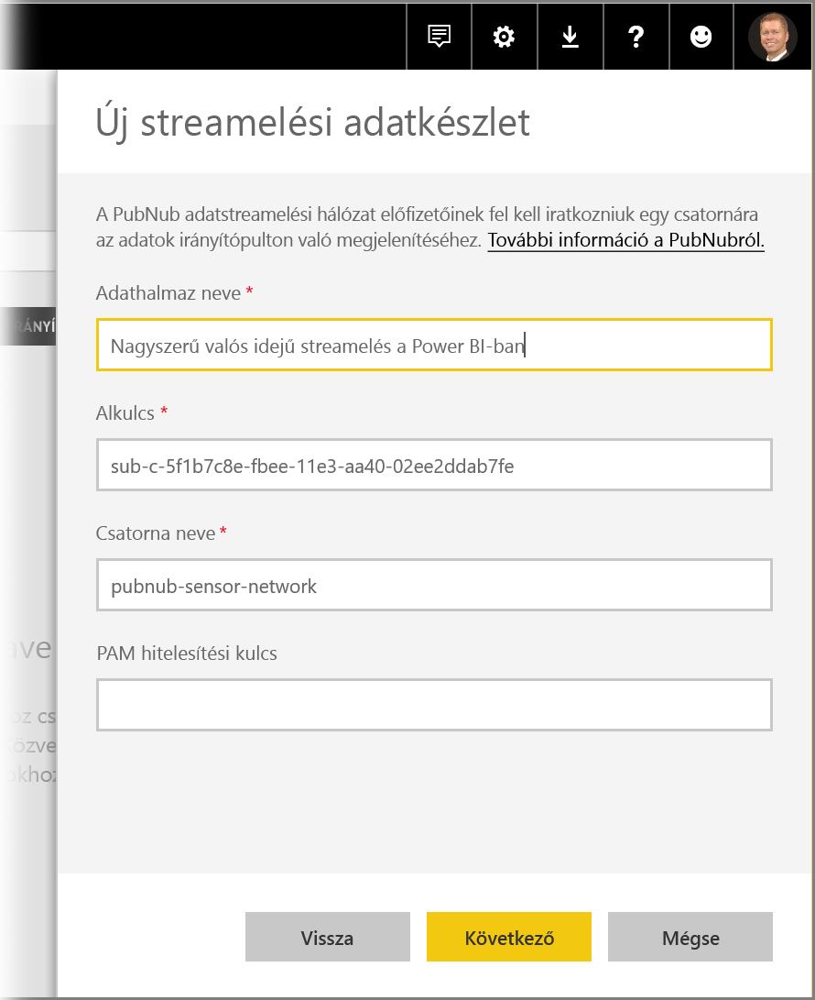
4. A következő ablakban válassza az automatikusan betöltődő alapértelmezéseket, majd a **Létrehozás** gombot.
   
   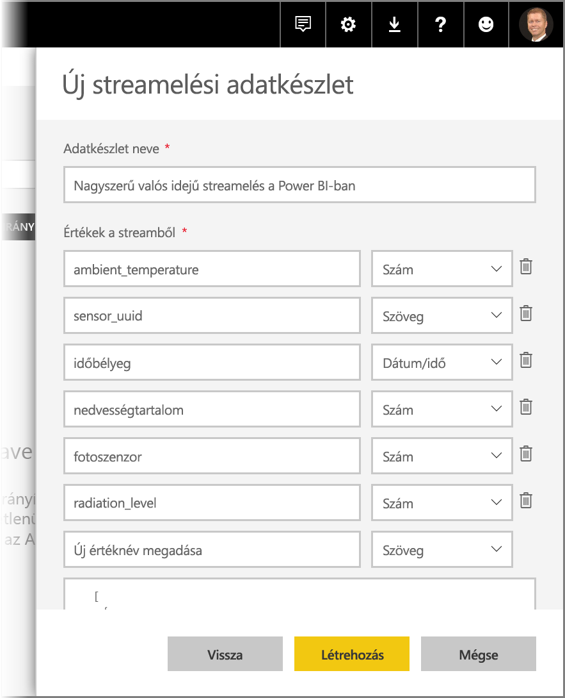
5. A Power BI munkaterületén hozzon létre egy új irányítópultot, majd adjon hozzá egy csempét (ha ehhez segítségre van szüksége, nézze meg a fentebb látható lépéseket). Most már, ha a csempe létrehozásakor az **Egyedi streamelési adatok** lehetőséget választja, rendelkezésére áll egy streamelési adatkészlet. Haladjunk is tovább, és próbáljuk ki. Ha hozzáadja a *number* típusú mezőket vonaldiagramokhoz, és felvesz egyéb csempéket is, akkor lesz egy, az alábbihoz hasonló irányítópultja:
   
   

Próbálja ki, játsszon egy kicsit a mintaadatkészlettel. Majd hozzon létre egy saját adatkészletet, és streameljen vele élő adatokat a Power BI-ba.

## Kérdések és válaszok
Itt elolvashatja a Power BI-ban történő valós idejű streameléssel kapcsolatos gyakori kérdéseket és a rájuk adott válaszokat.

#### Lehet szűrni a leküldéses adatkészleteket? És a streamelési adatkészleteket?
Sajnos a streamelési adatkészletek nem teszik lehetővé a szűrést. A leküldéses adatkészletekből létre tud hozni jelentéseket, szűrheti ezeket a jelentéseket, majd rögzítheti a szűrt vizualizációkat az irányítópulton. Ha viszont már rögzített egy vizualizációt az irányítópulton, akkor nem lehet módosítani a szűrőjét.

Az élő jelentés külön rögzíthető az irányítópulton, ebben az esetben módosíthatók a szűrők is. Az élő jelentések csempéi azonban nem frissülnek valós időben az adatok leküldésekor. Ehhez manuálisan kell frissíteni a vizualizációt a **...** menü *Az irányítópult csempéinek frissítése* parancsával.

Amikor olyan leküldéses adatkészleteken alkalmaz szűrőket, amelyekben ezredmásodperces pontosságú *DateTime* mezők találhatók, akkor az *egyezik* operátor nem használható. Ugyanakkor a nagyobb, mint (>) és a kisebb, mint (<) operátor megfelelően működik.

#### Hogyan tudom megnézni a legutóbbi értékeket egy leküldéses adatkészletben? És a streamelési adatkészletekben?
A streamelési adatkészletek a legutóbbi értékek megjelenítésére lettek kialakítva. A **Kártya** típusú streamelési vizualizációval könnyen megnézheti a legutóbbi numerikus értékeket. A kártyákon azonban sajnos nem használhatók *DateTime* és *Text* típusú adatok.
Leküldéses adatkészletekből létrehozhat vizualizációkat az elmúlt N idő szűrővel, feltéve, hogy a sémában egy időbélyeg is található.

#### Csatlakozhatok leküldéses vagy streamelési adatkészletekhez a Power BI Desktopban?
Erre jelenleg sajnos nincs lehetőség.

#### Hogyan lehet modellezést végezni a valós idejű adatkészleteken, tekintettel az előző kérdésre adott válaszra?
Streamelési adatkészleteken nem lehetséges a modellezés, mert az adatok nincsenek maradandóan tárolva. A leküldéses adatkészletek esetében használhatja az adatkészletek/táblázatok frissítésére szolgáló REST API-kat mértékek és kapcsolatok hozzáadására. További információt a [táblázatséma frissítését ismertető](https://msdn.microsoft.com/library/mt203560.aspx) és az [adatkészlet tulajdonságait ismertető](https://msdn.microsoft.com/library/mt742155.aspx) cikkben talál.

#### Hogyan tudom az összes értéket törölni egy leküldéses adatkészletből? És a streamelési adatkészletekből?
A leküldéses adatkészletek esetében használhatja a sorok törlése REST API-hívást. Külön is használhatja ezt a hasznos eszközt, amely a REST API-k burkolója. Jelenleg nem lehet adatokat törölni a streamelési adatkészletekből, bár az adatok egy óra elteltével maguktól törlődnek.

#### Beállítottam egy Azure Stream Analytics-kimenetet a Power BI felé, de nem látom, hogy megjelent volna a Power BI-ban. Mi okozza a hibát?
A következő ellenőrzőlista segít elhárítani a hibát:

1. Indítsa újra az Azure Stream Analytics-feladatot (a streamelés általános elérhetővé tétele előtt létrehozott feladatokat újra kell indítani).
2. Adja meg újra a Power BI-kapcsolat hitelesítő adatait az Azure Stream Analyticsben.
3. Melyik munkaterületet adta meg az Azure Stream Analytics-kimenetben? Ugyanezt a munkaterületet nézi a Power BI szolgáltatásban?
4. Az Azure Stream Analytics-lekérdezés kimenete egy explicit módon meghatározott Power BI-kimenet? (az INTO kulcsszó használatával)
5. Halad át adat az Azure Stream Analytics-feladaton? Az adatkészlet csak akkor jön létre, ha vannak továbbított adatok.
6. Vannak figyelmeztetések vagy hibák az Azure Stream Analytics naplóiban?

## Következő lépések
A következő hivatkozások hasznos információkkal szolgálnak a Power BI-ban történő valós idejű streamelésről:

* [A Power BI REST API áttekintése, a valós idejű adatokra is kitérve](https://msdn.microsoft.com/library/dn877544.aspx)
* [A Power BI REST API korlátozásai](https://msdn.microsoft.com/library/dn950053.aspx)
* [REST API – **Adatkészlet létrehozása**](https://msdn.microsoft.com/library/mt203562.aspx)
* [**Sorok hozzáadása** – Power BI REST API](https://msdn.microsoft.com/library/mt203561.aspx)
* [Azure Stream Analytics](https://azure.microsoft.com/services/stream-analytics/)

