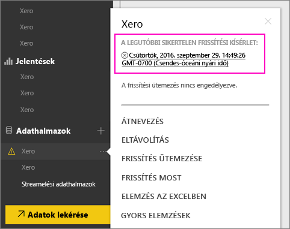
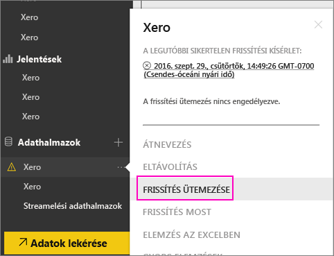
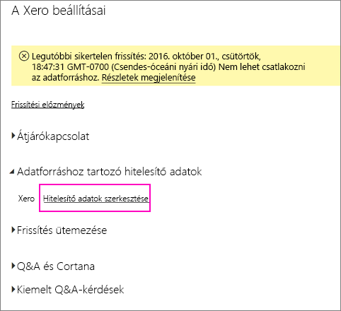
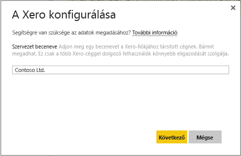
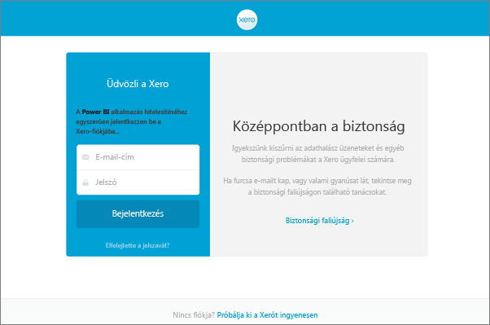
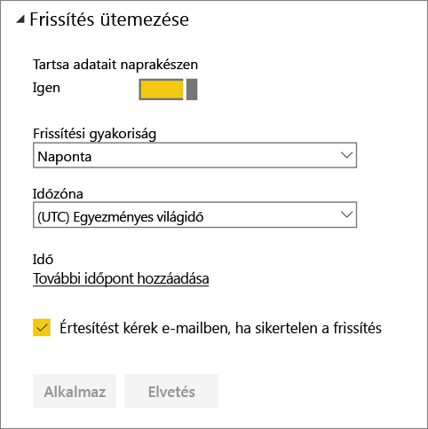
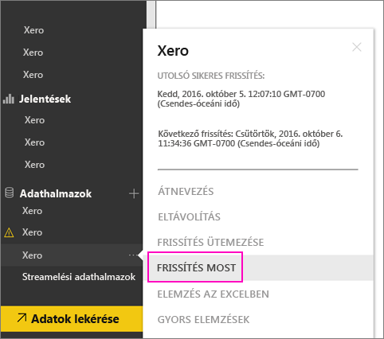

# A Xero tartalomcsomag hitelesítő adatainak frissítése frissítési hiba esetén
Ha a Xero Power BI-tartalomcsomagot használja, a tartalomcsomag napi frissítésével kapcsolatos problémákat tapasztalhatott a Power BI szolgáltatás egy közelmúltbeli hibája miatt.

Ellenőrizheti, hogy a tartalomcsomag sikeresen frissült-e, ha az alábbi képernyőképen látható módon ellenőrzi a Xero-adathalmaz utolsó frissítésének állapotát.

Ha azt látja, hogy a frissítés sikertelen volt, ahogy az a fenti képen is látható, akkor a következő lépések végrehajtásával újítsa meg a tartalomcsomag hitelesítő adatait.

1. Kattintson a Xero-adathalmaz melletti három pontra (...), majd a **Frissítés ütemezése** lehetőségre. Ezzel megnyitja a Xero-tartalomcsomag beállításainak oldalát.
   
    
2. A **Xero beállításai** oldalon válassza az **Adatforrás hitelesítő adatai** > **Hitelesítő adatok szerkesztése** lehetőséget.
   
    
3. Adja meg cége nevét > **Tovább**.
   
    
4. Jelentkezzen be Xero-fiókjával.
   
    
5. Most, hogy hitelesítő adatai frissültek, győződjön meg róla, hogy naponta egyszeri frissítés van ütemezve. Ennek ellenőrzéséhez kattintson ismét a Xero-adathalmaz melletti három pontra (...), majd a **Frissítés ütemezése** lehetőségre.
   
    
6. Úgy is dönthet, hogy azonnal frissíti az adathalmazt. Kattintson a Xero-adathalmaz melletti három pontra (...), majd az **Azonnali frissítés** lehetőségre.
   
    

Ha a frissítés továbbra is problémákba ütközik, forduljon hozzánk bizalommal a [http://support.powerbi.com](http://support.powerbi.com) URL-címen. 

A Power BI-hoz készült Xero-tartalomcsomagról a [Xero-tartalomcsomag súgóoldalán](service-connect-to-xero.md) találhat további információt.

### Következő lépések
* További kérdései vannak? [Kérdezze meg a Power BI közösségét](http://community.powerbi.com/)

