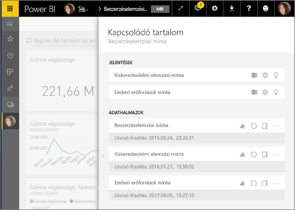
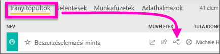
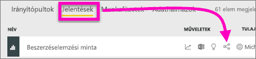
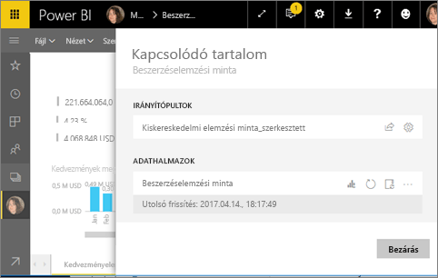
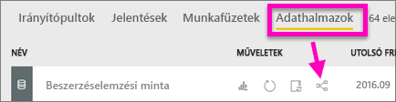
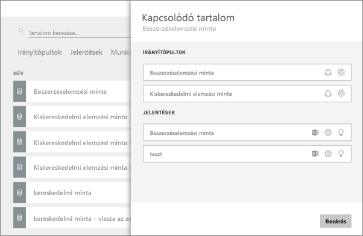

# Kapcsolódó tartalom megtekintése a Power BI szolgáltatásban
A **Kapcsolódó tartalom** ablaktáblában megtekintheti, hogyan vannak összekapcsolva a különböző Power BI-tartalmak – irányítópultok, jelentések és adatkészletek.  És ami még jobb, erről az ablaktábláról elvégezheti az olyan gyakori feladatokat is, mint a frissítés, az átnevezés, az értékelések készítése és még sok minden más. Ha kiválaszt egy kapcsolódó jelentést vagy irányítópultot, az megnyílik a Power BI munkaterületén.   

Mint azt már valószínűleg tudja, a jelentések adatkészletekre épülnek, a jelentések vizualizációit irányítópultokra lehet tűzni, és az irányítópultok vizualizációi hivatkoznak a jelentésekre. De hogyan tudhatja meg, hogy a Marketing jelentésének a vizualizációit melyik irányítópultokra tűzték ki? És hogyan találhatja meg ezeket az irányítópultokat? A Beszerzés irányítópult vajon olyan vizualizációkat használ, amelyek több adatkészletre is épülnek? És ha igen, akkor mi azok neve, és hogyan tudja megnyitni és szerkeszteni őket? Vajon használja-e valamelyik jelentés vagy irányítópult a HR-adatkészletet, vagy nyugodtan át lehet helyezni anélkül, hogy hivatkozásokat szakítana meg? Minden ilyen kérdésre választ találhat a **Kapcsolódó tartalom** adattáblán.  Az adattábla nem csak a kapcsolódó tartalmakat jeleníti meg, hanem műveletek elvégzését is lehetővé teszi rajtuk, és megkönnyíti a navigációt is közöttük.

> [!NOTE]
> A Kapcsolódó tartalom funkció nem működik streamelt adatkészletek esetén.
> 
> 

## Egy irányítópult kapcsolódó tartalmainak megtekintése
A videóban Will fogja bemutatni, hogyan lehet egy irányítópult kapcsolódó tartalmait megtekinteni. Ezután a tanultakat Ön is kipróbálhatja a Beszerzéselemzés mintaadatkészleten, a videó alatt látható részletes utasítások szerint.

<iframe width="560" height="315" src="https://www.youtube.com/embed/B2vd4MQrz4M#t=3m05s" frameborder="0" allowfullscreen></iframe>

A **Kapcsolódó tartalom** adattábla megnyitásához legalább *megtekintési* engedéllyel kell rendelkeznie az adott irányítópulthoz. A példában a [Beszerzéselemzési mintát](sample-procurement.md) fogjuk használni.

**1. módszer**

A munkaterületen válassza az **Irányítópultok** lapot, majd válassza ki a **Kapcsolódó megtekintése** ikont .

 

**2. módszer**

Ha az irányítópult meg van nyitva, válassza ki a  gombot a felső menüsorból.

Megnyílik a **Kapcsolódó tartalom** ablaktábla. Itt megtekintheti az összes olyan jelentést, amelyeknek a vizualizációi az irányítópultra vannak tűzve, és azokat az adatkészleteket, amelyekre épülnek. Ebben az esetben az irányítópultra 3 különböző jelentés vizualizációi vannak kitűzve, és ezek 3 különböző adatkészleten alapulnak.

Innen közvetlen műveleteket is végezhet a kapcsolódó tartalmakon.  Például, az egyik jelentés nevének kiválasztásával megnyithatja az adott jelentést.  A felsorolt jelentések esetében a megfelelő ikon kiválasztásával az [Elemzés az Excelben](service-analyze-in-excel.md), az [Átnevezés](service-rename.md) és az [Elemzések lekérése](service-insights.md) műveleteket hajthatja végre. Adatkészletek esetében az ikonokkal az [Új jelentés létrehozása](service-report-create-new.md), a [Frissítés](refresh-data.md), az Átnevezés, az [Elemzés az Excelben](service-analyze-in-excel.md), és az [Elemzések lekérése](service-insights.md) műveletek végezhetőek el, illetve a **Beállítások** ikonnal megnyitható az adott adatkészlet beállításait tartalmazó ablak.  

## Adott jelentéshez kapcsolódó tartalmak megtekintése
A **Kapcsolódó tartalom** ablaktábla megnyitásához legalább *megtekintési* engedéllyel kell rendelkeznie az adott jelentéshez. A példában a [Beszerzéselemzési mintát](sample-procurement.md) fogjuk használni.

**1. módszer**

A munkaterületen válassza a **Jelentések** lapot, majd a **Kapcsolódó megtekintése** ikont .

 
**2. módszer**

Nyissa meg az adott jelentést [Olvasó nézetben](service-reading-view-and-editing-view.md), és válassza ki a  gombot a felső menüsorból.

Megnyílik a **Kapcsolódó tartalom** ablaktábla. Itt megtekintheti a kapcsolódó adatkészleteket, és az összes olyan irányítópultot, amelyekre legalább egy csempe ki van tűzve a jelentésből. Ebben az esetben a jelentésből két különböző irányítópultra vannak kitűzve vizualizációk.

Innen közvetlen műveleteket is végezhet a kapcsolódó tartalmakon.  Például, az egyik irányítópult nevének kiválasztásával megnyithatja az adott irányítópultot.  A felsorolt irányítópultok esetében a megfelelő ikon kiválasztásával [megoszthatja az irányítópultot másokkal](service-share-dashboards.md), vagy megnyithatja az adott irányítópult **Beállítások** ablakát. Az adatkészlet esetében az ikonokkal az [Új jelentés létrehozása](service-report-create-new.md), a [Frissítés](refresh-data.md), az Átnevezés, az [Elemzés az Excelben](service-analyze-in-excel.md) és az [Elemzések lekérése](service-insights.md) műveletek végezhetőek el, illetve a **Beállítások** ikonnal megnyitható az adatkészlet beállításait tartalmazó ablak.  

## Egy adatkészlet kapcsolódó tartalmainak megtekintése
A **Kapcsolódó tartalom** adattábla megnyitásához legalább *megtekintési engedéllyel* kell rendelkeznie az adott adatkészlethez. A példában a [Beszerzéselemzési mintát](sample-procurement.md) fogjuk használni.

A munkaterületen válassza az **Adatkészletek** lapot, majd keresse meg a **Kapcsolódó megtekintése** ikont .

Válassza ki az ikont a **Kapcsolódó tartalom** ablaktábla megnyitásához.

Innen közvetlen műveleteket is végezhet a kapcsolódó tartalmakon.  Például, az egyik irányítópult vagy jelentés nevének kiválasztásával megnyithatja az adott irányítópultot vagy jelentést.  A felsorolt irányítópultok esetében a megfelelő ikon kiválasztásával [megoszthatja az irányítópultot másokkal](service-share-dashboards.md), vagy megnyithatja az adott irányítópult **Beállítások** ablakát. Jelentések esetében a megfelelő ikon kiválasztásával az [Elemzés az Excelben](service-analyze-in-excel.md), az [Átnevezés](service-rename.md) és az [Elemzések lekérése](service-insights.md) műveleteket hajthatja végre.  

## Korlátozások és hibaelhárítás
* Ha a böngésző ablakában nincs elég hely, akkor lehet, hogy nem látszik a **Kapcsolódó megtekintése** lehetőség, csak a Kapcsolódó megtekintése ikon . Válassza ki az ikont a **Kapcsolódó tartalom** ablaktábla megnyitásához.
* Egy jelentés kapcsolódó tartalmainak megnyitásához [Olvasó nézetben](service-reading-view-and-editing-view.md) kell lennie.
* A Kapcsolódó tartalom funkció a Power BI Desktop alkalmazásban nem érhető el.
* A Kapcsolódó tartalom funkció nem működik streamelt adatkészletek esetében.

## További lépések
* [A Power BI szolgáltatás használatának első lépései](service-get-started.md)
* További kérdései vannak? [Kérdezze meg a Power BI közösségét](http://community.powerbi.com/)

