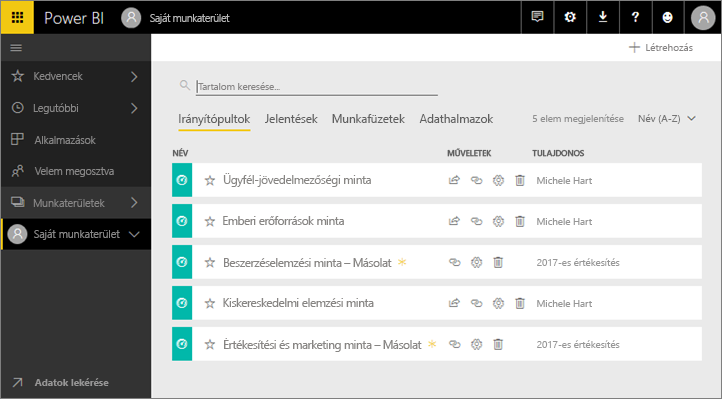
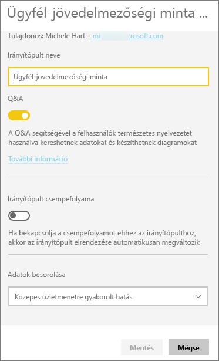
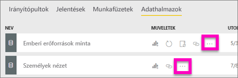
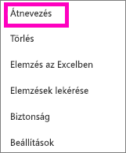
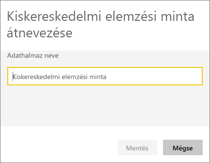
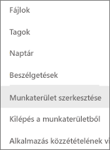
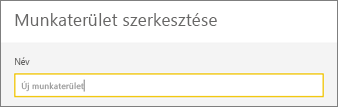
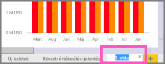
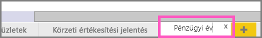

# A Power BI-szolgáltatásban szinte bármit átnevezhet
Ebből a cikkből megtudhatja, hogy miképpen nevezhet át irányítópultot, jelentést, munkafüzetet, adatkészletet, alkalmazást, vizualizációt vagy munkaterületet a Power BI szolgáltatásban.

**Módosíthatom a nevet?**

| Tartalomtípus | Szerző vagy létrehozó vagyok | Velem megosztva |
| --- | --- | --- |
| Munkaterületen lévő irányítópult |Igen |Nem |
| Munkaterületen lévő jelentés |Igen |Nem |
| Munkaterületen lévő munkafüzet |Igen |Nem |
| Munkaterületen lévő adatkészlet |Igen |Nem |
| Alkalmazás-munkaterület |Igen, ha Ön a tulajdonos, vagy rendszergazdai jogosultsága van |Nem |
| Közzétett alkalmazások |Ha rendszergazdai engedélye van, az alkalmazás nevét az alkalmazás képernyőjéről nem, de az alkalmazás-munkaterületről módosíthatja, és újra közzéteheti az új néven |Nem |
| Alkalmazás tartalma (irányítópult, jelentés, munkafüzet, adatkészlet) |Ha rendszergazdai engedélye van, az alkalmazás tartalmát az alkalmazás képernyőjéről nem, de az alkalmazás-munkaterületről átnevezheti, és újra közzéteheti az új néven |Nem |
| **Velem megosztott** tartalom |Nem |Nem |

## Irányítópult, jelentés vagy munkafüzet átnevezése
1. Indítson el egy munkaterületet, és kattintson az **Irányítópultok**, a **Jelentések**, vagy a **Munkafüzetek** lapra. Mutasson az átnevezni kívánt elemre, és kattintson a fogaskerék ikonra .
   
   
2. A Beállítások lapon írja be az új nevet, és kattintson a **Mentés** elemre.
   
   

## Adatkészlet átnevezése
1. Indítson el egy munkaterületet, és kattintson az **Adatkészletek** lapra.
   
   
2. Mutasson az átnevezni kívánt elemre, kattintson a három pontra (...), majd kattintson az **Átnevezés** lapra.  
   
      
   
   > [!NOTE]
   > A legördülő menüben lévő lehetőségek eltérőek lehetnek.
   > 
   > 
3. A Beállítások oldalon írjon be egy új nevet, és kattintson a **Mentés** elemre.
   
     

## Alkalmazás-munkaterület átnevezése
Aki rendszergazdai jogosultságokkal rendelkezik, átnevezheti az alkalmazás-munkaterületeket.

1. Az átnevezéshez indítsa el a munkaterületet.
2. A jobb felső sarokban kattintson a három pontra (...), és válassza a **Munkaterület szerkesztése** lehetőséget.  
   
    
3. Írja be a munkaterület új nevét, és kattintson a **Mentés** elemre.
   
   

## Jelentéslap átnevezése
Nincs megelégedve a Power BI-jelentésoldal nevével?  Az új név csak egy kattintásnyira van. Az oldalakat [a jelentés Szerkesztési nézetében](service-interact-with-a-report-in-editing-view.md) nevezheti át.

1. Nyissa meg a jelentést [Szerkesztési nézetben](service-reading-view-and-editing-view.md).
2. Keresse meg az oldalak lapfüleit a Power BI-ablak alján.
   
    
3. A lapfülre kattintva nyissa meg az átnevezni kívánt jelentésoldalt.
4. Dupla kattintással emelje ki a lapon látható nevet.  
   
    
5. Írja be a jelentésoldal új nevét, és nyomja le az ENTER billentyűt.
   
    

## Megfontolandó szempontok és hibaelhárítás
* Ha az átnevezendő elemet mások osztották meg Önnel, vagy tartalomcsomaghoz tartozik, nem jelenik meg a fogaskerék ikon, és nem férhet hozzá a Beállításokhoz.
* Ha nem látja a három pontot (...) az **Adatkészletek** lapon, bontsa ki a böngészőablakot.

További kérdései vannak? [Kérdezze a Power BI-közösséget](http://community.powerbi.com/)

