# Új jelentés létrehozása a Power BI szolgáltatásban adatkészlet importálásával
Már elolvasta a [Jelentések a Power BI-ban](service-reports.md) című cikket, és szeretne létrehozni egy saját jelentést. A jelentések több különböző módon is létrehozhatók. Ebben a cikkben kezdésként egy Excel-adatkészletből egy alapszintű jelentést fogunk létrehozni a Power BI szolgáltatásban. Ha már megismerte a jelentés létrehozásának alapjait, akkor a lap alján található **Következő lépések** hivatkozással továbbhaladhat a jelentésekkel kapcsolatos összetettebb témakörökre is.  

> **TIPP**: Ha egy meglévő jelentés másolásával szeretne létrehozni egy új jelentést, tekintse meg a [Jelentés másolása](power-bi-report-copy.md) cikket.
> 
### Előfeltételek
- A Power BI szolgáltatás (arról, hogy hogyan hozhat létre jelentést a Power BI Desktopban lásd: [Desktop jelentés nézet](desktop-report-view.md) )  
- A Kiskereskedelmi elemzési minta adatkészlete

## Adatkészlet importálása
Ha ezzel a módszerrel hoz létre egy jelentést, akkor annak kiindulópontja egy adatkészlet és egy üres jelentésvászon lesz. Ahhoz, hogy követhesse a lépéseket, [töltse le a Kiskereskedelmi elemzési minta Excel-adatkészletét](http://go.microsoft.com/fwlink/?LinkId=529778), és mentse a OneDrive Vállalati verzióra (javasolt) vagy lokálisan a számítógépére.

1. A jelentést a Power BI szolgáltatás egy munkaterületén fogjuk létrehozni, ezért válasszon ki egy meglévő munkaterületet, vagy hozzon létre egy újat.
   
   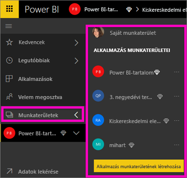
2. A bal oldali navigációs panelen válassza az **Adatok lekérése** elemet.
   
   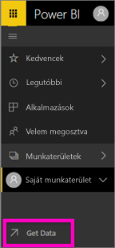
3. Válassza a **Fájlok** lehetőséget, majd navigáljon arra a helyre, ahova a Kiskereskedelmi elemzési mintát mentette.
   
    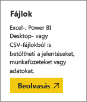
4. Ehhez a gyakorlathoz válassza az **Importálás** lehetőséget.
   
   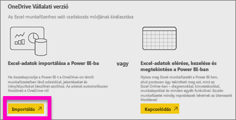
5. Ha megtörtént az adatkészlet importálása, válassza az **Adatkészlet megtekintése** lehetőséget.
   
   
6. Ha megtekint egy adatkészletet, azzal tulajdonképpen a jelentésszerkesztőt nyitja meg.  Egy üres vásznat fog látni, és a jelentések készítéséhez szükséges eszközöket.
   
   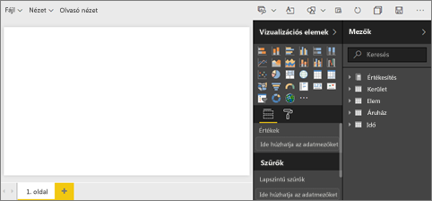

> **TIPP**: Ha nem ismeri a jelentésszerkesztő vásznat, vagy szeretné felfrissíteni ismereteit, [Tekintse át a jelentésszerkesztőt](service-the-report-editor-take-a-tour.md), mielőtt továbbhaladna.
> 
> 

## Mérőműszer felvétele jelentésbe
Most hogy már importáltuk az adatkészletünket, kezdjük el megválaszolni a kérdéseket.  A marketingigazgató tudni szeretné, hogy mennyire állunk közel ahhoz, hogy elérjük az idei év értékesítési célkitűzéseit. A mérőműszer [vizualizáció egy jó választás](power-bi-report-visualizations.md), ha ilyen típusú adatokat szeretnénk megjeleníteni.

1. A Mezők ablaktáblán válassza a **Sales** > **This Year Sales** > **Érték** elemet.
   
    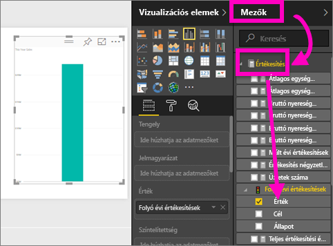
2. Konvertálja a vizualizációt egy Mérőműszerré, ehhez válassza a **Megjelenítések** ablaktáblán a Mérőműszer sablont .
   
    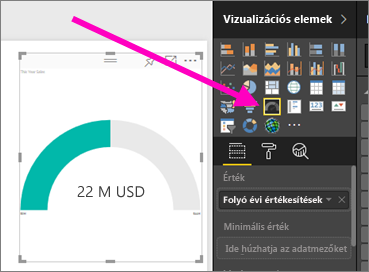
3. Húzza a **Sales** > **This Year Sales** > **Cél** elemet a **Célérték** gyűjtőbe. Úgy látszik, nagyon közel vagyunk a célkitűzésünk eléréséhez.
   
    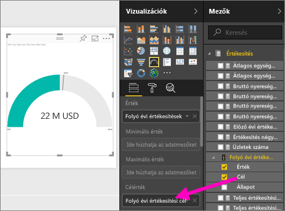
4. Érdemes [menteni a jelentést](service-report-save.md).
   
   

## Területdiagram és szeletelő felvétele a jelentésbe
Meg kell válaszolnunk a marketingigazgató újabb kérdéseit. Szeretné tudni, hogy milyenek az idei év értékesítési mutatói a tavalyi évhez képest. És ezt az egyes körzetekre lebontva szeretné látni.

1. Először is csináljunk egy kis helyet a vásznunkon. Válassza ki a Mérőműszert és helyezze a jobb felső sarokba. Ezután fogja meg az egyik sarkát és kicsinyítse le.
2. Szüntesse meg a mérőműszer kijelölt állapotát. A Mezők ablaktáblán válassza a **Sales** > **This Year Sales** > **Érték**, majd a **Sales** > **Last Year Sales** elemeket.
   
    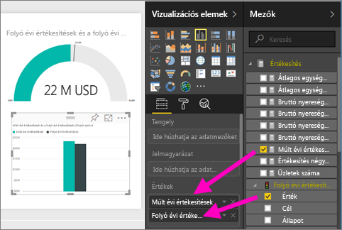
3. Konvertálja a vizualizációt egy Területdiagrammá, ehhez válassza a **Megjelenítések** ablaktáblán a Területdiagram sablont .
4. Adja hozzá a **Time** > **Period** elemet a **Tengely** gyűjtőhöz.
   
    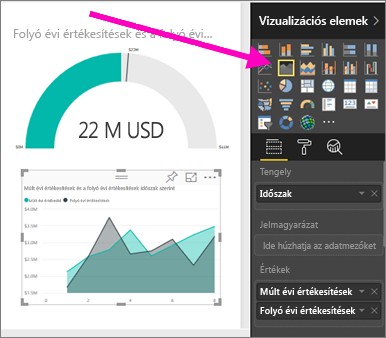
5. A vizualizáció időszakok szerinti rendezéséhez válassza a három pontot (...), majd a **Rendezés szempontja: Időszak** lehetőséget.
6. És most vegyük fel a szeletelőt. Válassza ki a vászon egy üres területét, majd a Szeletelő     sablont. Ez felvesz a vásznunkra egy üres szeletelőt.
   
        
7. A Mezők ablaktáblán válassza a **District** > **District** elemet. Helyezze át és méretezze át a szeletelőt.
   
    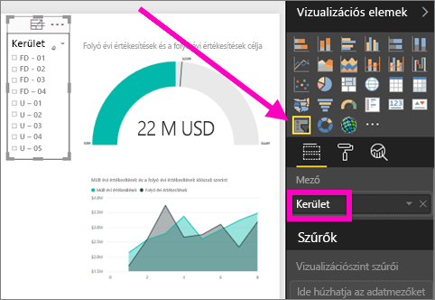  
8. A szeletelő használatával mintákat és összefüggéseket kereshet az egyes körzetek szerint.
   
     

Az adatokat tovább vizsgálhatja, és vizualizációkat is adhat hozzá. Ha különösen érdekes információt talál, azt [rögzítheti egy irányítópultra](service-dashboard-pin-tile-from-report.md).

## Következő lépések
* [Új oldal hozzáadása jelentéshez](power-bi-report-add-page.md)  
* Tudnivalók arról, hogyan történik a [vizualizációk rögzítése egy irányítópulton](service-dashboard-pin-tile-from-report.md)   
* További kérdései vannak? [Kérdezze meg a Power BI közösségét](http://community.powerbi.com/)

