# Feliratkozás Power BI-jelentésre vagy irányítópultra
Minden eddiginél egyszerűbb naprakésznek lenni a legfontosabb irányítópultokkal és jelentésekkel kapcsolatban. Feliratkozhat az Önnek leginkább fontos jelentésoldalakra és irányítópultokra, a Power BI pedig pillanatképeket küld e-mailben a postafiókjába. Megadhatja a Power BI-nak, hogy milyen gyakran szeretne ilyen e-mailt kapni: naponta egyszer, vagy csak hetente. 

Az e-mail és a pillanatkép a Power BI beállításaiban szereplő nyelvet fogja használni (lásd [A Power BI által támogatott nyelvek és országok/régiók](supported-languages-countries-regions.md) témakört). Ha nincs megadva nyelv, a Power BI a böngésző területi beállításait használja. A nyelvi beállításokat megtekintheti vagy módosíthatja a fogaskerék ikon, majd a  **> Beállítások > Általános > Nyelv** lehetőség választásával. 

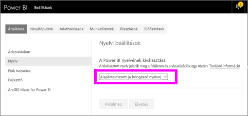

> [!NOTE]
> Feliratkozások csak a Power BI szolgáltatásban hozhatók létre. Amikor e-mail érkezik, abban szerepelni fog egy „ugrás a jelentésre/irányítópultra” hivatkozás. Olyan mobileszközökön, melyeken telepítve van a Power BI alkalmazás, a hivatkozás választásakor az alkalmazás indul el (szemben az alapértelmezett művelettel, a jelentés vagy az irányítópult a Power BI webhelyén való megnyitásával).
> 
> 

Figyelje meg, hogyan állítja be Sirui a feliratkozást egy jelentéshez tartozó e-mailekre. Ezután próbálja ki Ön is a videó alatt látható részletes utasítások szerint.

<iframe width="560" height="315" src="https://www.youtube.com/embed/saQx7G0pxhc" frameborder="0" allowfullscreen></iframe>

## Követelmények
A feliratkozás **létrehozása** Power BI Pro-funkció, és a használatához rendelkeznie kell a tartalom (irányítópult vagy jelentés) megtekintéséhez vagy szerkesztéséhez szükséges engedélyekkel.

## Feliratkozás irányítópultra
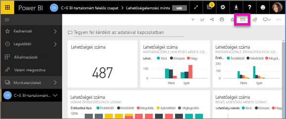

1. Nyissa meg az irányítópultot.
2. A felső menüsávon válassza a **Feliratkozás** lehetőséget vagy a boríték ikont .
   
   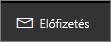
3. A feliratkozást a sárga csúszkával kapcsolhatja be és ki.  A csúszkával történő kikapcsolás nem törli a feliratkozást. A feliratkozás törléséhez válassza a kuka ikont.
   
   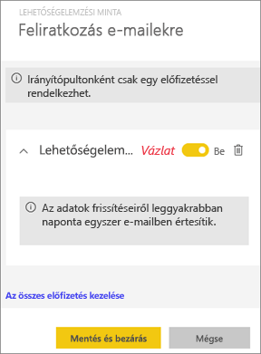
4. A feliratkozás mentéséhez válassza a **Mentés és bezárás** lehetőséget. Minden alkalommal e-mailben kap pillanatképet az irányítópultról, amikor bármelyik annak alapjául szolgáló adathalmaz módosul. Ha az irányítópult egy nap alatt egynél többször frissül, akkor az e-mailt csak az első frissítés után kapja meg.
   
   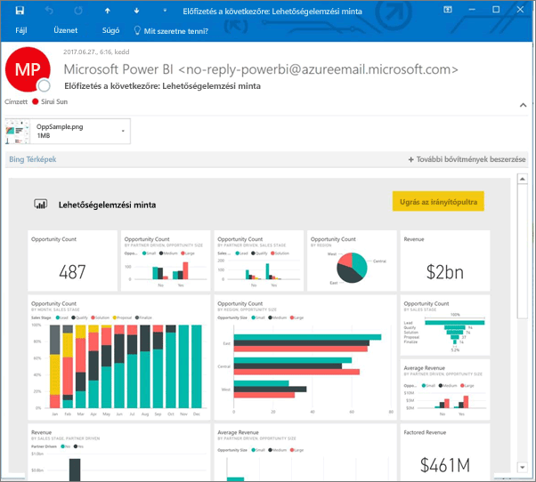
   
   > [!TIP]
   > Szeretné most azonnal látni az e-mailt? Váltsa ki egy e-mail küldését az irányítópulthoz társított adathalmazok egyikének frissítésével. (Ha nincs az adathalmazra vonatkozó szerkesztési engedélye, akkor meg kell kérnie valakit, aki rendelkezik ilyen engedéllyel, hogy tegye meg Ön helyett.) Úgy tudhatja meg, hogy az irányítópult létrehozásához mely adathalmazokat használták fel, hogy a **Kapcsolódók megtekintése** ikont  választva megnyitja a **Kapcsolódó tartalom** panelt, majd a frissítés ikont  választja. 
   > 
   > 
   
   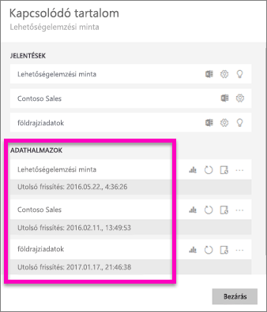

## Feliratkozás jelentésoldalra
1. Nyissa meg a jelentést [Olvasó nézetben](service-reading-view-and-editing-view.md).
2. A felső menüsávon válassza a **Feliratkozás** lehetőséget.
   
   
3. Egyszerre egy jelentésoldalra iratkozhat fel. Válassza ki a jelentésoldalt a legördülő listából.
   
   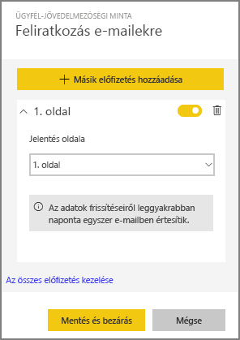
   
   Adjon hozzá további oldalakat.
4. A sárga csúszkával kapcsolhatja be és ki az egyes oldalakra való feliratkozást.  A csúszkával történő kikapcsolás nem törli a feliratkozást. A feliratkozás törléséhez válassza a kuka ikont.
   
   
5. A feliratkozás mentéséhez válassza a **Mentés és bezárás** lehetőséget. A jelentés frissülésekor minden alkalommal e-mailben kap pillanatképet az egyes jelentésoldalakról. Ha a jelentés nem frissül, akkor aznap nem kap e-mailben pillanatképet.  Ha a jelentés egy nap alatt egynél többször frissül, akkor az e-mailt csak az első frissítés után kapja meg.
   
   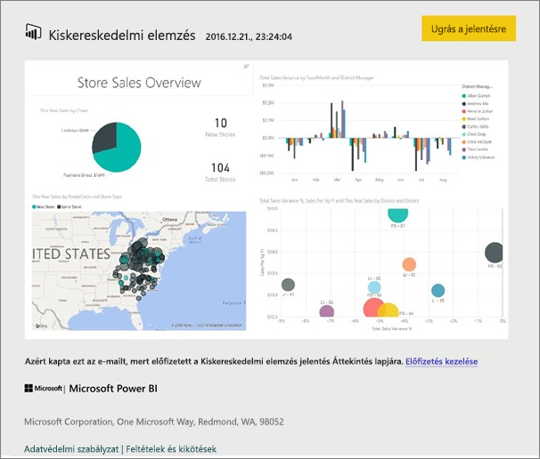
   
   > [!TIP]
   > Szeretné most azonnal látni az e-mailt? Úgy válthatja ki egy e-mail elküldését, hogy megnyitja az adathalmazt, és az **Azonnali frissítés** lehetőséget választja. Ha nincs az adathalmazra vonatkozó szerkesztési engedélye, akkor meg kell kérnie valakit, aki rendelkezik ilyen engedéllyel, hogy tegye meg Ön helyett.
   > 
   > 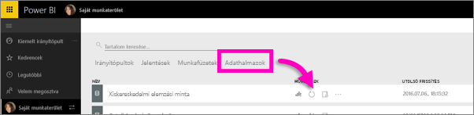
   > 
   > 

## A jelentésekre vonatkozó e-mailek ütemezésének meghatározása
Az alábbi táblázat azt ismerteti, hogy milyen gyakran kap e-mail-értesítést. Ez függ az irányítópult vagy jelentés alapjául szolgáló adathalmaz kapcsolódási módjától (DirectQuery, élő kapcsolat, Power BI-ba importált fájl, vagy Excel-fájl a OneDrive-on vagy a SharePoint Online-ban), valamint az elérhető és kijelölt feliratkozási lehetőségektől (naponta, hetente vagy nincs).

|  | **DirectQuery** | **Élő kapcsolat** | **Ütemezett frissítés (importálás)** | **Excel-fájl a OneDrive-on vagy a SharePoint Online-ban** |
| --- | --- | --- | --- | --- |
| **Milyen gyakran frissül a jelentés vagy az irányítópult?** |15 percenként |A Power BI 15 percenként ellenőrzi, hogy módosult-e az adathalmaz, és ha igen, akkor frissíti a jelentést. |A felhasználó a nincs, a naponta és a hetente lehetőség közül választhat. Naponta legfeljebb 8 alkalom lehet. A heti ütemezést a felhasználó hozza létre és állítja be legalább hetente egyszeri, vagy akár napi frissítésre. |Óránként egyszer |
| **Milyen mértékben befolyásolhatja a felhasználó az feliratkozásokhoz tartozó e-mailek ütemezését?** |Napi vagy heti ütemezés választható |Nem módosítható: a felhasználó a jelentés frissülésekor kap e-mailt, de naponta legfeljebb egyszer. |Ha a frissítés napi ütemezésű, akkor napi vagy heti ütemezés választható.  Ha a frissítés heti ütemezésű, akkor csak heti ütemezés válaszható. |Nem módosítható: a felhasználó az adathalmaz frissítésekor kap e-mailt, de naponta legfeljebb egyszer. |

## Feliratkozások kezelése
A feliratkozások kezelésére szolgáló képernyő két úton érhető el.  Az első **Az összes előfizetés kezelése** lehetőség választása a **Feliratkozás e-mailekre** párbeszédpanelen (lásd a fenti 3. lépést). A második a Power BI a felső menüsávon lévő fogaskerék ikonjának , majd a **Beállítások** lehetőség választása.

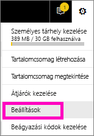

Hogy mely feliratkozások jelennek meg, az attól függ, hogy éppen melyik munkaterület aktív.  Ha az összes munkaterülethez tartozó feliratkozásokat szeretné megjeleníteni, győződjön meg arról, hogy a **Saját munkaterület** aktív. A munkaterületek működéséről a [Munkaterületek a Power BI-ban](service-create-distribute-apps.md) című cikkben olvashat bővebben.

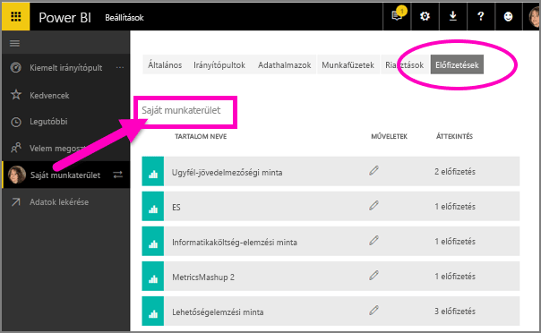

A feliratkozás megszűnik, ha lejár a Pro-licence, ha az irányítópultot vagy jelentést törli a tulajdonosa, vagy ha törlik a feliratkozás létrehozásához használt felhasználói fiókot.

## Megfontolandó szempontok és hibaelhárítás
* Tartalomcsomagokból vagy Power BI-alkalmazásokból származó irányítópultokhoz vagy jelentésekhez jelenleg nem érhető el a feliratkozás. Van azonban egy megkerülő megoldás. Készítsen másolatot a jelentésről vagy az irányítópultról, és inkább ahhoz a verzióhoz adjon hozzá feliratkozásokat.
* A jelentésoldalakra való feliratkozás a jelentésoldal nevéhez kapcsolódik. Ha feliratkozik egy jelentésoldalra, majd átnevezi azt, akkor újra létre kell hoznia a feliratkozást
* Az élő kapcsolattal rendelkező adathalmazokra vonatkozó e-mailekre való feliratkozáskor csak az adatok változása esetén kap értesítést. Tehát ha frissítés történik, de az adatok nem változnak, akkor a Power BI nem küld e-mailt.
* Az e-mailekre való feliratkozások az [egyéni vizualizációk](power-bi-custom-visuals.md) többségét nem támogatják.  Az egyetlen kivétel a [minősített](power-bi-custom-visuals-certified.md) egyéni vizualizációk esete.  
* Az e-mail-értesítések a jelentés szűrőinek és szeletelőinek alapértelmezett állapotait alkalmazva lesznek elküldve. Az alapértelmezéseknek a feliratkozás előtt végzett módosításai nem jelennek meg az e-mailben.    
* A feliratkozást egyelőre nem támogatják a Power BI Desktop élő szolgáltatáskapcsolati funkciójával létrehozott jelentésoldalak.    
* Kifejezetten az irányítópultokra való feliratkozások esetében bizonyos csempetípusok még nem támogatottak.  Ilyenek többek között a streamelési csempék, a videócsempék és az egyéni webes tartalomcsempék.     
* Ha a saját bérlőn kívüli munkatárssal oszt meg egy irányítópultot, akkor ő nem iratkozhat fel az irányítópultra vagy a hozzá tartozó jelentésoldalakra. Ha tehát ön aaron@xyz.com, akkor megoszthatja munkáját a következővel: anyone@ABC.com.  anyone@ABC.com azonban nem iratkozhat fel a megosztott tartalomra.    
* A különösen nagy méretű képeket tartalmazó irányítópultokra vagy jelentésekre való feliratkozás meghiúsulhat az e-mailek méretkorlátozásai miatt.    
* A Power BI automatikusan felfüggeszti a több mint 2 hónapja nem látogatott irányítópultokhoz vagy jelentésekhez társított adathalmazok frissítését.  Ha azonban feliratkozik egy irányítópultra vagy jelentésre, az nem lesz felfüggesztve akkor sem, ha nem látogatják.    
* Ha nem kapja meg az e-mail-értesítéseket, akkor ellenőrizze, hogy tud-e e-maileket fogadni az egyszerű felhasználónevével (UPN). [A Power BI csapata dolgozik ennek a követelménynek az enyhítésén](https://community.powerbi.com/t5/Issues/No-Mail-from-Cloud-Service/idc-p/205918#M10163); figyelje az értesítéseket. 
* Az elküldött jelentések és irányítópultok a Power BI nyelvi beállításait alkalmazzák. Az alapértelmezett nyelv az angol. A nyelvi beállításokat megtekintheti vagy módosíthatja a fogaskerék ikon, majd a  **> Beállítások > Általános > Nyelv** lehetőség választásával.

## Következő lépések
* További kérdései vannak? [Kérdezze a Power BI-közösséget](http://community.powerbi.com/)    
* [Olvassa el a blogbejegyzést](https://powerbi.microsoft.com/blog/introducing-dashboard-email-subscriptions-a-360-degree-view-of-your-business-in-your-inbox-every-day/)

