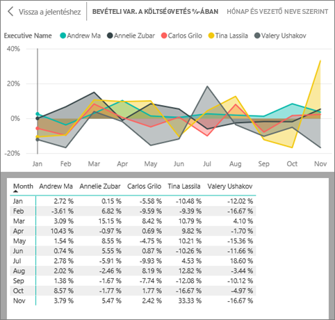
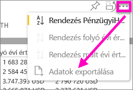

# A vizualizáció létrehozásához használt adatok megjelenítése
## Adatok megjelenítése
A Power BI-vizualizációk az adatkészletekből származó adatokból jönnek létre. Ha látni szeretné a háttérfolyamatokat, a Power BI-jal *megjelenítheti* a vizualizáció létrehozásához használt adatokat. Amikor az **Adatok megjelenítése** elemet választja, a Power BI megjeleníti a vizualizáció alatt (vagy mellett) lévő adatokat.

A vizualizáció létrehozásához használt adatokat exportálhatja is .xlsx vagy .csv fájlként, és megtekintheti azokat az Excelben. További információt az [Adatok exportálása Power BI-vizualizációkból](power-bi-visualization-export-data.md) című szakaszban talál.

> [!NOTE]
> Az *Adatok megjelenítése* és az *Adatok exportálása* a Power BI szolgáltatásban és a Power BI Desktopban is elérhető. A Power BI Desktop azonban egy további részletességi szintet nyújt; a [*Rekordok megjelenítése* megjeleníti az adatkészletből származó tényleges sorokat](desktop-see-data-see-records.md).
> 
> 

## Az *Adatok megjelenítésének* használata a Power BI szolgáltatásban
1. A Power BI szolgáltatásban nyisson meg egy jelentést az [Olvasó vagy a Szerkesztő nézetben](service-reading-view-and-editing-view.md), és válasszon egy vizualizációt.  A Power BI Desktopban nyissa meg a Jelentés nézetet.
2. A vizualizáció mögötti adatok megjelenítéséhez válassza a **Tallózás** > **Adatok megjelenítése** elemet.
   
   
3. Alapértelmezés szerint az adatok a vizualizáció alatt jelennek meg.
   
   
4. A tájolás módosításához válassza a függőleges elrendezést  a vizualizáció jobb felső sarkában.
   
   
5. Ha az adatokat .csv fájlba szeretné exportálni, válassza a három pontot, majd az **Adatok exportálása** elemet.
   
    
   
    Az adatok Excelbe való exportálásáról további információt az [Adatok exportálása Power BI-vizualizációkból](power-bi-visualization-export-data.md) című szakaszban talál.
6. Az adatok elrejtéséhez kapcsolja ki a **Tallózás** > **Adatok megjelenítése** beállítást.

### További lépések
[Adatok exportálása Power BI-vizualizációkból](power-bi-visualization-export-data.md)    
[Vizualizációk Power BI-jelentésekben](power-bi-report-visualizations.md)    
[Power BI-jelentések](service-reports.md)    
[Power BI – Alapfogalmak](service-basic-concepts.md)    
További kérdései vannak? [Kérdezze meg a Power BI közösségét](http://community.powerbi.com/)

