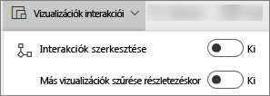
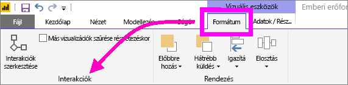
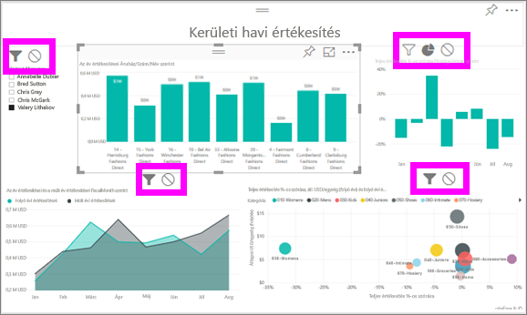

# Vizualizációk interakciói a Power BI-jelentésekben
Ha rendelkezik szerkesztési engedéllyel a jelentéshez, akkor a **Vizualizáció-interakciókkal** határozhatja meg, hogy a jelentésoldal vizualizációi milyen hatással legyenek egymásra. 

Alapértelmezés szerint egy jelentésoldal vizualizációi az oldal további vizualizációinak keresztszűréséhez és keresztkijelöléséhez használhatók.
Például egy állam kijelölése egy térkép vizualizációján kiemeli az oszlopdiagramot, és úgy szűri a vonaldiagramot, hogy az csak az adott államra vonatkozó adatokat jelenítse meg.
Lásd: [Szűrés és kiemelés](power-bi-reports-filters-and-highlighting.md). Ha pedig olyan vizualizációkkal is rendelkezik, amelyek támogatják a [részletes vizsgálatot](power-bi-visualization-drill-down.md), akkor alapbeállítás szerint egy adott vizualizáció részletező elemzése nem lesz hatással a jelentésoldal többi vizualizációjára. Mindkét alapértelmezett viselkedés módosítható azonban, és az interakciók az egyes vizualizációkra vonatkozóan beállíthatóak.

Ez a cikk azt mutatja be, hogyan használhatók a **vizualizáció-interakciók** a Power BI szolgáltatásban [Szerkesztési módban](service-interact-with-a-report-in-editing-view.md), valamint a Power BI Desktopban. Ha egy jelentés meg van osztva Önnel, a vizualizációk interakcióinak beállítását nem módosíthatja.

> [!NOTE]
> A *keresztszűrés* és *keresztkijelölés* kifejezésekkel az itt ismertetett viselkedéseket a **Szűrők** ablaktábla szűrés és kiemelés funkciójától különböztetjük meg.  
> 
> 

<iframe width="560" height="315" src="https://www.youtube.com/embed/N_xYsCbyHPw?list=PL1N57mwBHtN0JFoKSR0n-tBkUJHeMP2cP" frameborder="0" allowfullscreen></iframe>

1. Aktiváljon egy vizualizációt annak kijelölésével.  
2. Jelenítse meg a **Vizualizáció-interakciók** beállításait.
    - A Power BI szolgáltatásban válassza a jelentés menüsorából a legördülő listát.

       

    - A Desktopban válassza a **Formázás > Interakciók** lehetőséget.

        

3. Ha be szeretné kapcsolni a vizualizáció-interakciók vezérlőit, válassza az **Interakciók szerkesztése** lehetőséget. A Power BI a jelentésoldal összes többi vizualizációjához keresztszűrési és keresztkiemelési ikonokat ad hozzá.
   
    
3. Adja meg, hogy a kijelölt vizualizáció milyen hatással legyen a többire.  Ha szeretné, ezt megismételheti a jelentés oldalának minden vizualizációjával.
   
   * Ha keresztszűrést szeretne megadni, kattintson a **szűrő** ikonra .
   * Ha keresztkiemelést szeretne megadni, kattintson a **kiemelés** ikonra .
   * Ha nem szeretne hatást megadni, kattintson a **nincs hatás** ikonra .

4. A részletező elemzés vezérlőinek bekapcsolásához válassza a **Más vizualizációk részletező szűrése** lehetőséget.  Ha most egy vizualizációt részletesen elemez, akkor a jelentésoldal többi vizualizációja is változik majd, és tükrözi az aktuális elemzési kiválasztást. 

   

### Következő lépések
[A jelentésszűrők használata](power-bi-how-to-report-filter.md)

[Szűrés és kiemelés a jelentésekben](power-bi-reports-filters-and-highlighting.md)

[Power BI – Alapfogalmak](service-basic-concepts.md)

További kérdései vannak? [Kérdezze meg a Power BI közösségét](http://community.powerbi.com/)

