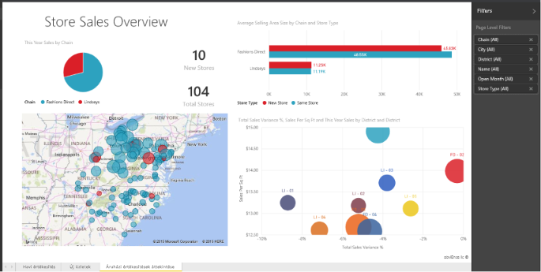

# Jelentések a Power BI-ban
## Mi a Power BI-jelentés?
A Power BI-***jelentés*** többféle nézőpontból jeleníti meg az adathalmazokat, különböző, az adott adathalmazból származó eredményeket és meglátásokat bemutató vizualizációkkal.  Egy jelentés állhat egyetlen vizualizációból vagy vizualizációkkal megtöltött lapokból. Feladatkörétől függően Ön lehet a jelentések *létrehozója* és/vagy egy azokat *feldolgozó* vagy felhasználó személy.

Ez a jelentés 3 lapot tartalmaz, és jelenleg az „Üzleti értékesítések áttekintése” lapot látjuk. Ez a lap 6 különböző vizualizációt és egy lapcímet tartalmaz. A vizualizációk *rögzíthetők* az irányítópultokra, és a rögzített vizualizációk választásakor megnyílik a jelentés, amelyből a vizualizáció származik.

Ha először használja a Power BI-t, sok mindent megtudhat, ha elolvassa a [Power BI alapvető fogalmai](service-basic-concepts.md) című témakört.

A jelentések a Power BI szolgáltatásban és a Power BI Desktop alkalmazásban érhetők el. A jelentések használatának élménye a két környezet esetében csaknem azonos. Mobileszközről azonban nem tud jelentést létrehozni, hanem csak [megtekintheti, megoszthatja és jegyzetekkel láthatja el](mobile-reports-in-the-mobile-apps.md) őket.

## A jelentések előnyei
A jelentések egyetlen adathalmazon alapulnak. A jelentésben lévő vizualizációk egy-egy információmorzsát képviselnek. A vizualizációk nem statikusak: hozzáadhat és eltávolíthat adatokat, módosíthatja a vizualizációtípusokat, és az elemzésekhez és a válaszok kereséséhez az adatok mélyebb szintjére lehatolva szűrőket és szeletelőket alkalmazhat. A jelentések rendkívül interaktívak és nagymértékben testre szabhatók (éppen úgy, ahogyan az irányítópultok – sőt, még inkább), a vizualizációk pedig frissülnek az alapjukul szolgáló adatok változásakor.

## Az irányítópultok és a jelentések különbségei
Az [irányítópultokat](service-dashboards.md) sokan összetévesztik a jelentésekkel, mert ezek is vizualizációkat tartalmazó vásznak. Vannak azonban lényeges különbségek a két elem között.  

| **Képesség** | **Irányítópultok** | **Jelentések** |
| --- | --- | --- |
| Oldalak |Egy oldal |Egy vagy több oldal |
| Adatforrások |Egy vagy több jelentés és egy vagy több adatkészlet irányítópultonként |Egyetlen adatkészlet jelentésenként |
| Elérhető a Power BI Desktopban |Nem |Igen, a jelentések létrehozhatók és megtekinthetők a Desktopban |
| Rögzítés |Csak az aktuális irányítópultról képes a létező vizualizációkat (csempéket) más irányítópultokra rögzíteni |Bármelyik irányítópultra képes rögzíteni a vizualizációkat (csempékként). Teljes oldalakat rögzíthet a jelentésből bármely irányítópultra. |
| Előfizetés |Nem fizethet elő irányítópultra |Előfizethet jelentésoldalakra |
| Szűrés |Nem lehet szűrni és szeletelni |Számos szűrési, kiemelési és szeletelési móddal rendelkezik |
| Riasztások beállítása |Létrehozhat olyan riasztásokat, amelyek e-mailen keresztül értesítik, ha a feltételek teljesülnek |Nem |
| Kiemelés |Kiválaszthat és beállíthat egy „kiemelt” irányítópultot |Nem hozhat létre kiemelt jelentést |
| Természetes nyelven történő lekérdezések |Elérhető az irányítópultból |Nem érhető el a jelentésekből |
| Megváltoztathatja a vizualizáció típusát |Nem. Ha egy jelentéstulajdonos megváltoztatja a vizualizáció típusát a jelentésen belül, az irányítópulton rögzített vizualizáció nem fog frissülni |Igen |
| Láthatja az alapul szolgáló adatkészlet-táblázatokat és -mezőket |Nem. Exportálhatja az adatokat, de magán az irányítópulton nem fogja látni a táblázatokat és a mezőket. |Igen. Láthatja az adatkészlet-táblázatokat, -mezőket és -értékeket. |
| Létrehozhat vizualizációkat |Csak a widgetek irányítópulthoz történő hozzáadása lehetséges a „Csempe hozzáadása” lehetőség használatával |A Szerkesztési engedéllyel létrehozhat számos különböző vizualizációtípust, egyéni vizualizációkat adhat hozzá és szerkeszthet stb. |
| Testreszabás |Mozgathatja és rendezheti a vizualizációkat (csempéket), újraméretezheti őket és hivatkozásokat adhat hozzájuk, valamint átnevezheti, törölheti vagy teljes képernyőn jelenítheti meg őket. Maguk az adatok és a vizualizációk azonban csak olvashatók. |Az olvasási nézetben közzétehet, beágyazhat, szűrhet és exportálhat adatokat, letölthet .pbix-ként, megtekintheti a vonatkozó tartalmakat, QR-kódokat generálhat, exceles elemzést hajthat végre stb.  Szerkesztő nézetben ugyanezek mellett rengeteg más művelet is elérhető. |

## Jelentések ***létrehozói*** és ***felhasználói***
A szerepkörétől függően Ön lehet olyan személy, aki jelentéseket hoz létre saját használatra vagy a munkatársakkal való megosztáshoz. Ez esetben a jelentések létrehozásáról és megosztásáról kell ismereteket szereznie. Vagy lehet olyan személy is, aki jelentéseket kap másoktól. Ez esetben azt kell tudnia, hogy hogyan értelmezheti és használhatja a jelentéseket.

A szerepkörének megfelelő alábbi témakörök kiváló kiindulási pontot nyújtanak.

### Jelentések létrehozásához és megosztásához
* Kezdje a [Power BI szolgáltatás áttekintésével](service-basic-concepts.md), melyből megtudhatja, hol találhatja meg a jelentéseket és a jelentéseszközöket.
* Ismerkedjen meg a [jelentésszerkesztővel](service-the-report-editor-take-a-tour.md).
* Tudja meg, [hogyan hozhat létre jelentést egy adatkészletből](service-report-create-new.md).
* Ismerkedjen meg a [vizualizációk, lapok és jelentésszintű szűrők használatával](power-bi-how-to-report-filter.md).
* Fedezze fel, milyen különféle módokon [oszthatja meg a jelentéseket a munkatársaival](service-share-dashboards.md).

### Jelentések fogadásához és felhasználásához
* Kezdje a [Power BI szolgáltatás áttekintésével](service-basic-concepts.md), melyből megtudhatja, hol találhatja meg a jelentéseket és a jelentéseszközöket.
* Ismerje meg, hogyan tud [megnyitni egy jelentést](service-report-open.md), és fedezze fel az [Olvasó nézetben](service-reading-view-and-editing-view.md) elérhető műveleteket.
* Gyakorolja a jelentések használatát az egyik [mintánk](sample-tutorial-connect-to-the-samples.md) segítségével.  
* Nincs már szüksége egy jelentésre? Akkor [törölheti a jelentést](service-delete.md).
* Ha szeretné megtudni, milyen adatkészletet használ egy jelentés, és mely irányítópultok tartalmaznak rögzített csempéket a jelentésből, [tekintse meg a kapcsolódó tartalmat](service-related-content.md).

> [!TIP]
> Ha nem találta meg itt, amit keres, a bal oldali tartalomjegyzékben elérheti a *jelentések* témaköreinek teljes listáját.
> 
> 

## Következő lépések
[A Power BI bemutatása](power-bi-overview.md) 

[Power BI – Alapfogalmak](service-basic-concepts.md)

További kérdései vannak? [Kérdezze meg a Power BI közösségét](http://community.powerbi.com/)

