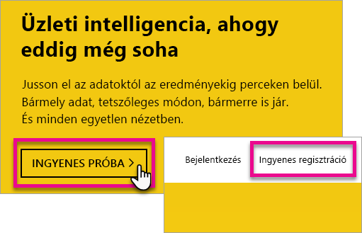
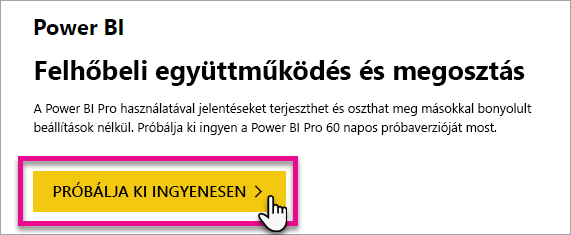
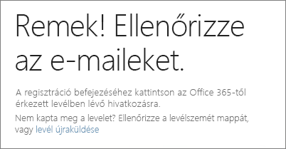
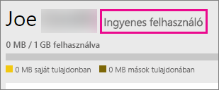
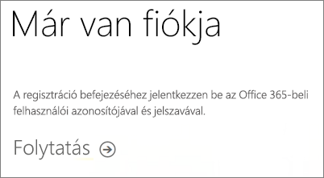
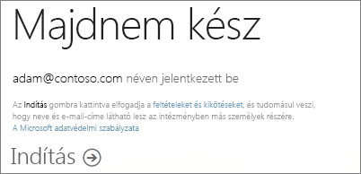
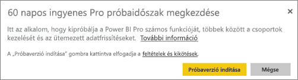

# Egyéni Power BI-regisztráció
Megtudhatja, hogyan regisztrálhat a Power BI szolgáltatásra, és hogyan veheti használatba személyes jelentéskészítési és vizualizációs munkáihoz.

A Power BI szolgálhat mind az Ön személyes jelentéskészítő és vizualizációs eszközeként, mind pedig projektek, részlegek vagy teljes nagyvállalatok analitikai és döntéshozatali motorjaként.

Ez a cikk végigvezeti a regisztráció beállításain és a Power BI első lépésein. További információt a Power BI ingyenes és Pro verziók közti különbségről az [Ingyenes és Pro szintű Power BI](service-free-vs-pro.md) című cikkben találhat.

## Több lehetősége van
Önálló regisztrációra és a Power BI használatbavételére több lehetősége van. Regisztrálhat ingyen, vagy megvásárolhat egy Power BI Pro-előfizetést. Ha ingyenes fiókra regisztrál, a szolgáltatásban a Power BI Pro 60 napos ingyenes próbaverzióját is kipróbálhatja.

Ha Ön egy olyan meglévő szervezet része, amely Office 365-öt használ, akkor is regisztrálhat ingyenes fiókra. A rendszergazdája is megvásárolhatja a Power BI Prót, illetve licenceket rendelhet a felhasználókhoz. További információ a rendszergazdai lehetőségekről: [A Power BI Pro megvásárlása](service-admin-purchasing-power-bi-pro.md).

> [!NOTE]
> Ha Ön egy szervezethez tartozik, előfordulhat, hogy az egyéni regisztráció lehetősége le van tiltva. Ha olyan jellegű hibaüzenetet kap, hogy ez a lehetőség ki van kapcsolva, további információt találhat az [Egyéni regisztráció ki van kapcsolva](#individual-sign-up-has-been-turned-off) című témakörben.
>

## Mi szükséges a regisztrációhoz?

A Power BI-regisztrációhoz egy munkahelyi e-mail-cím szükséges. A Power BI-regisztrációhoz személyes e-mail-cím nem használható.

### Milyen e-mail-címmel használható a Power BI?
A Power BI-regisztrációhoz munkahelyi vagy iskolai e-mail-címre van szüksége. A Power BI-regisztrációhoz nem használhatók fogyasztói e-mail-szolgáltatók vagy távközlési szolgáltatók által biztosított e-mail-címek, így az outlook.com, a hotmail.com, a gmail.com és más szolgáltatók által nyújtott címeket sem.

Ha személyes e-mail-címmel próbál regisztrálni, megjelenik egy üzenet, amely felszólítja, hogy használjon munkahelyi vagy iskolai e-mail-címet.

> [!NOTE]
> A Power BI-regisztrációhoz használhatók .gov vagy .mil végződésű címek. További információt az [USA-beli kormányzati szerv regisztrálása a Power BI szolgáltatásban](https://docs.microsoft.com/en-us/power-bi/service-govus-signup) című témakörben találhat.
>

> [!NOTE]
> Miután regisztrált, [meghívhat vendégfelhasználókat](https://docs.microsoft.com/en-us/azure/active-directory/active-directory-b2b-what-is-azure-ad-b2b), hogy bármilyen e-mail-címmel, közöttük személyes fiókokkal is meg lehessen tekinteni a Power BI-bérlőben található tartalmakat.
>

## Melyik licencre van szüksége?
A megfelelő licencet a hozzájuk tartozó funkciók áttekintésével találhatja meg. Az ingyenes felhasználók a szolgáltatások legtöbbjét elérhetik, kivéve a megosztási és együttműködési funkciókat. A Power BI Pro-felhasználók a szolgáltatás minden funkcióját elérhetik, azonban nem ingyen. Ha nem szeretne tartalmakat megosztani, az ingyenes verzió az Önnek megfelelő választás. További információt [a Power BI-díjszabás oldalán](https://powerbi.microsoft.com//pricing/) találhat.

A cikk további része az egyes verziókra történő regisztrációt ismerteti.

## Egyéni, ingyenes Power BI-regisztráció
A Power BI-regisztráció leggyorsabb módja az ingyenes Power BI-fiók választása. Ez a fiók nem jár költségekkel, és a szolgáltatás számos funkcióját elérheti vele.

> [!NOTE]
> Ha egy arról szóló üzenetet kap, hogy már ismert felhasználó, lépjen a https://app.powerbi.com lapra, és jelentkezzen be.
> 
> 

A Power BI-regisztrációhoz az alábbi lépéseket kell elvégeznie.

1. Nyissa meg a [powerbi.com](https://powerbi.microsoft.com) webhelyet.
2. Válassza az **Ingyenes próba megkezdése** vagy az **Ingyenes regisztráció** lehetőséget.
   
    
3. A kezdőlapon válassza a **Próbálja ki ingyenesen >** lehetőséget a Power BI felirat alatt.
   
    
4. Adja meg a regisztrációs e-mail-címét, majd válassza a **Regisztráció** lehetőséget. Ellenőrizze, hogy regisztrációhoz engedélyezett e-mail-címet használ-e. További információ a használható e-mail-címekről: [Milyen e-mail-címmel használható a Power BI?](#what-email-address-can-be-used-with-power-bi).
   
    
5. Egy üzenetet fog kapni, amely arra kéri Önt, hogy nyissa meg a postafiókját.
   
    
6. Nyissa meg a beérkezett e-mailben található hivatkozást az e-mail-címe megerősítéséhez. Ekkor visszakerül a regisztrációs folyamat ablakába. Előfordulhat, hogy meg kell adnia néhány további adatot magáról.
7. Ezt követően megnyílik a https://app.powerbi.com lap, Ön pedig ingyenes felhasználóként megkezdheti a Power BI használatát.

### A fiók megjelenése a szolgáltatásban
A szolgáltatásban meggyőződhet arról, hogy ingyenes fiókja van. Ehhez kattintson a **fogaskerék** ikonra, majd válassza a **Személyes tárhely kezelése** lehetőséget.

### Mi a teendő, ha már tagja egy meglévő szervezetnek?
Ha fiókja egy már meglévő szervezet része, üzenetet kap, hogy jelentkezzen be ezzel a fiókkal. Válassza a **Tovább** lehetőséget, és jelentkezzen be az Office 365-felhasználónevével és -jelszavával.

Ekkor megjelenik egy üzenet, és az **Indítás** parancs.

## Szolgáltatáson belüli Power BI Pro 60 napos próbaverzió
Miután regisztrált az ingyenes fiókra, lehetősége van ingyen kipróbálni a Pro verziót 60 napig. A próbaidőszak alatt a Pro verzió összes funkciójához hozzáférést kap . A Power BI Pro a Power BI ingyenes verziójának összes funkciójával rendelkezik, valamint további megosztási és együttműködési funkciókat is nyújt. További információkat a [Power BI díjszabásának oldalán](https://powerbi.microsoft.com/pricing) találhat. A Power BI 60 napos ingyenes próbaverziójának aktiválásához jelentkezzen be a Power BI-ba, és próbálja ki az alábbi Power BI-funkciók egyikét:

* [Alkalmazás-munkaterület létrehozása](service-create-distribute-apps.md)
* [Irányítópult megosztása](service-share-dashboards.md)

E funkciók bármelyikének kipróbálásakor a rendszer kérni fogja az ingyenes próba megkezdését. Az ingyenes próbaverziót a fogaskerék ikonra kattintva, majd a **Személyes tárhely kezelése** lehetőséget választva is aktiválhatja. Itt kattintson a **Pro kiadás ingyenes kipróbálása** lehetőségre a jobb oldalon.

Ezután kattintson a **Próbaverzió indítása** elemre.

>[!NOTE]
>Az Office 365 Felügyeleti portálján a szolgáltatáson belüli ingyenes Power BI Pro próbaverziót használó felhasználók nem Power BI Pro próbaverziós felhasználókként, hanem ingyenes Power BI-felhasználókként jelennek meg. A Power BI **Tárhely kezelése** lapján azonban Power BI Pro próbaverziós felhasználókként láthatja őket.

>[!NOTE]
>Ha informatikai rendszergazdaként anélkül szeretné beszerezni és üzembe helyezni a Power BI próbaverziójának licenceit több felhasználó számára a cégnél, hogy az egyes felhasználóknak el kellene fogadniuk a próbaverziós feltételeket, regisztrálhat a [Power BI Pro próbaverziós előfizetésére](https://portal.office.com/Signup/MainSignup15.aspx?OfferId=d59682f3-3e3b-4686-9c00-7c7c1c736085&dl=POWER_BI_PRO). Ha rendszergazdai próbaverzióra szeretne regisztrálni, az Office 365 globális vagy számlázási rendszergazdájának kell lennie, vagy új bérlőt kell létrehoznia. További információkért lásd: [A Power BI Pro megvásárlása](service-admin-purchasing-power-bi-pro.md).
> 
> [!NOTE]
> A Power BI Premium elérhetővé válásával és az ingyenes Power BI 2017. június 1-én módosított ajánlatával Ön a Pro kiterjesztett próbaverzióját is kipróbálhatja. További információkért lásd: [A Pro próbaverzió kiterjesztett aktiválása](service-extended-pro-trial.md).
> 
> 

### A fiók megjelenése a szolgáltatásban
A szolgáltatásban meggyőződhet arról, hogy Pro próbaverziós fiókja van. Ehhez kattintson a **fogaskerék* ikonra, majd válassza a **Személyes tárhely kezelése** lehetőséget.

## Mi a teendő ha a Power BI Pro teljes verzióját szeretné használni?
Egyéni felhasználóként nem vásárolhat Power BI Pro-licencet. A licenc megvásárlásához és az Ön fiókjához rendeléséhez egy rendszergazdára van szükség. További információ: [A Power BI Pro megvásárlása](service-admin-purchasing-power-bi-pro.md).

## Hibaelhárítás
Számos esetben a Power BI-regisztráció elvégezhető a fentebb ismertetett egyszerű önkiszolgáló módszerrel. Előfordulhat azonban, hogy több okból kifolyólag nem tudja elvégezni a regisztrációt.  Az alábbi táblázat összefoglalja a leggyakoribb ilyen okokat, és a hozzájuk tartozó megoldásokat.

| **Probléma/hibaüzenet** | **Ok és megkerülő megoldás** |
| --- | --- |
| **Személyes e-mail-cím (például: nancy@gmail.com)** A regisztráció során az alábbihoz hasonló üzenet jelenik meg:    *Személyes e-mail-címet adott meg. Adja meg a munkahelyi vagy az iskolai e-mail-címét a céges adatainak biztonságos tárolása érdekében.*    vagy    *Ez egy személyes e-mail-címnek tűnik. Adja meg a munkahelyi e-mail-címét, így össze tudjuk kapcsolni Önt a cége többi tagjával. Ne aggódjon. A címét nem osztjuk meg senkivel.* |A Power BI nem támogatja a fogyasztói e-mail-szolgáltatók vagy távközlési szolgáltatók által biztosított e-mail-címeket.    Próbálja meg újra a regisztrációt egy munkahelyi vagy iskolai e-mail-címmel.    Ha továbbra sem tud regisztrálni, és hajlandó egy bonyolultabb telepítési folyamatot elvégezni, [regisztráljon egy új Office 365-próbaverziós előfizetésre, és használja az ahhoz megadott e-mail-címet a regisztrációhoz](service-admin-signing-up-for-power-bi-with-a-new-office-365-trial.md).    A felhasználói fiókot [Azure B2B-vendégként](https://docs.microsoft.com/en-us/azure/active-directory/active-directory-b2b-what-is-azure-ad-b2b) hívja meg. |
| **Az önkiszolgáló regisztráció le van tiltva** A regisztráció során az alábbihoz hasonló üzenet jelenik meg:    *Nem tudjuk befejezni a regisztrációt. Az informatikai részleg kikapcsolta a Microsoft Power BI-regisztráció lehetőségét. A regisztráció befejezéséhez forduljon hozzájuk.*    vagy    *Ez egy személyes e-mail-címnek tűnik. Adja meg a munkahelyi e-mail-címét, így össze tudjuk kapcsolni Önt a cége többi tagjával. Ne aggódjon. A címét nem osztjuk meg senkivel.* |A szervezet rendszergazdája letiltotta az önkiszolgáló regisztrációt a Power BI szolgáltatásba.    A regisztráció befejezéséhez forduljon a rendszergazdához, és kérje meg, hogy kövesse az alábbi lap utasításait, és engedélyezze, hogy a meglévő felhasználók regisztrálhassanak a Power BI-ba, valamint hogy az új felhasználók csatlakozhassanak a meglévő bérlőhöz.    Ez a probléma akkor is felmerülhet, ha egy partneren keresztül regisztrált az Office 365-be. [További információ](service-admin-syndication-partner.md)    [Szervezeti Power BI](https://support.office.com/en-ca/article/Power-BI-in-your-Organization-d7941332-8aec-4e5e-87e8-92073ce73dc5#BKMK_HowCanIAllowO365Tenant) |
| **Az e-mail-cím nem egy Office 365-azonosító** A regisztráció során az alábbihoz hasonló üzenet jelenik meg:    *Ön nem rendelkezik fiókkal a contoso.com oldalon.  A munkahelyén vagy az iskolában másik azonosítót használ?    Próbáljon meg bejelentkezni azzal, és ha nem jár sikerrel, kérje az informatikai részleg segítségét.* |A szervezet nem az e-mail-címet használja azonosítóként az Office 365-ba és más Microsoft-szolgáltatásokba való bejelentkezéshez.  Előfordulhat például, hogy az e-mail-címe Nancy.Smith@contoso.com, míg az azonosítója nancys@contoso.com.    Ilyenkor a regisztrációhoz használja a szervezet által az Office 365-be és más Microsoft-szolgáltatásokba való bejelentkezéshez kapott azonosítót.  Ha ezt nem tudja, forduljon a rendszergazdához.    Ha továbbra sem tud regisztrálni, és hajlandó egy bonyolultabb telepítési folyamatot elvégezni, [regisztráljon egy új Office 365-próbaverziós előfizetésre, és használja az ahhoz megadott e-mail-címet a regisztrációhoz](service-admin-signing-up-for-power-bi-with-a-new-office-365-trial.md). |

## Következő lépések
[Ingyenes szervezeti Power BI](service-admin-service-free-in-your-organization.md)  
[A Power BI Pro megvásárlása](service-admin-purchasing-power-bi-pro.md)  
[A Power BI szolgáltatási szerződése egyéni felhasználók számára](https://powerbi.microsoft.com/terms-of-service/)  
[Power BI Premium – mi ez?](service-premium.md)  
[Power BI Premium-tanulmány](https://aka.ms/pbipremiumwhitepaper)  

További kérdései vannak? [Kérdezze meg a Power BI közösségét](http://community.powerbi.com/)

