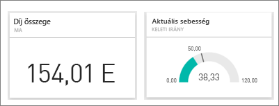
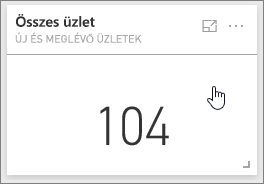
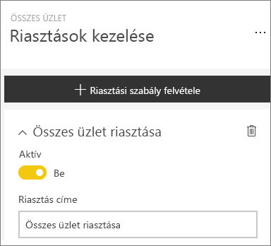
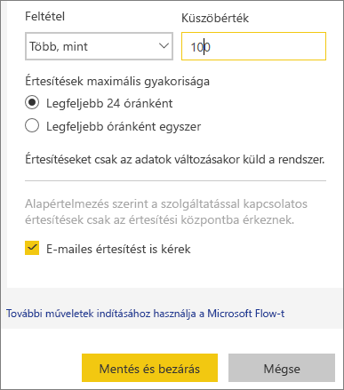
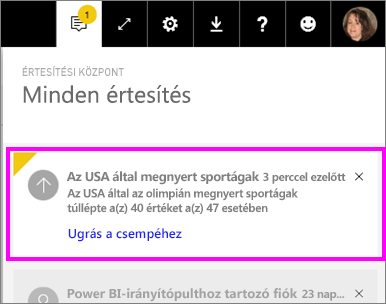
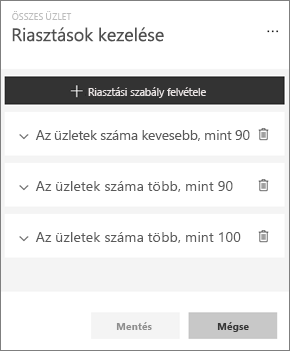
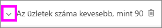
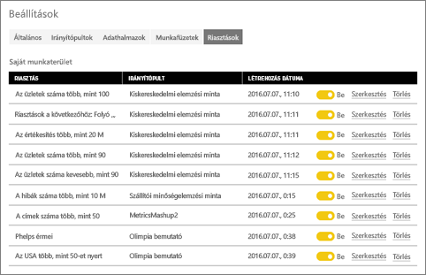

# Adatriasztások a Power BI szolgáltatásban
Riasztásokat állíthat be, amelyek figyelmeztetik, ha az irányítópultjain lévő adatok változásai meghaladják a beállított korlátokat. 

Ha Power BI Pro-licenccel rendelkezik, vagy ha egy [prémium szintű kapacitásból](service-premium.md) osztottak meg Önnel egy irányítópultot, beállíthat riasztásokat a csempékhez. Csak a jelentések vizualizációiról rögzített csempéken, és kizárólag mérőműszerekhez, KPI-khez és kártyákhoz állíthatók be riasztások. A riasztásokat beállíthatja a jelentésekből az irányítópultokra rögzített streamelési adatkészletekről készített vizualizációkon, azonban az irányítópultokon a **Csempe hozzáadása** > **Egyedi folyamatos átviteli adatok** paranccsal közvetlenül létrehozott streamelési csempéken nem. 

Mindenki csak a saját riasztásait látja, még az irányítópult megosztása esetén is. A rendszer teljes mértékben szinkronizálja az adatriasztásokat a platformok között, így [a Power BI mobilalkalmazásokban](consumer/mobile/mobile-set-data-alerts-in-the-mobile-apps.md) és a Power BI szolgáltatásban is beállíthatja és megtekintheti őket. A Power BI Desktopban azonban nem érhetők el. A riasztások [automatizálhatók és integrálhatók a Microsoft Flow-val](https://flow.microsoft.com) - [– próbálja ki](service-flow-integration.md).

> [!WARNING]
> Az adatalapú riasztások értesítései az adatokkal kapcsolatos információkat tartalmaznak. Ha Power BI-adatait egy mobileszközön követi, és az adott eszközt ellopják, javasoljuk, hogy a Power BI szolgáltatásban tiltsa le az összes adatalapú riasztási szabályt.
> 
> 

## Adatriasztások beállítása a Power BI szolgáltatásban
Tekintse meg, ahogy Amanda riasztásokat ad hozzá egyes csempékhez az irányítópultján. Ezután a videó alatt látható részletes utasítások szerint próbáljon meg Ön is riasztásokat beállítani.

<iframe width="560" height="315" src="https://www.youtube.com/embed/JbL2-HJ8clE" frameborder="0" allowfullscreen></iframe>

A példában Amanda a Retail Analysis (Kiskereskedelmi elemzés) minta-irányítópultról származó kártyacsempét használ.

1. Kezdje a műveletet egy irányítópulttal. Az irányítópult egyik mérőműszer-, KPI- vagy kártyacsempéjén kattintson a három pontra (...).
   
   
2. A harang ikon  kiválasztásával adjon hozzá egy vagy több riasztást a **Total Stores** (Összes üzlet) csempéhez.
   
1. Először válassza a **+ Riasztási szabály hozzáadása** lehetőséget, győződjön meg arról, hogy a csúszka a **Be** állásba van kapcsolva, majd adjon címet a riasztásnak. A címek segítségével könnyebben felismerheti a riasztásokat.
   
   
4. Görgessen le, és adja meg a riasztás adatait.  Ebben a példában most egy olyan riasztást állítunk be, amely napi küld értesítést, ha az üzletek száma 100 fölé emelkedik. A riasztások az Értesítési központban jelennek meg. Azt is beállítjuk, hogy a Power BI egy e-mailt is küldjön.
   
   
5. Kattintson a **Mentés** gombra.

## Riasztások fogadása
Ha egy követett adat eléri valamelyik beállított küszöböt, több dolog történik. Először is, a Power BI ellenőrzi, hogy eltelt-e legalább egy óra vagy 24 óra (a választott beállítástól függően) az utolsó riasztás óta. Ha az adat meghaladja a küszöböt, a rendszer mindenképp riasztást küld.

Ezután a Power BI egy riasztást küld az Értesítési központba, valamint választhatóan az e-mail-fiókjába is. Az egyes riasztásokban közvetlen hivatkozás mutat az adatokra. A hivatkozásra megnyitásával megtekintheti a vonatkozó csempét, ahol részletesebb információkat találhat, valamint megoszthatja az információkat.  

1. Ha úgy konfigurálta a riasztást, hogy az e-mailben is értesítse, valami ilyesmit talál majd a bejövő levelei közt.
   
   
2. A Power BI egy üzenetet küld az **Értesítési központba**, és egy új riasztás ikont jelenít meg az érintett csempén.
   
   
3. A riasztás részleteinek megtekintéséhez nyissa meg az Értesítési központot.
   
    
   
   > [!NOTE]
   > A riasztások kizárólag a frissített adatokon működnek. Az egyes adatok frissítésekor a Power BI ellenőrzi, hogy az adott adathoz van-e beállítva riasztás. Ha az adott adat elérte a riasztási küszöböt, a riasztás aktiválódik.
   > 
   > 

## Riasztások kezelése
A riasztások számos módon kezelhetők: Magával az irányítópult csempéjével, a Power BI-beállítások menüjében, illetve egy adott csempével az [iPhone-on futtatott Power BI-mobilalkalmazásban](consumer/mobile/mobile-set-data-alerts-in-the-mobile-apps.md) vagy a [Windows 10-hez készült Power BI-mobilalkalmazásban](consumer/mobile/mobile-set-data-alerts-in-the-mobile-apps.md).

### Magáról a csempéről
1. Ha módosítani vagy törölni szeretné egy adott csempe valamelyik riasztását, nyissa meg újra a **Riasztások kezelése** ablakot a harang ikon  kiválasztásával. Az adott csempéhez beállított összes riasztás megjelenik.
   
    .
2. A riasztás módosításához válassza a neve mellett balra található nyilat.
   
    .
3. A riasztás módosításához válassza a neve mellett jobbra található kukát.
   
      

### A Power BI Beállítások menüjéből
1. Kattintson a fogaskerék ikonra a Power BI menüsorán.
   
    .
2. A **Beállítások** alatt válassza a **Riasztások** elemet.
   
    
3. Erről a felületről be- és kikapcsolhatja a riasztásokat, megnyithatja a **Riasztások kezelése** ablakot a riasztás módosításához, vagy akár törölheti is a riasztást.

## Tippek és hibaelhárítás
* A Bing-csempék, illetve a dátum/idő mértékekkel rendelkező kártyacsempék jelenleg nem támogatják a riasztásokat.
* A riasztások kizárólag numerikus adattípusokkal működnek.
* A riasztások kizárólag a frissített adatokon működnek. Statikus adatokon nem.
* A riasztások a streamelési adatkészleteken csak akkor működnek, ha felépít egy KPI-/kártya-/mérőműszer-jelentési vizualizációt, majd rögzíti az irányítópulton.

## További lépések
[Adatriasztást tartalmazó Microsoft Flow létrehozása](service-flow-integration.md)    
[Adatriasztások beállítása mobileszközökön](consumer/mobile/mobile-set-data-alerts-in-the-mobile-apps.md)    
[A Power BI bemutatása](power-bi-overview.md)    
További kérdései vannak? [Kérdezze meg a Power BI közösségét](http://community.powerbi.com/)

